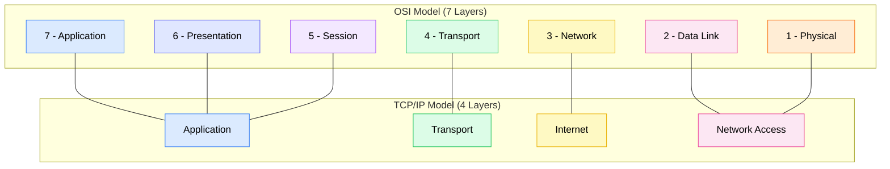

# How the Internet Works

> The internet is a global network of interconnected computers that exchange data by breaking information into small chunks called packets and routing them through a web of cables, routers, and service providers.

**Level:** 0 · **Topic:** 3 of 7 · **Prerequisites:** [Client-Server Model](../02-Client-Server-Model/README.md)

---

## 🎯 The Problem

You open your phone and send a message to a friend in Tokyo. You hit send, and a second later they receive it. Simple, right? But think about what just happened: your message traveled thousands of miles, crossed oceans, passed through dozens of machines owned by different companies, and arrived intact — in under a second.

Without understanding how the internet actually works under the hood, you cannot reason about:

- **Latency** — why does it take ~150ms to reach Tokyo but only ~5ms to reach a server in your city?
- **Reliability** — what happens when a cable is cut under the Pacific Ocean?
- **Failures** — why does your app suddenly stop working for users in one region but not another?
- **Design decisions** — should your database be in one region or replicated across three?

Understanding the physical and logical structure of the internet turns these mysteries into predictable engineering constraints you can design around.

---

## 🌍 Real-World Analogy

Think of the internet like the global postal system.

- **Your letter (a packet):** You don't send one massive scroll — you break your message into pages, each sealed in its own envelope with a destination address written on it.
- **The destination address (an IP address):** Every envelope must have a valid address so it can be delivered to the right place.
- **Sorting centers (routers):** Your envelope doesn't teleport to Tokyo. It goes to your local post office, then a regional hub, then an international sorting center, then another hub in Japan, and finally to your friend's door. Each sorting center reads the address and decides the best next stop.
- **The postal service (your ISP):** You don't personally manage this — you pay a postal service (Internet Service Provider) to handle delivery on your behalf.
- **Multiple routes:** If a road between two sorting centers is blocked, the postal service reroutes your envelope through a different path. It still arrives, maybe a little slower.

The internet works exactly this way, just at the speed of light through fiber-optic cables.

---

## 🧠 Core Idea

### What Is a Packet?

When you send data over the internet — a message, a webpage, a video — it is not sent as one big blob. It is broken into small chunks called **packets**.

- A typical packet is around **1500 bytes** (this limit is called the **MTU — Maximum Transmission Unit**).
- Each packet contains: a **header** (where it's going, where it came from, its sequence number) and a **payload** (the actual data).
- At the destination, packets are reassembled in order. If some arrive out of order, the destination reorders them. If some are lost, they are requested again.

### IP Addresses and Routing

Every device on the internet has an **IP address** — a unique identifier, like `142.250.80.46`. Addresses come in two versions:

- **IPv4:** 32-bit address written as four numbers (e.g., `192.168.1.1`). About 4.3 billion possible addresses — nearly exhausted.
- **IPv6:** 128-bit address (e.g., `2001:0db8:85a3::8a2e:0370:7334`). Essentially unlimited.

**Routers** are specialized devices whose only job is to read a packet's destination IP address and decide where to send it next. Each router knows about the networks directly connected to it and uses routing protocols (like **BGP — Border Gateway Protocol**) to learn about paths to everywhere else.

### ISPs — The Three Tiers

Not all internet providers are equal. They are organized in a hierarchy:

- **Tier 1 ISPs** — The backbone of the internet. Companies like AT&T, NTT, and Telia own massive global networks of fiber-optic cables, including submarine cables crossing oceans. They peer with each other for free (called **settlement-free peering**) because they are roughly equal in size. Examples: Lumen (CenturyLink), Telia, NTT.
- **Tier 2 ISPs** — Regional providers that buy transit from Tier 1 ISPs and peer with other Tier 2s. Examples: Comcast (for its backbone), regional European ISPs.
- **Tier 3 ISPs** — Local providers that sell internet access to homes and businesses. They buy transit from Tier 1 or Tier 2 ISPs. This is your home broadband provider.

When you load a webpage, your request travels: your device → Tier 3 ISP → Tier 2 ISP → Tier 1 backbone → destination.

### IXPs — Internet Exchange Points

**IXPs (Internet Exchange Points)** are physical locations where many ISPs and networks connect their equipment in the same building and exchange traffic directly — without routing through a third-party network.

- This shortens paths, reduces latency, and lowers costs.
- Famous IXPs: DE-CIX in Frankfurt (one of the world's largest), AMS-IX in Amsterdam, LINX in London.
- When Netflix peers directly with Comcast at an IXP, Netflix traffic no longer needs to travel through a Tier 1 backbone — it goes directly from Netflix's servers to Comcast's network, faster and cheaper.

### Submarine Fiber Cables

Most intercontinental internet traffic travels through **submarine fiber-optic cables** on the ocean floor. These cables are about the thickness of a garden hose, protected by steel armor near shores.

- There are over 400 submarine cable systems in service (as of 2024), carrying ~99% of international data.
- Notable cables: **MAREA** (Microsoft + Facebook, connecting Virginia to Bilbao, Spain, 160Tbps capacity), **FASTER** (Google-led, Pacific Ocean), **2Africa** (Meta, circling Africa).
- When a cable is cut (by a ship anchor or earthquake), traffic reroutes through other cables — but latency and capacity are affected.

### The OSI Model — 7 Layers

The **OSI model (Open Systems Interconnection)** is a conceptual framework that describes how data moves through a network, broken into 7 layers. Think of it as a recipe with 7 steps that every piece of data must go through.

| Layer | Name | What It Does | Example Protocol |
|-------|------|-------------|-----------------|
| 7 | Application | What the user sees; generates/consumes data | HTTP, SMTP, DNS |
| 6 | Presentation | Encoding, encryption, compression | TLS/SSL, JPEG |
| 5 | Session | Opens/closes communication sessions | NetBIOS, RPC |
| 4 | Transport | Breaks data into segments; reliability | TCP, UDP |
| 3 | Network | Logical addressing; routes packets across networks | IP, ICMP |
| 2 | Data Link | Frames data for a single physical link; MAC addresses | Ethernet, Wi-Fi (802.11) |
| 1 | Physical | Raw bits over cables/radio waves | Fiber, Ethernet cable, radio |

**How to remember it:** "**P**lease **D**o **N**ot **T**hrow **S**ausage **P**izza **A**way" (Physical, Data Link, Network, Transport, Session, Presentation, Application).

### The TCP/IP Model — 4 Layers

In practice, engineers use the **TCP/IP model** (also called the Internet model), which collapses the 7 OSI layers into 4:

| TCP/IP Layer | Equivalent OSI Layers | Example |
|-------------|----------------------|---------|
| Application | 7 + 6 + 5 | Your browser sending an HTTP request |
| Transport | 4 | TCP ensuring the request arrives completely |
| Internet | 3 | IP routing the packets to the right server |
| Network Access | 2 + 1 | Wi-Fi transmitting bits from your laptop to the router |

**Concrete example — loading a webpage:**

1. **(Application)** Your browser constructs an HTTP GET request for `example.com`.
2. **(Transport)** TCP breaks it into segments and tags each with a sequence number.
3. **(Internet)** IP wraps each segment in a packet with source/destination IP addresses.
4. **(Network Access)** Wi-Fi converts the packet into radio waves and sends it to your router.
5. Your router strips the Wi-Fi frame, reads the IP packet, and forwards it toward `example.com`'s server.
6. The process reverses at the other end: the server's network card receives bits, reassembles the IP packet, TCP reassembles the HTTP request, and the application layer processes it.

---

## 📊 How It Works

### Packet Journey: Your Laptop to a Datacenter

```mermaid
graph LR
    A["💻 Your Laptop<br/>(192.168.1.5)"]:::device --> B["🏠 Home Router<br/>(NAT + Wi-Fi)"]:::router
    B --> C["🏢 Tier 3 ISP<br/>(Last Mile)"]:::isp
    C --> D["🌐 Tier 1 Backbone<br/>(Long-Haul Fiber)"]:::backbone
    D --> E["🔀 IXP<br/>(e.g., DE-CIX)"]:::ixp
    E --> F["🏢 Destination ISP<br/>(Tier 2/3)"]:::isp
    F --> G["🖥️ Datacenter Server<br/>(93.184.216.34)"]:::device

    classDef device fill:#dbeafe,stroke:#3b82f6,color:#000
    classDef router fill:#dcfce7,stroke:#22c55e,color:#000
    classDef isp fill:#fef9c3,stroke:#eab308,color:#000
    classDef backbone fill:#fce7f3,stroke:#ec4899,color:#000
    classDef ixp fill:#f3e8ff,stroke:#a855f7,color:#000
```

*Caption: A packet from your laptop travels through your home router, your ISP's network, a Tier 1 backbone, an Internet Exchange Point, the destination ISP, and finally arrives at the datacenter server. Each hop is a router making a forwarding decision.*

---

### OSI vs TCP/IP Layer Mapping

*Caption: The TCP/IP model is what the internet actually uses in practice. The OSI model is a teaching framework. Layers 5, 6, and 7 of OSI collapse into the single Application layer of TCP/IP.*

---

## 🔧 Types / Variations / Strategies

### OSI Model vs TCP/IP Model — Full Layer Table

| OSI Layer | OSI Name | TCP/IP Layer | What It Does | Example Protocol |
|-----------|----------|-------------|-------------|-----------------|
| 7 | Application | Application | User-facing services (web, email, DNS) | HTTP, FTP, SMTP, DNS |
| 6 | Presentation | Application | Data format, encryption, compression | TLS, SSL, MIME |
| 5 | Session | Application | Manage communication sessions | NetBIOS, PPTP |
| 4 | Transport | Transport | End-to-end delivery, segmentation, error recovery | TCP, UDP |
| 3 | Network | Internet | Logical addressing, routing across networks | IP, ICMP, BGP |
| 2 | Data Link | Network Access | Framing, MAC addressing, error detection on one link | Ethernet, 802.11 (Wi-Fi) |
| 1 | Physical | Network Access | Raw bit transmission: voltages, light pulses, radio waves | Fiber, Coax, DSL |

### ISP Tier Comparison

| Tier | Who They Are | What They Own | How They Connect | Example |
|------|-------------|--------------|-----------------|---------|
| Tier 1 | Global backbone providers | Intercontinental fiber, submarine cables | Peer with other Tier 1s for free | AT&T, NTT, Telia, Lumen |
| Tier 2 | Regional carriers | Regional fiber networks | Buy transit from Tier 1, peer with other Tier 2s | Comcast backbone, Deutsche Telekom |
| Tier 3 | Local access providers | Last-mile infrastructure (DSL, cable, fiber to home) | Buy transit from Tier 1 or Tier 2 | Your home broadband ISP |

---

## 🏢 Real-World Examples

### AWS us-east-1 to eu-west-1 (~90ms Round-Trip)

When your application in AWS `us-east-1` (Northern Virginia) calls a service in `eu-west-1` (Ireland), you will see approximately **80–100ms round-trip latency**. Why?

- The straight-line distance is ~5,900 km.
- Light travels at ~200,000 km/s in fiber (slower than in vacuum due to the glass).
- Minimum theoretical latency: 5,900 / 200,000 = ~30ms one-way, ~60ms round-trip.
- Real-world adds routing overhead, queuing at routers, and processing time — landing at ~90ms.

This is why you should never put your primary database in Virginia and your application servers in Ireland without expecting this penalty on every database query.

### Google's Private Fiber Backbone

Google does not rely on the public internet to move data between its datacenters. It operates **one of the world's largest private fiber networks**, connecting datacenters across continents. When a YouTube video is requested, it may be served from a cache close to you, but the original content and metadata flow over Google's private backbone — not through Tier 1 ISPs — giving Google control over latency, reliability, and cost.

### Submarine Cables: MAREA

**MAREA** is a submarine cable system co-funded by Microsoft and Facebook, running 6,600 km from Virginia Beach, USA, to Bilbao, Spain. It went live in 2018 with an initial capacity of **160 Tbps (terabits per second)** across 8 fiber pairs. A single cable like this carries more traffic than all the satellites in orbit combined. When cables are cut — by ship anchors, earthquakes, or shark bites (it happens) — traffic automatically reroutes through backup cables, but with higher latency and potential congestion.

### Netflix Open Connect — Peering at ISPs

Netflix built its own CDN called **Open Connect**. Instead of sending video traffic through the public internet backbone, Netflix places **Open Connect Appliances (OCAs)** — custom caching servers — inside ISP networks and at IXPs. When you stream a Netflix show, the video comes from a server that might be sitting in your ISP's own datacenter, just a few hops away. This reduces latency, reduces the ISP's bandwidth costs, and improves video quality. Netflix and the ISP peer directly, bypassing Tier 1 backbones entirely for this traffic.

---

## ⚖️ Trade-offs

### Centralized vs Distributed Routing

| | Centralized Routing | Distributed Routing (what the internet uses) |
|--|--------------------|--------------------------------------------|
| **How it works** | One central controller decides all routes | Each router independently computes routes using protocols like BGP and OSPF |
| **Resilience** | Single point of failure — if the controller dies, everything stops | No single point of failure — routers adapt when links go down |
| **Scalability** | Does not scale to millions of routers | Scales because each router only needs to know about its neighbors |
| **Consistency** | Routes are always optimal and consistent | Routes may be temporarily inconsistent during convergence after a failure |
| **Control** | Easy to enforce policies globally | Hard to enforce global policies — each AS (Autonomous System) sets its own |
| **Real-world use** | Used inside datacenters (Software Defined Networking) | Used across the public internet |

### Wired vs Wireless at the Access Layer

| | Wired (Ethernet/Fiber) | Wireless (Wi-Fi/4G/5G) |
|--|----------------------|----------------------|
| **Latency** | Very low and consistent (~0.1ms on LAN) | Higher and variable (1–50ms depending on conditions) |
| **Bandwidth** | High and guaranteed (up to 100Gbps on fiber) | Shared medium; degrades with distance and congestion |
| **Reliability** | Very high — no interference | Susceptible to interference, walls, and distance |
| **Mobility** | Fixed — you must stay plugged in | Mobile — you can move freely |
| **Best for** | Servers, desktop workstations, datacenters | Mobile devices, IoT, areas where cabling is impractical |

---

## ✅ When to Use / ❌ When NOT to Use

### When Understanding This Layer Matters

- **Cross-region system design:** Choosing where to place databases, caches, and application servers requires knowing that cross-region latency is real (60–150ms) and cannot be engineered away.
- **Network partition planning:** Designing systems that tolerate network failures (the "P" in CAP theorem) requires understanding that packets can be lost, delayed, or reordered.
- **CDN and peering strategy:** Deciding whether to use a CDN, which edge locations to use, or whether to negotiate ISP peering (like Netflix does) requires understanding the ISP tier hierarchy and IXPs.
- **Capacity and cost planning:** Data transfer costs between cloud regions (e.g., AWS charges for cross-region traffic) make sense once you understand they reflect real physical infrastructure costs.
- **Debugging latency issues:** If your service is slow for users in one country but fast in another, you need to understand routing, ISP paths, and submarine cable geography.

### When You Can Abstract It Away

- **Building a simple CRUD web app** where all your infrastructure lives in one cloud region — you can treat the network as "fast enough."
- **Local development** — your laptop's loopback interface (`127.0.0.1`) has no physical network involved.
- **Internal microservices** in the same datacenter — intra-datacenter latency is typically under 1ms and bandwidth is abundant; you rarely need to think about physical topology.

---

## ⚠️ Common Pitfalls

**Treating the internet as a magic pipe**
Many developers assume data instantly teleports between systems. In reality, physical distance imposes minimum latency that no amount of software optimization can overcome. A service in Sydney, Australia will always have at least ~160ms round-trip to London — that is just physics.

**Ignoring packet loss and reordering**
Packets can be dropped (by congested routers) or arrive out of order. TCP handles this transparently, but it adds latency when retransmission is needed. UDP does not handle this — if you use UDP (e.g., for video streaming), your application must handle loss itself. Never assume that because you sent data, it was received.

**Not accounting for physical distance in latency estimates**
A common mistake is estimating latency based purely on software benchmarks run on localhost. Cross-region latency (60–150ms) will dominate the response time of any multi-region call. Always add network latency to your back-of-the-envelope calculations.

**Assuming one ISP path**
Your traffic does not always take the same route. BGP routing can change based on policy, cost, and congestion. The path from your server to a user in Brazil might change hour to hour. This is why latency measurements vary and why you need percentile metrics (p95, p99), not just averages.

**Confusing private cloud networks with the public internet**
Traffic between AWS services in the same VPC (Virtual Private Cloud) travels through AWS's private network, not the public internet. Traffic leaving to the public internet goes through AWS's gateways. Mixing these up leads to incorrect latency estimates and security assumptions.

---

## 🎤 Interview Tips

- **Cross-region latency numbers matter.** When discussing multi-region architectures, say: "Cross-region latency is typically 60–150ms round-trip. For example, us-east-1 to eu-west-1 is about 90ms." Interviewers notice when you use real numbers.

- **BGP is the internet's routing protocol.** If asked "how does the internet know where to route packets?", explain that **BGP (Border Gateway Protocol)** is the protocol that ISPs and large networks use to advertise which IP address ranges they own and can reach. It is the "postal routing protocol" that every major network speaks.

- **The internet is decentralized by design.** There is no single authority controlling it. ARPANET (the internet's predecessor) was designed to survive nuclear attacks by having no single point of failure. This is why the internet routes around damage — automatically.

- **Know the difference between latency and bandwidth.** Latency is the delay (ms) for a packet to travel from A to B. Bandwidth is how much data can flow per second (Gbps). A fat pipe (high bandwidth) does not reduce latency. A submarine cable can carry 160Tbps but still takes ~70ms to cross the Atlantic.

- **Mention IXPs when discussing CDNs.** Explaining that CDNs work partly by peering at IXPs (reducing hops) shows depth of understanding.

- **OSI model layer numbers are useful shorthand.** Engineers say "Layer 3 issue" (routing/IP problem), "Layer 4" (TCP/UDP problem), or "Layer 7" (application problem). Know what each means.

---

## 📝 TL;DR

- Data travels the internet as small **packets** (~1500 bytes each), not as a single stream, and is reassembled at the destination.
- **Routers** read each packet's IP address and forward it hop-by-hop toward the destination using **BGP** for routing decisions between networks.
- The internet is organized in **ISP tiers** (Tier 1 = global backbone, Tier 2 = regional, Tier 3 = local access); **IXPs** let networks connect directly, reducing hops and latency.
- **Physical distance is real:** cross-region latency is 60–150ms and cannot be reduced below the speed-of-light minimum; ~99% of international traffic travels over submarine fiber cables.
- The **TCP/IP model** (4 layers: Application, Transport, Internet, Network Access) is what the internet uses in practice; the **OSI model** (7 layers) is a teaching framework.

---

## 🧪 Test Yourself

1. You are designing a system where users in São Paulo, Brazil need to read from a database in Tokyo, Japan. The straight-line distance is approximately 18,500 km. What is the theoretical minimum round-trip latency, and what practical latency would you plan for? How would this affect your architecture?

2. A user reports that your website is fast in the US but slow in Southeast Asia. Walk through the possible network-layer reasons for this, starting from your datacenter and ending at the user's browser.

3. Explain the difference between a Tier 1 ISP and a Tier 3 ISP. Why does this hierarchy exist, and what happens to a packet that needs to travel between two users on different Tier 3 ISPs with no Tier 1 peering?

4. Netflix uses Open Connect to place caching servers inside ISP networks. How does this differ from Netflix simply using a cloud CDN like AWS CloudFront? What problem does direct peering solve that a third-party CDN does not?

---

## 📚 Further Reading

- **"How the Internet Works" by Preston Gralla** — Accessible, illustrated guide to the internet's physical and logical infrastructure. Great starting point for anyone new to networking.
- **Cloudflare Learning Center** ([cloudflare.com/learning](https://www.cloudflare.com/learning/)) — Free articles on DNS, HTTP, TLS, BGP, DDoS, and more, written clearly with diagrams. Particularly recommended: "What is BGP?" and "What is an IXP?"
- **"Computer Networks" by Andrew S. Tanenbaum** — The definitive textbook on computer networking. Chapters 1 (Introduction) and 5 (Network Layer) are most relevant to this topic. Dense but authoritative.
- **Submarine Cable Map** ([submarinecablemap.com](https://www.submarinecablemap.com/)) — Interactive map of all active and planned submarine cables. Excellent for visualizing why cross-Atlantic latency differs from cross-Pacific.
- **"BGP in 2023" reports by APNIC** — Annual reports on the state of BGP routing on the internet. Good for understanding how the routing table has grown and how routing security (RPKI) is evolving.
