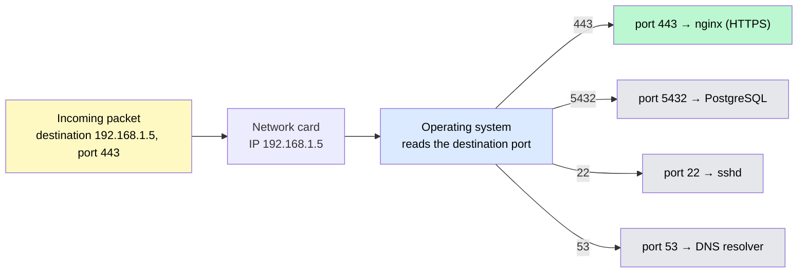
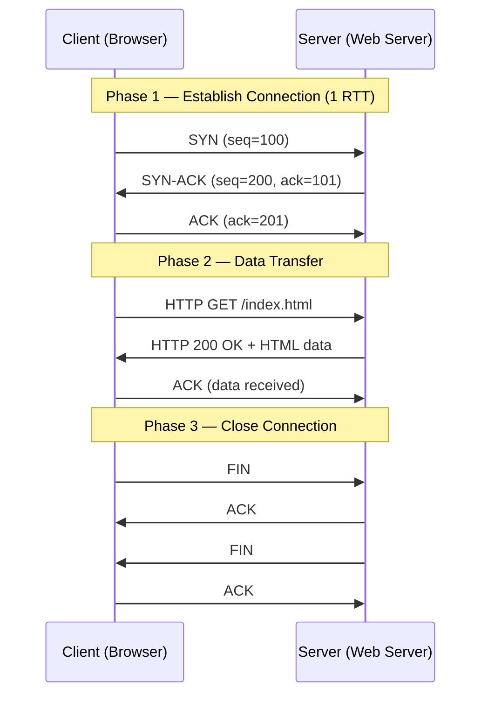
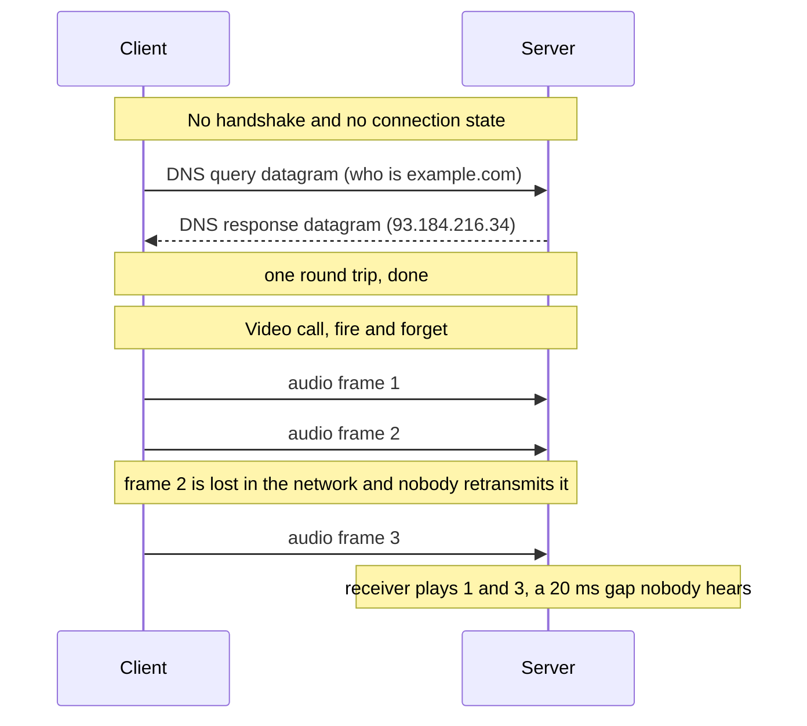

# Network Protocols: TCP, UDP, and IP

> A network protocol is a set of rules that determines how data is packaged, addressed, and delivered between computers — think of it as the agreed-upon language computers use to talk to each other across a network.

**Level:** 0 · **Topic:** 4 of 7 · **Prerequisites:** [How the Internet Works](../03-How-the-Internet-Works/README.md)

---

## 🎯 The Problem

Imagine two scenarios you face every day:

1. You are on a video call with a friend. The call freezes for half a second, then catches up. A few pixels look blurry, but the conversation keeps moving. You do not stop to re-watch the blurry frame — you just keep talking.

2. You download a bank statement PDF. Every single byte must arrive perfectly. If even one bit is corrupted, the file is useless or dangerous. You would rather wait an extra second than receive a broken file.

These two situations have completely opposite requirements. The video call needs **speed** and can tolerate small losses. The file download needs **perfect accuracy** and can tolerate small delays.

This is exactly why multiple transport protocols exist. A single "one size fits all" protocol would be either too slow for real-time media or too unreliable for critical data. So engineers designed different protocols for different guarantees — and that is what this topic is about.

---

## 🌍 Real-World Analogy

**TCP (Transmission Control Protocol)** is like sending a certified letter through the postal service. When you send a certified letter:
- The post office tracks every step of the delivery.
- You get a confirmation when it arrives.
- If the letter gets lost, it is re-sent automatically.
- Multiple pages arrive in the correct order (page 1 before page 2).

This is reliable, but it takes extra time for all the confirmation paperwork.

**UDP (User Datagram Protocol)** is like shouting something across a crowded room. You say it once, loudly, and hope the other person hears you. If they miss a word, you do not stop and repeat it — the conversation keeps moving. Some words get lost, but the exchange happens fast.

**IP (Internet Protocol)** is the addressing system on the envelope. It does not care what is inside the envelope or whether it arrives — it just routes the envelope toward the correct destination based on the address written on it. Both TCP and UDP ride on top of IP.

---

## 🧠 Core Idea

### IP — The Addressing Layer

IP is a **connectionless, best-effort** protocol. "Best-effort" means IP does its best to deliver each packet (a small chunk of data) but makes no promises. Packets can be:
- Lost entirely
- Duplicated
- Delivered out of order

IP's job is purely **routing and addressing**. Every device on the internet has an IP address (e.g., `192.168.1.1` for IPv4 or `2001:db8::1` for IPv6), and IP uses these addresses to forward packets hop-by-hop toward the destination.

### TCP — Reliable Delivery

TCP sits on top of IP and adds the reliability that IP does not provide. TCP is:
- **Connection-oriented** — two devices must establish a connection before sending data.
- **Reliable** — lost packets are detected and re-sent automatically.
- **Ordered** — if packet 3 arrives before packet 2, TCP buffers it and delivers them in sequence.
- **Flow-controlled** — TCP slows down if the receiver's buffer is filling up (the receiver tells the sender how much space it has left, called the "receive window").
- **Congestion-controlled** — TCP detects network congestion and reduces its sending rate to avoid making things worse (algorithms like TCP Reno and TCP CUBIC handle this).

#### The TCP 3-Way Handshake

Before any data is sent, TCP performs a **3-way handshake** to establish a connection. It costs approximately **1.5 RTT** (round-trip times) of latency before the first byte of real data can flow:

| Step | Direction | Packet | Meaning |
|------|-----------|--------|---------|
| 1 | Client → Server | SYN | "I want to connect. My starting sequence number is X." |
| 2 | Server → Client | SYN-ACK | "OK. My starting sequence number is Y. I acknowledge yours." |
| 3 | Client → Server | ACK | "Acknowledged. Connection is open." |

Only after step 3 does the client send the actual HTTP request (or whatever data it needs). This means every new TCP connection adds at least 1 full RTT of delay before useful work begins. On a connection with 50ms RTT, that is 50ms of overhead just to say hello.

#### TCP 4-Way Termination

Closing a TCP connection is a separate 4-step process (either side can initiate):

1. **FIN** — one side says "I am done sending."
2. **ACK** — the other side acknowledges.
3. **FIN** — the other side says "I am also done sending."
4. **ACK** — the first side acknowledges, and the connection closes.

This ensures both sides have finished transmitting before the connection ends.

### UDP — Speed Over Guarantee

UDP also sits on top of IP but adds almost nothing on top of it:
- **Connectionless** — no handshake, data is sent immediately.
- **No reliability** — lost packets stay lost.
- **No ordering** — packets may arrive out of order and UDP does not reorder them.
- **No flow control, no congestion control** — UDP sends as fast as it wants (which can overwhelm a network).
- **Low overhead** — the UDP header is just 8 bytes vs TCP's 20+ byte header.

UDP trades all of TCP's guarantees for raw speed and simplicity. Applications that need reliability on top of UDP must implement it themselves (which is exactly what QUIC and WebRTC do).

### Ports — Finding the Right Application

An IP address identifies a machine, but a single machine runs dozens of programs at once. **Ports** identify which application on that machine should receive the data.

- Port numbers range from **0 to 65535**.
- Ports 0–1023 are **well-known ports** reserved for standard services.
- A **socket** is the combination of an IP address and a port, written as `192.168.1.5:443`. It uniquely identifies one endpoint of a network connection.

| Port | Protocol | Service |
|------|----------|---------|
| 80 | TCP | HTTP (unencrypted web) |
| 443 | TCP | HTTPS (encrypted web) |
| 22 | TCP | SSH (secure shell) |
| 53 | UDP/TCP | DNS (domain name resolution) |
| 25 | TCP | SMTP (sending email) |
| 3306 | TCP | MySQL database |
| 5432 | TCP | PostgreSQL database |
| 27017 | TCP | MongoDB |

*One machine, one IP address, many programs. The operating system uses the destination port to hand each arriving packet to the right one.*

*Caption: The IP address gets the packet to the machine; the port gets it to the program. Together they form a socket — `192.168.1.5:443` — which is the actual endpoint of every connection.*

---

## 📊 How It Works

### TCP 3-Way Handshake and Data Exchange

*Caption: A full TCP lifecycle — the 3-way handshake adds ~1 RTT before any application data flows. Each data segment is acknowledged by the receiver. The 4-way FIN/ACK sequence closes the connection cleanly.*

---

### UDP Message Flow (No Handshake)

Unlike TCP, UDP has no setup or teardown phase. A message is simply fired and the sender moves on immediately:

| Step | What Happens |
|------|-------------|
| 1 | Sender writes data into a UDP datagram |
| 2 | Datagram is sent directly to the destination IP + port |
| 3 | Receiver either gets it or does not — there is no ACK |
| 4 | Sender is already sending the next datagram |

For a DNS query, this entire exchange takes one round-trip (query + response), compared to TCP's minimum of 1.5 RTT before data can even start.

*Compare this with the TCP diagram above: no handshake, no acknowledgments, no teardown — and when a datagram is lost, nothing happens.*

*Caption: For a DNS lookup the missing handshake saves a full round trip. For a call, retransmitting frame 2 would arrive too late to be useful anyway — so UDP's "lost is lost" is exactly the right behavior.*

---

## 🔧 Types / Variations / Strategies

### TCP vs UDP Comparison

| Property | TCP | UDP |
|----------|-----|-----|
| Connection | Connection-oriented (handshake required) | Connectionless (fire and forget) |
| Reliability | Guaranteed delivery via retransmissions | No delivery guarantee |
| Ordering | Packets reordered before delivery | Packets may arrive out of order |
| Speed | Slower due to overhead | Faster due to minimal overhead |
| Header Size | 20–60 bytes | 8 bytes (fixed) |
| Flow Control | Yes (receive window) | No |
| Congestion Control | Yes (TCP Reno, CUBIC, BBR) | No |
| Error Detection | Checksum + retransmit | Checksum only (no retransmit) |
| Use Cases | Web, email, file transfer, databases | Video streaming, DNS, gaming, VoIP |
| Examples | HTTP, HTTPS, FTP, SSH, SMTP | DNS, DHCP, RTP, QUIC |

### Well-Known Ports Reference

| Port Range | Name | Description |
|-----------|------|-------------|
| 0–1023 | Well-known ports | Reserved for standard services (HTTP, SSH, DNS, etc.) |
| 1024–49151 | Registered ports | Used by applications that register with IANA (e.g., MySQL at 3306) |
| 49152–65535 | Dynamic/ephemeral ports | Assigned temporarily by the OS for outgoing connections |

---

## 🏢 Real-World Examples

**HTTP and HTTPS use TCP.** When your browser loads a webpage, it opens a TCP connection to port 80 (HTTP) or port 443 (HTTPS). Every byte of the HTML, CSS, and JavaScript must arrive perfectly — a missing byte means a broken page. TCP's reliability guarantee is worth the overhead here.

**DNS uses UDP (with TCP fallback).** When you type `google.com` in your browser, your computer sends a tiny DNS query to a DNS server on UDP port 53. The response is usually small enough to fit in a single packet. UDP's low overhead makes DNS lookups fast. However, if the DNS response is too large to fit in one UDP packet (over 512 bytes traditionally, 4096 bytes with EDNS), the client automatically retries the query over TCP.

**Zoom and WebRTC use UDP.** Real-time video calls cannot afford to wait for TCP retransmissions. If a video frame is 100ms late because TCP is retransmitting it, that frame is already useless — you would rather show a slightly blurry frame and keep the audio in sync. WebRTC (the protocol powering browser-based video calls) runs over UDP and implements its own lightweight reliability only where absolutely necessary.

**Online gaming (Valorant, CS:GO, League of Legends) uses UDP.** A game server might send 64 position updates per second. If one update is lost, the game client simply uses the next update that arrives — there is no point in waiting for a retransmission of stale position data. UDP's low latency keeps the gameplay feeling responsive.

**QUIC (HTTP/3) — UDP with reliability built on top.** QUIC is Google's protocol that now powers HTTP/3. It runs on UDP to avoid TCP's 1-RTT handshake cost and instead implements its own multiplexing, reliability, and encryption (TLS 1.3) directly in the application layer. QUIC can establish a connection in 0-RTT for repeat connections, making it significantly faster than TCP + TLS for web browsing.

---

## ⚖️ Trade-offs

| | TCP | UDP |
|-|-----|-----|
| **Pros** | Reliable — no data loss | Extremely fast — no handshake |
| **Pros** | In-order delivery — no reordering bugs | Low overhead — 8-byte header |
| **Pros** | Flow and congestion control — fair to network | Flexible — application controls behavior |
| **Pros** | Battle-tested — decades of optimization | Good for broadcast/multicast |
| **Cons** | ~1 RTT handshake adds latency to new connections | No delivery guarantee — data can be lost |
| **Cons** | Head-of-line blocking — one lost packet blocks all data behind it | No ordering — must reorder manually if needed |
| **Cons** | Higher overhead — 20+ byte header plus ACKs | No congestion control — can flood the network |
| **Cons** | Cannot be easily customized | Application must handle reliability if needed |

---

## ✅ When to Use / ❌ When NOT to Use

### Use TCP when:
- You are building a **web server** — HTTP/HTTPS require reliable delivery.
- You are transferring **files** (FTP, SCP, SFTP) — every byte must arrive.
- You are sending **email** (SMTP, IMAP, POP3) — messages cannot be partially delivered.
- You are connecting to a **database** (MySQL, PostgreSQL) — query results must be complete and correct.
- You are implementing **SSH** — command output must be perfectly reproduced.

### Use UDP when:
- You are building **live video streaming or video calls** — a missed frame is better than a delayed one.
- You are implementing **DNS** — queries are tiny and a retry is cheaper than a TCP connection.
- You are building an **online game** — low latency matters more than perfect delivery.
- You are doing **VoIP (Voice over IP)** — real-time audio cannot tolerate retransmission delays.
- You are implementing **IoT sensor data** — a missed reading is acceptable; low overhead is critical.
- You are building on top of **QUIC** — you want UDP's speed with custom reliability on top.

---

## ⚠️ Common Pitfalls

**Pitfall 1: Assuming UDP is always faster than TCP.**
UDP skips the handshake and retransmissions, but TCP's congestion control actually helps in congested networks. When a network is overloaded, TCP backs off and each sender gets a fair share. A UDP sender that blasts data at full speed can congest the network and cause even more packet loss, making its effective throughput lower than TCP's. Measure before assuming.

**Pitfall 2: Forgetting that TCP's handshake costs latency.**
Every new TCP connection requires ~1 RTT (one round-trip) before the first byte of real data can be sent. On a network with 100ms RTT (a cross-continental connection), that is 100ms of dead time just saying hello. This is why HTTP/2 reuses connections (keep-alive), and why QUIC was invented. When you design a system making thousands of short-lived connections, TCP's handshake overhead adds up fast.

**Pitfall 3: Assuming packets arrive in order with UDP.**
If you send UDP packets numbered 1, 2, 3, the receiver might see them as 3, 1, 2. Or it might only see 1 and 3. If your UDP application displays data as it arrives without reordering, you will show a garbled stream. Video conferencing apps include sequence numbers in their own application-layer headers so they can detect and compensate for out-of-order delivery.

**Pitfall 4: Thinking TCP is immune to data loss.**
TCP hides packet loss from you by retransmitting, but it does not hide the *delay* caused by retransmission. In bad network conditions, one lost TCP packet can cause a full RTT of stall (called "head-of-line blocking"), which is visible as a freeze or stutter. QUIC solves this by multiplexing independent streams so one lost packet only blocks its own stream, not the entire connection.

---

## 🎤 Interview Tips

**When asked about real-time systems:** Always mention UDP and WebRTC. Explain that real-time media (audio, video, gaming) prioritizes low latency over perfect delivery. A missed video frame is tolerable; a delayed one ruins the experience. UDP avoids TCP's retransmission stalls, making it the right choice. Add that WebRTC builds lightweight reliability on top of UDP where needed.

**When asked about HTTP/3 or QUIC:** Say that HTTP/3 runs over QUIC, and QUIC runs over UDP — not TCP. The reason is that TCP's head-of-line blocking was hurting web performance. QUIC reimplements reliability and multiplexing at the application layer over UDP, allowing independent streams without blocking each other on a single packet loss.

**When asked about latency:** Know that TCP adds approximately 1 RTT of overhead for the handshake before the first request can be sent. With TLS added on top, it has historically been 2–3 RTTs total (though TLS 1.3 reduced this). QUIC achieves 1-RTT for new connections and 0-RTT for repeat connections, which is why it is significantly faster for users with high-latency connections.

**When asked about "which protocol":** Use the TCP-vs-UDP decision framework: Does your application need every byte to arrive correctly? Use TCP. Does it need low latency and can tolerate some loss? Use UDP. Do you need UDP's speed but with custom reliability? Consider QUIC or build your own protocol on UDP.

---

## 📝 TL;DR

- **IP** handles addressing and routing but offers no delivery guarantees — it is the envelope, not the postal service.
- **TCP** is reliable, ordered, and connection-oriented. It adds ~1 RTT of handshake latency and uses retransmissions to guarantee delivery. Use it for web, files, email, and databases.
- **UDP** is connectionless, unreliable, and fast. There is no handshake, no ordering, and no retransmissions. Use it for streaming, gaming, DNS, and VoIP.
- **Ports** (0–65535) identify which application on a machine receives the traffic. A **socket** = IP address + port number.
- **QUIC** (HTTP/3) is UDP with reliability and encryption built on top — giving you UDP's speed without sacrificing too much of TCP's correctness.

---

## 🧪 Test Yourself

1. You are designing a live sports score app that pushes updates every second to millions of users. Should you use TCP or UDP? What are the trade-offs of your choice?

2. A developer tells you "UDP is always faster than TCP." Is this accurate? Describe a scenario where TCP might actually achieve higher effective throughput than UDP.

3. Walk through the TCP 3-way handshake step by step. What is exchanged at each step, and how much latency does the handshake add before data can flow?

4. DNS normally uses UDP on port 53, but sometimes falls back to TCP. When does this TCP fallback happen, and why does DNS default to UDP in the first place?

---

## 📚 Further Reading

- **TCP/IP Illustrated, Volume 1** by W. Richard Stevens — the definitive, deeply technical reference for how TCP and IP actually work. Reading chapters 1–3 and 17–20 will give you more than enough for any system design interview.
- **Cloudflare Learning Center — "What is TCP?"** — a well-written, beginner-friendly explainer with diagrams: https://www.cloudflare.com/learning/ddos/glossary/tcp-ip/
- **Cloudflare Learning Center — "What is UDP?"** — the companion article: https://www.cloudflare.com/learning/ddos/glossary/user-datagram-protocol-udp/
- **IETF RFC 793 — Transmission Control Protocol** — the original 1981 TCP specification, surprisingly readable: https://datatracker.ietf.org/doc/html/rfc793
- **IETF RFC 768 — User Datagram Protocol** — the original 1980 UDP specification, only 3 pages long: https://datatracker.ietf.org/doc/html/rfc768
- **IETF RFC 9000 — QUIC: A UDP-Based Multiplexed and Secure Transport** — how HTTP/3 builds reliability on top of UDP: https://datatracker.ietf.org/doc/html/rfc9000
- **"HTTP/3 explained"** by Daniel Stenberg (creator of curl) — free online book covering QUIC and HTTP/3 in depth: https://http3-explained.haxx.se/
