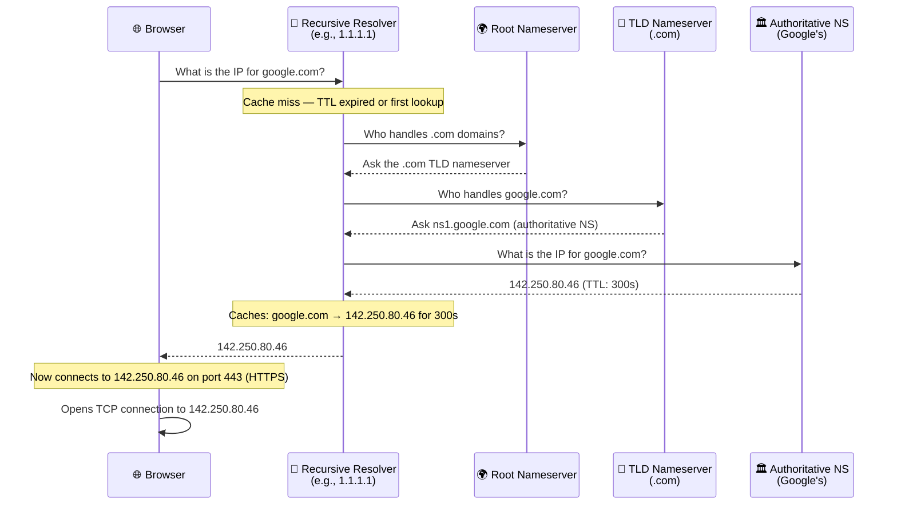

# DNS — The Internet's Phone Book

> DNS (Domain Name System) is the service that translates human-readable website names like `google.com` into the numerical IP addresses computers actually use to communicate.

**Level:** 0 · **Topic:** 5 of 7 · **Prerequisites:** [Network Protocols](../04-Network-Protocols/README.md)

---

## 🎯 The Problem

You want to visit `google.com`. You open your browser, type the name, and hit Enter. Simple.

But here is what is actually happening under the hood: computers on the internet do not talk to each other using names. They use **IP addresses** — a string of numbers like `142.250.80.46`. Your browser needs that number to send a request to Google's servers.

Now imagine you had to memorize a number like that for every website you visit — Google, YouTube, Wikipedia, your bank, your email provider, your favorite news site. You visit dozens of sites a day. That is hundreds of numbers to memorize, and they change regularly when companies move their servers.

That is impossible for humans. **DNS is the solution.** It acts as an automatic translator, converting names you can remember (`google.com`) into numbers computers can route (`142.250.80.46`) — all in the background, in milliseconds, without you ever thinking about it.

---

## 🌍 Real-World Analogy

Think about how you call your mom. You do not dial her phone number from memory — you open your contacts app, search for "Mom," and tap her name. Your phone looks up the number and dials it.

DNS works exactly the same way:

- **Your contacts app** = DNS
- **"Mom"** = `google.com`
- **Her phone number** = `142.250.80.46`

When you type `google.com` into your browser, DNS looks up the corresponding number and hands it back to your browser. Your browser then dials that number to reach Google's servers.

The phone book analogy also captures another truth: the phone book does not make the call for you. It just gives you the number. DNS just gives your browser the IP — your browser still has to make the actual connection.

---

## 🧠 Core Idea

### The DNS Hierarchy

DNS is not a single server — it is a **global hierarchy of servers**, each responsible for a piece of the naming system. Think of it like a tree:

```
Root (.)
├── .com
│   ├── google.com
│   └── amazon.com
├── .org
│   └── wikipedia.org
└── .net
    └── cloudflare.net
```

There are four levels you need to know:

1. **Root Nameservers** — The top of the hierarchy. There are 13 sets of root nameservers worldwide (operated by organizations like ICANN, Verisign, and NASA). They do not know your domain's IP, but they know which server to ask next.

2. **TLD Nameservers (Top-Level Domain)** — These handle extensions like `.com`, `.org`, `.net`, `.io`. The `.com` TLD nameserver knows which authoritative nameserver is responsible for `google.com`.

3. **Authoritative Nameservers** — These are the final authority for a specific domain. Google's authoritative nameserver knows the exact IP address for `google.com`. When you register a domain (e.g., with GoDaddy or Cloudflare), you set up authoritative nameservers for it.

4. **Your Domain** — The actual record, like `A google.com → 142.250.80.46`.

### Recursive Resolver vs Authoritative Resolver

There are two key types of DNS resolvers:

- **Recursive Resolver (also called a DNS Resolver):** This is the server your device talks to first. It does the legwork — it queries root nameservers, then TLD nameservers, then authoritative nameservers, on your behalf. Your ISP provides one by default. Cloudflare's `1.1.1.1` and Google's `8.8.8.8` are popular public recursive resolvers.

- **Authoritative Resolver (Authoritative Nameserver):** This is the server that has the final, definitive answer for a domain. It does not go ask anyone else — it is the source of truth. AWS Route 53, Cloudflare DNS, and Google Cloud DNS are services that act as authoritative resolvers.

You can think of it this way: the recursive resolver is like a librarian who fetches books for you, and the authoritative resolver is like the bookshelf that actually holds the book.

### DNS Caching and TTL (Time to Live)

Making the full hierarchy lookup every time would be slow. DNS solves this with **caching**.

Once your recursive resolver gets the IP address for `google.com`, it stores (caches) that answer so it does not have to do the full lookup again for a while.

**TTL (Time to Live)** controls how long that cached answer is kept. It is a number set by the domain owner, measured in seconds:

- `TTL 300` = cache this answer for 300 seconds (5 minutes)
- `TTL 86400` = cache this answer for 86,400 seconds (24 hours)
- `TTL 60` = cache this for only 60 seconds (short-lived, updates propagate fast)

After the TTL expires, the cached answer is discarded, and the next request triggers a fresh lookup.

### Cache Hit vs Cache Miss

- **Cache Hit:** Your recursive resolver already has the answer cached and TTL has not expired. It responds immediately — typically under 1ms. This is the fast path.

- **Cache Miss:** No cached answer exists (or TTL expired). The resolver must do the full hierarchy lookup — querying root → TLD → authoritative nameserver. This takes **20–120ms** depending on network conditions.

Most DNS lookups you experience day-to-day are cache hits, because popular domains like `google.com` are cached by recursive resolvers constantly.

### DNS Record Types

DNS stores different types of records for different purposes:

| Record Type | Full Name | Purpose |
|-------------|-----------|---------|
| **A** | Address | Maps a domain to an IPv4 address. `google.com → 142.250.80.46` |
| **AAAA** | IPv6 Address | Maps a domain to an IPv6 address. `google.com → 2607:f8b0:4004::200e` |
| **CNAME** | Canonical Name | Alias from one name to another. `www.example.com → example.com` |
| **MX** | Mail Exchanger | Tells email servers where to deliver mail for a domain |
| **NS** | Nameserver | Specifies which nameservers are authoritative for a domain |
| **TXT** | Text | Stores arbitrary text, used for domain verification, SPF, DKIM |
| **SOA** | Start of Authority | Metadata about the zone — primary nameserver, admin email, serial number |

**A record** is the most common one you will encounter. When someone says "DNS points to an IP," they almost always mean an A record.

**CNAME** is used when you want one name to be an alias for another. For example, `www.yoursite.com` might be a CNAME pointing to `yoursite.com`, so you only manage the IP in one place.

**TXT records** are used for security features like SPF (prevents email spoofing) and DKIM (cryptographic email signing), as well as for proving domain ownership to services like Google Search Console.

---

## 📊 How It Works

The diagram below shows the full DNS resolution flow when your browser visits `google.com` for the first time (cache miss):



**Caption:** Full DNS resolution for `google.com`. The recursive resolver (1.1.1.1) walks the hierarchy — root → TLD → authoritative — to find the IP. It then caches the result for 300 seconds (TTL). Your browser never talks to the hierarchy directly; the recursive resolver does all the work.

On a **cache hit** (second visit within 300 seconds), steps 2–5 are skipped entirely. The resolver answers immediately from its cache.

---

## 🔧 Types / Variations / Strategies

### DNS Record Types Reference Table

| Type | Purpose | Example |
|------|---------|---------|
| A | Maps domain → IPv4 | `google.com → 142.250.80.46` |
| AAAA | Maps domain → IPv6 | `google.com → 2607:f8b0:4004::200e` |
| CNAME | Alias one name to another | `www.example.com → example.com` |
| MX | Directs email delivery | `example.com MX → mail.google.com` |
| NS | Declares authoritative nameservers | `example.com NS → ns1.cloudflare.com` |
| TXT | Text data (verification, SPF, DKIM) | `"v=spf1 include:_spf.google.com ~all"` |
| SOA | Zone metadata | Serial number, refresh interval, admin email |

### DNS for Load Balancing: Round-Robin DNS

You can use DNS to distribute traffic across multiple servers. Instead of returning a single IP for `google.com`, you return multiple:

```
google.com → 142.250.80.46
google.com → 142.250.81.100
google.com → 142.250.82.200
```

Each time someone queries DNS, the resolver returns the list in a different order (round-robin). The browser connects to whichever IP appears first. This spreads traffic across servers.

**Limitation:** DNS does not know if a server is down. If `142.250.80.46` crashes, DNS still returns it. You need additional health-checking tools (like Route 53 health checks or a load balancer) to remove failed servers.

### DNS for Geo-Routing

You can configure your authoritative nameserver to return **different IPs based on where the user is located**:

- Users in India → `13.234.x.x` (Mumbai region)
- Users in the US → `52.90.x.x` (Virginia region)
- Users in Europe → `52.28.x.x` (Frankfurt region)

AWS Route 53's "Geolocation routing" does exactly this. The user connects to the nearest server, reducing latency significantly (from ~300ms cross-ocean to ~20ms local).

### Anycast DNS

**Anycast** is a routing strategy where the **same IP address is announced from multiple physical locations**. When you send a packet to that IP, the internet automatically routes it to the nearest location.

Cloudflare's `1.1.1.1` uses anycast. That single IP is served from 300+ data centers worldwide. When you query `1.1.1.1` from Tokyo, your request goes to Cloudflare's Tokyo server. When you query from London, it goes to their London server — even though both use the address `1.1.1.1`.

Benefits of anycast:
- Automatic geographic routing with no DNS configuration
- Built-in redundancy — if one location fails, traffic reroutes to the next nearest
- Very low latency (Cloudflare averages ~14ms globally)

---

## 🏢 Real-World Examples

### Cloudflare 1.1.1.1 — Fast Recursive Resolver

Cloudflare launched `1.1.1.1` in 2018 as a public recursive resolver. It uses anycast to serve queries from 300+ locations worldwide.

Average query time:
- **Cloudflare 1.1.1.1:** ~14ms
- **Google 8.8.8.8:** ~20ms
- **ISP default resolver:** ~60ms (varies widely)

The speed difference matters because DNS is often in the critical path of page load. Saving 46ms on every DNS lookup adds up across a page that loads dozens of assets.

### AWS Route 53 — Geo-Routing for Global Apps

AWS Route 53 is an authoritative DNS service that lets you define routing rules:

- Indian users → route to `ap-south-1` (Mumbai)
- US users → route to `us-east-1` (Virginia)
- EU users → route to `eu-west-1` (Ireland)

A startup deploying globally can use Route 53 to ensure users always hit the closest server, without building complex infrastructure. The DNS layer handles the routing transparently.

### Netflix — DNS to Direct Users to CDN

Netflix uses DNS as part of its content delivery strategy. When your device requests `api.netflix.com` or a video chunk URL, Netflix's DNS infrastructure routes you to the nearest CDN (Content Delivery Network) node.

If you are in Sydney, your DNS query returns the IP of a Sydney CDN node rather than one in Los Angeles. The video data travels a shorter path, reducing buffering and improving quality. Netflix uses a combination of OpenConnect (their CDN) and DNS-based routing to make this work at scale.

### Google — Anycast for Global DNS

Google runs `8.8.8.8` as a public recursive resolver using anycast across dozens of locations worldwide. Like Cloudflare's `1.1.1.1`, querying `8.8.8.8` from anywhere routes you to Google's nearest point of presence. Google processes over **1 trillion DNS queries per day** through this infrastructure.

---

## ⚖️ Trade-offs

### TTL: Short vs Long

| Dimension | Short TTL (e.g., 60s) | Long TTL (e.g., 86400s) |
|-----------|----------------------|------------------------|
| **Propagation speed** | Changes take effect quickly (60s) | Changes take up to 24h to propagate |
| **DNS query load** | Higher (caches expire often, more lookups) | Lower (cached for longer, fewer lookups) |
| **Use case** | Blue-green deployments, failover | Stable production domains |
| **Risk** | Slightly more DNS traffic | Slow recovery if you need to change IPs fast |

**Tip:** Many engineers lower TTL to 60–300 seconds *before* a planned migration, then raise it back to 86400 afterward.

### Authoritative vs Recursive Resolver

| Dimension | Authoritative Resolver | Recursive Resolver |
|-----------|----------------------|-------------------|
| **Role** | Source of truth for a domain | Fetches answers on behalf of clients |
| **Examples** | Route 53, Cloudflare DNS (authoritative mode) | 1.1.1.1, 8.8.8.8, ISP resolver |
| **Who configures it** | Domain owner | End user / organization |
| **Caches answers?** | No (serves them) | Yes |

### Anycast vs Unicast DNS

| Dimension | Anycast | Unicast |
|-----------|---------|---------|
| **How it works** | Same IP, multiple physical locations | One IP, one physical server |
| **Latency** | Low globally (nearest location serves) | High for distant users |
| **Redundancy** | Built-in (reroutes on failure) | Single point of failure |
| **Complexity** | Higher (requires BGP routing setup) | Simpler |
| **Example** | Cloudflare 1.1.1.1, Google 8.8.8.8 | A single VPS running BIND |

---

## ✅ When to Use / ❌ When NOT to Use

### DNS-Based Load Balancing

**Use it when:**
- You want a simple, globally distributed way to spread traffic across servers
- You are implementing geo-routing (serve users from nearest region)
- You need a lightweight solution without managing a load balancer

**Do NOT rely on it when:**
- You need health checks that automatically remove failed servers (DNS does not check if servers are up)
- You need session affinity (same user always hitting same server — DNS cannot guarantee this)
- You need instant failover — TTL means there is always a propagation delay

**Do NOT treat DNS as a true load balancer:** Clients cache DNS responses, so traffic distribution is uneven in practice. A browser that cached `142.250.80.46` will keep hitting that server until TTL expires, regardless of how much load it has.

---

## ⚠️ Common Pitfalls

### 1. DNS Propagation Delays

When you update a DNS record (e.g., point your domain to a new server), the change does not take effect everywhere instantly. Old records are cached in recursive resolvers around the world, and each resolver honors the TTL of the old record before fetching the new one.

If your old TTL was 86400 seconds (24 hours), some users may still hit your old server for up to 24 hours after you update the record.

**Mitigation:** Lower your TTL to 300 seconds (5 minutes) at least 24 hours before a planned change. After the change is stable, raise it back.

### 2. DNS Cache Poisoning

An attacker tricks a recursive resolver into caching a *false* DNS record. For example, they convince your ISP's resolver that `yourbank.com → attacker-server-ip`. Now everyone using that resolver gets sent to a malicious site.

**Mitigations:**
- **DNSSEC** (DNS Security Extensions) — cryptographically signs DNS records so resolvers can verify authenticity
- Use trusted resolvers (1.1.1.1, 8.8.8.8) that implement DNSSEC validation
- Use DNS over HTTPS (DoH) or DNS over TLS (DoT) to prevent eavesdropping and tampering in transit

### 3. DNS Lookup Latency Is Not Free

Developers sometimes forget that DNS lookup itself takes time. On a **cache miss**, a full DNS resolution takes **20–120ms**. This happens:

- On a user's first visit (cold cache)
- After TTL expiration
- When changing networks (mobile switching from WiFi to cell)

In a web page that loads 50 assets from 10 different domains, you could have 10 DNS lookups adding up to 1,000ms+ of latency before even a single byte of content is fetched.

**Mitigations:**
- Use DNS prefetching in HTML: `<link rel="dns-prefetch" href="//cdn.example.com">`
- Minimize the number of unique domains your page loads from
- Use a fast recursive resolver (1.1.1.1 or 8.8.8.8)

---

## 🎤 Interview Tips

**When discussing deployments or blue-green switches:**
Always mention TTL. Say something like: "Before we switch the DNS record to point to the new servers, we would lower the TTL from 86400 to 60 seconds at least 24 hours ahead of time, so that if we need to roll back, the revert propagates within a minute rather than a day."

**When discussing load balancing:**
Make it clear that DNS-based load balancing has a key weakness: clients cache responses. So if your A record has 3 IPs and a user's browser caches the first one for 5 minutes, you do not get perfect 1/3 distribution. For true load balancing, DNS works alongside (not instead of) a layer-4 or layer-7 load balancer.

**When discussing global infrastructure or CDNs:**
Bring up anycast. Explain that services like Cloudflare, Google DNS, and most CDNs use anycast to serve the same IP from hundreds of locations, routing users to the nearest one automatically. This is how `1.1.1.1` can be both fast in Tokyo and fast in New York.

**Common interview question:** "What happens when you type `google.com` into a browser?"
DNS is step 1. Walk through the full hierarchy: browser cache → OS cache → recursive resolver cache → root NS → TLD NS → authoritative NS → IP returned → TCP connection → TLS handshake → HTTP request.

---

## 📝 TL;DR

- DNS translates human-readable domain names (`google.com`) to IP addresses (`142.250.80.46`) — it is the internet's phone book.
- Resolution walks a hierarchy: recursive resolver → root nameserver → TLD nameserver → authoritative nameserver.
- DNS caches answers using TTL (Time to Live). A cache hit is near-instant (<1ms); a cache miss takes 20–120ms.
- Key record types: A (IPv4), AAAA (IPv6), CNAME (alias), MX (mail), TXT (verification/security), NS (nameserver).
- DNS enables load balancing (round-robin), geo-routing (nearest region), and anycast (same IP, many locations) — but it has no built-in health checks and propagation is delayed by TTL.

---

## 🧪 Test Yourself

1. You update your website's DNS A record to point to a new server. Some users still see the old site 6 hours later. Why? What could you have done to shorten this window?

2. What is the difference between a recursive resolver (like `1.1.1.1`) and an authoritative nameserver (like Route 53)? What role does each play in a DNS lookup?

3. Your startup serves users globally. Currently all traffic hits a single server in Virginia. Latency for users in Singapore is 250ms. How could you use DNS to improve this?

4. A colleague says "we can use DNS for load balancing instead of a load balancer — it is simpler and free." What are the limitations of this approach they might not be considering?

---

## 📚 Further Reading

- **DNS and BIND** by Cricket Liu & Paul Albitz — the definitive book on DNS. Covers everything from basics to DNSSEC and advanced zone configuration.
- **Cloudflare Learning Center — DNS** — [cloudflare.com/learning/dns/](https://www.cloudflare.com/learning/dns/) — Free, well-written articles on how DNS works, DNS record types, DNS security, and more. Excellent for beginners.
- **RFC 1035** — The original DNS specification from 1987. Surprisingly readable. Defines the wire format and query/response protocol. Good for understanding DNS at a deep level.
- **RFC 4033 / 4034 / 4035** — DNSSEC specification, if you want to understand how DNS records are cryptographically signed and verified.
- **"The 1.1.1.1" blog post by Cloudflare** — Explains how they built the world's fastest recursive resolver using anycast.
