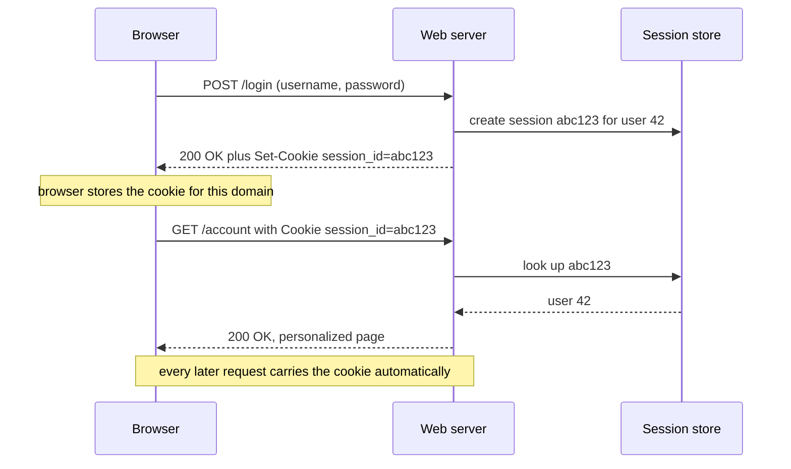
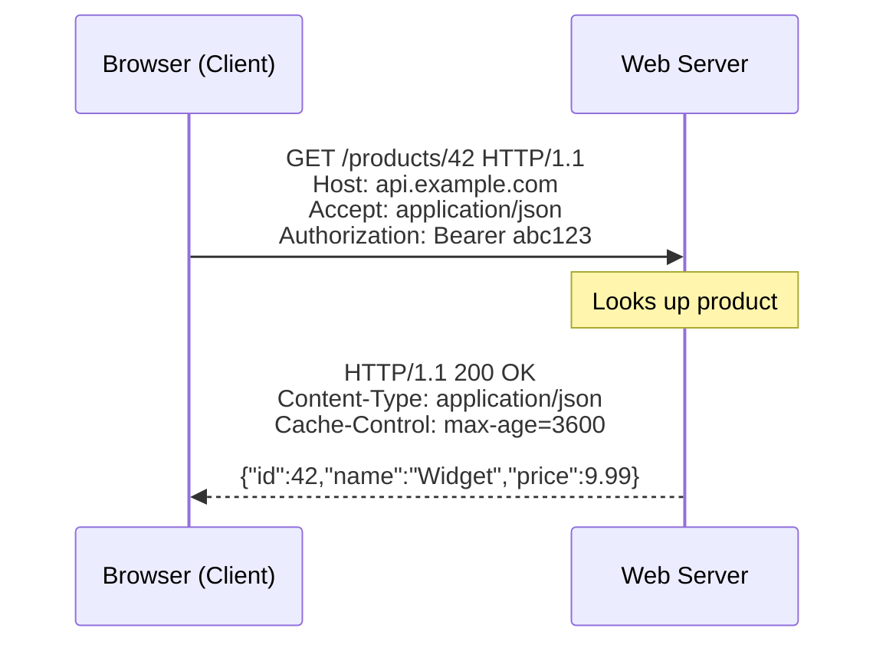
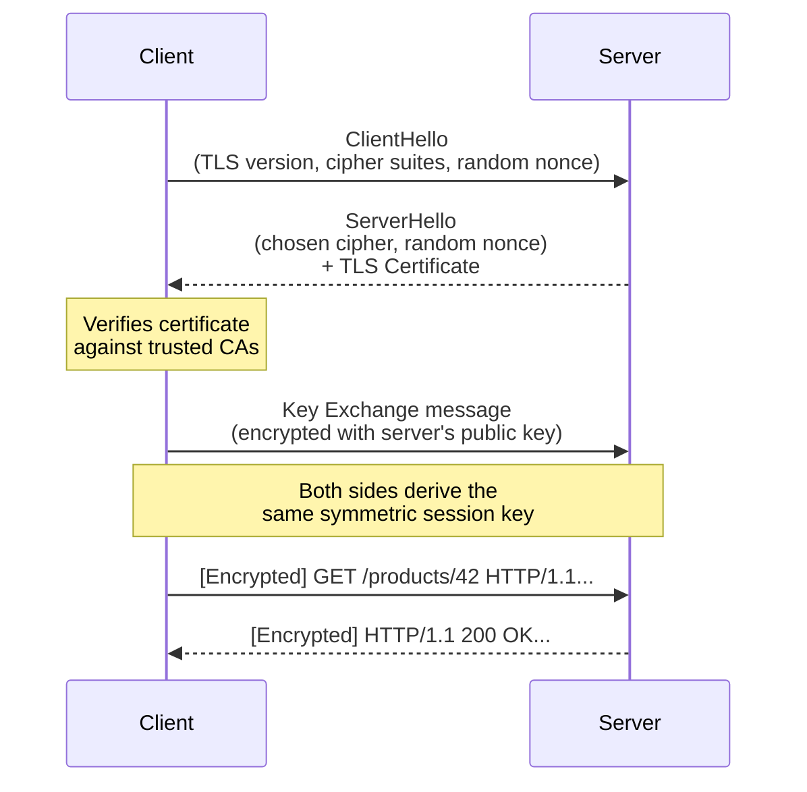
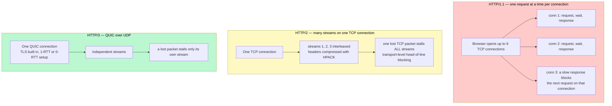

# HTTP and HTTPS — The Language of the Web

> HTTP (HyperText Transfer Protocol) is the agreed-upon set of rules that lets your browser and a web server send messages back and forth so you can load web pages, submit forms, and use apps.

**Level:** 0 · **Topic:** 6 of 7 · **Prerequisites:** [DNS](../05-DNS/README.md) · [Network Protocols](../04-Network-Protocols/README.md)

---

## 🎯 The Problem

Two computers sitting on opposite sides of the world need to exchange a web page. The browser knows the server's address (thanks to DNS), and TCP/IP can physically carry the bytes — but what do those bytes *mean*? How does the server know you want a specific page and not a file? How does it tell you the page was found, or that you need to log in first?

Without a shared grammar, every server would invent its own format and browsers would have to speak thousands of different dialects. HTTP solves this by defining a universal language: clients make **requests**, servers send back **responses**, and everyone agrees on the structure.

---

## 🌍 Real-World Analogy

Imagine walking into a restaurant.

- You are the **client** (your browser).
- The kitchen is the **server**.
- The **menu** is like HTTP — a shared set of rules for placing orders.

You say: "I want item #42" → that's a `GET /products/42` request.
The kitchen replies: "Here it is, ready to go" → that's a `200 OK` response with the food (the response body).

Now imagine the restaurant is in a busy food court where other diners can overhear your order and see your credit card. That's plain **HTTP** — unencrypted, anyone on the network can read it.

**HTTPS** adds a sealed envelope around your order slip. You and the kitchen agree on a secret code before you start talking, so eavesdroppers hear only scrambled noise. That secret code system is called **TLS**.

---

## 🧠 Core Idea

### Request Anatomy

Every HTTP request has four parts:

```
GET /products/42 HTTP/1.1          ← Method + URL path + HTTP version (the request line)
Host: www.example.com              ← Headers (key: value pairs, one per line)
Accept: application/json
Authorization: Bearer abc123
                                   ← Blank line — separates headers from body
                                   ← Body (empty for GET; JSON/form data for POST)
```

| Part | What it is |
|------|-----------|
| **Method** | The *verb* — what action you want (GET, POST, etc.) |
| **URL / Path** | *Which resource* you're acting on (`/products/42`) |
| **Headers** | Metadata about the request (content type, auth tokens, caching hints) |
| **Body** | Optional data you're sending *to* the server (e.g., a JSON payload on POST) |

### Response Anatomy

```
HTTP/1.1 200 OK                    ← Status line (version + code + reason)
Content-Type: application/json     ← Response headers
Cache-Control: max-age=3600
Content-Length: 87

{"id": 42, "name": "Widget", "price": 9.99}   ← Body
```

### HTTP Methods

| Method | Meaning | Safe? | Idempotent? |
|--------|---------|-------|-------------|
| `GET` | Fetch a resource — never changes server state | Yes | Yes |
| `HEAD` | Like GET but returns only headers, no body | Yes | Yes |
| `OPTIONS` | Ask what methods the server supports | Yes | Yes |
| `POST` | Create a new resource or trigger an action | No | No |
| `PUT` | Replace a resource entirely (or create if missing) | No | Yes |
| `PATCH` | Partially update a resource | No | No* |
| `DELETE` | Remove a resource | No | Yes |

> **Safe** means the method never modifies server state. **Idempotent** means calling it multiple times has the same effect as calling it once — important for retrying failed requests safely.

### Status Code Families

| Family | Range | Meaning |
|--------|-------|---------|
| **1xx** | 100–199 | Informational — request received, keep going |
| **2xx** | 200–299 | Success |
| **3xx** | 300–399 | Redirect — look somewhere else |
| **4xx** | 400–499 | Client error — you did something wrong |
| **5xx** | 500–599 | Server error — the server failed |

Key codes you'll encounter every day:

| Code | Name | When you see it |
|------|------|-----------------|
| 200 | OK | Standard success |
| 201 | Created | POST succeeded, new resource created |
| 204 | No Content | Success, but nothing to send back |
| 301 | Moved Permanently | URL has changed forever; update your bookmarks |
| 302 | Found (Temporary Redirect) | URL has changed temporarily |
| 400 | Bad Request | Malformed syntax or invalid parameters |
| 401 | Unauthorized | Not authenticated — you need to log in |
| 403 | Forbidden | Authenticated but not allowed — wrong permissions |
| 404 | Not Found | Resource doesn't exist |
| 429 | Too Many Requests | Rate limited |
| 500 | Internal Server Error | Something crashed on the server |
| 502 | Bad Gateway | A proxy got a bad response from an upstream server |
| 503 | Service Unavailable | Server is down or overloaded |
| 504 | Gateway Timeout | A proxy timed out waiting for the upstream server |

### Important Headers

| Header | Direction | Purpose |
|--------|-----------|---------|
| `Content-Type` | Both | What format the body is in (`application/json`, `text/html`) |
| `Accept` | Request | What formats the client can handle |
| `Authorization` | Request | Credentials (`Bearer <token>`, `Basic <base64>`) |
| `Cache-Control` | Both | How long responses can be cached |
| `Cookie` | Request | Sends stored cookies to the server |
| `Set-Cookie` | Response | Tells the browser to store a cookie |
| `ETag` | Response | A fingerprint of the resource version (for caching) |
| `If-None-Match` | Request | Send the ETag back — server replies 304 if unchanged |

### Statelessness (and How Cookies Fix It)

HTTP is **stateless**: each request is completely independent. The server has no built-in memory of your previous requests. This makes servers easy to scale (any server can handle any request), but it means you have to re-identify yourself on every request.

The solution: **cookies**. On login, the server sends `Set-Cookie: session_id=abc123`. Your browser stores it and automatically attaches `Cookie: session_id=abc123` to every subsequent request. The server looks up `abc123` in its session store and knows who you are.

*The cookie round-trip. Notice that the server keeps no memory of you between requests — the cookie is what re-introduces you every time.*



*Caption: Because the identity lives in the cookie plus a shared session store, any server can handle any request — which is what makes stateless web tiers easy to scale (see Stateless vs Stateful in Level 1).*

### HTTPS = HTTP + TLS

**TLS** (Transport Layer Security) wraps the HTTP conversation in an encrypted tunnel. From the outside, the requests and responses look like scrambled noise. Only the client and server — who negotiated a shared secret key — can read them.

TLS provides three guarantees:
1. **Confidentiality** — nobody eavesdropping can read the data.
2. **Integrity** — nobody can tamper with the data in transit without detection.
3. **Authentication** — you know you're talking to the real server (via its certificate).

**Simplified TLS Handshake:**

1. **ClientHello** — browser sends: "I support TLS 1.3, here are my cipher suites, here's my random number."
2. **ServerHello + Certificate** — server sends: "Use this cipher suite, here's my TLS certificate (signed by a trusted CA)."
3. **Key Exchange** — both sides use the certificate and math (Diffie-Hellman) to agree on a symmetric key *without ever sending it over the wire*.
4. **Encrypted Channel** — from here on, everything uses the symmetric key. HTTP requests and responses flow inside the tunnel.

### HTTP Version History

| Version | Key Feature | Problem Solved | Remaining Issue |
|---------|-------------|----------------|-----------------|
| **HTTP/1.0** | One connection per request | Basic web | Very slow — TCP setup for every request |
| **HTTP/1.1** | Keep-alive connections, pipelining | Reuse connections | Head-of-line blocking (one slow response blocks all others) |
| **HTTP/2** | Multiplexing, header compression (HPACK), server push | Multiple requests over one connection simultaneously | TCP head-of-line blocking still exists at transport layer |
| **HTTP/3** | QUIC over UDP, stream-level flow control | Eliminates TCP head-of-line blocking entirely | Still maturing adoption |

---

## 📊 How It Works

### A Basic HTTP Request/Response



*The client sends a request with a method, path, and headers. The server processes it and returns a status code, headers, and a body.*

---

### TLS Handshake (Simplified)



*After the handshake, all HTTP traffic flows inside the encrypted tunnel. An eavesdropper sees only ciphertext.*

---

## 🔧 Types / Variations / Strategies

### HTTP Methods — When to Use Each

| Method | Use When | Idempotent? | Safe? | Example |
|--------|----------|-------------|-------|---------|
| `GET` | Fetching data, searching, reading | Yes | Yes | `GET /users/42` |
| `POST` | Creating new resources, submitting forms, triggering actions | No | No | `POST /orders` |
| `PUT` | Replacing a full resource (send the entire object) | Yes | No | `PUT /users/42` with full user JSON |
| `PATCH` | Updating specific fields only | No* | No | `PATCH /users/42` with `{"email":"new@example.com"}` |
| `DELETE` | Removing a resource | Yes | No | `DELETE /sessions/abc123` |
| `HEAD` | Checking if a resource exists / getting headers without body | Yes | Yes | `HEAD /files/report.pdf` |
| `OPTIONS` | Preflight CORS checks, API discovery | Yes | Yes | `OPTIONS /api/products` |

### HTTP/1.1 vs HTTP/2 vs HTTP/3

| Feature | HTTP/1.1 | HTTP/2 | HTTP/3 |
|---------|----------|--------|--------|
| Transport | TCP | TCP | QUIC (UDP) |
| Multiplexing | No (one request at a time per connection) | Yes (streams) | Yes (streams) |
| Header compression | No | HPACK | QPACK |
| Head-of-line blocking | TCP + HTTP | TCP (transport level) | Eliminated |
| Server Push | No | Yes | Yes |
| TLS | Optional | Effectively required | Required |
| Adoption (2025) | ~5% new sites | ~60%+ | ~30%+ |
| Best for | Legacy systems | Most modern web traffic | High-latency, mobile, video |

*What "head-of-line blocking" means in each version, and why HTTP/3 had to leave TCP behind to fix it.*



*Caption: HTTP/2 solved the application-level problem (one request at a time) but inherited TCP's rule that bytes are delivered in order. QUIC gives each stream its own ordering, so a dropped packet on a lossy mobile link hurts one image instead of the whole page.*

### Common Status Codes by Scenario

| Code | Scenario |
|------|----------|
| 200 | `GET /users/42` succeeds — user returned in body |
| 201 | `POST /orders` creates a new order — order returned in body |
| 204 | `DELETE /sessions/abc123` succeeds — nothing to return |
| 301 | `http://` URL permanently redirected to `https://` |
| 304 | Client sends `If-None-Match` ETag, resource unchanged — use your cache |
| 400 | `POST /orders` with malformed JSON body |
| 401 | Hitting a protected endpoint without an `Authorization` header |
| 403 | Authenticated user tries to access another user's private data |
| 404 | `GET /products/9999` — product doesn't exist |
| 429 | Stripe API called more than 100 times per second |
| 500 | Unhandled exception in the server code |
| 503 | Server is in maintenance mode or overwhelmed |

---

## 🏢 Real-World Examples

**Facebook / Meta — HTTP/2 at scale**
Facebook serves 2.9 billion monthly active users. They were early adopters of SPDY (HTTP/2's predecessor) and HTTP/2, specifically for HPACK header compression. Because Facebook's API responses include many repeated headers (auth tokens, content types, host names), HPACK can compress headers by up to 85%, dramatically reducing bandwidth and latency. Facebook's mobile apps make hundreds of small API calls per session — multiplexing means all those calls share one TCP connection instead of opening dozens.

**Google — pushing HTTP/3 adoption**
Google invented QUIC (the protocol underneath HTTP/3) and has run it in production since 2013 across Google Search, YouTube, and Gmail. YouTube benefits enormously: with TCP, a single lost packet pauses the entire video stream. With QUIC's stream-level flow control, a lost packet only pauses that one stream — other streams (audio, metadata) keep flowing. Google's Chrome browser defaulted to HTTP/3 for eligible connections starting in 2020.

**Stripe — proper use of HTTP methods and status codes**
Stripe's API is a gold standard for REST design. `POST /v1/charges` creates a charge (not idempotent — sending twice creates two charges — so they provide an `Idempotency-Key` header). `GET /v1/charges/ch_abc` retrieves it. A card decline returns `402 Payment Required` with a structured error body. Authentication failures return `401`. Permission errors return `403`. This consistency means developers can write predictable error-handling code.

**GitHub — ETag caching for API responses**
GitHub's REST API returns an `ETag` header with every response — a hash of the current resource state. On subsequent calls, your client sends `If-None-Match: <etag>`. If nothing changed, GitHub replies `304 Not Modified` with an empty body and doesn't count the call against your rate limit. For tools that poll GitHub frequently (CI systems, bots), this can reduce bandwidth by 90% and keep you well within rate limits.

---

## ⚖️ Trade-offs

### HTTP vs HTTPS

| Factor | HTTP | HTTPS |
|--------|------|-------|
| Security | None — anyone on the network can read traffic | Encrypted, authenticated, tamper-evident |
| Latency overhead | None | TLS handshake adds ~1 RTT (mitigated by TLS session resumption) |
| CPU overhead | None | Small (AES-NI hardware acceleration makes it negligible on modern CPUs) |
| SEO | Google penalizes HTTP sites | Google ranks HTTPS sites higher |
| Browser warnings | Chrome shows "Not Secure" | Padlock icon — user trust |
| Verdict | Only for internal localhost development | Use HTTPS everywhere, always |

### HTTP Version Trade-offs

| Factor | HTTP/1.1 | HTTP/2 | HTTP/3 |
|--------|----------|--------|--------|
| Simplicity | Simple, easy to debug with `curl` | More complex binary protocol | Most complex |
| Tooling support | Universal | Excellent | Growing |
| Performance on fast networks | Adequate | Excellent | Excellent |
| Performance on lossy networks (mobile) | Poor | Poor (TCP HOL blocking) | Excellent |
| Server complexity | Low | Medium | High |
| When to use | Legacy or internal tools | Most production web APIs and sites | High-scale, global, latency-sensitive services |

---

## ✅ When to Use / ❌ When NOT to Use

**Use HTTP/REST when:**
- You're building a standard web API (CRUD operations on resources).
- Clients are browsers or mobile apps.
- You need wide compatibility (every language has an HTTP client).
- You want human-readable requests (easy to debug with browser DevTools or `curl`).

**Consider WebSockets instead when:**
- You need **real-time, bidirectional** communication (chat, live collaboration, multiplayer games).
- You need to push data to the client without the client asking (live stock prices, notifications).
- HTTP's request-response overhead would be too high for your message frequency.

**Consider gRPC instead when:**
- You're doing **service-to-service communication** in a microservices backend.
- You need strict typed contracts (Protocol Buffers).
- You need high-throughput, low-latency calls with streaming.
- You don't need human-readable wire format (you have internal tooling).

*(WebSockets and gRPC are covered in depth in later topics.)*

---

## ⚠️ Common Pitfalls

**1. Using GET for state-changing operations**
Never use `GET /deleteUser?id=42`. GET requests are bookmarkable, cached by browsers, and pre-fetched by link crawlers. A web crawler or a browser prefetch could accidentally delete your data. Always use `POST`, `PUT`, `PATCH`, or `DELETE` for mutations.

**2. Returning 200 for errors**
A common mistake in early API design is returning `200 OK` with a body like `{"success": false, "error": "not found"}`. This breaks every HTTP-aware tool: load balancers, monitoring systems, and client retry logic all check status codes. Return `404` for not found, `400` for bad input, `500` for server errors.

**3. Not setting Cache-Control headers**
If you don't set `Cache-Control`, browsers and CDNs may cache responses indefinitely or not at all, depending on their heuristics. Be explicit: `Cache-Control: no-store` for sensitive data, `Cache-Control: max-age=3600` for cacheable resources, `Cache-Control: no-cache` for resources that must be revalidated with the server.

**4. Confusing 401 vs 403**
- `401 Unauthorized` actually means *unauthenticated* — "I don't know who you are, please log in."
- `403 Forbidden` means *unauthorized* — "I know who you are, and you're not allowed to do this."
Mixing these up confuses clients that use the status code to decide whether to prompt for login.

**5. Ignoring HTTPS for "internal" APIs**
Traffic between your own microservices can be intercepted if your network is compromised. Mutual TLS (mTLS) for service-to-service traffic is increasingly standard. At minimum, use HTTPS even on internal endpoints.

---

## 🎤 Interview Tips

**PUT vs PATCH** — Know this cold. `PUT` replaces the entire resource (you must send all fields). `PATCH` applies a partial update (send only the fields you want to change). If you `PUT` a user object and omit their email, the email gets deleted. If you `PATCH` and omit the email, it stays unchanged.

**Always mention TLS when discussing HTTPS** — Interviewers want to know you understand *why* HTTPS is secure. Don't just say "it's encrypted." Explain: TLS provides a handshake where both parties agree on a symmetric key, and the server's certificate is verified against a trusted Certificate Authority. This gives you confidentiality, integrity, and authentication.

**HTTP/2 multiplexing for performance** — When asked how to improve web performance, bring up HTTP/2. Mention that HTTP/1.1 suffers from head-of-line blocking (one slow response delays all others on that connection), and HTTP/2 solves this with multiplexing (multiple streams on one connection, independent of each other).

**REST is an architectural style, not a protocol** — REST (Representational State Transfer) is a set of design constraints (stateless, resource-based URLs, standard methods). HTTP is the protocol that most REST APIs happen to use. You can have non-RESTful HTTP APIs (like RPC-style `POST /getUserById`), and REST principles have been implemented over other protocols.

**Status codes in system design** — When discussing distributed systems, mention that clients should retry `503 Service Unavailable` and `429 Too Many Requests` (with exponential backoff), but should *not* retry `400 Bad Request` or `404 Not Found` — those errors won't go away on their own.

---

## 📝 TL;DR

- HTTP is the request-response protocol that powers the web: clients send requests (method + URL + headers + body), servers reply with responses (status code + headers + body).
- HTTP methods describe the *action* (GET to read, POST to create, PUT to replace, PATCH to update, DELETE to remove); status codes describe the *outcome* (2xx success, 4xx client error, 5xx server error).
- HTTP is stateless — cookies and session tokens are the workaround that lets servers remember who you are across requests.
- HTTPS wraps HTTP in TLS, which provides encryption (confidentiality), tamper detection (integrity), and server identity verification (authentication) via a certificate handshake.
- HTTP/2 added multiplexing (many requests over one connection simultaneously); HTTP/3 replaced TCP with QUIC to eliminate the last form of head-of-line blocking.

---

## 🧪 Test Yourself

1. You want to update a user's email address without touching any other fields. Which HTTP method should you use, and why? What would you use instead if you were replacing the entire user record?

2. Your API returns `200 OK` with `{"error": "user not found"}` in the body. What is wrong with this approach, and what should you return instead?

3. A colleague says "we don't need HTTPS on our internal microservices API because it's not public-facing." What are the counter-arguments? What is mTLS and when would you use it?

4. Explain what happens during a TLS handshake before an HTTPS request is made. What is the purpose of the server's certificate, and what would happen if a Certificate Authority's private key were compromised?

---

## 📚 Further Reading

- **"HTTP: The Definitive Guide"** — David Gourley, Brian Totty, et al. (O'Reilly). The definitive deep dive into everything HTTP — headers, caching, authentication, proxies, and more. Dense but comprehensive.

- **MDN Web Docs — HTTP** — [developer.mozilla.org/en-US/docs/Web/HTTP](https://developer.mozilla.org/en-US/docs/Web/HTTP). The best free reference for HTTP headers, methods, and status codes. Bookmark this and use it daily.

- **"High Performance Browser Networking"** — Ilya Grigorik (O'Reilly, free online at [hpbn.co](https://hpbn.co)). Covers TCP, TLS, HTTP/1.1, HTTP/2, WebSockets, and WebRTC in depth with a focus on real-world performance. The HTTP/2 and QUIC chapters are especially excellent.
