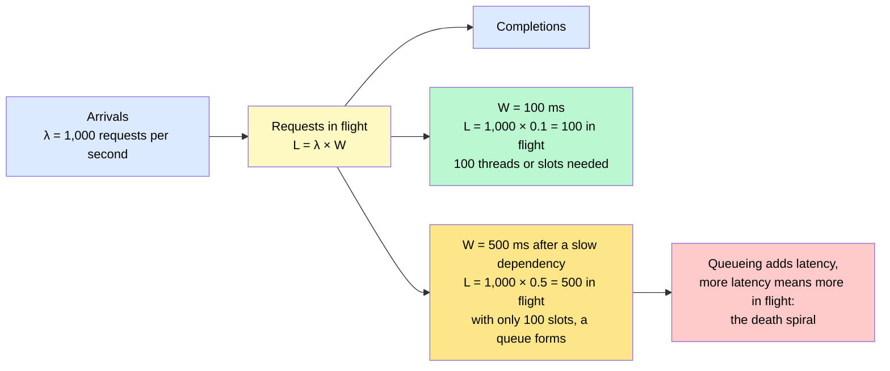
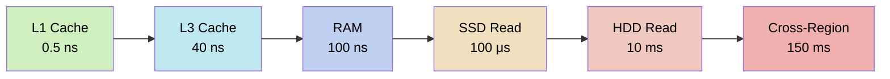
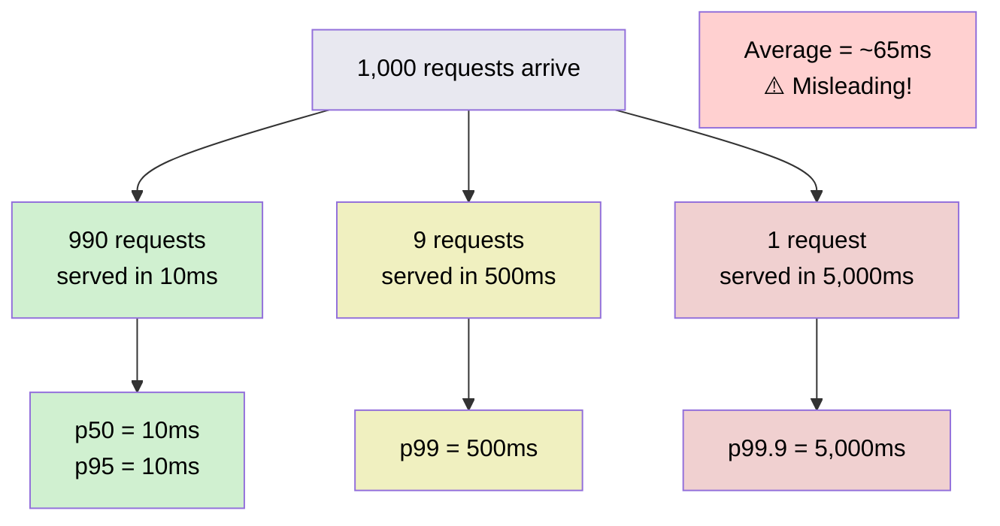
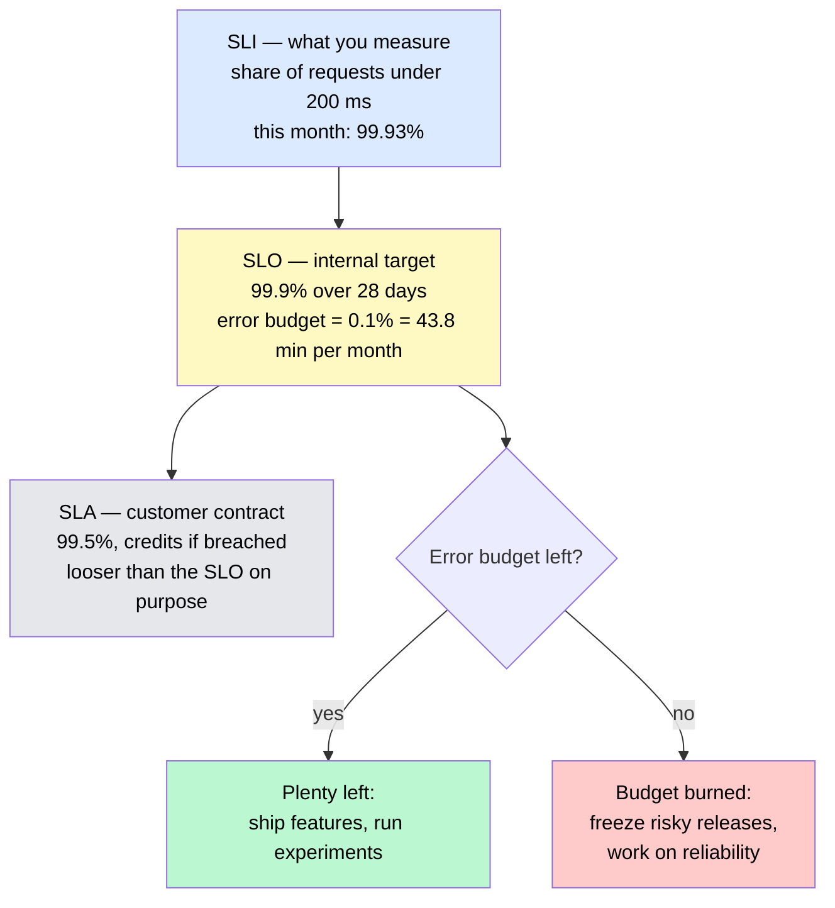

# Latency, Throughput, and Performance

> Latency, throughput, and performance are the three lenses that let you precisely describe *why* a system feels slow and *where* to fix it.

**Level:** 0 · **Topic:** 7 of 7 · **Prerequisites:** [HTTP and HTTPS](../06-HTTP-and-HTTPS/README.md)

---

## 🎯 The Problem

Your app works perfectly in development. Ten friends try it and say it feels snappy. You launch publicly and 10,000 users hit it on the same afternoon. Suddenly everything feels "slow" — but *slow* is not an engineering term. You cannot fix "slow." You can fix:

- "The database query takes 800ms at the 99th percentile under 5,000 concurrent users."
- "We handle 200 requests per second but the product team needs 2,000."
- "Our p99 latency triples when the queue depth exceeds 500 items."

Before you can design systems that scale, you need this vocabulary. Latency, throughput, and bandwidth are the units of measure for everything that follows in this curriculum. Every architectural decision you will ever make — caching, load balancing, database sharding, CDNs, message queues — is ultimately a trade-off denominated in these numbers.

This is the last topic in Level 0. By the end, you will have the language to walk into any system design conversation and immediately ask the right questions.

---

## 🌍 Real-World Analogy

Think of a highway connecting two cities.

- **Latency** is how long a single car takes to drive from City A to City B. If the trip takes 2 hours, the latency is 2 hours.
- **Throughput** is how many cars pass the toll booth at City B per hour. A busy highway might see 3,000 cars/hour.
- **Bandwidth** is how many lanes the highway has. A 10-lane highway has more *capacity* than a 2-lane road.

Here is the key insight: **a congested highway has high latency AND low throughput even if it has 10 lanes.** If every lane is gridlocked, adding more lanes does not help. The bottleneck is not bandwidth — it is the utilization of existing capacity.

This is exactly how computer systems behave. A database server with a 10 Gbps network card (bandwidth) can still be slow (high latency) and handle few requests (low throughput) if it is CPU-bound or waiting on disk I/O.

---

## 🧠 Core Idea

### The Three Metrics

**Latency** — the time it takes to complete *one* operation, measured in milliseconds (ms), microseconds (μs), or nanoseconds (ns). Examples: the time from clicking "Submit" to seeing a response; the time for a database to return one row.

**Throughput** — how many operations the system completes per unit of time. Usually expressed as:
- **QPS** (queries per second) for databases
- **RPS** (requests per second) for web servers
- **TPS** (transactions per second) for payment systems
- **MB/s or GB/s** for data pipelines

**Bandwidth** — the *maximum* rate at which data can be transferred, usually measured in Gbps (gigabits per second) or MB/s. Bandwidth is a ceiling; throughput is what you actually achieve below that ceiling.

### The Relationship Between Latency and Throughput

Under a naive model you might think: throughput = 1 / latency. If each request takes 10ms, you get 100 requests/second. This is only true with a single worker and zero parallelism.

In reality, systems handle many requests concurrently. With 100 parallel workers, each taking 10ms, throughput = 100 / 0.010s = 10,000 RPS. The relationship is:

```
Throughput = Concurrency / Latency
```

But this breaks down under load due to queuing effects (covered below with Little's Law).

### Percentiles: Why Averages Lie

Suppose you measure response times for 1,000 requests and calculate an average of 50ms. That sounds fine. But what if 990 requests took 10ms and 10 requests took 5,000ms? The average is ~60ms but 1% of your users are waiting 5 seconds.

This is why engineers use **percentiles**:

| Percentile | Notation | Meaning |
|---|---|---|
| 50th | p50 | Half of requests are faster than this. The median. |
| 95th | p95 | 95% of requests are faster; 5% are slower. |
| 99th | p99 | 99% faster; 1% slower. |
| 99.9th | p99.9 | 999 out of 1,000 are faster; 1 in 1,000 is slower. |

### Tail Latency: Why p99 Matters More Than Average

The worst-performing requests are called **tail latency**. In user-facing systems:

- p50 = the experience your median user has
- p99 = the experience your most "unlucky" 1 in 100 users has
- p99.9 = 1 in 1,000 users — still thousands of people at Google scale

In a microservices architecture, tail latency **compounds**. If a user request fans out to 10 backend services, each with p99 = 10ms, the probability that the overall request avoids all slow tails is 0.99^10 ≈ 90%. That means 10% of requests — 1 in 10 — will be slow, even though each individual service is only slow 1% of the time. At 100 services, it is 0.99^100 ≈ 37%. Nearly two-thirds of requests hit at least one slow service.

**Tail latency is the dominant performance problem in large distributed systems.**

### Little's Law

Little's Law is a fundamental theorem from queuing theory that describes how latency, throughput, and queue length relate:

```
L = λ × W
```

Where:
- **L** = average number of items in the system (queue length + in-service)
- **λ** (lambda) = average arrival rate (throughput, in items/second)
- **W** = average time an item spends in the system (latency)

**Example:** If your web server receives 1,000 RPS (λ = 1,000) and average latency is 100ms (W = 0.1s), then L = 1,000 × 0.1 = 100 requests are in-flight at any moment. If latency spikes to 500ms, you need 500 in-flight slots to maintain the same throughput — or your queue grows, latency increases further, and you enter a death spiral.

*Little's Law as a picture. The same arrival rate needs five times the capacity when latency goes up five times — and if that capacity isn't there, the queue itself adds latency.*



*Caption: This is why timeouts and load shedding exist — they cap W so that L stays bounded when a dependency slows down.*

### Latency Numbers Every Programmer Should Know

Originally compiled by Jeff Dean (Google), these numbers give you a mental ruler for system design. Memorize the orders of magnitude.

| Operation | Latency | Notes |
|---|---|---|
| L1 cache reference | ~0.5 ns | On-chip, directly beside the CPU core |
| Branch misprediction | ~5 ns | CPU has to flush and restart the pipeline |
| L2 cache reference | ~7 ns | Still on-chip but farther away |
| Mutex lock/unlock | ~25 ns | OS-level synchronization |
| L3 cache reference | ~40 ns | Shared across cores |
| Main memory (RAM) reference | ~100 ns | 200× slower than L1 cache |
| Compress 1 KB with Snappy | ~3,000 ns = 3 μs | CPU-bound compression |
| Read 1 MB sequentially from RAM | ~9,000 ns = 9 μs | Memory bandwidth limited |
| SSD random read (NVMe) | ~100 μs = 0.1 ms | 1,000× slower than RAM |
| Read 1 MB sequentially from SSD | ~200 μs = 0.2 ms | — |
| HDD seek + read | ~10 ms | Mechanical arm must physically move |
| Send packet within same datacenter | ~0.5 ms | LAN, negligible |
| Same-region cloud network hop | ~1 ms | e.g., us-east-1 within AWS |
| Read 1 MB sequentially from HDD | ~30 ms | Mechanical, sequential is best case |
| TCP handshake + TLS (same region) | ~5–10 ms | Round-trip cost |
| Cross-region (US → Europe) | ~60–150 ms | Speed of light across ~7,000 km |
| Round-trip EU ↔ US | ~150 ms | Physical lower bound |

---

## 📊 How It Works

### Latency Spectrum: From Nanoseconds to Milliseconds



*Each arrow represents roughly a 10–1,000× jump in latency. Going from L1 cache to a cross-region network call spans a factor of 300,000,000×.*

### p50 vs p99: What Percentiles Reveal



*The average (65ms) hides the fact that 1 in 100 users waits 500ms and 1 in 1,000 waits 5 full seconds.*

### Latency Reference Table (With Human Analogies)

| Operation | Latency | If 1 ns = 1 second | Implication |
|---|---|---|---|
| L1 cache | 0.5 ns | 0.5 seconds | Effectively free; always cache hot data here |
| L2 cache | 7 ns | 7 seconds | Still very fast; prefer over RAM |
| L3 cache | 40 ns | 40 seconds | Shared; watch for cache contention |
| RAM | 100 ns | 1.7 minutes | In-memory databases (Redis) live here |
| NVMe SSD | 100 μs | 1.7 days | Fast enough for many DB operations |
| Network (LAN) | 0.5 ms | 8 days | Cheap cross-service calls within a datacenter |
| HDD seek | 10 ms | 4 months | Avoid random HDD I/O at all costs |
| Cross-region | 150 ms | 4.75 years | Design replication strategies around this |

---

## 🔧 Types / Variations / Strategies

### Throughput Optimization Strategies

| Strategy | Description | Latency Impact | Trade-off |
|---|---|---|---|
| **Caching** | Store results of expensive operations (RAM, Redis) | Reduces latency 10–1,000× | Stale data; cache invalidation complexity |
| **Parallelism** | Handle multiple requests concurrently (threads, goroutines) | No direct impact per request | Resource usage; synchronization overhead |
| **Batching** | Group many small operations into one large one | Increases per-item latency | Higher throughput; not suitable for interactive workloads |
| **Async processing** | Decouple request receipt from work execution (queues) | Improves perceived latency | Eventual consistency; harder debugging |
| **Connection pooling** | Reuse database/network connections | Reduces per-request overhead | Pool exhaustion under bursty load |
| **Read replicas** | Direct reads to replicas, writes to primary | Reduces read latency | Replication lag; eventual consistency |
| **Horizontal scaling** | Add more servers behind a load balancer | Improves throughput linearly (ideal) | Cost; coordination overhead |
| **Compression** | Reduce data size before transfer | Reduces network latency | CPU cost; not worth it for tiny payloads |

### SLAs, SLOs, and SLIs (Google SRE Framework)

These three terms come from Google's Site Reliability Engineering (SRE) framework and are now industry standard.

**SLI — Service Level Indicator**
A *measurement*. A specific, quantifiable metric of service behavior.
- Example: "The fraction of HTTP requests that return a response in under 200ms"
- Example: "The percentage of login attempts that succeed"

**SLO — Service Level Objective**
A *target* for an SLI. The threshold your team commits to internally.
- Example: "99% of HTTP requests return in under 200ms, measured over a rolling 28-day window"
- Example: "Availability ≥ 99.9% per month"
- SLOs define your **error budget**: with 99.9% availability, you are allowed ~43.8 minutes of downtime per month.

**SLA — Service Level Agreement**
A *contract* between you and your customers, with financial penalties for violations.
- Example: "AWS EC2 SLA: if monthly uptime < 99.9%, customers receive a 10% service credit; if < 95%, a 30% credit"
- SLAs are usually less strict than internal SLOs (so you have a buffer before violating the customer contract).

**The hierarchy:**
```
SLA (external contract, least strict)
  └── SLO (internal target, stricter)
        └── SLI (the actual measured number)
```

**Error budgets** are the innovation from Google SRE: if your SLO is 99.9% availability, you have a 0.1% error budget. If you have consumed it, you slow down feature releases and focus on reliability. If you have plenty left, you can move fast.

*How the three fit together, and how the error budget turns a number into a decision.*



*Caption: The SLA is deliberately looser than the SLO so that missing the internal target is a warning, not a breach of contract.*

---

## 🏢 Real-World Examples

**Amazon — Latency = Revenue**
Amazon published research showing that every **100ms of additional latency** costs them **1% in sales**. At Amazon's scale (hundreds of billions in annual revenue), 100ms = hundreds of millions of dollars per year. This is why Amazon engineers have an internal culture of measuring latency obsessively.

**Google — Perceived Speed Affects Behavior**
Google ran an experiment in 2006: introducing a **500ms delay** on Google Search results pages caused a **20% drop in searches** — people simply gave up and searched less. Users adapt to speed; when you slow down, they disengage.

**Discord — Serving Millions with Tight Tail Latency**
Discord serves over 6.5 million concurrent users in real-time voice, video, and text. Their engineering team publicly targets **p99 < 200ms** for message delivery. They achieved this by moving from Python to Elixir (for concurrency) and later Rust (for memory efficiency), and by carefully managing their Cassandra database query patterns to avoid tail latency outliers.

**Stripe — Payments Under Pressure**
Stripe's payment API targets **p99 < 250ms** for charge creation. A slow payment API directly causes cart abandonment. Stripe achieves this through geographic distribution (serving users from the nearest region), aggressive connection pooling, and writing idempotency into their API so retries do not cause double-charges.

**Netflix — Latency Budgeting Across Microservices**
Netflix's architecture involves hundreds of microservices. Each time you press "Play," Netflix orchestrates calls to services for: authentication, entitlement checking, stream URL generation, device manifest selection, and DRM licensing — all in parallel when possible, sequential when not. Netflix assigns a **latency budget** to each service and monitors p99 for each leg. If one service degrades, they have pre-built fallback behaviors (e.g., serving cached content manifests) rather than surfacing the error to the user.

---

## ⚖️ Trade-offs

### Latency vs. Throughput

| Scenario | Optimize For | Sacrifice | Example |
|---|---|---|---|
| User clicks "Search" | Latency | Throughput (fewer concurrent users) | Google Search |
| Nightly data warehouse ETL | Throughput | Latency (each row takes longer) | Spark batch job |
| Video streaming | Throughput (bandwidth) | Some latency (buffering) | Netflix, YouTube |
| Online gaming | Latency | Throughput | First-person shooters need <50ms RTT |
| Bank transaction | Neither (ACID guarantees) | Both | Correctness > speed |
| Social media feed | Throughput + low latency | Consistency (eventual) | Twitter timeline |

### Consistency vs. Latency (Preview)

One of the deepest trade-offs in distributed systems is between **consistency** and **latency**. To return consistent data, a database might need to wait for acknowledgment from multiple servers — which adds latency. This is formalized in the **CAP theorem** and **PACELC model**, which you will study in Level 1. For now, internalize this: *the speed of light is a hard constraint*. Two datacenters 10,000 km apart cannot communicate in under ~33ms, period. Any system requiring global consistency must pay that cost.

---

## ✅ When to Use / ❌ When NOT to Use

### Optimize for Latency When:
- You are building **user-facing, interactive systems**: web UIs, APIs, mobile apps, games
- Users are **waiting synchronously** for a response
- Small latency differences translate to revenue (e-commerce, ads, search)
- You are chaining **many services** (latency compounds)
- Your SLA/SLO has **explicit latency targets** (p99 < 200ms)

### Optimize for Throughput When:
- You are running **batch jobs**: data pipelines, ML training, report generation
- Users are **not waiting synchronously** (fire-and-forget, async notifications)
- You are processing **large volumes of data** (ETL, log ingestion, event streaming)
- Cost efficiency matters more than speed: maximize work per dollar
- The bottleneck is **I/O bandwidth**, not compute or network round-trips

### Do NOT Over-Optimize When:
- You have not **measured** yet — never optimize without profiling data
- Your latency is already within SLO and the bottleneck is elsewhere
- Optimization would require **breaking correctness guarantees** (e.g., removing transactions for 5ms gains)
- The added complexity **outweighs** the benefit for your current scale

---

## ⚠️ Common Pitfalls

**1. Optimizing the average instead of p99**
Mean response time hides outliers. Your average might look great while 1% of users have a terrible experience. Always look at p95 and p99. Many dashboards default to averages — change that.

**2. Ignoring queuing effects under load**
Systems behave differently under 10% utilization versus 90% utilization. As utilization approaches 100%, queue length and latency grow non-linearly (this is the "knee of the curve" in queuing theory). Load test at production-like concurrency, not just serial benchmarks.

**3. Confusing bandwidth with throughput**
Your network card has 10 Gbps bandwidth. Your actual throughput might be 2 Gbps because of CPU overhead, protocol inefficiency, or TCP congestion control. Bandwidth is the ceiling, not the floor.

**4. Not measuring before optimizing**
"Premature optimization is the root of all evil" (Knuth). Profile first. The bottleneck is almost never where you expect it. Use tools like `perf`, `flamegraphs`, distributed tracing (Jaeger, Zipkin), and APM platforms (Datadog, New Relic) to find the *actual* hot path before rewriting anything.

**5. Testing in isolation, not under load**
A service that takes 5ms when called alone may take 500ms when 1,000 concurrent requests are competing for the same database connection pool. Always test under realistic concurrency.

**6. Ignoring network costs in microservices**
Splitting a monolith into 20 microservices adds 20 network hops. Each hop is ~0.5–1ms within a datacenter. That is 10–20ms of *pure* network overhead before any work is done. At p99, those hops have variance and the tail compounds.

---

## 🎤 Interview Tips

**Start by establishing requirements — always.**
Before designing anything, ask: "What are the latency requirements? What throughput do we need to support? Are there SLAs?" This immediately signals that you think in concrete, measurable terms rather than vague "make it fast."

**Use the latency numbers table to justify decisions.**
When you suggest adding a cache, say: "A Redis cache call is ~0.5ms within the same datacenter, versus a database query that might be 10–50ms. That is a 20–100× reduction in latency for cached items." Grounding decisions in real numbers is a senior engineering skill.

**Tail latency compounds in microservices — say this out loud.**
"If we have a request path that calls 10 services, and each service has p99 = 20ms, then 0.99^10 ≈ 90% of requests complete in time — meaning roughly 10% of user requests will hit at least one slow tail. At high traffic, that is a significant fraction of users having a bad experience."

**Mention Little's Law when discussing queue depth or concurrency.**
"By Little's Law, if our arrival rate is 1,000 RPS and average latency is 100ms, we need to handle 100 in-flight requests concurrently. If we only have 50 threads, we will queue and latency will spike further — a feedback loop."

**Back-of-envelope: practice these estimates.**
- "At 10ms average latency per request with 200 threads, we can handle ~20,000 RPS."
- "If p99 = 1s and we want p99 < 200ms, we need to cut tail latency by 5×."
- "A 10ms cross-datacenter call done 50 times per request = 500ms overhead minimum."

**Distinguish between latency-sensitive and throughput-sensitive workloads.** Showing you know when *not* to optimize for latency (batch jobs, offline analytics) is just as impressive as knowing when to optimize for it.

---

## 📝 TL;DR

- **Latency** = time for one operation (ms); **throughput** = operations per second (RPS/QPS); **bandwidth** = maximum transfer capacity (Gbps). They are related but distinct.
- Always measure **percentiles** (p50, p95, p99), never just averages. Tail latency (p99, p99.9) is what determines the worst user experience.
- Tail latency **compounds** in distributed systems: 10 services each at p99 means ~10% of requests hit at least one slow tail (0.99^10 ≈ 90% succeed).
- Know the **latency numbers**: L1 cache = 0.5 ns; RAM = 100 ns; SSD = 100 μs; HDD = 10 ms; cross-region network = 150 ms. These numbers justify every caching and replication decision.
- **Little's Law** (L = λW) tells you how queue depth, throughput, and latency are coupled — understanding it helps you predict when a system will degrade under load.

---

## 🧪 Test Yourself

1. A web service handles 500 RPS with an average latency of 200ms. According to Little's Law, how many requests are in-flight at any given moment? What happens to that number if a slow database query causes average latency to spike to 2,000ms?

2. You have a microservices system where a single user request calls 20 downstream services. Each service has a p99 latency of 50ms. What is the probability that a given user request *avoids* hitting the p99 tail on *all* 20 services? What does this mean for your system design?

3. Your team's dashboard shows an average API response time of 80ms, which seems healthy. A user reports that the app "sometimes freezes for seconds." What metric should you look at next, and why did the average mislead you?

4. A startup says: "Our database has a 10 Gbps network interface, so bandwidth is not our bottleneck." But their queries still take 200ms. Name three reasons why high bandwidth does not guarantee low latency or high throughput.

---

## 📚 Further Reading

- **"Designing Data-Intensive Applications"** — Martin Kleppmann, Chapter 1 (*Reliable, Scalable, and Maintainable Applications*). The best introduction to thinking about performance in real systems. [O'Reilly]
- **"Systems Performance: Enterprise and the Cloud"** — Brendan Gregg. The definitive reference on measuring and tuning performance at the OS and hardware level. Dense but authoritative.
- **Google SRE Book, Chapter 4** (*Service Level Objectives*) — Free online at [sre.google/sre-book](https://sre.google/sre-book/service-level-objectives/). The canonical source for SLIs, SLOs, SLAs, and error budgets.
- **Jeff Dean's "Numbers Every Programmer Should Know"** — The original latency table, frequently updated. Search "Latency Numbers Every Programmer Should Know" for the interactive version by Colin Scott.
- **"The Tail at Scale"** — Jeff Dean and Luiz André Barroso, Communications of the ACM (2013). The seminal paper on why tail latency dominates in large-scale distributed systems.
- **"Little's Law as a Practical Tool"** — Search for John Little's original 1961 proof or the many engineering blog posts explaining its practical applications to web systems.

---

## 🚀 What's Next?

You have just completed all 7 topics in **Level 0: Foundations**. You now have the vocabulary and mental models to talk about *any* system design problem:

- You understand how clients and servers communicate (HTTP, TCP/IP)
- You know how data is stored and retrieved (databases, file systems)
- You can reason precisely about speed, capacity, and bottlenecks (this topic)

**[Proceed to Level 1: Building Blocks →](../../Level-01-Building-Blocks/README.md)**

Level 1 takes everything you have learned and shows you the *components* that real systems are built from:

- **Load balancers** — distribute traffic across servers to improve throughput and availability
- **Caches** (Redis, Memcached) — eliminate redundant work and cut latency by orders of magnitude
- **Databases at scale** — SQL vs. NoSQL, indexing, replication, sharding
- **Message queues** (Kafka, RabbitMQ) — decouple producers from consumers to handle bursts
- **CDNs** — serve static content from the edge, milliseconds from your users

Every decision in Level 1 is a trade-off in the dimensions you just learned: latency, throughput, bandwidth, and consistency. The vocabulary from Level 0 *is* the language of Level 1.

You are ready. Let's build something.
