# Level 0 — Foundations

Welcome to the starting line. Before you can design systems that serve millions of users, you need a solid mental model of the infrastructure those systems run on. This level strips away the magic and shows you what actually happens when a user types a URL and hits Enter — from electrons on a wire to a rendered webpage. No prior experience required.

---

## What you'll be able to do after this

- Explain how data travels across the internet at the packet level
- Describe the client-server model and the request/response cycle clearly
- Distinguish between TCP and UDP and choose the right one for a use case
- Trace a DNS lookup from browser to authoritative server and back
- Explain what HTTPS buys you and why plain HTTP is not enough
- Reason about latency and throughput as first-class design constraints

---

## Topics

| # | Topic | What it covers |
|---|-------|----------------|
| 1 | [01 — What is System Design](./01-What-is-System-Design/README.md) | What system design is and how interviews work |
| 2 | [02 — Client-Server Model](./02-Client-Server-Model/README.md) | Clients, servers, and the request/response cycle |
| 3 | [03 — How the Internet Works](./03-How-the-Internet-Works/README.md) | Packets, routers, ISPs, and data's physical journey |
| 4 | [04 — Network Protocols](./04-Network-Protocols/README.md) | IP, TCP, UDP and when each is used |
| 5 | [05 — DNS](./05-DNS/README.md) | How domain names become IP addresses |
| 6 | [06 — HTTP and HTTPS](./06-HTTP-and-HTTPS/README.md) | The language of the web and why HTTPS matters |
| 7 | [07 — Latency, Throughput & Performance](./07-Latency-Throughput-Performance/README.md) | Performance fundamentals that drive every design decision |

Topics 1 and 2 lay the conceptual groundwork. Topics 3 through 7 all build on that foundation, so work through them in order on your first pass.

---

## Learning path

```mermaid
graph LR
    T1["01<br/>What is System Design"]
    T2["02<br/>Client-Server Model"]
    T3["03<br/>How the Internet Works"]
    T4["04<br/>Network Protocols"]
    T5["05<br/>DNS"]
    T6["06<br/>HTTP & HTTPS"]
    T7["07<br/>Latency & Throughput"]

    T1 --> T2
    T2 --> T3
    T3 --> T4
    T4 --> T5
    T5 --> T6
    T6 --> T7

    style T1 fill:#d0e8ff,color:#000
    style T2 fill:#d0e8ff,color:#000
    style T3 fill:#daf5e0,color:#000
    style T4 fill:#daf5e0,color:#000
    style T5 fill:#daf5e0,color:#000
    style T6 fill:#daf5e0,color:#000
    style T7 fill:#fde8c8,color:#000
```

**Key:** blue = conceptual groundwork, green = internet internals, orange = performance thinking.

---

## Prerequisites

None — this is the starting point.

---

## Estimated time

~4–6 hours (reading + exercises across all 7 topics).

---

## Navigation

| | |
|---|---|
| Next level | [Level 1 — Building Blocks](../Level-01-Building-Blocks/README.md) |
