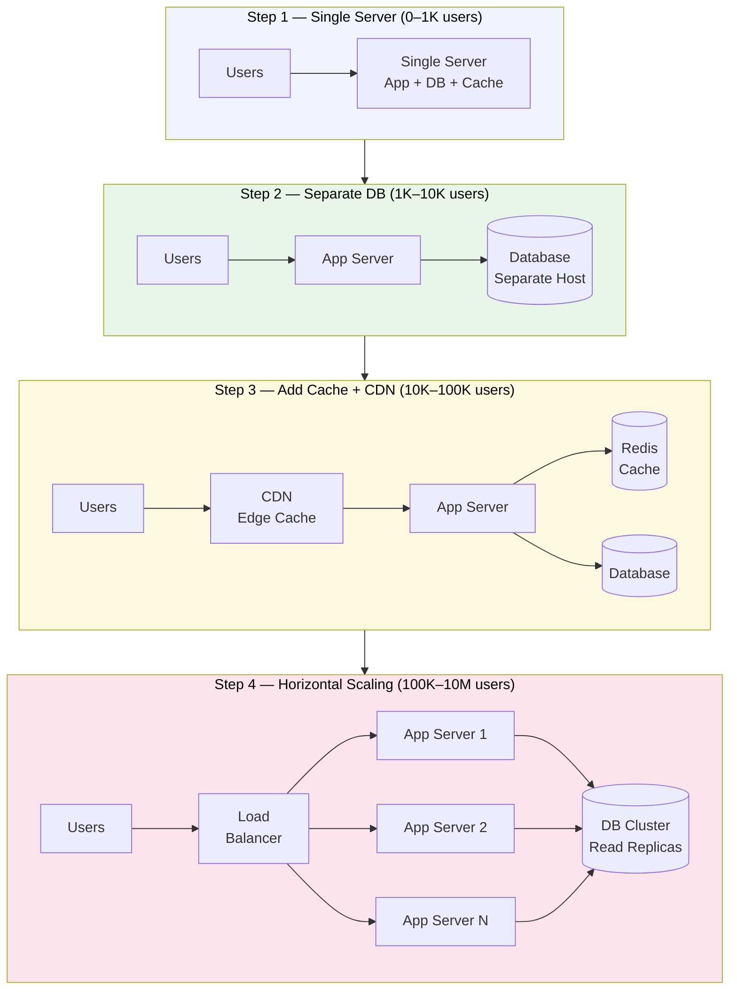
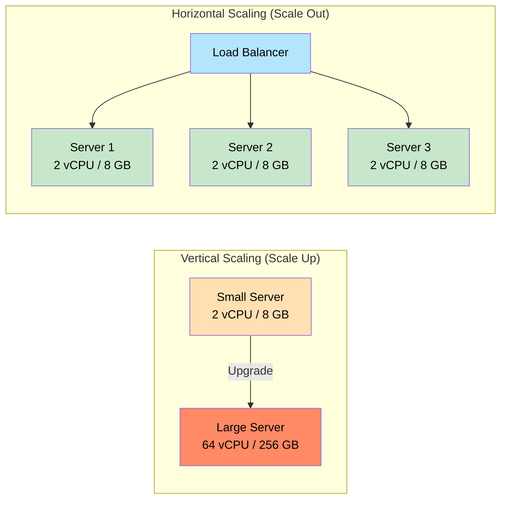

# Scalability

> **Scalability** is a system's ability to handle more work — more users, more data, more requests — by adding resources, without rewriting everything from scratch.

**Level:** 1 · **Topic:** 1 · **Prerequisites:** [What is System Design](../../Level-00-Foundations/01-What-is-System-Design/README.md) · [Latency & Throughput](../../Level-00-Foundations/07-Latency-Throughput-Performance/README.md)

---

## 🎯 The Problem

Imagine you launch a side project. Day 1: 10 users, a $5/month VPS handles everything fine. Day 30: you get featured on Hacker News. 50,000 users hit your site simultaneously. The server's CPU is at 100%, RAM is exhausted, and every request times out. Your app is down.

You *could* just restart the server — but the traffic keeps coming. You need a plan to handle this gracefully **before** it happens, not after. That plan is scalability.

---

## 🌍 Real-World Analogy

Think of a restaurant kitchen. When 10 customers arrive, one chef manages fine. When 500 customers arrive for a wedding banquet, you have two options:

1. **Hire a super-chef** who cooks 50x faster (upgrade the existing chef)
2. **Hire 50 normal chefs** and divide the work between them

Option 1 is vertical scaling. Option 2 is horizontal scaling. As you'll see, option 2 almost always wins at scale — because even the world's best chef has limits.

---

## 🧠 Core Idea

### The Single-Server Era

Every system starts on a single server. The server handles:
- The web/app layer (your code)
- The database
- File storage
- Caching

This is fine early on. It's cheap, simple to manage, and easy to debug. But it has a ceiling.

### Vertical Scaling (Scale Up)

Add more power to the **same machine**: bigger CPU, more RAM, faster NVMe disk.

- A small VM might have 2 vCPUs and 4 GB RAM
- A large VM might have 96 vCPUs and 384 GB RAM (e.g., AWS `r6i.24xlarge`)
- Cost grows **super-linearly**: doubling specs often costs 3–4x more
- There is a **hard ceiling**: no single machine has infinite resources
- Downtime required for most hardware upgrades

### Horizontal Scaling (Scale Out)

Add **more machines** of the same size and spread the load across them.

- Each machine is cheap (commodity hardware or small cloud instances)
- No single point of failure — if one goes down, others pick up the work
- Theoretically unlimited: just keep adding nodes
- Requires a **load balancer** in front and **stateless** application servers (more on both in later topics)

### The Scale Cube

A useful mental model from the book *The Art of Scalability*:

- **X-axis:** Clone the service horizontally (run N identical copies)
- **Y-axis:** Split by function (separate the user service, payment service, etc.)
- **Z-axis:** Split by data (shard users A–M to server 1, N–Z to server 2)

Most real systems use all three axes simultaneously.

---

## 📊 How It Works

### The Evolution Story: Single Server → Global Scale

*Caption: The four-step evolution every system goes through. You rarely start at Step 4 — you evolve there.*

---

### Vertical vs Horizontal: Side-by-Side

*Caption: Vertical scaling hits a ceiling; horizontal scaling is theoretically unbounded.*

---

## 🔧 Types / Variations / Strategies

### Vertical vs Horizontal Comparison

| Dimension | Vertical (Scale Up) | Horizontal (Scale Out) |
|-----------|--------------------|-----------------------|
| **Cost** | Super-linear — big machines cost disproportionately more | Linear — each node is the same price |
| **Ceiling** | Hard ceiling (biggest available instance) | Theoretically unlimited |
| **Downtime** | Often requires restart | None — add nodes live |
| **Complexity** | Low — single machine, easy to debug | Higher — distributed systems, network issues |
| **Failure** | Single point of failure | Resilient — redundant nodes |
| **State** | Easy to keep state in memory | Requires externalized state (Redis, DB) |
| **Best for** | Databases, stateful systems | Stateless web/app servers |

### The Scale Cube

| Axis | Technique | Example |
|------|-----------|---------|
| **X — Clone** | Run N identical copies behind a load balancer | 10 identical web servers |
| **Y — Decompose** | Split by function/service | User service, Order service, Payment service |
| **Z — Partition** | Split by data subset (sharding) | Users 0–999999 on DB1, 1000000+ on DB2 |

---

## 🏢 Real-World Examples

### Twitter (X)

In 2009, Twitter ran on a handful of Ruby on Rails servers. By 2013, they handled ~300K tweets/minute. The evolution:
- Started with **vertical scaling** (bigger servers) — hit limits quickly
- Moved to **horizontal scaling** for the web tier
- Introduced caching (Memcached, then Redis) to protect the DB
- Eventually split into microservices (**Y-axis** decomposition): tweet service, timeline service, search service

### Amazon

Amazon's retail site started as a monolith in the late 1990s. As they scaled:
- **X-axis:** Thousands of identical EC2 instances for web serving
- **Y-axis:** The famous 2002 "API mandate" — every team must expose functionality as a service (this became AWS)
- **Z-axis:** DynamoDB shards data automatically across hundreds of nodes

### YouTube

YouTube handles ~500 hours of video uploaded per minute. Key scalability choices:
- Static content (videos) served from CDN edge nodes worldwide
- Database tier uses both vertical scaling (large MySQL machines) and sharding (Z-axis)
- Separate clusters for upload, transcoding, and serving pipelines (Y-axis)

---

## ⚖️ Trade-offs

| | Pros | Cons |
|--|------|------|
| **Vertical Scaling** | Simple, no code changes, works for stateful services | Expensive, single point of failure, hard ceiling |
| **Horizontal Scaling** | Fault-tolerant, cost-linear, no ceiling | Requires stateless design, more operational complexity, harder to debug |
| **Y-axis (Microservices)** | Independent scaling per service, team autonomy | Distributed system complexity, network overhead, harder transactions |
| **Z-axis (Sharding)** | Scales data volume linearly | Harder queries, re-sharding is painful, hot shards are a problem |

---

## ✅ When to Use / ❌ When NOT to Use

**Scale Up (Vertical) — Use When:**
- Your service is stateful (a primary database, a caching layer)
- You're early-stage and simplicity matters
- You need to buy time cheaply before investing in horizontal architecture

**Scale Out (Horizontal) — Use When:**
- Traffic is variable or bursty (you need elastic capacity)
- You need high availability (no single point of failure)
- Your service is stateless or you've externalized state (see [Stateless vs Stateful](../07-Stateless-vs-Stateful/README.md))

**When NOT to Scale Horizontally Yet:**
- Your bottleneck is the database and you haven't tuned indexes first
- You haven't profiled — don't scale what isn't slow
- Your app isn't stateless — horizontal scaling won't help if every request must hit the same in-memory session store

---

## ⚠️ Common Pitfalls

1. **Premature scaling:** Scaling before you have a bottleneck wastes money and adds complexity. Measure first.
2. **Forgetting the database:** You can horizontally scale app servers, but the DB is often the next bottleneck. Plan for read replicas and caching early.
3. **Stateful app servers:** If your servers hold session state in memory, you can't add more without users getting logged out. Fix this first (see [Stateless vs Stateful](../07-Stateless-vs-Stateful/README.md)).
4. **Ignoring operational complexity:** 100 servers are 100x harder to deploy, monitor, and debug than one. Invest in observability and automation.
5. **Hot spots / uneven load:** Horizontal scaling only works if traffic distributes evenly. A poor sharding key or a lack of load balancing creates one overloaded node and many idle ones.

---

## 🎤 Interview Tips

- **State the evolution story:** "I'd start with a single server, then separate the DB, then add caching, then scale out the app tier..." — interviewers love to see you reason step by step.
- **Always mention the bottleneck:** Scalability isn't one thing. Say "the app tier bottleneck vs the DB bottleneck" and address them separately.
- **Know the scale cube:** Mentioning X/Y/Z axes signals you think in systems, not just "add more servers."
- **Horizontal wins for stateless, vertical wins for stateful (initially)** — a clean one-liner that shows depth.
- **Real numbers matter:** "A single `m5.xlarge` handles ~2K–5K req/s for a typical web app" sounds much better than vague statements.

---

## 📝 TL;DR

- **Vertical scaling** = bigger machine. Simple but hits a hard ceiling and is a single point of failure.
- **Horizontal scaling** = more machines. Fault-tolerant, cost-linear, theoretically unlimited — but requires stateless services and a load balancer.
- **The scale cube** provides three axes: clone (X), decompose by function (Y), partition by data (Z).
- Every production system evolves: single server → separate DB → caching → horizontal app tier → sharded DB.
- Don't scale prematurely — measure your bottleneck first.

---

## 🧪 Test Yourself

1. A startup's API is slow. You double the server's RAM and it's fast again — for two weeks. What is this approach called, and what's the long-term problem?
2. You have 5 identical app servers behind a load balancer. Users complain they get logged out randomly. What's the likely cause and how do you fix it?
3. Describe how the Scale Cube's three axes apply to a system like Uber.
4. Why does horizontal scaling often fail to help a database bottleneck directly? What do you use instead?
5. What is the difference between Y-axis and Z-axis scaling? Give a concrete example of each.

---

## 📚 Further Reading

- [The Art of Scalability](https://akfpartners.com/books/the-art-of-scalability) — AKF Partners, where the Scale Cube originated
- [AWS Well-Architected Framework — Reliability Pillar](https://docs.aws.amazon.com/wellarchitected/latest/reliability-pillar/welcome.html)
- [High Scalability Blog](http://highscalability.com/) — real-world architecture teardowns
- Next: [Load Balancing](../02-Load-Balancing/README.md) — the mechanism that makes horizontal scaling possible
