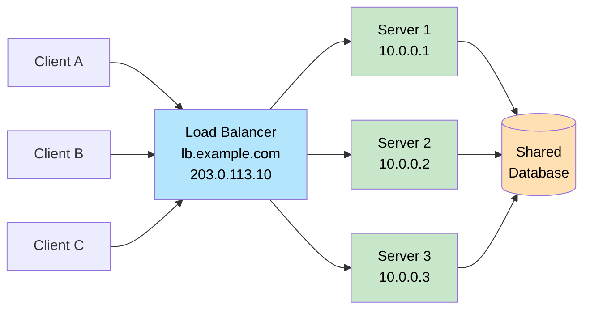
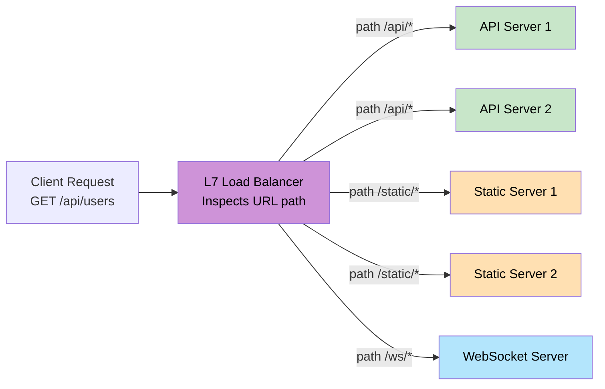
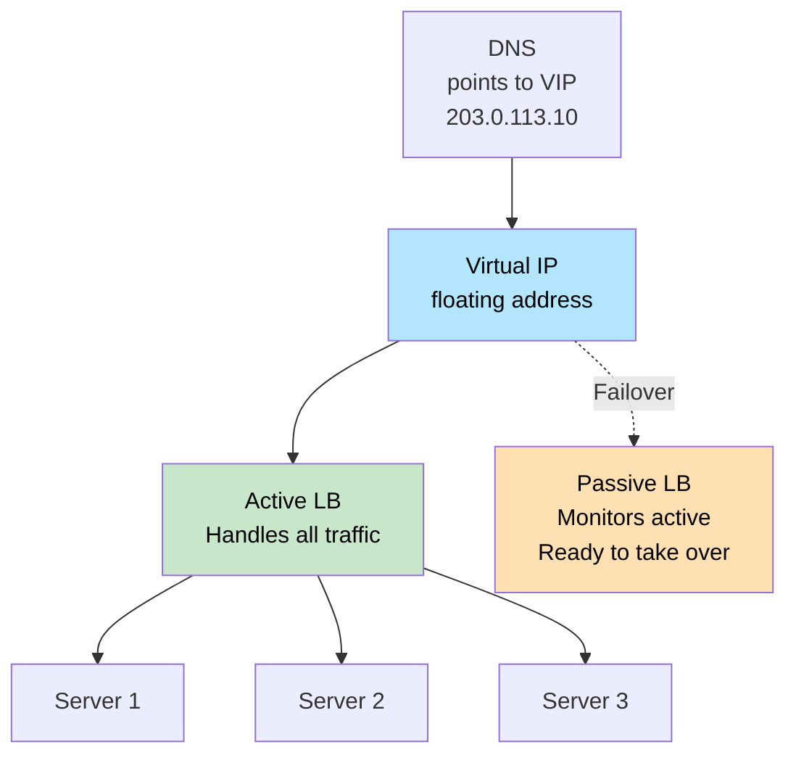

# Load Balancing

> A **load balancer** is a component that sits in front of multiple servers and distributes incoming requests among them so that no single server gets overwhelmed.

**Level:** 1 · **Topic:** 2 · **Prerequisites:** [Scalability](../01-Scalability/README.md) · [Network Protocols](../../Level-00-Foundations/04-Network-Protocols/README.md)

---

## 🎯 The Problem

You've horizontally scaled your app to 5 servers. But how does a user's request know which server to go to? Without a traffic director, all requests might hit Server 1 while Servers 2–5 sit idle. Or worse, if Server 1 crashes, users get errors even though 4 healthy servers are waiting.

You need something to:
1. Distribute traffic evenly (or intelligently)
2. Detect failed servers and stop sending them traffic
3. Present a single address to the outside world

That something is a **load balancer**.

---

## 🌍 Real-World Analogy

Think of a bank with 10 teller windows. A greeter at the door watches which windows are busy and directs each customer to the shortest queue. If a teller goes on break, the greeter stops sending customers there. The customer never needs to know how many tellers are working — they just walk up to the greeter.

The greeter is your load balancer.

---

## 🧠 Core Idea

### What a Load Balancer Does

A load balancer receives requests from clients and forwards them to a pool of backend servers (also called an **upstream** or **server pool**). To the client, it looks like there's only one server — the load balancer's IP. This hides the entire backend fleet.

Core responsibilities:
- **Traffic distribution** — spread requests across healthy servers
- **Health checking** — probe servers periodically; remove unhealthy ones from rotation
- **SSL/TLS termination** — decrypt HTTPS at the LB so backend servers handle plain HTTP (cheaper)
- **Session persistence** — optionally route a user's requests to the same server (sticky sessions)

### Layer 4 vs Layer 7

This is the most important distinction. Load balancers operate at different layers of the network stack:

**Layer 4 (Transport Layer):**
- Routes based on IP address and TCP/UDP port only
- Never looks at request content (HTTP headers, paths, cookies)
- Very fast — minimal CPU overhead; can handle millions of connections
- Can load-balance *any* TCP/UDP protocol (not just HTTP)

**Layer 7 (Application Layer):**
- Understands HTTP/HTTPS — can inspect URL paths, headers, cookies, method
- Enables **content-based routing**: `/api` → API servers, `/images` → static servers
- Enables **A/B testing**: send 10% of traffic to the new version
- Slightly more overhead but far more powerful for web traffic

---

## 📊 How It Works

### Basic Fan-Out

*Caption: Clients see only the load balancer's IP. Servers share a database and a cache (not shown). Adding Server 4 is transparent to clients.*

---

### Layer 7 Content Routing

*Caption: A Layer 7 load balancer can route to different server pools based on URL path, headers, or any HTTP attribute.*

---

### Redundant Load Balancers (Active-Passive)

*Caption: Active-passive HA. If the Active LB fails, the Passive LB claims the Virtual IP and takes over — typically within 1–3 seconds via VRRP or keepalived.*

---

## 🔧 Types / Variations / Strategies

### Load-Balancing Algorithms

| Algorithm | How It Works | Best For | Watch Out |
|-----------|-------------|----------|-----------|
| **Round Robin** | Requests go to servers 1→2→3→1→2→3... | Uniform request weight | Bad if some requests are 100x heavier |
| **Weighted Round Robin** | Same, but Server 1 gets 2x the requests of Server 2 | Mixed server sizes | Weights need tuning as fleet changes |
| **Least Connections** | Route to the server with the fewest open connections | Long-lived connections (streaming, WebSocket) | Slight overhead to track connection counts |
| **Least Response Time** | Route to the server that replies fastest | Latency-sensitive APIs | Adds monitoring overhead |
| **IP Hashing** | Hash client IP → always the same server | Stateful servers (avoid sticky sessions) | Poor distribution if many clients share a NAT IP |
| **Consistent Hashing** | Hash a key (user ID, URL) to a point on a ring | Caches, stateful routing, minimal redistribution on resize | More complex to implement |
| **Random** | Pick a random server | Simple, surprisingly effective | No awareness of load |

### L4 vs L7 Comparison

| Feature | L4 (Transport) | L7 (Application) |
|---------|---------------|------------------|
| Inspects | IP + Port | HTTP headers, URL, cookies, body |
| Speed | Very fast | Slightly slower |
| SSL termination | No (passes through) | Yes |
| Content-based routing | No | Yes |
| A/B testing | No | Yes |
| Health check | TCP connect | HTTP GET /health |
| Examples | AWS NLB, HAProxy (TCP mode) | AWS ALB, Nginx, HAProxy (HTTP mode) |

### Sticky Sessions

By default, the same user can hit a different server on each request. **Sticky sessions** (or session affinity) ensure a user always lands on the same server:

- **Cookie-based:** LB injects a cookie (e.g., `AWSALB`) that encodes which server to use
- **IP-based:** Hash the client IP (less reliable — NAT, mobile networks change IPs)

Sticky sessions solve stateful apps without re-architecting them, but they defeat the purpose of load balancing. The better fix: externalize state (see [Stateless vs Stateful](../07-Stateless-vs-Stateful/README.md)).

---

## 🏢 Real-World Examples

### Nginx

Nginx is the world's most popular web server and reverse proxy. As a load balancer it supports:
- Round-robin (default), least-connections, IP hash
- Health checks (Nginx Plus only for active checks; open-source uses passive)
- SSL termination and HTTP/2 support
- Used by Dropbox, Netflix, WordPress.com, GitHub

### HAProxy

HAProxy is purpose-built for high-availability load balancing. At 2M+ connections per second on a single box, it's common in financial services and gaming:
- Extremely reliable, low latency
- Supports both L4 and L7
- Used by GitHub, Instagram, Stack Overflow, Reddit

### AWS Elastic Load Balancer

AWS offers three tiers:
- **CLB** (Classic) — legacy, L4+L7, avoid for new projects
- **NLB** (Network LB) — L4, millions of requests/second, ultra-low latency (~100 µs), static IP
- **ALB** (Application LB) — L7, path/header routing, WebSocket, HTTP/2, best for web apps

---

## ⚖️ Trade-offs

| | Pros | Cons |
|--|------|------|
| **Load Balancer in general** | Single entry point, fault tolerance, easy to scale | New component to manage; can itself become a bottleneck or single point of failure |
| **L4** | Extremely fast, protocol-agnostic | No application-level features |
| **L7** | Rich routing rules, A/B, SSL offload | Higher CPU per connection, more to configure |
| **Round Robin** | Dead simple | Uneven if requests vary in cost |
| **Sticky Sessions** | Keeps stateful apps working | Defeats load distribution; can overload one server |
| **Consistent Hashing** | Minimal redistribution when servers change | More complex, potential hot spots |

---

## ✅ When to Use / ❌ When NOT to Use

**Use a Load Balancer When:**
- You have more than one server handling the same service
- You need zero-downtime deployments (drain traffic off one server, update it, add it back)
- You need health checking and automatic failover
- You want SSL termination centralized

**L4 When:**
- You're balancing non-HTTP traffic (databases, game servers, custom TCP protocols)
- You need raw throughput with minimal latency

**L7 When:**
- You want to route `/api`, `/static`, `/ws` to different pools
- You need A/B testing, header-based routing, or request rewriting

**Don't Need a Load Balancer When:**
- You have a single server (you need high availability first)
- Traffic is very low and one server handles it fine — add complexity only when needed

---

## ⚠️ Common Pitfalls

1. **The load balancer as a single point of failure:** A load balancer that isn't itself redundant (active-passive or active-active pair) just moves the SPOF from the app server to the LB. Always deploy LBs in pairs.

2. **Health checks that are too shallow:** A health check that only tests TCP connect (`200 OK`) might return success even if the app is in a broken state (DB connections exhausted, deadlock). Use a `/health` endpoint that checks real dependencies.

3. **Sticky sessions hiding state problems:** If you're using sticky sessions because your app is stateful, you've papered over the problem. When that server goes down, those users lose their sessions anyway.

4. **Forgetting the load balancer's own bandwidth ceiling:** A 10 Gbps NIC on your LB limits you to 10 Gbps of total throughput regardless of how many backend servers you add. Plan accordingly.

5. **Thundering herd on server restart:** When a server restarts and rejoins the pool, the LB sends it traffic immediately. If the app takes 30 seconds to warm up (JVM, cache warm-up), those first requests all fail. Use **slow-start** configuration in HAProxy/Nginx.

---

## 🎤 Interview Tips

- **Start with the "why":** "A load balancer lets us scale horizontally and eliminates the app server as a single point of failure."
- **Distinguish L4 vs L7 confidently:** This question is very common. Say "L4 routes by IP/port, never reads HTTP; L7 understands HTTP and can route by path, header, or cookie."
- **Name real algorithms and their trade-offs:** Don't just say "round-robin." Add "...but for WebSocket connections I'd use least-connections because connections are long-lived."
- **Always mention health checks:** A load balancer without health checks is just traffic splitting. Health checks are what make it fault-tolerant.
- **Bring up HA for the LB itself:** Shows you think in systems — the question "but what if the load balancer fails?" is a common follow-up.

---

## 📝 TL;DR

- A load balancer distributes traffic across a fleet of servers and removes unhealthy ones from rotation.
- **L4** is faster and protocol-agnostic; **L7** understands HTTP and enables rich routing.
- Common algorithms: round-robin (simple), least-connections (long connections), consistent hashing (caches/stateful).
- **Sticky sessions** keep stateful apps working but defeat load distribution — prefer externalizing state.
- Always deploy load balancers in an **active-passive** (or active-active) pair — a single LB is a new SPOF.

---

## 🧪 Test Yourself

1. What is the difference between an L4 and an L7 load balancer? Give one thing each can do that the other cannot.
2. You're building a WebSocket chat app. Which load-balancing algorithm would you choose and why?
3. Your app has sticky sessions enabled. One of the four app servers crashes. What happens to users who were pinned to it?
4. What is "slow-start" in the context of load balancing, and when is it needed?
5. You have 3 servers: Server A (8 vCPU) and Servers B, C (2 vCPU each). How would you configure weighted round-robin?

---

## 📚 Further Reading

- [HAProxy Documentation — Load Balancing Algorithms](https://www.haproxy.com/documentation/hapee/latest/load-balancing/algorithms/)
- [Nginx Load Balancing Guide](https://docs.nginx.com/nginx/admin-guide/load-balancer/http-load-balancer/)
- [AWS: Choosing a Load Balancer](https://docs.aws.amazon.com/AmazonECS/latest/developerguide/load-balancer-types.html)
- Previous: [Scalability](../01-Scalability/README.md) · Next: [Caching](../03-Caching/README.md)
