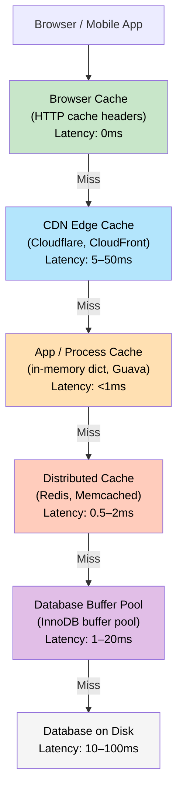
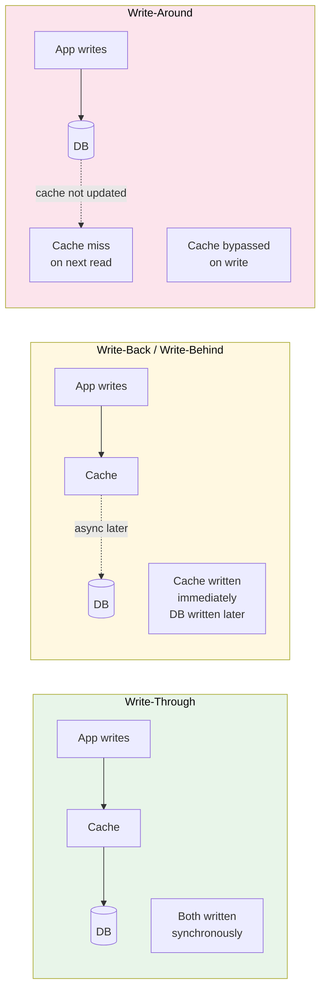
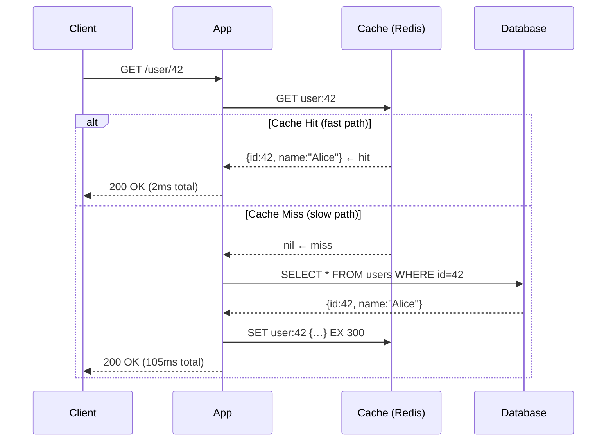

# Caching

> **Caching** is storing the result of an expensive operation in a fast location so you can return it instantly the next time someone asks for the same thing — without repeating the work.

**Level:** 1 · **Topic:** 3 · **Prerequisites:** [Scalability](../01-Scalability/README.md) · [Latency & Throughput](../../Level-00-Foundations/07-Latency-Throughput-Performance/README.md)

---

## 🎯 The Problem

Your homepage loads data from 12 database tables and takes 350ms to render. 10,000 users per second visit the homepage. That's 10,000 × 350ms database work every second — your database is on fire.

Here's the secret: the homepage HTML barely changes. It's the same for 99% of visitors. You're doing the same expensive computation 10,000 times per second when you could do it *once* and serve the cached result 9,999 times.

That's what caching is for.

---

## 🌍 Real-World Analogy

You're a student cramming for an exam. Every time someone asks you "What's the capital of France?" you *could* look it up in a textbook (slow, expensive). Or you can just **remember the answer** from the last time you looked it up — "Paris" — and answer instantly.

Your brain is a cache. The textbook is the database. Looking it up the first time is a cache miss. Answering from memory is a cache hit.

Now imagine the whole class is writing "capital of France" notes on a shared whiteboard. That's a shared distributed cache (like Redis).

---

## 🧠 Core Idea

### Cache Hit vs Cache Miss

- **Cache hit:** The requested data is in the cache → serve it immediately (sub-millisecond)
- **Cache miss:** The data is not in the cache → fetch from the source, store it, return it
- **Hit ratio:** `hits / (hits + misses)`. A 90% hit ratio means 9 of every 10 requests skip the database entirely

Real-world hit ratios:
- Browser cache: 50–80% for returning visitors
- CDN: 70–95% for static assets
- Redis for a hot social feed: 95–99%

A 95% hit ratio with a 1ms cache vs 100ms DB means average latency ≈ `0.95 × 1ms + 0.05 × 100ms = 5.95ms` — a 17x improvement.

### Where Can You Cache?

Caching happens at every layer of the stack. Understanding *where* is as important as *whether*.

---

## 📊 How It Works

### The Cache Layers

*Caption: Every layer is a cache for the layer below it. A request only travels as far down as it needs to. The goal is to catch it as early (left/top) as possible.*

---

### Write Policies

How the cache stays in sync with the database:

*Caption: Three write policies, each with different consistency and performance trade-offs.*

---

### Cache Hit / Miss Flow

*Caption: On a cache miss, the app fetches from the DB and populates the cache so the next identical request is a hit.*

---

## 🔧 Types / Variations / Strategies

### Eviction Policies

Caches have limited memory. When full, they must evict (remove) something to make room:

| Policy | Rule | Best For |
|--------|------|----------|
| **LRU** (Least Recently Used) | Evict the item that was used longest ago | General purpose — the most common choice |
| **LFU** (Least Frequently Used) | Evict the item with the fewest accesses | When popularity matters more than recency |
| **FIFO** (First In, First Out) | Evict the oldest inserted item | Simple, but ignores access patterns |
| **TTL** (Time-to-Live) | Each item expires after a set duration | Data with a natural freshness window |
| **Random** | Evict a random item | Surprisingly effective, very simple |
| **MRU** (Most Recently Used) | Evict the most recently used | Rare — scan-resistant caches |

Redis supports: LRU, LFU, Random, TTL-only. Memcached uses LRU exclusively.

### Write Policies Compared

| Policy | Write Cache? | Write DB? | Consistency | Speed | Risk |
|--------|-------------|-----------|-------------|-------|------|
| **Write-through** | Yes (sync) | Yes (sync) | Strong | Slower (two writes) | Data loss: none |
| **Write-back** | Yes (sync) | Later (async) | Eventually consistent | Fast | Data loss if cache crashes before DB write |
| **Write-around** | No | Yes (sync) | Cache may be stale | Normal | High miss rate on write-heavy workloads |

### Redis vs Memcached

| | Redis | Memcached |
|--|-------|-----------|
| **Data types** | Strings, Lists, Sets, Sorted Sets, Hashes, Streams | Strings only |
| **Persistence** | Yes (RDB snapshots, AOF log) | No — volatile only |
| **Replication** | Yes (primary-replica, Sentinel, Cluster) | No built-in |
| **Max value size** | 512 MB | 1 MB |
| **Cluster/sharding** | Redis Cluster (built-in) | Client-side only |
| **Use when** | You need rich data types, persistence, pub/sub | Simple get/set with maximum raw throughput |

---

## 🏢 Real-World Examples

### Facebook / Meta — Memcached at Huge Scale

Facebook's "Scaling Memcache at Facebook" (USENIX 2013) described a deployment of **tens of thousands** of Memcached servers handling billions of requests per second. Key patterns:
- **Look-aside caching:** App checks Memcached first, reads from MySQL on miss
- **Lease tokens:** To prevent thundering herd, the first miss gets a "lease" — other requests wait rather than all hitting the DB simultaneously
- Facebook eventually open-sourced a Memcached variant called **mcrouter** for routing across pools

### Twitter — Timeline Caching

Twitter's home timeline (your feed) is read-heavy. Rather than computing it on every request, Twitter uses Redis to pre-compute and cache timelines for active users. When a celebrity with 50M followers tweets, Twitter writes into up to 50M Redis lists. This is called **fanout-on-write**. The trade-off: storage cost for non-active users is wasted. Twitter uses a hybrid: small accounts get fanout, large accounts are merged at read time.

### Netflix — EVCache

Netflix built **EVCache** (Ephemeral Volatile Cache), a Memcached-based system deployed across multiple AWS Availability Zones. It caches metadata (movie details, user preferences, recommendation scores). EVCache handles **30 million+ requests per second** with sub-millisecond p99 latency. A cache miss forces a database query that might take 50–100ms, so even a tiny miss rate matters enormously at Netflix's scale.

---

## ⚖️ Trade-offs

| | Pros | Cons |
|--|------|------|
| **Caching in general** | Dramatically reduces DB load; much lower latency | Stale data; cache invalidation complexity; added infrastructure |
| **In-process cache** | Zero network overhead; sub-microsecond | Not shared across servers; lost on restart; can cause OOM |
| **Distributed cache (Redis)** | Shared across all servers; survives restarts (with persistence) | 1–2ms network hop; another service to operate |
| **CDN caching** | Closest to users; offloads origin completely | Invalidation is slow/expensive; only for public content |
| **TTL-based expiry** | Simple to reason about | Stale data until TTL expires; hard to pick the right TTL |
| **Write-through** | Never stale | Two writes per update; higher write latency |
| **Write-back** | Fastest writes | Risk of data loss; eventual consistency |

---

## ✅ When to Use / ❌ When NOT to Use

**Use Caching When:**
- The same data is requested many times (high read:write ratio)
- The source is slow (database query, external API, complex computation)
- The data can tolerate some staleness
- You need to protect a downstream service from traffic spikes

**Do NOT Cache When:**
- Data must be perfectly fresh on every read (real-time stock prices, inventory counts)
- The data is unique per request (personalized without any sharing)
- The cache hit rate would be very low (random access patterns with huge datasets)
- The data is sensitive and you can't afford cache poisoning risk

---

## ⚠️ Common Pitfalls

### 1. Cache Stampede (Thundering Herd)

A popular cached item expires. At that exact moment, 1,000 requests come in simultaneously, all miss the cache, all hit the database at once, and the DB crashes. Solutions:
- **Jitter TTL:** Add random seconds to TTL so not everything expires at once (`TTL = 300 + rand(60)`)
- **Mutex/lock:** First miss acquires a lock and fetches; others wait
- **Background refresh:** Refresh cache *before* it expires (stale-while-revalidate)

### 2. Cache Invalidation ("The Hardest Problem in CS")

Phil Karlton famously said: *"There are only two hard things in Computer Science: cache invalidation and naming things."*

The challenge: you update a user's name in the DB. The cache still has the old name for 5 minutes. Solutions:
- **Event-driven invalidation:** On DB write, publish an event that deletes/updates the cache key
- **Short TTL:** Accept some staleness, keep TTL short
- **Version keys:** Embed a version in the cache key (`user:42:v7`) and invalidate by updating the version

### 3. Cache Aside vs Cache Through Confusion

- **Cache-aside (lazy loading):** App manages the cache manually (check → miss → DB → populate)
- **Read-through:** Cache manages itself — on miss, cache fetches from DB automatically
- **Write-through:** Cache writes to DB on every write

Most Redis implementations use cache-aside. Know which pattern you're implementing.

### 4. Caching Sensitive Data

Caching authentication tokens or PII without proper access control can expose one user's data to another. Always scope cache keys to the user/tenant. Never cache responses that contain secrets unless the key is scoped to that user exclusively.

### 5. Forgetting to Monitor Hit Ratio

A cache with a 20% hit ratio is barely helping. Always instrument `cache_hits`, `cache_misses`, and `hit_ratio`. If hit ratio is low, your key design or TTL is wrong.

---

## 🎤 Interview Tips

- **Start with the hit ratio math:** Show that you understand caching's impact quantitatively. "At 95% hit rate with a 1ms cache and 100ms DB, average latency is about 6ms."
- **Know the eviction policies and when to use LRU vs LFU:** LRU for recency (hot feed), LFU for popularity (trending items).
- **Discuss cache invalidation unprompted:** It shows depth. Mention TTL, event-driven invalidation, and version keys.
- **Bring up cache stampede and mitigation:** Many interviewers specifically ask about this after you mention caching.
- **Distinguish Redis vs Memcached:** "Memcached for raw throughput on simple strings; Redis when I need data structures, persistence, or pub/sub."
- **Name the layers:** Browser → CDN → App → Redis → DB buffer pool. Showing all layers signals seniority.

---

## 📝 TL;DR

- Caching stores expensive results in a fast location; the **hit ratio** determines how much it helps.
- Cache exists at every layer: browser, CDN, app process, Redis/Memcached, and the DB's own buffer pool.
- **Write-through** is safe but slower; **write-back** is fast but risks data loss; **write-around** bypasses the cache on writes.
- **LRU** eviction is the default go-to; use **TTL** when data has a natural expiry.
- The two hardest cache problems: **stampede** (many misses at once) and **invalidation** (keeping cache in sync with reality).

---

## 🧪 Test Yourself

1. A cache has 1,000 requests: 850 hits and 150 misses. What is the hit ratio? If a cache hit takes 1ms and a DB read takes 200ms, what is the average response time?
2. You store a user's profile in Redis with a 10-minute TTL. The user updates their name. A request arrives 3 minutes later. What does the user see, and how would you fix it?
3. What is a cache stampede and what are three ways to prevent it?
4. When would you choose write-back over write-through? What's the risk?
5. Should you cache a user's shopping cart contents? What about a list of trending products? Explain your reasoning.

---

## 📚 Further Reading

- [Facebook: Scaling Memcache at Facebook (USENIX 2013)](https://www.usenix.org/conference/nsdi13/technical-sessions/presentation/nishtala)
- [Redis Documentation — Eviction Policies](https://redis.io/docs/manual/eviction/)
- [AWS ElastiCache Best Practices](https://docs.aws.amazon.com/AmazonElastiCache/latest/red-ug/best-practices.html)
- Previous: [Load Balancing](../02-Load-Balancing/README.md) · Next: [Databases — SQL vs NoSQL](../04-Databases-SQL-vs-NoSQL/README.md)
