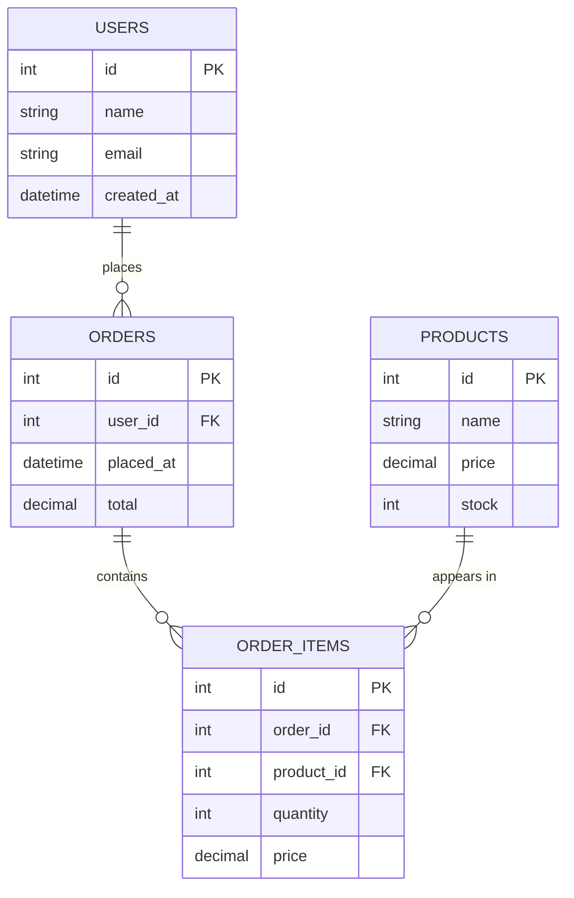
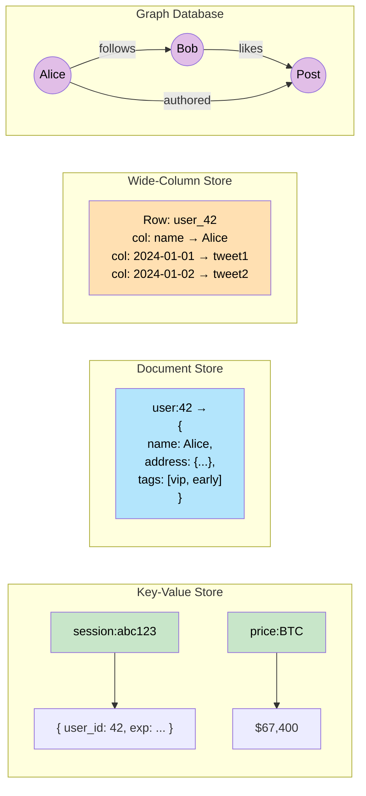
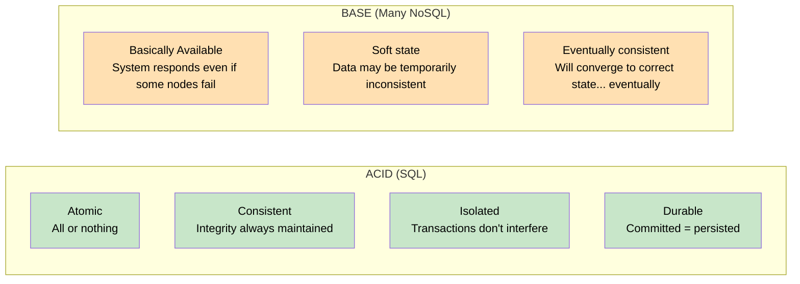

# Databases — SQL vs NoSQL

> Choosing between **SQL (relational)** and **NoSQL** databases is about matching the data model, consistency requirements, and access patterns of your system to the right tool — there is no universally "better" choice.

**Level:** 1 · **Topic:** 4 · **Prerequisites:** [Scalability](../01-Scalability/README.md) · [Caching](../03-Caching/README.md)

---

## 🎯 The Problem

You're building a social network. You need to store:
- User profiles (structured, consistent)
- Posts (variable fields, huge volume)
- "Who follows whom" relationships (graph-like)
- Session tokens (key → value, expire in 30 min)

No single database type does all four optimally. The wrong choice means: painfully slow queries, inability to scale, or impossibly complex schema migrations down the road. You need to understand what each type is designed for — and when to use multiple databases in the same system (**polyglot persistence**).

---

## 🌍 Real-World Analogy

**SQL (relational)** is like a well-organized filing cabinet with labeled folders, strict rules about what goes in each folder, and a powerful indexing system for finding exactly what you need. Every document must match a predefined template.

**NoSQL** is like a collection of specialized containers:
- A **key-value store** is a simple coat check: give a ticket, get back a coat.
- A **document store** is a folder where each document can have a different format — no template required.
- A **wide-column store** is a spreadsheet where each row can have completely different columns.
- A **graph database** is a cork board with pins and strings — relationships *are* the data.

---

## 🧠 Core Idea

### The Relational Model (SQL)

Relational databases (RDBMS) organize data into **tables** (rows and columns). Related tables are connected via **foreign keys**. You query them with **SQL** (Structured Query Language).

Key properties:
- **Schema-on-write:** You define the structure before you insert data
- **ACID transactions:** Atomic, Consistent, Isolated, Durable — operations either fully succeed or fully roll back
- **Joins:** You can query across tables efficiently
- **Normalization:** Eliminate redundancy by splitting data into related tables

When SQL shines:
- Complex relationships between entities (orders → line items → products → customers)
- Financial systems where consistency is non-negotiable
- Reporting and analytics with ad-hoc queries
- You don't know all the access patterns upfront (SQL handles diverse queries well)

Popular SQL databases: PostgreSQL, MySQL, SQLite, Oracle, Microsoft SQL Server

### The NoSQL Family

"NoSQL" means "not only SQL" — it's a collection of four quite different database types that share one thing: they sacrifice some relational features in exchange for performance, scale, or flexibility in specific use cases.

---

## 📊 How It Works

### SQL Table Structure

*Caption: A normalized SQL schema for an e-commerce system. Relationships are explicit; foreign keys enforce integrity. A single query with JOINs can answer "what did user 42 order last month, and is it still in stock?"*

---

### The Four NoSQL Families

*Caption: Each NoSQL family has a distinct data model optimized for specific access patterns.*

---

### ACID vs BASE

*Caption: ACID prioritizes correctness; BASE prioritizes availability and partition tolerance. Most NoSQL databases offer tunable consistency levels between these extremes.*

---

## 🔧 Types / Variations / Strategies

### The Four NoSQL Types Compared

| Type | How Data is Stored | Best Access Pattern | Examples | Use Case |
|------|--------------------|---------------------|----------|----------|
| **Key-Value** | Arbitrary value (blob) behind a string key | Single key lookup | Redis, DynamoDB, Memcached | Sessions, caches, shopping carts, feature flags |
| **Document** | JSON/BSON documents, flexible schema per document | Fetch whole document; filter by fields | MongoDB, Couchbase, Firestore | User profiles, product catalogs, CMS content |
| **Wide-Column** | Rows with named columns; each row can have different columns | Row key + column range scans | Cassandra, HBase, Bigtable | Time-series, activity feeds, IoT sensor data, write-heavy |
| **Graph** | Nodes (entities) and edges (relationships) | Traverse relationships, pathfinding | Neo4j, Amazon Neptune, JanusGraph | Social networks, recommendation engines, fraud detection |

### SQL vs NoSQL Decision Guide

| Criterion | Choose SQL | Choose NoSQL |
|-----------|-----------|--------------|
| **Data structure** | Well-defined, rarely changing schema | Flexible, varying structure per record |
| **Relationships** | Many complex joins between entities | Few joins; data is self-contained |
| **Consistency** | ACID required (banking, inventory) | Eventual consistency OK (feeds, analytics) |
| **Scale pattern** | Moderate scale; vertical first | Massive horizontal scale needed |
| **Query patterns** | Ad-hoc, flexible queries | Known, narrow access patterns |
| **Writes vs reads** | Mixed | Write-heavy (Cassandra) or read-heavy (Redis) |
| **Team familiarity** | Everyone knows SQL | Specialized needs justify the learning curve |

### Schema-on-Write vs Schema-on-Read

| | Schema-on-Write (SQL) | Schema-on-Read (most NoSQL) |
|--|----------------------|----------------------------|
| **Definition** | Schema enforced at insert time | Schema interpreted at read time |
| **Enforcement** | Database rejects non-conforming data | Application parses whatever is stored |
| **Migrations** | Required; can be painful at scale | Easy to change — just add new fields |
| **Safety** | Corrupt data is rejected | Corrupt data is stored; errors surface at read |
| **Best for** | Financial data, regulated industries | Fast iteration, evolving products |

---

## 🏢 Real-World Examples

### Uber — Polyglot Persistence

Uber uses multiple databases for different purposes:
- **MySQL / PostgreSQL** for transactional data (trips, payments, driver accounts)
- **Cassandra** for high-volume append-only data (location pings every 4 seconds from millions of drivers → billions of writes/day)
- **Redis** for caching, leaderboards, geospatial queries
- **Elasticsearch** for search and log analytics

One system, four databases, each chosen for its strength.

### Amazon DynamoDB

DynamoDB is a key-value + document NoSQL database designed by Amazon for extreme scale. Amazon's shopping cart originally ran on Oracle SQL — it couldn't handle Prime Day traffic spikes. The team re-architected using DynamoDB (described in the famous 2007 Dynamo paper). DynamoDB is now the backbone for Amazon's retail site and many AWS services, handling millions of requests per second with single-digit millisecond latency.

### LinkedIn — Graph at Scale

LinkedIn's "People You May Know" feature and connection graph use a purpose-built graph engine. The LinkedIn social graph has 900 million+ members and billions of connections. Traditional SQL JOIN-based graph traversal gets exponentially slower at each hop (friend → friend's friend → friend's friend's friend). A graph database handles this in O(edges traversed) time rather than O(table cross-product) time.

---

## ⚖️ Trade-offs

| | Pros | Cons |
|--|------|------|
| **SQL** | ACID guarantees; powerful querying; mature tooling; strong consistency | Harder to scale horizontally; rigid schema; slower writes at huge volume |
| **Key-Value NoSQL** | Extremely fast; simple; horizontally scalable | Can't query by value; no structure | 
| **Document NoSQL** | Flexible schema; natural mapping to objects; good for hierarchical data | Denormalization → data duplication; limited multi-doc transactions |
| **Wide-Column NoSQL** | Excellent write throughput; scales to petabytes; good for time-series | Limited query flexibility; must design around access patterns |
| **Graph NoSQL** | Perfect for relationship traversal; natural for social/fraud data | Complex to operate; not general-purpose |

---

## ✅ When to Use / ❌ When NOT to Use

**Use SQL When:**
- You need ACID transactions (money movement, inventory management)
- Your data has many relationships and you need ad-hoc queries
- You don't know all your access patterns yet
- The team is familiar with SQL and the scale doesn't demand NoSQL

**Use Document Store When:**
- Each entity has varying fields (product catalog where phones have specs, books have ISBN)
- You read entire documents at once and rarely join
- Schema evolves rapidly (startup iterating fast)

**Use Key-Value When:**
- You need sub-millisecond lookups by a known key
- Data has a natural TTL (sessions, rate limit counters)

**Use Wide-Column When:**
- Extreme write throughput (millions of writes/sec)
- Time-series or event data (append-only, queried by time range)

**Use Graph When:**
- The most important queries are about relationships and multi-hop traversals
- Social networks, recommendation engines, fraud graphs

**Don't Use NoSQL When:**
- You need complex multi-table transactions
- You're replacing SQL just because it's "trendy" — the penalty is real

---

## ⚠️ Common Pitfalls

1. **Choosing NoSQL to "scale" without knowing your bottleneck.** Well-indexed PostgreSQL on proper hardware handles 10,000+ writes/sec and hundreds of thousands of reads/sec. Don't abandon SQL until you've proven it's the bottleneck.

2. **Using a document DB and then needing joins.** MongoDB added multi-document transactions in 2018, but they're slower than SQL joins. If your queries constantly join documents, you wanted SQL.

3. **Neglecting Cassandra's data modeling requirements.** Cassandra queries MUST be designed around the partition key. "I'll add that query later" isn't possible without a full table redesign.

4. **Assuming eventual consistency is always fine.** "Eventual" can mean milliseconds or minutes. If a user withdraws $1000 and immediately checks their balance, eventual consistency can show the wrong amount. Always reason about what staleness is acceptable.

5. **Polyglot persistence without operational maturity.** Running 4 different database systems means 4 backup strategies, 4 upgrade paths, 4 failure modes to debug at 3am. Start with fewer databases and add complexity only when proven necessary.

---

## 🎤 Interview Tips

- **Lead with access patterns:** "Before I choose a database, I need to understand: what data do we read, what do we write, how often, and what queries do we need?" This shows engineering judgment.
- **Know the four NoSQL families cold:** Key-value, document, wide-column, graph. Name an example DB for each.
- **ACID vs BASE is almost always asked:** Atomic / Consistent / Isolated / Durable vs Basically Available / Soft-state / Eventually consistent. Memorize both expansions.
- **Mention polyglot persistence:** Real systems use multiple databases. Saying "it depends on the service — I'd use PostgreSQL for orders and Cassandra for event logs" sounds like production experience.
- **Don't dismiss SQL:** Many junior candidates default to "NoSQL for scale." Saying "PostgreSQL can handle a lot more than people think; I'd reach for NoSQL only when I have a specific, proven reason" shows maturity.

---

## 📝 TL;DR

- **SQL:** Structured, ACID, joins, rigid schema — best for complex relationships and correctness requirements.
- **NoSQL comes in four flavors:** key-value (Redis), document (MongoDB), wide-column (Cassandra), graph (Neo4j) — each excels at specific access patterns.
- **ACID vs BASE:** SQL guarantees strong consistency; many NoSQL systems trade it for availability and scale.
- **Schema-on-write (SQL) enforces correctness; schema-on-read (NoSQL) enables flexibility** — both have costs.
- **Polyglot persistence:** Production systems commonly use multiple database types; pick each by access pattern, not by habit.

---

## 🧪 Test Yourself

1. A ride-sharing app stores every GPS ping from every driver every 4 seconds. Which database family is most appropriate and why?
2. You're building a bank. A transfer involves debiting one account and crediting another. Why is ACID important here, and which database type guarantees it?
3. Explain the difference between schema-on-write and schema-on-read. Give one advantage of each.
4. What does "eventually consistent" mean? Give an example where it's acceptable and one where it's not.
5. A startup is building an e-commerce site and expects 10K orders/day initially. Should they start with SQL or NoSQL? Justify your answer.

---

## 📚 Further Reading

- [Amazon Dynamo Paper (2007)](https://www.allthingsdistributed.com/files/amazon-dynamo-sosp2007.pdf) — the paper that sparked the NoSQL movement
- [MongoDB vs PostgreSQL comparison](https://www.postgresql.org/about/advantages/)
- [Martin Fowler — NoSQL Distilled](https://martinfowler.com/books/nosql.html) (book)
- [CAP Theorem — Brewer's original talk](https://people.eecs.berkeley.edu/~brewer/cs262b-2004/PODC-keynote.pdf)
- Previous: [Caching](../03-Caching/README.md) · Next: [Proxies](../05-Proxies/README.md)
