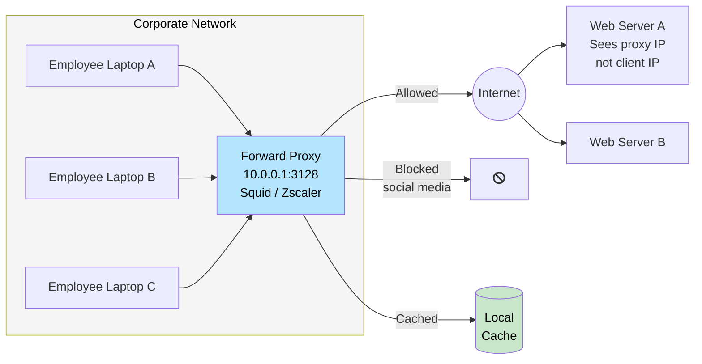
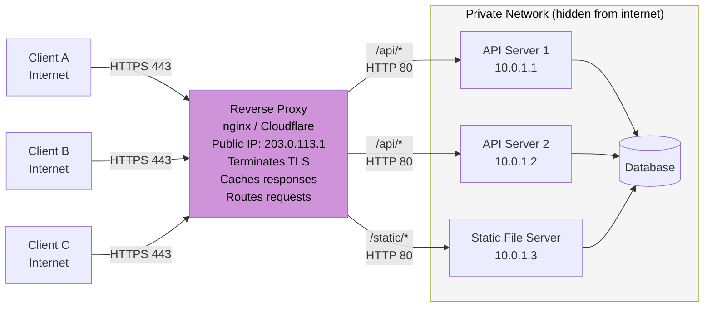
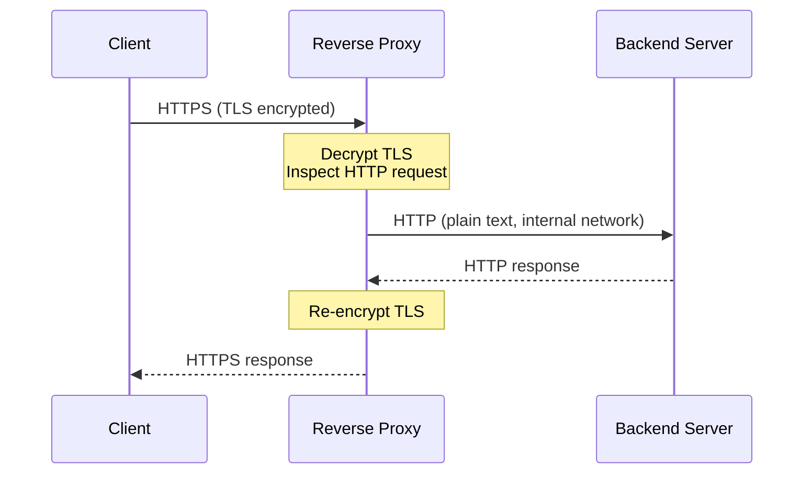

# Proxies

> A **proxy** is a middleman component that sits between two parties in a network communication — intercepting requests and responses to add capabilities neither end needs to implement themselves.

**Level:** 1 · **Topic:** 5 · **Prerequisites:** [Load Balancing](../02-Load-Balancing/README.md) · [HTTP and HTTPS](../../Level-00-Foundations/06-HTTP-and-HTTPS/README.md)

---

## 🎯 The Problem

Consider two scenarios:

1. A company wants all employee internet traffic to be filtered for malicious sites, logged for compliance, and cached to reduce bandwidth costs — but installing software on every employee device is impractical.

2. A website runs on 10 different backend servers but wants to expose a single address to the world, terminate SSL in one place, block suspicious IPs, and cache common responses.

Both scenarios need a middleman. The first is a **forward proxy**. The second is a **reverse proxy**. They look similar but face opposite directions — and that distinction is everything.

---

## 🌍 Real-World Analogy

**Forward proxy:** You're a student at a school with internet filtering. You can't access YouTube directly. Instead, every request goes through the school's proxy server first. The school can see, filter, or cache anything you request. Websites see the school's IP — not yours. *The proxy represents the client.*

**Reverse proxy:** You call a company's main phone number. A receptionist answers, decides which department to forward your call to, and may answer common questions themselves without bothering anyone in the back. The caller never speaks directly to the departments. *The proxy represents the server.*

---

## 🧠 Core Idea

### Forward Proxy

A forward proxy sits **between clients and the internet**. The clients are configured to route their traffic through it.

What forward proxies do:
- **Privacy / anonymity:** The server sees the proxy's IP, not the client's
- **Content filtering:** Block sites (corporate, parental controls, country-level censorship)
- **Caching:** Cache common responses to save bandwidth (especially useful for corporate networks with many employees visiting the same sites)
- **Traffic logging:** Audit who accesses what (compliance, security)
- **Bypass geo-restrictions:** A proxy in another country appears as local traffic to the destination (VPNs work similarly)

Examples: Squid proxy, corporate web proxies, VPNs, Tor network

### Reverse Proxy

A reverse proxy sits **between the internet and your backend servers**. Clients don't know the backend servers exist — they only see the proxy's address.

What reverse proxies do:
- **Load balancing:** Distribute requests across multiple backend servers
- **SSL/TLS termination:** Decrypt HTTPS once at the edge; backend runs plain HTTP internally
- **Caching:** Cache responses and serve them without hitting the backend
- **Compression:** gzip/brotli responses before sending to client
- **Request routing:** Route `/api` to API servers, `/static` to file servers
- **Security:** Hide backend IPs; block malicious requests; rate limiting; WAF (Web Application Firewall)
- **Health checking:** Remove unhealthy backends from rotation

Examples: Nginx, HAProxy, Caddy, AWS CloudFront, Cloudflare

---

## 📊 How It Works

### Forward Proxy — Client Side

*Caption: Clients in the corporate network route all traffic through the forward proxy. The proxy filters, logs, and caches. External servers only see the proxy's public IP.*

---

### Reverse Proxy — Server Side

*Caption: Clients communicate only with the reverse proxy over HTTPS. Backend servers are on a private network, run plain HTTP, and have no public IP. The proxy handles TLS, routing, caching, and load balancing.*

---

### SSL Termination Detail

*Caption: SSL termination at the proxy means backend servers only process plain HTTP — no TLS library overhead, simpler cert management, cheaper backend compute.*

---

## 🔧 Types / Variations / Strategies

### Forward vs Reverse Proxy — Side by Side

| Dimension | Forward Proxy | Reverse Proxy |
|-----------|--------------|---------------|
| **Represents** | Clients | Servers |
| **Configured on** | Client (browser/OS proxy settings) | Server side (DNS points to proxy) |
| **Who knows about it** | Clients (they route to it explicitly) | Clients (transparent — they just see one address) |
| **Primary users** | Enterprises, VPNs, privacy tools | Web applications, APIs, CDNs |
| **Key capabilities** | Filtering, anonymity, client-side caching | LB, SSL termination, server-side caching, security |
| **Examples** | Squid, Zscaler, corporate proxies | Nginx, HAProxy, Cloudflare, AWS ALB |

### Reverse Proxy Capabilities Matrix

| Capability | Nginx | HAProxy | Cloudflare | AWS ALB |
|-----------|-------|---------|-----------|---------|
| Load balancing | Yes | Yes | Yes | Yes |
| SSL termination | Yes | Yes | Yes | Yes |
| Response caching | Yes | Limited | Yes | No |
| WAF | Yes (Nginx+) | Limited | Yes | Yes (AWS WAF) |
| HTTP/2 | Yes | Yes | Yes | Yes |
| WebSocket | Yes | Yes | Yes | Yes |
| Rate limiting | Yes | Yes | Yes | Yes (via WAF) |

### Proxy vs Load Balancer vs CDN

These concepts overlap — it's worth clarifying:

| Component | Primary Role | Also Does |
|-----------|-------------|-----------|
| **Forward Proxy** | Represents clients to the internet | Caching, filtering, anonymity |
| **Reverse Proxy** | Represents servers to clients | Can do LB, caching, SSL |
| **Load Balancer** | Distributes traffic across servers | Is often implemented as a reverse proxy |
| **CDN** | Serves content from edge nodes near users | Is a globally distributed reverse proxy + cache |

A CDN *is* a reverse proxy. A load balancer is often *implemented as* a reverse proxy. These aren't separate categories — they're capabilities on a spectrum.

---

## 🏢 Real-World Examples

### Nginx as Reverse Proxy

Nginx is the most widely deployed reverse proxy in the world, running on ~35% of all websites. A typical Nginx config routes:
- `GET /` → React/Vue static build (served directly from Nginx without hitting any app server)
- `GET /api/*` → upstream pool of Python/Node backend servers (load-balanced)
- `GET /media/*` → S3 bucket or CDN (redirected)

Nginx handles **50,000+ concurrent connections** on a single server due to its event-driven, non-blocking I/O model. Instagram served 100M+ users with a relatively small Nginx fleet before migrating to CDN.

### Cloudflare — Massive Reverse Proxy Network

Cloudflare is essentially a globally distributed reverse proxy with 300+ PoPs (Points of Presence) worldwide. Every request to a Cloudflare-protected site goes through their edge nodes, which:
- Terminate TLS (with their certificate management)
- Cache static responses at the edge
- Filter DDoS traffic (they absorb multi-terabit attacks)
- Apply WAF rules
- Route clean traffic to the origin

The origin server never sees the client's real IP directly (unless the CF-Connecting-IP header is trusted).

### Corporate Forward Proxy (Zscaler, Squid)

Large enterprises (banks, law firms) route all employee internet traffic through a forward proxy. Benefits:
- All HTTP/S traffic is logged (compliance requirement)
- Malware download URLs are blocked in real-time
- Bandwidth is saved by caching common downloads (Windows updates, npm packages)
- Employees can be geolocated to "appear" from the company's datacenter when accessing external services

---

## ⚖️ Trade-offs

| | Pros | Cons |
|--|------|------|
| **Forward Proxy** | Centralized control; privacy; caching for clients | Single point of failure; potential bottleneck; clients must be configured to use it |
| **Reverse Proxy** | Hides backend complexity; centralized SSL; enables LB and caching; protects backend IPs | Added network hop; new component to operate; can become a bottleneck |
| **SSL termination at proxy** | Simpler backend; centralized cert management; cheaper backend compute | Proxy–backend traffic is unencrypted (requires trusted internal network or mTLS) |
| **Nginx as reverse proxy** | Battle-tested, fast, rich features | Config syntax can be tricky; advanced features require Nginx Plus (paid) |

---

## ✅ When to Use / ❌ When NOT to Use

**Use a Forward Proxy When:**
- Corporate network compliance requires traffic logging and filtering
- You want to anonymize client requests to external services
- You want to reduce external bandwidth by caching shared downloads

**Use a Reverse Proxy When:**
- You have more than one backend server (enables load balancing)
- You want centralized SSL termination (don't manage certs on every server)
- You want to protect backend servers from direct internet exposure
- You need request routing, response caching, or rate limiting in one place

**Do NOT add a proxy when:**
- You have a single server and low traffic — it adds unnecessary complexity
- Your "reverse proxy" would become a bottleneck without redundancy — always deploy in HA pairs

---

## ⚠️ Common Pitfalls

1. **Trusting X-Forwarded-For blindly:** When a reverse proxy forwards requests, it adds an `X-Forwarded-For` header with the client's real IP. But an attacker can spoof this header if the proxy doesn't sanitize it. Only trust this header from known proxy IPs.

2. **Forgetting to proxy WebSockets:** Many reverse proxy configurations default to HTTP/1.1 without the `Upgrade` header needed for WebSocket connections. Missing this causes persistent connection failures for real-time apps.

3. **SSL termination with unencrypted backend traffic on untrusted networks:** Terminating SSL at the proxy and sending plain HTTP to backends is fine inside a private VPC. It's a security risk if the backend is on a different cloud or public network.

4. **Proxy as a single point of failure:** One Nginx server handling all traffic is itself a SPOF. Always run at least two proxy instances with a floating VIP or DNS-level failover.

5. **Buffer size mismatches:** Nginx has default buffer sizes for proxy responses. If your backend returns large JSON payloads or file downloads and buffers are too small, Nginx writes temp files to disk, killing performance. Tune `proxy_buffer_size` and `proxy_buffers`.

---

## 🎤 Interview Tips

- **The direction test:** "A forward proxy represents clients; a reverse proxy represents servers." State this clearly — it's the core distinction interviewers check for.
- **Reverse proxy is an umbrella:** A load balancer is typically a reverse proxy. A CDN is a distributed reverse proxy. Showing you understand this relationship demonstrates depth.
- **SSL termination is a key use case:** Mention it when asked about reverse proxies — it's almost always relevant in real systems.
- **Name real tools:** Nginx and HAProxy for reverse proxies; Squid or Zscaler for forward proxies. Cloudflare as the reverse proxy-at-internet-scale example.
- **Bring up the security angle:** "By hiding backend IPs behind the reverse proxy, you prevent direct attacks on your servers and centralize security policy." Interviewers love security awareness.

---

## 📝 TL;DR

- A **forward proxy** represents clients — it sits in front of users and talks to the internet on their behalf (filtering, caching, anonymity).
- A **reverse proxy** represents servers — it sits in front of your backend and handles client requests (SSL, LB, caching, security).
- Reverse proxy capabilities overlap significantly with load balancers and CDNs — they're the same concept at different scales.
- Key reverse proxy wins: SSL termination, backend IP hiding, centralized caching, health-check-aware routing.
- Always run proxies in HA pairs; a single proxy is a new single point of failure.

---

## 🧪 Test Yourself

1. What is the key directional difference between a forward proxy and a reverse proxy? Which one represents the client, and which represents the server?
2. You have a backend server running on port 3000. You put Nginx in front on port 443. Describe what happens when a client sends `GET https://api.example.com/users`.
3. Why would you terminate SSL at the reverse proxy instead of on each backend server? What's the security trade-off?
4. A user's real IP is `1.2.3.4`. The request passes through your reverse proxy at `10.0.0.1`. What HTTP header should the proxy add, and what value?
5. How is a CDN similar to a reverse proxy? What additional capability does a CDN add?

---

## 📚 Further Reading

- [Nginx Reverse Proxy Guide](https://docs.nginx.com/nginx/admin-guide/web-server/reverse-proxy/)
- [HAProxy Configuration Manual](https://www.haproxy.org/download/2.8/doc/configuration.txt)
- [Cloudflare: How Cloudflare Works](https://www.cloudflare.com/learning/what-is-cloudflare/)
- Previous: [Databases — SQL vs NoSQL](../04-Databases-SQL-vs-NoSQL/README.md) · Next: [CDN](../06-CDN/README.md)
