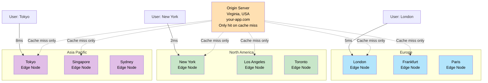
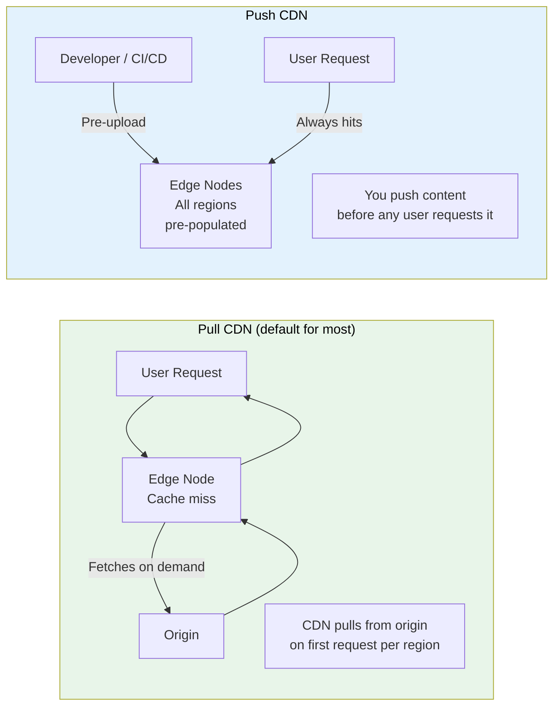

# CDN (Content Delivery Network)

> A **CDN** is a geographically distributed network of servers (edge nodes) that caches your content close to your users so they get it faster, and your origin server gets much less traffic.

**Level:** 1 · **Topic:** 6 · **Prerequisites:** [Caching](../03-Caching/README.md) · [Proxies](../05-Proxies/README.md) · [DNS](../../Level-00-Foundations/05-DNS/README.md)

---

## 🎯 The Problem

Your web server is in Virginia, USA. A user in Tokyo requests your 2MB product image. The round-trip latency between Tokyo and Virginia is ~150ms. Every image, CSS file, and JavaScript bundle travels halfway around the world. Your homepage takes 4 seconds to load.

Meanwhile, another user in London requests the same image 1 second later — the image travels the Atlantic and back again. You're serving the same bytes from the same server to thousands of users worldwide, all of whom are far away.

The fix: **put copies of your content on servers in every major city in the world.**

---

## 🌍 Real-World Analogy

Imagine you're a popular author. If you print all books at one factory in New York and ship worldwide, readers in Tokyo wait weeks. Instead, you license local printers in 200 cities. When someone in Tokyo orders the book, the local Tokyo printer makes a copy and delivers it in an hour. Your New York factory only prints the first copy that a city's printer needs — after that, that city handles itself.

Your "factory" is the origin server. The local printers are CDN edge nodes (also called **Points of Presence** or **PoPs**).

---

## 🧠 Core Idea

### Edge Nodes and PoPs

A CDN operator (Cloudflare, Akamai, CloudFront, Fastly) runs **hundreds of data centers** strategically placed:
- Major internet exchange points (New York, London, Frankfurt, Tokyo, Singapore, São Paulo...)
- As close to end users as possible — sometimes inside ISPs themselves

Each data center has servers called **edge nodes** that cache your content. When a user requests content, DNS routes them to the nearest edge node.

### How a Request Flows

1. User requests `https://cdn.example.com/image.jpg`
2. DNS resolves `cdn.example.com` to the **nearest edge node's IP** (via anycast or geoDNS)
3. Edge node checks its cache:
   - **Cache HIT:** Returns the file immediately from local disk (~5–50ms)
   - **Cache MISS:** Fetches from your **origin server**, caches it, returns it (~150–400ms for first user in that region)
4. Second user in same city hits the same edge → instant cache hit (~5ms)

The first user in a region pays the origin fetch cost. Every user after that gets the cached copy.

---

## 📊 How It Works

### Global Edge Network



*Caption: Each user is routed to the nearest edge PoP. The origin is only contacted on a cache miss — typically the first request from that region. After that, all users in the region are served locally.*

---

### Cache Miss → Origin Fetch → Cache Fill

```mermaid
sequenceDiagram
    participant U1 as User 1 (Tokyo)
    participant E as Tokyo Edge Node
    participant O as Origin (Virginia)
    participant U2 as User 2 (Tokyo)

    U1->>E: GET /hero-image.jpg
    E->>E: Cache miss (not stored yet)
    E->>O: GET /hero-image.jpg (150ms RTT)
    O-->>E: 200 OK + image data
    E->>E: Store in local cache<br/>TTL from Cache-Control header
    E-->>U1: 200 OK (155ms total for User 1)

    Note over E: Image now cached at Tokyo PoP

    U2->>E: GET /hero-image.jpg
    E->>E: Cache HIT!
    E-->>U2: 200 OK (8ms total for User 2 ✓)
```



*Caption: User 1 pays the origin latency cost. All subsequent users in Tokyo get it from the edge in milliseconds.*

---

### Pull CDN vs Push CDN



*Caption: Pull CDN is simpler — just point your CDN at your origin and it handles the rest. Push CDN gives you control but requires explicit upload workflows.*

---

## 🔧 Types / Variations / Strategies

### Pull vs Push CDN

| | Pull CDN | Push CDN |
|--|----------|----------|
| **How content gets to edge** | Edge fetches from origin on first miss | You upload content proactively |
| **Operational complexity** | Low — just configure origin URL | Higher — upload pipeline required |
| **First-request latency** | High (origin fetch) | None — always pre-populated |
| **Best for** | Large, frequently accessed assets | Frequently changing content; time-critical launches |
| **Examples** | CloudFront (default), Cloudflare | Akamai NetStorage, CloudFront with S3 pre-push |

### Cache-Control Headers

The CDN respects HTTP cache headers from your origin. These headers control CDN behavior:

| Header | Example | What It Does |
|--------|---------|-------------|
| `Cache-Control: max-age=86400` | `max-age=86400` | CDN caches for 86,400 seconds (1 day) |
| `Cache-Control: s-maxage=3600` | `s-maxage=3600` | CDN caches for 1 hour (overrides max-age for CDN only) |
| `Cache-Control: no-cache` | — | CDN revalidates with origin on every request |
| `Cache-Control: no-store` | — | CDN must not cache at all |
| `Cache-Control: public` | — | Explicitly cacheable (even if response has Set-Cookie) |
| `Cache-Control: private` | — | CDN must not cache — only browser may |
| `Vary: Accept-Encoding` | — | Cache separate copies per encoding (gzip vs br) |
| `ETag: "abc123"` | — | Enables conditional GET revalidation |
| `Surrogate-Key: product-42` | — | Tag-based purge (Fastly/Varnish) |

### Cache Invalidation / Purge

When you update content, old versions may sit cached at hundreds of edge nodes:

| Strategy | How | Latency to Propagate |
|----------|-----|---------------------|
| **TTL expiry** | Wait for `max-age` to expire | Minutes to hours |
| **Cache purge by URL** | API call to CDN: DELETE specific URLs | Seconds to minutes |
| **Surrogate-key purge** | Tag groups of assets, purge by tag | Seconds (Fastly, Varnish) |
| **Cache-busting** | Change the URL (e.g., `image.v2.jpg` or `image.jpg?v=2`) | Instant — new URL = no cache |

Cache-busting by URL is the most reliable and commonly used technique for versioned assets (JS bundles, CSS files).

### Origin Shielding

Without origin shielding, if you have 200 edge nodes and a cache expires, up to 200 simultaneous requests may hit your origin at once. **Origin shielding** adds a layer:

```
Edge Nodes → Shield Node (one per region) → Origin
```

Only the shield node talks to the origin. Edge nodes in the same region miss to the shield first. This dramatically reduces origin load (from 200 to ~10 simultaneous origin requests).

### Dynamic Content at the Edge

CDNs were originally for static files. Modern CDNs now handle dynamic content:
- **Edge functions / serverless at edge:** Cloudflare Workers, Lambda@Edge — run code within milliseconds of every user
- **Edge-side includes (ESI):** Assemble HTML at the edge by combining static parts (cached) with dynamic fragments
- **Smart caching of API responses:** Cache `/api/products` for 60 seconds — the DB never sees individual user requests
- **A/B testing at edge:** Route a percentage of traffic to variant B without origin involvement

---

## 🏢 Real-World Examples

### Cloudflare

Cloudflare operates **300+ PoPs** in 100+ countries. It handles more internet traffic than most hyperscalers. Key features:
- **Anycast routing:** All Cloudflare PoPs share the same IP address space. BGP routing automatically sends traffic to the nearest PoP.
- **DDoS mitigation:** Absorbs multi-terabit attacks at the edge before they reach your origin
- **Cloudflare Workers:** V8-based edge functions run on every PoP — typical cold start is <1ms (compared to 100ms+ for traditional serverless)

### Amazon CloudFront

CloudFront is AWS's CDN, tightly integrated with S3, EC2, and API Gateway:
- 600+ edge locations worldwide
- Supports Lambda@Edge and CloudFront Functions for edge compute
- Used by Amazon Prime Video, Amazon.com static assets, and millions of AWS customers
- Cache hit rates of 80–95% are typical for well-configured static asset delivery

### Akamai

Akamai is the oldest CDN (founded 1998) and still serves a significant portion of global internet traffic:
- **Thousands** of edge servers embedded inside ISPs worldwide — closer to users than anyone
- Handles streaming for major media companies (NFL, Disney+, BBCSport)
- Specializes in video delivery, large file distribution, and enterprise security
- Netflix historically used Akamai before building its own CDN (Open Connect)

### Netflix Open Connect

Netflix outgrew public CDNs and built **Open Connect** — its own CDN with ~17,000 servers embedded directly inside ISPs and internet exchanges worldwide. Netflix ships physical appliances to ISPs, pre-loaded with popular content during off-peak hours. During peak evenings, a typical city's Netflix traffic never leaves the ISP's network. Netflix estimates this saves hundreds of millions in bandwidth costs annually.

---

## ⚖️ Trade-offs

| | Pros | Cons |
|--|------|------|
| **CDN in general** | Dramatically lower latency for users worldwide; reduces origin load; absorbs traffic spikes | Cost (per-GB transfer fees); cache invalidation complexity; another vendor dependency |
| **Pull CDN** | Simple setup; no operational overhead | First user per region pays origin latency; origin still handles cache refreshes |
| **Push CDN** | Predictable; no origin hits | Upload pipeline required; easy to forget to invalidate |
| **Long TTLs** | Maximum cache efficiency; lowest origin load | Stale content until TTL expires; invalidation required on every update |
| **Short TTLs** | Always fresh content | More origin requests; defeats caching purpose |
| **Cache-busting** | Instant propagation of new assets | Requires build pipeline to version file names; old URLs keep serving stale |

---

## ✅ When to Use / ❌ When NOT to Use

**Use a CDN When:**
- Your users are geographically distributed (any public-facing website)
- You serve static assets: images, CSS, JS, videos, fonts, PDFs
- You need to absorb traffic spikes or DDoS protection
- You want to offload origin bandwidth costs

**CDN Helps With:**
- API responses that are the same for all users and can be cached briefly (product listings, news feeds)
- Video streaming — CDN is essentially mandatory for large-scale video delivery

**Do NOT Cache With CDN:**
- Personalized content (user-specific dashboards, account pages) — unless you segment by cookie
- Real-time data that changes every second
- Content with authentication required per request (use `Cache-Control: private`)

---

## ⚠️ Common Pitfalls

1. **Caching private content:** If your CDN caches a page with `Set-Cookie: session_id=...` without `Cache-Control: private`, the next user may receive the previous user's session. Always set proper cache headers on authenticated responses.

2. **Forgetting to purge on deploy:** After deploying new HTML, your CDN may still serve the old version. Either use short TTLs for HTML (60 seconds), implement purge-on-deploy in your CI/CD pipeline, or use cache-busting URLs.

3. **Vary header explosion:** `Vary: User-Agent` tells the CDN to cache a separate copy per user agent string. There are thousands of unique user agent strings. This defeats caching. Only use `Vary: Accept-Encoding` (for gzip vs brotli) unless you have very specific needs.

4. **Not using origin shielding:** Without origin shielding, a cache expiration across 200 PoPs can send 200 simultaneous requests to your origin. Enable origin shielding for expensive-to-compute responses.

5. **Assuming CDN = infinite scale:** A CDN drastically reduces origin load, but your origin still needs to handle cache misses and dynamic requests. If your origin can't handle the miss load, a CDN's traffic spike protection is incomplete.

---

## 🎤 Interview Tips

- **State the core benefit clearly:** "CDN puts content at the edge — near users — so round-trip time drops from 150ms to 5ms for static assets, and origin servers see dramatically less traffic."
- **Distinguish static vs dynamic:** Show you know CDNs are evolving beyond static files — edge functions, API caching, A/B testing at edge.
- **Bring up cache-busting:** It's the practical solution to "how do you deploy new code immediately?" Answer: content-hashed filenames in your build pipeline.
- **Origin shielding shows depth:** Most candidates just say "CDN caches stuff." Mentioning origin shielding (the shield tier between edges and origin) signals production experience.
- **Compare CDN to a reverse proxy:** "A CDN is fundamentally a globally distributed reverse proxy + cache. Cloudflare is just Nginx running on 300 servers worldwide."

---

## 📝 TL;DR

- A CDN caches your content at **edge nodes** near users worldwide, cutting latency from 150ms+ to under 20ms for returning requests.
- **Pull CDN** fetches from origin on the first miss per region; **push CDN** requires you to upload content proactively.
- **Cache-Control headers** control TTL; **cache purge** or **URL cache-busting** handles invalidation on deploy.
- **Origin shielding** adds a regional tier to prevent thundering herd from hitting your origin on cache expiry.
- Modern CDNs support **edge compute** (Cloudflare Workers, Lambda@Edge) — run logic within milliseconds of every user.

---

## 🧪 Test Yourself

1. A user in Singapore requests an image from your origin server in Frankfurt. What happens on the first request vs the tenth request to the same CDN edge node?
2. You deploy a new version of your JS bundle. How do you ensure users receive the new version immediately without setting a 0-second TTL on every request?
3. What does `Cache-Control: s-maxage=3600, max-age=0` mean for a CDN vs a browser?
4. What is origin shielding and why is it important?
5. Your product page shows the user's account balance. Should this page be cached by a CDN? How would you handle it?

---

## 📚 Further Reading

- [Cloudflare Learning: What is a CDN?](https://www.cloudflare.com/learning/cdn/what-is-a-cdn/)
- [AWS CloudFront Developer Guide](https://docs.aws.amazon.com/AmazonCloudFront/latest/DeveloperGuide/Introduction.html)
- [HTTP Caching (MDN)](https://developer.mozilla.org/en-US/docs/Web/HTTP/Caching)
- [Netflix Open Connect](https://openconnect.netflix.com/en/)
- [Fastly Surrogate Keys (Tag-based Purge)](https://www.fastly.com/blog/surrogate-keys-part-1/)
- Previous: [Proxies](../05-Proxies/README.md) · Next: [Stateless vs Stateful](../07-Stateless-vs-Stateful/README.md)
