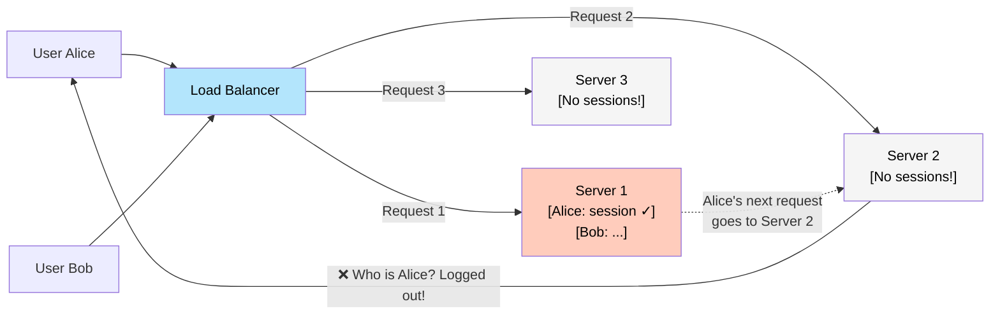
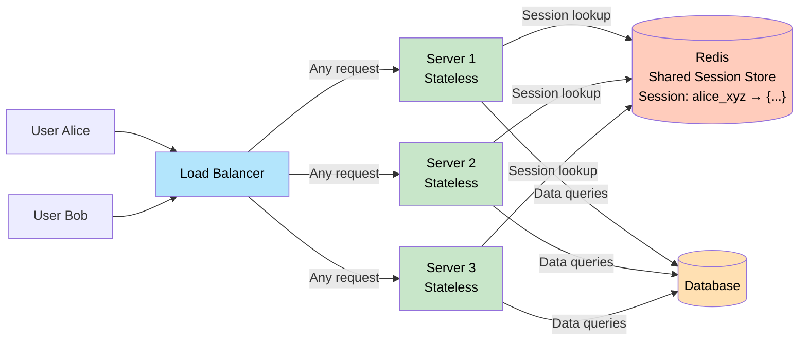
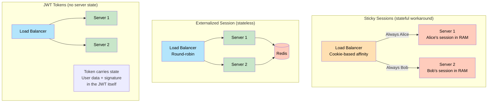

# Stateless vs Stateful

> A **stateless** service treats every request as independent — it holds no memory of past requests. A **stateful** service remembers — it keeps data about ongoing interactions in memory or local storage.

**Level:** 1 · **Topic:** 7 · **Prerequisites:** [Scalability](../01-Scalability/README.md) · [Load Balancing](../02-Load-Balancing/README.md) · [Caching](../03-Caching/README.md)

---

## 🎯 The Problem

You've scaled your app to 3 web servers behind a load balancer. Users log in and everything seems fine — until complaints roll in: users get randomly logged out, items disappear from shopping carts, and half the support tickets are "why did I have to log in again?"

The problem: when a user logs in, Server 1 stores their session in its local memory. The next request goes to Server 2, which has no session — so the user is treated as a stranger. Your app is **stateful** (stores state locally), but your infrastructure is horizontal.

This is one of the most common scaling bugs. The fix is to make your services **stateless**.

---

## 🌍 Real-World Analogy

**Stateless:** A vending machine. Each transaction is independent. It doesn't know (or care) who you are, what you bought yesterday, or how many times you've used it before. Give it money, press a button, get a snack. If you swap out the machine for another identical one, nothing changes for you.

**Stateful:** A barista who remembers your name, your usual order, and that you get the large on Fridays. This is wonderful service — but if that barista calls in sick, the replacement has no idea who you are. The knowledge lived in one person's memory and is now gone.

Stateful services are like that barista. They're powerful and personalized — but they break when you try to "swap them out" (restart a server, add more servers, or recover from a crash).

---

## 🧠 Core Idea

### What Is "State"?

**State** is any information that persists between requests and is specific to a user or session:

- User's login session ("Alice is authenticated")
- Shopping cart contents
- An in-progress file upload buffer
- A game's current match state
- A database transaction (mid-way through a multi-step operation)

### Stateless Services

A stateless service receives a request, processes it using **only the data contained in that request** (plus shared external stores), and returns a response. Nothing is remembered locally between calls.

Properties:
- **Horizontally scalable:** Any server can handle any request → add servers freely
- **Crash-safe:** Restart a server, no data lost (state lives elsewhere)
- **Load balancer friendly:** Works perfectly with round-robin; no sticky sessions needed
- **Easy to deploy:** Roll updates by replacing servers one at a time

### Stateful Services

A stateful service remembers data about clients across requests, usually in local memory or local disk.

Properties:
- **Cannot be freely load-balanced:** Must route each user to the same server (sticky sessions) or lose their state
- **Hard to scale:** Adding servers doesn't help — each has isolated state
- **Crash-sensitive:** A server crash loses all in-memory state for all users on that server
- **Necessary for certain workloads:** Databases, game servers, streaming sockets — some things *must* be stateful

---

## 📊 How It Works

### Stateful Architecture (the problem)

*Caption: Alice's session is stored in Server 1's memory. When her next request goes to Server 2, that server has no knowledge of her session — she's forced to log in again.*

---

### Stateless Architecture (the solution)

*Caption: State is externalized to Redis. Every server can handle any request because they all look up sessions from the same Redis store. Adding a 4th server requires zero data migration.*

---

### Session Management Options Compared

*Caption: Three approaches to session management. Sticky sessions are the quick fix; externalized sessions or JWT tokens are the scalable solutions.*

---

## 🔧 Types / Variations / Strategies

### The Three Session Strategies

| Strategy | How It Works | Pros | Cons |
|----------|-------------|------|------|
| **Sticky sessions** | LB routes user to same server via cookie/IP | No code change to existing app | Defeats load distribution; server crash = lost sessions |
| **Externalized sessions (Redis)** | Sessions stored in Redis; servers are stateless | True horizontal scaling; crash-safe | Redis becomes a dependency; network hop per request |
| **JWT / Signed tokens** | Session state encoded in a signed token sent with every request | Zero server state; works without Redis | Token revocation is hard; tokens can grow large; secret key management |

### Comparing Stateless vs Stateful Services

| Dimension | Stateless | Stateful |
|-----------|-----------|----------|
| **Horizontal scaling** | Trivial — add any number of instances | Hard — requires data migration or co-location |
| **Crash recovery** | Instant — restart and continue | Data loss unless persisted separately |
| **Load balancing** | Any algorithm works | Requires sticky sessions or data replication |
| **Deployment** | Roll updates freely | Careful draining of connections required |
| **Simplicity** | More code to externalize state | Simpler code (state in memory) |
| **Examples** | REST API, stateless microservices | Databases, game servers, WebSocket sessions |

### When State Is Unavoidable — Stateful Services

Some services are inherently stateful and that's OK:

| Service Type | Why It's Stateful | How It Scales |
|-------------|------------------|---------------|
| **Database** | Stores all persistent data | Replication + sharding |
| **Cache (Redis)** | Holds key-value state | Redis Cluster or sharding |
| **Message queue** | Holds unprocessed messages | Cluster + partitioning (Kafka) |
| **Game server** | Tracks real-time match state | Single authoritative server per match; matches distributed across servers |
| **WebSocket server** | Maintains persistent connections | Connections sharded across servers; pub/sub for cross-server messaging |
| **Leader election** | One node must be "in charge" | Paxos/Raft consensus protocol |

The key insight: even in systems with stateful components, **the goal is to isolate state in dedicated stateful services** (database, Redis) so that the application logic layer can remain stateless and horizontally scalable.

---

## 🏢 Real-World Examples

### Netflix — Stateless API Services

Netflix's API layer (which handles 200M+ subscriber requests) is entirely stateless. Each service instance:
- Holds no user session data
- Reads user preferences from a shared database or cache
- Signs requests with JWTs for authentication

This allows Netflix to scale API instances up/down within seconds in response to traffic (especially during "pause all of Netflix" events like the Super Bowl halftime show). No service instance is irreplaceable.

### Facebook — PHP "Stateless" Architecture

Facebook's original PHP web tier was stateless — every PHP process could handle any user's request. State was externalized to:
- Memcached for session and feed data
- MySQL for durable user data

This allowed Facebook to scale from one server to thousands without changing the application layer. The PHP tier scaled purely by adding machines.

### Online Multiplayer Games — The Stateful Exception

A game like Fortnite's match server is inherently stateful: it tracks every player's position, health, inventory, and game events in real time. These servers *cannot* be made stateless — the state is the product.

The solution: treat match servers as **ephemeral stateful units**. Each match runs on one server for its duration (~20 minutes), then terminates. The matchmaking service (which assigns players to matches) is stateless. The match server itself is stateful but short-lived. Durable data (stats, inventory) is written to the database at match end.

### 12-Factor App — Industry Standard for Stateless Services

The [12-Factor App methodology](https://12factor.net/) defines the industry standard for building stateless, cloud-native services. Factor VI states: "Execute the app as one or more stateless processes. Any data that needs to persist must be stored in a stateful backing service (database)." This principle is the foundation of Kubernetes, Heroku, and modern microservice architecture.

---

## ⚖️ Trade-offs

| | Pros | Cons |
|--|------|------|
| **Stateless services** | Trivially scalable; crash-safe; simple deployment | Must externalize state (adds infrastructure); network round-trip to fetch state |
| **Stateful services** | Simple to build initially; no external dependency for state | Hard to scale; crash-sensitive; deployment requires care |
| **Redis session store** | Shared, fast (< 1ms), supports TTL, survives app restarts | New infrastructure dependency; Redis itself must be made HA |
| **JWT tokens** | Zero server state; works without external store | Revocation requires a blocklist (adds state anyway for logout); tokens can be large |
| **Sticky sessions** | Quick fix for legacy stateful apps | Defeats load distribution; node failure = session loss |

---

## ✅ When to Use / ❌ When NOT to Use

**Design Stateless When:**
- You're building an API or web service that will scale horizontally
- You want zero-downtime deployments (replace instances without draining sessions)
- You're building microservices (each service should be independently scalable)
- You care about fault tolerance (a crashed instance loses nothing important)

**Accept Stateful When:**
- You're building a database, cache, or message queue (state *is* the value)
- You're building real-time game servers or collaborative editors (low-latency shared state is essential)
- You need sub-millisecond state access that a network round-trip to Redis would violate

**Sticky Sessions (temporary):**
- OK as a quick fix to make an existing stateful app work with a load balancer
- Not acceptable for new systems — it's technical debt that makes scaling harder later

---

## ⚠️ Common Pitfalls

1. **In-memory caches as hidden state:** It's tempting to cache per-user data in a process-level dictionary (Python dict, Java HashMap). This makes your service secretly stateful. Requests to other instances get cache misses, leading to inconsistent behavior and extra DB load.

2. **JWT for revocation:** JWTs are stateless — once issued, they're valid until expiry. If a user logs out or changes their password, how do you invalidate all outstanding JWTs? You need a server-side blocklist, which re-introduces state. Know this trade-off.

3. **Misidentifying the bottleneck:** Making app servers stateless doesn't scale the database. Redis (the session store) still needs HA. The stateless app servers can scale infinitely — but the shared state stores are still a scale concern.

4. **WebSocket servers as stateless:** WebSocket connections are persistent. A "stateless" WebSocket server that holds live connections isn't truly stateless — the connection itself is state. Use a pub/sub layer (Redis Pub/Sub, Kafka) to route messages across WebSocket servers.

5. **Forgetting to handle graceful shutdown:** Even stateless services can be mid-request when killed. Implement graceful shutdown (finish in-flight requests, stop accepting new ones) to avoid dropped requests during deployments.

---

## 🎤 Interview Tips

- **Define state clearly:** "State is any data specific to a user or session that persists between requests." Interviewers want to know you can articulate what you're externalizing and why.
- **Lead with the scaling consequence:** "A stateful app server can't be load-balanced without sticky sessions, which defeats the purpose. Making it stateless by externalizing sessions to Redis lets you round-robin freely."
- **Mention the three session strategies:** Sticky sessions (workaround), Redis (correct), JWT (trade-offs). Show you know the real options.
- **Distinguish stateless app layer from stateful data layer:** "The goal is a stateless *application* layer, not a stateless system — databases and caches are necessarily stateful, but they're purpose-built for that."
- **Cite the 12-Factor App:** Saying "the 12-Factor methodology formalized this as Factor VI" signals production awareness.

---

## 📝 TL;DR

- **Stateless** services hold no per-user state in memory — every request is self-contained. They scale horizontally with zero friction.
- **Stateful** services remember things between requests. They're powerful but don't scale well and are crash-sensitive.
- The key technique: **externalize state** to a dedicated store (Redis, database) so app servers become stateless.
- Three session options: sticky sessions (quick fix, avoid), Redis session store (right answer for most), JWT tokens (stateless but revocation is tricky).
- Databases and caches are *intentionally* stateful — the goal is to isolate state there so everything else is stateless.

---

## 🧪 Test Yourself

1. You have 4 app servers behind a load balancer. User sessions are stored in each server's memory. A user logs in and their next 5 requests go to different servers. What happens?
2. What is sticky sessions, and why is it considered a workaround rather than a solution?
3. Describe how you would make the app servers in question 1 stateless. What infrastructure do you need to add?
4. A JWT contains `{ user_id: 42, role: admin, exp: ... }` and is signed with your server's secret key. The user is demoted from admin. Their existing JWT doesn't expire for 24 hours. How do you handle this?
5. A multiplayer game server must track 100 players' positions in real time. Is this service stateless or stateful? How would you scale it to support 10,000 simultaneous matches?

---

## 📚 Further Reading

- [12-Factor App — Factor VI: Processes](https://12factor.net/processes)
- [Redis as a Session Store](https://redis.io/docs/manual/patterns/session-store/)
- [JWT.io — JSON Web Tokens](https://jwt.io/introduction)
- [The Stateless Service Pattern (Microsoft Azure Architecture)](https://learn.microsoft.com/en-us/azure/architecture/patterns/static-content-hosting)
- Previous: [CDN](../06-CDN/README.md) · Next: [08 — Concurrency Models & Async I/O](../08-Concurrency-and-Async-IO/README.md) · Back to [Level 01 Overview](../README.md)
