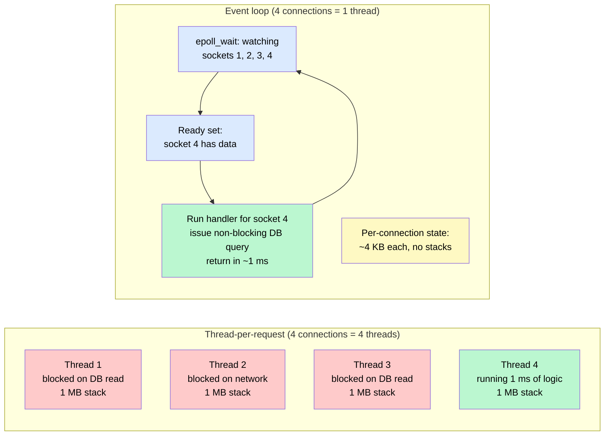
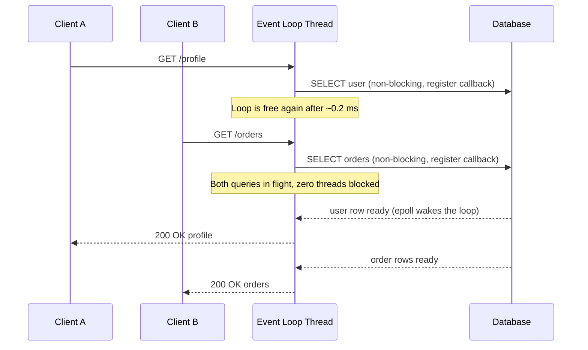
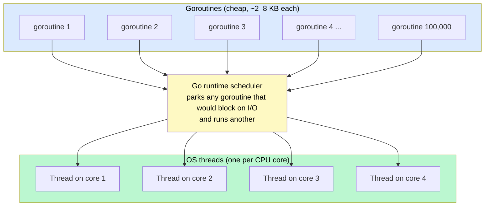

# Concurrency Models & Async I/O

> A **concurrency model** is how a server juggles thousands of simultaneous requests — with one OS thread per request, a single event loop, or lightweight green threads — and it decides whether 10,000 idle connections cost you 10 GB of RAM or almost nothing.

**Level:** 1 · **Topic:** 8 · **Prerequisites:** [The Client-Server Model](../../Level-00-Foundations/02-Client-Server-Model/README.md) · [Latency, Throughput & Performance](../../Level-00-Foundations/07-Latency-Throughput-Performance/README.md) · [Stateless vs Stateful](../07-Stateless-vs-Stateful/README.md)

---

## 🎯 The Problem

It's 1999. Your web server handles each connection by spawning a thread. A thread costs about 1 MB of stack memory and the kernel has to context-switch between all of them. At 10,000 simultaneous connections you need 10 GB of RAM just for stacks, and the CPU spends more time switching threads than doing work. This became famous as the **C10K problem**: "how do you serve ten thousand clients at once?"

The twist that makes it solvable: **almost all of those threads are idle.** A typical web request spends 1 ms doing CPU work and 50–200 ms *waiting* — for the database, for another service, for the client's slow phone to send the next packet. A thread parked on a `read()` call is pure overhead: it holds memory and a scheduler slot while doing nothing.

Today the number is C10M — a single machine holding millions of WebSocket connections for chat, gaming, or IoT. You cannot get there by adding threads.

**The core problem:** the naive "one thread per connection" model ties memory and scheduling cost to the number of *connections*, when what actually matters is the amount of *work in progress*.

---

## 🌍 Real-World Analogy

Picture a restaurant.

- **Thread-per-request** is hiring one waiter per table. The waiter takes your order, walks to the kitchen, and then *stands at the pass doing nothing* for fifteen minutes until your food is ready. Fifty tables means fifty waiters, forty-five of them idle at any moment. Payroll is enormous.
- **The event loop** is one extremely fast waiter. They take your order, hand the ticket to the kitchen, and immediately move to the next table. When the kitchen rings the bell (the "callback"), they grab the plate and deliver it. One waiter can comfortably serve fifty tables — *as long as they never stop to cook.* If that one waiter starts grinding coffee beans by hand for ten minutes, every table in the restaurant waits.
- **Green threads / goroutines** are a manager with a small crew of waiters and a stack of paper order slips. Any waiter can pick up any slip. When a waiter would have to wait on the kitchen, they put the slip down and pick up another one. The paper slips (goroutines) are nearly free; the waiters (OS threads) are few and always busy.

The whole topic is about which of these staffing models your server uses.

---

## 🧠 Core Idea

### Step 1 — Why threads block

When code calls `socket.read()` or `db.query()`, the operating system parks that thread until data arrives. This is **blocking I/O**. The thread holds its stack memory the whole time and cannot do anything else. Blocking is simple to reason about — code reads top to bottom — but it wastes a thread per outstanding I/O operation.

### Step 2 — Thread-per-request (and thread pools)

The classic model: Apache's prefork MPM, Tomcat, Rails/Puma, Django on gunicorn. Each request gets a thread (or process). To avoid unbounded memory, servers cap this with a **thread pool** — say, 200 threads. Request number 201 waits in a queue.

- **Pros:** dead simple; each request is isolated; a slow request only occupies its own thread; blocking libraries "just work."
- **Cons:** memory per thread (512 KB–1 MB stack); context switches; the pool size becomes a hard concurrency ceiling. If your database takes 100 ms per query, 200 threads can serve at most 2,000 requests/second no matter how fast your CPU is.

### Step 3 — Non-blocking I/O and the event loop

Modern kernels expose **`epoll`** (Linux), **`kqueue`** (BSD/macOS), and **IOCP** (Windows): a thread can hand the kernel a list of 10,000 sockets and say "wake me when *any* of them has data." One thread then waits on all connections at once.

This gives you the **event loop** (the "reactor pattern"):

1. Call `epoll_wait()` → the kernel returns the handful of sockets that are ready.
2. For each ready socket, run a small piece of code (a callback, a promise continuation, or the next step of an `async` function).
3. That code issues its own non-blocking I/O (a DB query) and returns immediately.
4. Go back to step 1.

Node.js, Nginx, Redis, Netty, Twisted, and libuv all work this way. Memory per connection drops from ~1 MB to a few KB — a tiny struct for the socket state plus whatever your handler keeps.

**The one rule:** *never block the loop.* A synchronous file read, a 50 MB `JSON.parse`, a CPU-heavy image resize, or a tight loop on the event-loop thread stalls *every* connection on the server, not just one.

### Step 4 — Green threads: blocking-style code, event-loop cost

Writing everything as callbacks is painful ("callback hell"). **Green threads** hide the event loop: you write ordinary blocking-looking code, and a runtime scheduler multiplexes thousands of lightweight threads onto a few OS threads. When a green thread would block on I/O, the runtime parks it (costing almost nothing) and runs another.

- **Go goroutines:** start with a 2–8 KB stack that grows on demand. An **M:N scheduler** maps millions of goroutines onto a handful of OS threads (one per core). A million goroutines ≈ a few GB, versus a million OS threads ≈ impossible.
- **Erlang/Elixir processes:** the original — WhatsApp famously held 2 million TCP connections on a single server with this model.
- **Java 21 virtual threads (Project Loom):** the same idea arriving in the JVM, so existing blocking Java code can scale like Go.
- **Kotlin coroutines, Python gevent:** same family.

### Step 5 — `async` / `await`

`async/await` (JavaScript, Python asyncio, C#, Rust) is syntax sugar over the event loop. The compiler turns an `async` function into a state machine; each `await` is a point where the function yields the thread back to the loop until its I/O completes. It reads like blocking code but costs like an event loop. The catch is "function coloring": async code can only be awaited from other async code, so the model tends to spread through a codebase.

### Step 6 — I/O-bound vs CPU-bound: the deciding question

Everything above optimizes *waiting*. It does nothing for *computing*.

- **I/O-bound work** (API gateways, chat servers, proxies, CRUD services): event loops and green threads win decisively.
- **CPU-bound work** (image/video processing, compression, ML inference, cryptography): you need real parallelism — one OS thread or process per core. Node.js uses a `cluster` of worker processes or `worker_threads`; Python needs `multiprocessing` because the GIL lets only one thread run Python code at a time; Go and Java run goroutines/threads on all cores natively.

**Sizing with Little's Law:** `concurrency = throughput × latency`. If you serve 10,000 requests/second and each takes 200 ms, you have 2,000 requests in flight at all times. With thread-per-request that's 2,000 threads (~2 GB). With an event loop it's 2,000 small state objects (~20 MB).

---

## 📊 How It Works

### Thread-per-Request vs Event Loop

*Both servers hold 4 connections. On the left, 4 threads sit blocked; on the right, one loop thread handles all of them and is free between events.*

*Caption: Red threads are parked and wasting memory. The event loop only spends CPU on the one socket that is actually ready, then goes back to waiting on all of them.*

### One Loop Thread Interleaving Two Requests

*Notice the loop never waits for the database — it registers interest and moves on. The kernel wakes it when results arrive.*

*Caption: Two requests, two outstanding database calls, one thread. With thread-per-request this would have consumed two blocked threads for the entire 50–100 ms.*

### How Go Multiplexes Goroutines onto OS Threads

*Caption: The M:N scheduler is why "spawn a goroutine per connection" is fine in Go but "spawn a thread per connection" is not in Java 8 or C++.*

---

## 🔧 Types / Variations / Strategies

| Model | How it works | Memory per idle connection | Handles CPU-bound work? | Examples |
|-------|-------------|----------------------------|--------------------------|----------|
| **Process-per-request** | Fork a process per connection | ~10 MB+ | Yes (true parallelism) | Apache prefork, old CGI |
| **Thread-per-request** | One OS thread per connection | ~0.5–1 MB | Yes | Tomcat, Puma, classic Java servlets |
| **Thread pool + queue** | Fixed N threads; extra requests queue | ~0.5–1 MB × N (bounded) | Yes | Most JVM servers, gunicorn sync workers |
| **Single-threaded event loop** | One thread, epoll/kqueue, callbacks or async/await | ~2–10 KB | **No** — must offload | Node.js, Redis, Python asyncio |
| **Multi-worker event loop** | One event loop per core, kernel balances accepts | ~2–10 KB | Across workers, not within | Nginx, Node cluster, uvicorn workers |
| **Green threads (M:N)** | Runtime multiplexes lightweight threads on few OS threads | ~2–8 KB | Yes, on all cores | Go, Erlang/Elixir, Java 21 virtual threads |
| **Actor model** | Isolated actors exchanging messages, scheduled like green threads | ~1–2 KB | Yes | Erlang OTP, Akka, Orleans |

### Sizing cheat sheet

| Workload | Right-size rule | Why |
|----------|----------------|-----|
| CPU-bound thread pool | threads ≈ number of cores | More threads just context-switch |
| I/O-bound thread pool | threads ≈ cores × (1 + wait_time / compute_time) | Threads spend most time parked, so oversubscribe |
| Event loop workers | one loop per core | Each loop is single-threaded; use all cores via workers |
| Requests in flight | throughput × latency (Little's Law) | Tells you how much state or how many threads you need |

---

## 🏢 Real-World Examples

### Nginx vs Apache — the C10K showdown
Apache's original process/thread-per-connection design collapsed under thousands of slow clients. Nginx (2004) was built as an event-driven server: a few worker processes, each running an epoll loop, holding 10,000+ connections in a few megabytes. This is the single biggest reason Nginx overtook Apache for high-traffic sites, and it's the same architecture behind HAProxy and Envoy.

### WhatsApp — 2 million connections per server
In 2012 WhatsApp engineers showed a single FreeBSD server holding over 2 million concurrent TCP connections using Erlang. Each connection was an Erlang process costing a couple of KB. The same workload with OS threads would have needed terabytes of stack memory.

### Node.js at PayPal and Netflix
PayPal's 2013 migration of an account-overview page from Java to Node.js reported roughly double the requests per second and 35% lower response times with a smaller team — a textbook I/O-bound workload (the page mostly waits on downstream services). Netflix similarly moved its UI tier to Node. Both companies keep CPU-heavy work (encoding, recommendations) in other languages.

### Go at Cloudflare, Uber, and Discord
Cloudflare and Uber lean on goroutines to hold millions of connections with simple blocking-style code. Discord is the nuance: its "Read States" service was originally Go, but garbage-collection pauses every two minutes caused latency spikes, so they rewrote it in Rust. Lesson: green threads solve *concurrency*; they don't remove a runtime's GC behavior from the equation.

### Redis — single-threaded and still 100K+ ops/sec
Redis serves every command on one event-loop thread. Because each command touches in-memory data for microseconds, the loop is never blocked and there is no locking overhead at all. Redis 6 added I/O threads purely for reading/writing sockets — command execution stayed single-threaded.

### Java virtual threads (JDK 21)
Project Loom lets existing blocking Java code (`InputStream.read()`, JDBC) run on virtual threads that park cheaply, exactly like goroutines. Spring Boot 3.2+ can switch Tomcat to virtual threads with one property — an enormous win for the world's most common I/O-bound web workload.

---

## ⚖️ Trade-offs

| Factor | Thread-per-request | Event loop | Green threads (Go / Loom) |
|--------|-------------------|------------|---------------------------|
| **Code style** | Plain blocking, easiest to read | Callbacks / async-await; "function coloring" | Plain blocking style |
| **Memory at 100K idle connections** | ~50–100 GB (impossible) | ~1 GB | ~1–2 GB |
| **CPU-bound work** | Fine | Stalls everyone; must offload to workers | Fine, uses all cores |
| **One slow/blocking operation** | Hurts only its own thread | Hurts every connection on that loop | Hurts only its own goroutine |
| **Debugging & stack traces** | Excellent | Fragmented across callbacks | Good |
| **Ecosystem risk** | Any library works | A single blocking library call is a landmine | Most libraries work |

---

## ✅ When to Use / ❌ When NOT to Use

**Use an event loop or green threads when:**
- The service is **I/O-bound**: API gateways, proxies, chat/WebSocket servers, notification fan-out, anything that mostly waits on databases and other services.
- You need to hold **very many mostly-idle connections** (long polling, SSE, WebSockets, IoT).
- Tail latency matters and thread context-switching is showing up in profiles.

**Use plain threads or processes when:**
- The work is **CPU-bound**: transcoding, image resizing, compression, ML inference. Give it a pool sized to the cores.
- The codebase depends on **blocking libraries** you can't replace (many database drivers, legacy SDKs) and you aren't on a runtime like Go or Loom that makes blocking cheap.
- The service is small and simplicity beats scale. A thread pool of 50 handles thousands of requests per second for most businesses.

**Mix them** — the common production pattern is an event loop for network handling plus a bounded worker pool for anything heavy.

---

## ⚠️ Common Pitfalls

1. **Blocking the event loop.** One synchronous `fs.readFileSync`, a giant `JSON.parse`, or a `bcrypt` hash on the loop thread freezes every connection. Move it to a worker pool. In Node, watch the event-loop lag metric.

2. **Unbounded goroutines / tasks.** "Spawn one per request" is fine — until a traffic spike spawns 5 million and the process runs out of memory. Bound concurrency with a semaphore or worker pool, and apply backpressure at accept time.

3. **Thread-pool starvation deadlock.** A task on the pool waits for a result from *another* task that needs a thread from the *same* full pool. Nothing progresses. Never block a pool thread waiting on the pool.

4. **Mismatched pools.** 500 web threads sharing a database connection pool of 20 means 480 threads queue for a connection. Size pools together — see [Connection Pooling](../../Level-02-Data-Layer/06-Connection-Pooling/README.md).

5. **Ignoring the GIL.** Python threads don't run CPU-bound code in parallel. Use `multiprocessing` or a native extension for heavy compute; use `asyncio` for I/O.

6. **No timeouts.** A hung downstream call with no timeout is a leaked thread (or goroutine) per request, forever. Every outbound call needs a deadline.

7. **Shared mutable state across threads.** Green threads and thread pools both need locks, channels, or immutability. Races are the classic source of "works on my laptop, corrupts data in prod."

---

## 🎤 Interview Tips

- **The classic prompt:** "How does your server hold 1 million WebSocket connections?" Answer with the model (event loop or goroutines), then the memory math: 1M × ~5 KB ≈ 5 GB, versus 1M × 1 MB = 1 TB for threads. Then mention `epoll` by name.
- **Say "never block the loop"** — and give a concrete example (a sync file read, a CPU-heavy hash). Interviewers probe this immediately after you say "event loop."
- **Little's Law is a scoring move:** "10K rps × 200 ms latency = 2,000 requests in flight — that's how many threads or state objects I need."
- **Common follow-up:** "What if a request needs 500 ms of CPU?" → Offload to a bounded worker pool sized to cores; keep the loop for I/O. Or use a separate CPU-bound service.
- **Common follow-up:** "How big should the thread pool be?" → Cores for CPU-bound; larger for I/O-bound using the wait/compute ratio; and match it to downstream connection pools.
- **Name real systems:** Nginx (event loop), Go (goroutines), Erlang at WhatsApp (2M connections), Java virtual threads. It shows you know this isn't theoretical.

---

## 📝 TL;DR

- Thread-per-request is simple but ties memory (~1 MB/thread) and scheduling cost to the number of *connections*; it dies at C10K.
- Most request time is spent *waiting*; an **event loop** (epoll/kqueue) lets one thread wait on thousands of sockets and only work on the ready ones.
- The rule of the event loop: **never block it** — offload CPU-heavy work to a worker pool.
- **Green threads** (goroutines, Erlang processes, Java virtual threads) give event-loop efficiency with blocking-style code, and use all cores.
- Choose by workload: event loop / green threads for **I/O-bound**, threads or processes per core for **CPU-bound**.
- Size everything with **Little's Law**: in-flight work = throughput × latency.

---

## 🧪 Test Yourself

1. A Node.js API server becomes unresponsive for all users whenever any user uploads a large CSV that the server parses synchronously. Explain exactly why, and give two fixes.
2. Your Java service uses a 200-thread pool and every request makes one 100 ms database call. What is the maximum requests/second it can serve? How would Go goroutines or Java virtual threads change that ceiling?
3. Using Little's Law, estimate how many requests are in flight for a service doing 25,000 requests/second at a p50 latency of 80 ms. How much memory does that imply under thread-per-request versus an event loop?
4. Why did Discord rewrite a Go service in Rust even though goroutines handled the concurrency fine? What does this tell you about the difference between a concurrency model and a runtime?
5. A Python team wants to speed up an image-thumbnailing service and proposes switching from threads to `asyncio`. Will it help? What should they do instead?

---

## 📚 Further Reading

- [The C10K Problem — Dan Kegel](http://www.kegel.com/c10k.html) — the essay that named the problem and surveyed the solutions.
- [The Node.js Event Loop, Timers, and process.nextTick()](https://nodejs.org/en/learn/asynchronous-work/event-loop-timers-and-nexttick) — official walkthrough of loop phases.
- [Scalable Go Scheduler Design Doc — Dmitry Vyukov](https://docs.google.com/document/d/1TTj4T2JO42uD5ID9e89oa0sLKhJYD0Y_kqxDv3I3XMw) — the M:N scheduler explained by its author.
- [JEP 444: Virtual Threads](https://openjdk.org/jeps/444) — Java's green threads.
- [What Color is Your Function? — Bob Nystrom](https://journal.stuffwithstuff.com/2015/02/01/what-color-is-your-function/) — the definitive critique of async/await's spread.
- [Architecture of Open Source Applications: Nginx](https://aosabook.org/en/v2/nginx.html) — how the worker/event-loop design is laid out.
- [Why Discord is switching from Go to Rust](https://discord.com/blog/why-discord-is-switching-from-go-to-rust) — GC pauses versus green threads.
- Previous: [07 — Stateless vs Stateful](../07-Stateless-vs-Stateful/README.md) · Next Level: [Level 02 — Data Layer](../../Level-02-Data-Layer/README.md) · Back to [Level 01 Overview](../README.md)
- See also: [Connection Pooling](../../Level-02-Data-Layer/06-Connection-Pooling/README.md) · [WebSockets & Real-Time](../../Level-03-Communication/06-WebSockets-and-Realtime/README.md) · [Load Balancing](../02-Load-Balancing/README.md)
