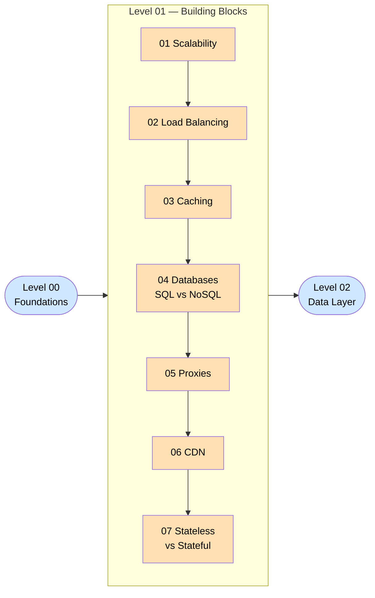

# Level 1 — Building Blocks

> **Theme:** The core LEGO bricks. Every large-scale system is assembled from these seven primitives. Master them here and every advanced topic clicks into place.

---

## 🎯 What You'll Be Able to Do After This Level

- Explain *why* a single server eventually breaks and what replaces it
- Choose the right load-balancing algorithm for a given traffic pattern
- Design a caching layer that avoids the classic pitfalls (stampedes, stale data)
- Pick SQL vs NoSQL — and defend the choice in an interview
- Distinguish a forward proxy from a reverse proxy without hesitation
- Describe how a CDN serves a file from the edge and what happens on a cache miss
- Recognize stateful bottlenecks in a design and know how to remove them

---

## 📋 Prerequisites

Complete **[Level 00 — Foundations](../Level-00-Foundations/README.md)** first, especially:

- [How the Internet Works](../Level-00-Foundations/03-How-the-Internet-Works/README.md)
- [Network Protocols](../Level-00-Foundations/04-Network-Protocols/README.md)
- [Latency, Throughput & Performance](../Level-00-Foundations/07-Latency-Throughput-Performance/README.md)

---

## 🗺️ Roadmap

---

## 📚 Topics

| # | Topic | One-Line Description |
|---|-------|----------------------|
| 01 | [Scalability](./01-Scalability/README.md) | How you grow a system from one server to millions of users |
| 02 | [Load Balancing](./02-Load-Balancing/README.md) | Spreading traffic across many servers so none gets overwhelmed |
| 03 | [Caching](./03-Caching/README.md) | Storing results of expensive work so you never repeat it |
| 04 | [Databases — SQL vs NoSQL](./04-Databases-SQL-vs-NoSQL/README.md) | Picking the right kind of database for the job |
| 05 | [Proxies](./05-Proxies/README.md) | Middlemen that stand between clients and servers — and why that's powerful |
| 06 | [CDN](./06-CDN/README.md) | Putting your content on servers closer to your users, worldwide |
| 07 | [Stateless vs Stateful](./07-Stateless-vs-Stateful/README.md) | Why services that remember nothing are easier to scale |

---

## ⏱️ Estimated Time

| Format | Time |
|--------|------|
| Read-through | 4–6 hours |
| Read + diagrams + notes | 8–10 hours |
| Read + practice questions | 12–15 hours |

---

## ➡️ What Comes Next

After finishing this level, head to **[Level 02 — Data Layer](../Level-02-Data-Layer/README.md)** to go deeper into databases: replication, sharding, indexing, and ACID transactions.
