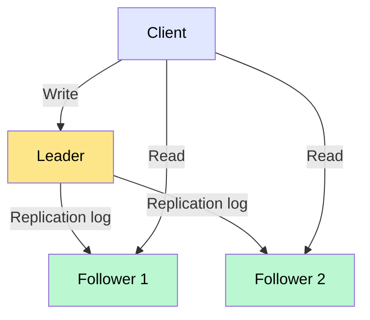
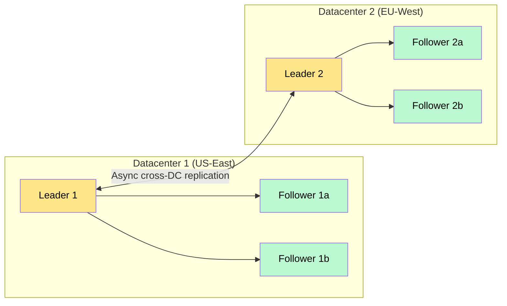
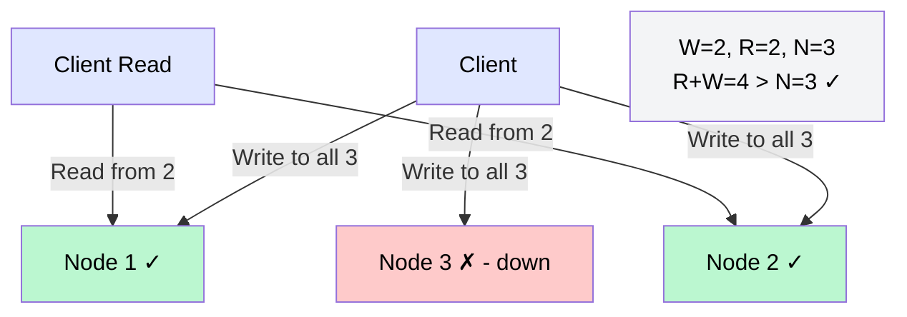
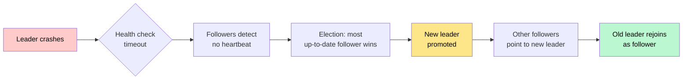

# Database Replication

> **Replication** is the practice of keeping copies of the same data on multiple machines so that the system survives failures, serves reads faster, and stays available.

**Level:** 2 · **Topic:** 1 · **Prerequisites:** [Scalability](../../Level-01-Building-Blocks/01-Scalability/README.md) · [Databases SQL vs NoSQL](../../Level-01-Building-Blocks/04-Databases-SQL-vs-NoSQL/README.md)

---

## 🎯 The Problem

You run a social network. Your single Postgres instance handles 50 000 reads/second. One morning a disk fails and the server crashes. Every user sees errors for 20 minutes while you restore from backup. Worse, your backup is 6 hours old — you just lost 6 hours of posts, likes, and messages.

Two distinct pain points:

1. **Durability** — if the only copy of data is on one disk, a hardware failure loses it.
2. **Availability & read throughput** — one machine can only handle so much; when it dies, everything dies.

Replication fixes both by keeping the same data on multiple nodes simultaneously.

---

## 🌍 Real-World Analogy

Think of a popular book in a library system. A single copy means one reader at a time and permanent loss if it's destroyed. The library solves this by keeping copies at multiple branches. One branch can burn down and the book still exists. Many readers can check it out simultaneously. The "main copy" at the central branch is the authoritative source; the branches sync new editions from it.

That's leader-follower replication.

---

## 🧠 Core Idea

Every replication scheme answers the same three questions:

1. **Who can accept writes?** One node (leader), multiple nodes (multi-leader), or any node (leaderless)?
2. **When does a follower become consistent with the leader?** Before the write is acknowledged (synchronous), or eventually (asynchronous)?
3. **What happens when a node fails?** How do you elect a new leader or route around the failure?

Let's walk through each topology.

---

## 📊 How It Works

### Topology 1 — Leader-Follower (Master-Slave)

The classic and most common model. One node is the **leader** (also called primary or master). All writes go to the leader. The leader records the change in a **replication log** and ships it to **followers** (replicas, secondaries). Followers apply the log in order and serve read queries.



*Caption: All writes hit the leader; followers replicate the log and serve reads.*

**Synchronous vs Asynchronous replication**

| Mode | Leader waits for…| Durability | Latency |
|------|-----------------|------------|---------|
| **Synchronous** | At least one follower to confirm write | High — follower has the data | Higher — write blocks on network round-trip |
| **Asynchronous** | Nobody — confirms to client immediately | Lower — follower may lag | Lower — faster writes |
| **Semi-synchronous** | Exactly one follower (others async) | Good balance | Moderate |

Most production systems use **semi-synchronous**: one synchronous follower guarantees you don't lose the latest write even if the leader dies; extra followers are async so they don't slow you down.

---

### Replication Lag and the Read-After-Write Problem

Because async followers can lag behind the leader by milliseconds to seconds, a user might write data and then read it back from a follower that hasn't caught up yet — they see stale data or, worse, their own write disappear.

```mermaid
sequenceDiagram
    participant User
    participant Leader
    participant Follower

    User->>Leader: POST /profile (update bio)
    Leader-->>User: 200 OK
    Note over Follower: Lag: follower hasn't replicated yet
    User->>Follower: GET /profile
    Follower-->>User: (old bio — write not visible yet!)

    style Leader fill:#fde68a,color:#000
    style Follower fill:#bbf7d0,color:#000
```

*Caption: A user updates their bio but immediately reads from a lagging follower — the update is invisible.*

**Solutions:**

- **Read-your-own-writes consistency:** always route a user's reads to the leader (or to the follower that has caught up) for a short window after they write.
- **Monotonic reads:** always route the same user to the same follower so at least their view never goes backward.
- **Bounded staleness:** reject reads from followers that are more than X seconds behind.

---

### Topology 2 — Multi-Leader (Multi-Master)

Multiple nodes can accept writes. Each leader replicates to the others. Common for **multi-datacenter** setups: each datacenter has its own leader so writes are low-latency locally.



*Caption: Each datacenter has its own leader; leaders sync asynchronously across the WAN.*

**The big problem:** **write conflicts**. If two leaders both accept writes to the same row simultaneously, you have a conflict. Conflict resolution strategies:

- **Last-write-wins (LWW):** the write with the higher timestamp wins. Simple but can silently discard data.
- **Application-level merge:** the app defines how to merge conflicting versions (CRDTs, custom logic).
- **Avoid conflicts:** route all writes for a given user/entity to the same leader.

---

### Topology 3 — Leaderless (Dynamo-Style)

Any node can accept a write. The client (or a coordinator node) sends the write to **multiple nodes in parallel** and waits for **W** acknowledgements. Reads also go to **multiple nodes** in parallel and require **R** consistent responses. If `R + W > N` (total replicas), you're guaranteed at least one node overlaps between read and write sets.



*Caption: With N=3, W=2, R=2: the write set and read set overlap by at least one node, guaranteeing you see the latest write.*

**Quorum math:**
- `N=3, W=2, R=2` → `R+W=4 > 3` ✅ strong consistency
- `N=3, W=1, R=1` → `R+W=2 ≤ 3` ❌ eventual consistency (faster but stale reads possible)
- `N=5, W=3, R=3` → `R+W=6 > 5` ✅ tolerates 2 node failures

Used by: Amazon Dynamo, Apache Cassandra, Riak.

**Anti-entropy & read repair:** stale nodes are eventually healed by background anti-entropy processes or by "read repair" — when a read detects an inconsistency across nodes, it writes the latest version back to the stale node.

---

### Failover and Leader Promotion

When the leader in a leader-follower setup crashes:



*Caption: Automated failover in a leader-follower cluster.*

**Risks during failover:**
- **Split-brain:** two nodes both think they're the leader. Writes diverge. Solution: fencing — the old leader is forcibly killed (STONITH) before the new leader is promoted.
- **Lost writes:** if async replication was used, the new leader may be missing the last few writes the old leader accepted. Systems like Postgres handle this with a "replication slot" to track exactly where each follower is.

---

## 🔧 Types / Variations / Strategies

| Topology | Writers | Best For | Weakness |
|----------|---------|----------|----------|
| Leader-Follower | 1 | Simple setups, read-heavy workloads | Leader is write bottleneck |
| Multi-Leader | Many | Multi-datacenter, offline apps | Write conflicts hard to resolve |
| Leaderless | Any | High availability, geo-distributed | Weaker consistency, complex quorum tuning |

| Replication Mode | Durability | Write Latency | Use When |
|-----------------|------------|---------------|----------|
| Synchronous | Highest | Highest | Financial data — must not lose a write |
| Semi-synchronous | High | Moderate | Default production setting |
| Asynchronous | Lower | Lowest | Analytics replicas, DR copies |

---

## 🏢 Real-World Examples

- **MySQL / Postgres** — classic leader-follower. Most web apps run one primary + 1–3 read replicas. Heroku Postgres uses this.
- **Amazon RDS Multi-AZ** — synchronous standby in a second availability zone; automatic failover in ~60–120 seconds.
- **Cassandra** — leaderless with tunable quorums; Netflix uses it for its global content metadata store (`N=3`, `W=1`, `R=1` for high availability with eventual consistency).
- **CockroachDB / Spanner** — Raft-based consensus replication across nodes; gives you strong consistency even in a distributed setting.
- **GitHub's MySQL setup** — uses semi-synchronous replication; failover is managed by Orchestrator.

---

## ⚖️ Trade-offs

| Pro | Con |
|-----|-----|
| Surviving hardware failures (durability) | More complex operational setup |
| Read scaling — spread reads across replicas | Replication lag causes stale reads |
| Low-latency reads from geographically close replica | Write conflicts in multi-leader |
| Faster failover than restore-from-backup | Split-brain risk if fencing is misconfigured |
| Follower can be used for backups without impacting leader | Storage cost multiplied by replica count |

---

## ✅ When to Use / ❌ When NOT to Use

**Use replication when:**
- You need high availability (uptime SLA > 99.9%).
- You have significantly more reads than writes (read replicas absorb the load).
- You're deploying across multiple datacenters.
- Backup/restore time from single-node is too slow for your RTO.

**Don't rely on replication alone when:**
- You need **horizontal write scaling** — replication copies the write to every node; sharding (Topic 02) splits writes across nodes.
- You have very low tolerance for stale reads — consider synchronous replication + read-your-own-writes, or just always read from the leader.
- The dataset won't fit on a single node — replication copies everything; sharding splits it.

---

## ⚠️ Common Pitfalls

1. **Assuming replication = backup.** A bug that deletes rows replicates instantly to all followers. Always maintain point-in-time backups separately.
2. **Ignoring replication lag in the application.** Code that writes then immediately reads from a replica will intermittently return stale data. Test this path explicitly.
3. **Underestimating split-brain.** Without proper fencing, two leaders will diverge silently. Use tools like Patroni (Postgres) or MHA (MySQL) that handle this.
4. **Over-counting read capacity.** Followers lag under heavy load — they can't always absorb 100% of reads if they're still catching up to the leader.
5. **Choosing `R=1, W=1` in Cassandra** for a "high availability" setup without realizing you've sacrificed consistency.

---

## 🎤 Interview Tips

- Always name the **three topologies** (leader-follower, multi-leader, leaderless) and when each is appropriate.
- When asked about "high availability," bring up **synchronous vs asynchronous** replication and the durability/latency trade-off.
- For **read-after-write consistency**, walk through: write to leader → async replicate → user reads from follower before replication completes. Then give the fix.
- Quorum formula `R + W > N` comes up often. Know it, derive it, give an example with numbers.
- DDIA Chapter 5 (Replication) is the go-to reference — mentioning you've read it signals seriousness.

---

## 📝 TL;DR

- Replication keeps copies of data on multiple nodes for durability, read scaling, and HA.
- **Leader-follower** is simplest: one writer, many readers. **Multi-leader** enables multi-DC writes. **Leaderless** (Dynamo/Cassandra) maximizes availability via quorums.
- Async replication is fast but causes **replication lag** — the read-after-write problem. Fix: route reads to the leader or use monotonic reads.
- `R + W > N` guarantees you'll always read the latest write in a leaderless system.
- Replication is **not** a backup; it's not horizontal write scaling (that's sharding).

---

## 🧪 Test Yourself

1. You write a post on Twitter. 200ms later you refresh and don't see it. What is this problem called and how would you fix it?
2. Your system uses `N=5, W=2, R=2`. Is this strongly or eventually consistent? What's the minimum W to guarantee strong consistency with this N and R?
3. A leader fails. Two followers both think the other is down and both promote themselves to leader. What is this called and how do you prevent it?
4. Why can't you replace sharding with replication to handle a 10 TB dataset that can't fit on one machine?
5. Multi-leader replication is popular for mobile apps that work offline (e.g., Google Docs offline mode). Why? What problem does it create?

---

## 📚 Further Reading

- **DDIA Chapter 5** — Replication (the definitive treatment; covers all three topologies in depth).
- [PostgreSQL Replication Docs](https://www.postgresql.org/docs/current/high-availability.html)
- [Cassandra Replication Strategy](https://cassandra.apache.org/doc/latest/cassandra/architecture/dynamo.html)
- [AWS RDS Multi-AZ vs Read Replicas](https://aws.amazon.com/rds/features/multi-az/)
- Next: [02 — Sharding and Partitioning](../02-Sharding-and-Partitioning/README.md)
