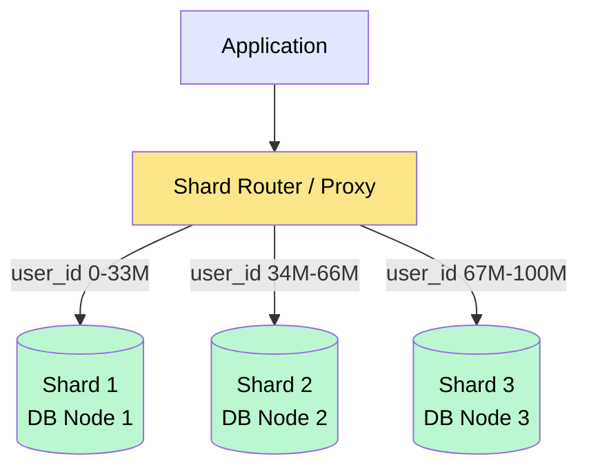
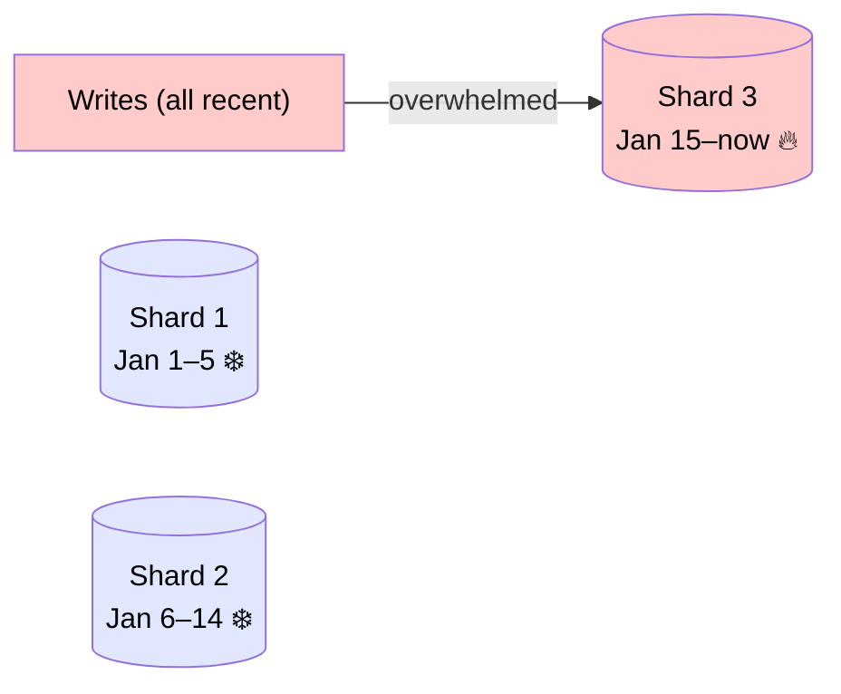
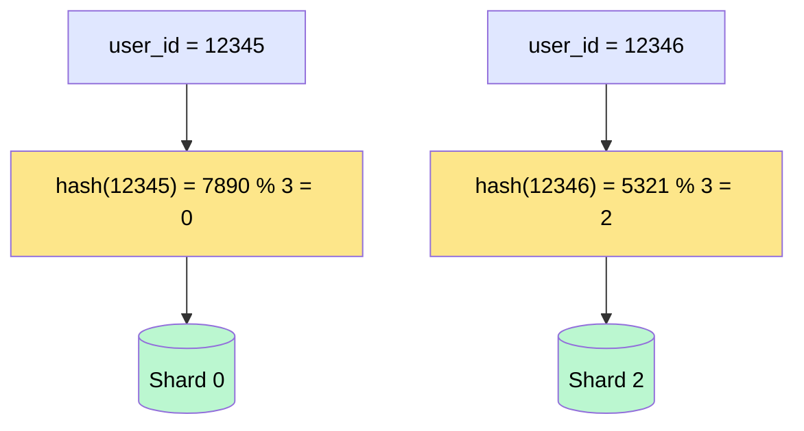
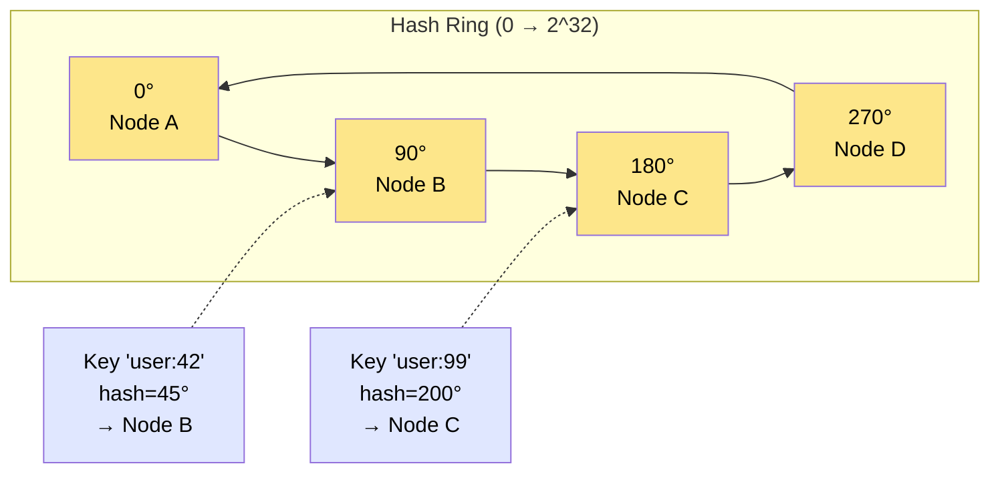

# Sharding and Partitioning

> **Sharding** (also called horizontal partitioning) is the technique of splitting a large dataset across multiple database nodes so that each node holds only a subset of the data, enabling the system to scale writes and storage beyond what a single machine can handle.

**Level:** 2 · **Topic:** 2 · **Prerequisites:** [Database Replication](../01-Database-Replication/README.md) · [Caching](../../Level-01-Building-Blocks/03-Caching/README.md)

---

## 🎯 The Problem

Your e-commerce platform has grown to 500 million users and 2 billion orders. Your single Postgres primary can't keep up:

- The database is 8 TB — it won't fit on any single affordable server.
- Write throughput has hit the ceiling at ~10 000 writes/second.
- Even with read replicas (Topic 01), they all have to replicate the full 8 TB dataset.

Replication copies the entire dataset to every node. That solves reads and availability — but it doesn't help when the dataset is too large or writes are too frequent. You need to **split** the data, not copy it.

---

## 🌍 Real-World Analogy

Imagine a phone book for a city of 10 million people. No single book can hold all the names legibly. The city splits it: one volume for A–F, another for G–M, another for N–Z. Each volume lives in a different library. When you want to look up "Johnson," you go straight to the G–M library — you never touch the other two. That's **range partitioning**.

Alternatively, the city assigns each person a number based on the last digit of their phone number and puts them in one of 10 buildings. This is **hash partitioning**.

---

## 🧠 Core Idea

Sharding has three moving parts:

1. **Partition key (shard key):** the field(s) used to decide which shard a row belongs to.
2. **Partitioning strategy:** the rule that maps a key to a shard.
3. **Routing layer:** the component that knows which shard holds which data and routes queries to the right place.

The goal: every query touches exactly one shard (or as few as possible).

---

## 📊 How It Works

### The Big Picture



*Caption: A shard router (or application-level logic) maps each request to the correct DB node based on the shard key.*

---

### Strategy 1 — Range Partitioning

Divide the key space into contiguous ranges. Each shard owns a range.

| Shard | Key Range |
|-------|-----------|
| Shard 1 | user_id 1 → 33 333 333 |
| Shard 2 | user_id 33 333 334 → 66 666 666 |
| Shard 3 | user_id 66 666 667 → 100 000 000 |

**Advantage:** range queries are efficient — "find all orders from Jan 1–15" hits one shard.

**Problem:** **hotspots**. If your key is a timestamp, all new writes go to the shard for "now" while older shards sit idle.



*Caption: Range partitioning by timestamp creates a "hot" shard for recent data while older shards are idle.*

---

### Strategy 2 — Hash Partitioning

Apply a hash function to the key; the result (mod N shards) determines the shard.

```
shard_id = hash(user_id) % N
```



*Caption: Hashing distributes writes evenly but makes range queries expensive (they'd hit all shards).*

**Advantage:** even distribution of writes — no hot shards.

**Problem:** range queries require hitting every shard ("scatter-gather"). Adding/removing shards requires rehashing most keys (see consistent hashing below).

---

### Strategy 3 — Consistent Hashing

A more sophisticated variant of hash partitioning used in distributed caches and leaderless databases (Dynamo, Cassandra). Nodes and keys are placed on a virtual **ring**. Each key is assigned to the nearest node clockwise on the ring. When a node is added or removed, only the keys between it and its predecessor move — roughly `1/N` of total keys.



*Caption: Keys map to the next node clockwise. Adding a node only migrates keys between it and its predecessor.*

See also: [Caching — Consistent Hashing](../../Level-01-Building-Blocks/03-Caching/README.md) for the caching context of this algorithm.

---

### Strategy 4 — Directory / Lookup Table

A separate service (directory) explicitly maps each key to its shard. Maximum flexibility — you can move individual users to different shards.

```
directory_service.lookup("user_id:42") → Shard 7
```

**Advantage:** no constraints on key distribution; easy rebalancing without rehashing.

**Problem:** the directory is a single point of failure and a potential bottleneck. Usually cached aggressively.

---

## 🔧 Types / Variations / Strategies

| Strategy | Distribution | Range Queries | Rebalancing Cost | Use When |
|----------|-------------|---------------|-----------------|----------|
| Range | Uneven (hotspot risk) | Cheap (1 shard) | Low | Time-series, ordered scans |
| Hash | Even | Expensive (all shards) | High (full rehash) | Random access, even load |
| Consistent Hash | Even | Expensive | Low (1/N keys move) | Distributed caches, DHTs |
| Directory | Manual | Depends on design | Very low | Need full control, infrequent rebalancing |

---

## 🏢 Real-World Examples

- **Instagram (PostgreSQL sharding):** sharded by `user_id` using a custom logical sharding layer on top of Postgres. 12 shards originally, then migrated to Citus (distributed Postgres extension).
- **Cassandra (consistent hashing):** each row's partition key is hashed onto a ring. Every cluster node owns a token range. Adding a node triggers a `nodetool repair` on just the affected range.
- **MongoDB (range + hash):** supports both range and hashed shard keys via the `mongos` router. The config server stores the chunk map (a form of directory service).
- **Discord (Cassandra):** stores billions of messages sharded by `(channel_id, bucket)` where `bucket = timestamp / 10_days`. The bucket prevents any single channel from creating unbounded partition growth.
- **Vitess (YouTube/GitHub):** a MySQL sharding middleware that handles routing, resharding, and query rewriting for horizontally scaled MySQL clusters.

---

## ⚖️ Trade-offs

| Pro | Con |
|-----|-----|
| Horizontal write scaling beyond one machine | Cross-shard queries (joins, aggregations) are slow or impossible |
| Dataset can exceed single-machine storage | Shard key choice is hard to change later |
| Failure of one shard affects only a subset of data | Uneven key distribution creates hotspots |
| Combine with replication for both scaling and HA | Transactions across shards require distributed transactions (expensive) |
| Lower index size per shard = faster queries | Operational complexity multiplied by shard count |

---

## ✅ When to Use / ❌ When NOT to Use

**Use sharding when:**
- Your dataset won't fit on a single node (storage ceiling).
- Write throughput has exceeded what a single primary can handle.
- You need true horizontal write scaling, not just read scaling.
- The access pattern is well-suited to a natural partition key (e.g., `user_id`, `tenant_id`).

**Don't shard when:**
- Your data fits comfortably on one server — sharding adds enormous complexity.
- Your access patterns require many cross-shard joins — you'll spend all your gains on scatter-gather.
- You haven't exhausted vertical scaling and caching yet — they're much simpler.
- You can't identify a good shard key — a bad key leads to hotspots that negate the benefits.

---

## ⚠️ Common Pitfalls

1. **Choosing the wrong shard key.** User activity is rarely uniform — some users (celebrities, viral content) generate orders of magnitude more reads/writes. A `user_id` shard for a social network means Justin Bieber's shard is 1000x hotter than average (the "celebrity problem"). Solutions: prefix the key with a random suffix or use a separate hot-user routing layer.

2. **Hot partition = single-shard bottleneck.** Even with hash sharding, if one key is queried millions of times per second, its shard becomes a bottleneck. This is different from uneven distribution — it's a single *key* that's hot. Cache these keys at the application layer.

3. **Cross-shard queries become scatter-gather.** `SELECT * FROM orders WHERE amount > 100` requires querying all shards and merging the results. Keep cross-shard queries rare or pre-compute aggregations.

4. **Resharding is painful.** Once live, changing the number of shards (or the shard key) requires moving data while the system is running. This is one of the most dangerous database operations. Plan your shard count with room to grow, or use consistent hashing / virtual shards that make rebalancing incremental.

5. **Foreign key constraints and joins across shards don't work.** SQL's referential integrity is per-database. Denormalize or move to an application-level integrity check.

---

## 🎤 Interview Tips

- Lead with: "Before I shard, I'd exhaust vertical scaling, caching, and read replicas — sharding is a last resort because it introduces enormous complexity."
- Name the **four strategies** and their trade-offs with a concrete example each.
- Always bring up the **hotspot problem** — interviewers want to know if you've thought about celebrity accounts / viral content.
- For system design questions involving user data (Twitter, Instagram), the natural shard key is usually `user_id` with hash partitioning + consistent hashing.
- Know that you can **combine replication + sharding**: each shard can itself be replicated for HA. This is how every production system operates.
- Reference DDIA Chapter 6 (Partitioning) — it covers range, hash, and secondary index partitioning comprehensively.

---

## 📝 TL;DR

- Sharding splits data across multiple nodes to scale storage and writes — unlike replication, which copies data to every node.
- **Partition key choice is the most critical decision** — it determines load distribution and query efficiency.
- **Range** = ordered, range-query friendly, hotspot risk. **Hash** = even distribution, no range queries. **Consistent hashing** = easy rebalancing. **Directory** = most flexible.
- Cross-shard joins, transactions, and resharding are the painful costs.
- The "celebrity problem" (single hot key) is different from overall imbalance — solve it with caching or key salting.

---

## 🧪 Test Yourself

1. Instagram shards by `user_id`. Beyoncé has 200 million followers. When she posts a photo, what problem does this create, and how would you mitigate it?
2. You have `N=4` shards using `hash(user_id) % 4`. You add a 5th shard. What fraction of your data needs to move? How would consistent hashing improve this?
3. A query `SELECT SUM(revenue) FROM orders WHERE created_at > '2024-01-01'` runs on a system sharded by `user_id`. What happens? What's a better approach?
4. What is a "virtual node" (vnode) in consistent hashing and why does Cassandra use them?
5. You're designing a chat app. Messages need to be retrieved by `(conversation_id, timestamp)`. What's your shard key and why?

---

## 📚 Further Reading

- **DDIA Chapter 6** — Partitioning (covers range, hash, secondary index partitioning in depth).
- [Vitess Overview](https://vitess.io/docs/overview/) — see how YouTube shards MySQL.
- [Cassandra Data Partitioning](https://cassandra.apache.org/doc/latest/cassandra/architecture/dynamo.html)
- [Discord — How Discord Stores Billions of Messages](https://discord.com/blog/how-discord-stores-billions-of-messages)
- Previous: [01 — Database Replication](../01-Database-Replication/README.md) · Next: [03 — Indexing](../03-Indexing/README.md)
