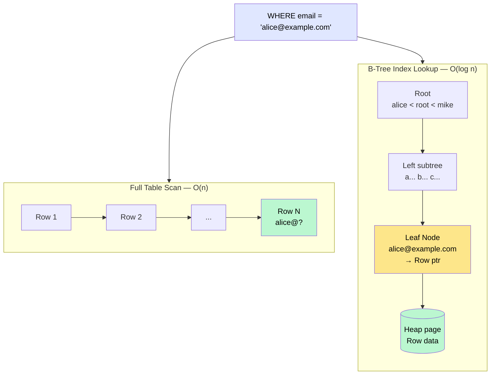
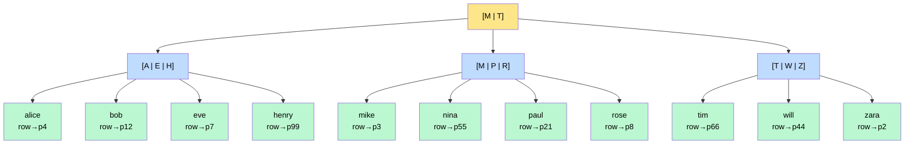

# Indexing

> An **index** is a separate data structure maintained by the database that maps key values to their row locations, allowing lookups to skip scanning the entire table.

**Level:** 2 · **Topic:** 3 · **Prerequisites:** [Sharding and Partitioning](../02-Sharding-and-Partitioning/README.md) · [Database Internals](../04-Database-Internals/README.md) *(can be read in parallel)*

---

## 🎯 The Problem

Your e-commerce site has a `users` table with 50 million rows. A customer calls support asking about their account. The support agent searches by email address:

```sql
SELECT * FROM users WHERE email = 'alice@example.com';
```

Without an index, the database reads **every single row** — all 50 million — to find the one that matches. On spinning disk this takes minutes. Even on NVMe SSDs, a full scan of 50M rows is measured in seconds. Your customers are waiting.

The fix is blindingly obvious in hindsight: maintain a sorted lookup structure on `email` so the database can jump directly to the right row. That's an index.

---

## 🌍 Real-World Analogy

A phone book is sorted alphabetically by last name. To find "Smith, John" you open roughly to the "S" section and scan a few pages — you do **not** read the entire book from page 1. The sorted order is the index.

A library catalog (card catalog or digital OPAC) is a secondary index: it maps from title/author/subject to a shelf location. The actual books (rows) live on shelves in acquisition order; the catalog is a separate structure that lets you find them by different attributes.

---

## 🧠 Core Idea

Every index involves a trade-off:

- **Reads get faster** — the database can find rows without a full scan.
- **Writes get slower** — every INSERT, UPDATE, DELETE must also update every index on the table.
- **Storage increases** — indexes take up disk space (sometimes as much as the table itself).

The database maintains indexes automatically once you declare them. The query optimizer decides whether to use an index for a given query — sometimes a full scan is actually faster (e.g., when you need most of the rows anyway).

---

## 📊 How It Works

### Full Table Scan vs Index Lookup



*Caption: Full scan reads every row (O(n)); a B-Tree index narrows the search to O(log n) by traversing tree levels.*

---

### The B-Tree Mental Model

Most relational database indexes (Postgres, MySQL InnoDB, SQL Server) use a **B-Tree** (balanced tree). Here's the key intuition:



*Caption: A B-Tree index on `name`. Finding "nina" takes 2 comparisons (root → B subtree → nina leaf), not 11 row reads.*

Key properties:
- **Balanced:** all leaf nodes are at the same depth, so lookup time is always O(log n).
- **Sorted:** range queries (`WHERE name BETWEEN 'alice' AND 'eve'`) are efficient — follow the tree to the start, then scan leaves sequentially.
- **Fan-out:** each internal node holds many keys (hundreds in practice). A B-Tree with fan-out 500 can index 500³ = 125 billion rows in 3 levels. Real tables almost never need more than 4 levels.
- In Postgres/InnoDB, each node = one disk page (typically 8 KB or 16 KB).

---

## 🔧 Types / Variations / Strategies

### Primary vs Secondary Index

| Type | Also Called | Points To | Example |
|------|------------|-----------|---------|
| **Primary index** | Clustered index (InnoDB), heap-organized (Postgres) | Determines physical row order | `id` column in InnoDB — the table *is* the B-Tree |
| **Secondary index** | Non-clustered index | Points to primary key or row pointer | Index on `email` — stores `email → row_id` |

In **InnoDB (MySQL)**, the primary key is the clustered index — rows are physically stored in primary key order. A secondary index lookup fetches from the secondary B-Tree, then does a second lookup into the primary B-Tree. This is called a **double-dip lookup** or **key lookup**.

In **Postgres**, the heap (table) stores rows in arbitrary order; all indexes (including the "primary key" index) are non-clustered B-Trees pointing to heap tuple IDs. A `CLUSTER` command physically reorders the heap once, but it doesn't stay sorted.

---

### Composite Index

An index on multiple columns: `CREATE INDEX idx ON orders (user_id, created_at)`.

The **leftmost prefix rule:** a composite index on `(A, B, C)` can efficiently serve queries that filter on:
- `A` alone
- `A` and `B`
- `A`, `B`, and `C`

But NOT `B` alone or `C` alone — those require a full scan of the index.

```
Index: (user_id, created_at)

✅ WHERE user_id = 42                    → uses index
✅ WHERE user_id = 42 AND created_at > X → uses index
❌ WHERE created_at > X                  → full scan (user_id is leading column, not filtered)
```

---

### Covering Index

A covering index includes all the columns a query needs, so the DB never has to visit the actual table rows — the index leaf node contains everything needed.

```sql
-- Query:
SELECT email, name FROM users WHERE email = 'alice@example.com';

-- Covering index (includes all selected columns):
CREATE INDEX idx_users_email_name ON users (email, name);
-- → DB reads only the index, never touches the heap rows. Much faster!
```

---

### Other Index Types

| Type | DB Support | Best For |
|------|-----------|----------|
| Hash index | Postgres (heap), MySQL Memory engine | Exact equality only (`=`); faster than B-Tree for equality, but no range |
| GIN (Generalized Inverted) | Postgres | Full-text search, JSONB, arrays |
| GiST | Postgres, PostGIS | Geometric/spatial data, fuzzy matching |
| Partial index | Postgres | `CREATE INDEX ON orders (user_id) WHERE status = 'pending'` — index only a subset |
| Expression index | Postgres | `CREATE INDEX ON users (LOWER(email))` — index a computed expression |
| Full-text index | MySQL FULLTEXT, Elasticsearch | Tokenized document search |

---

## 🏢 Real-World Examples

- **Postgres (any app):** adding `CREATE INDEX CONCURRENTLY ON users(email)` on a live 50M-row table. The `CONCURRENTLY` keyword builds it without locking the table. A query that took 12 seconds now returns in 0.3ms.
- **MySQL InnoDB (Shopify):** Shopify's product catalog tables use clustered primary keys by `shop_id` + `product_id` so all products for a shop are physically colocated — efficient for the common "list all products for shop X" query.
- **Elasticsearch:** built on Lucene, which uses inverted indexes (similar to GIN) for full-text search. Each field in a document is tokenized and indexed. A search for "running shoes" finds documents containing those tokens in milliseconds across billions of docs.
- **Cassandra:** secondary indexes in Cassandra are limited because data is already partitioned — a secondary index query broadcasts to all nodes. Cassandra recommends modeling data so the partition key handles the primary query; secondary indexes are a last resort.

---

## ⚖️ Trade-offs

| Pro | Con |
|-----|-----|
| Dramatically faster reads (O(log n) vs O(n)) | Every write must update all affected indexes — more I/O |
| Enables efficient range scans on sorted columns | Storage overhead — can be 20–100% of table size |
| Covering indexes eliminate table row access entirely | Too many indexes slow down INSERT/UPDATE/DELETE |
| Query optimizer can combine multiple indexes | Index maintenance during bulk loads must often be deferred |
| Partial indexes reduce index size for selective queries | Wrong index choice by optimizer can actually slow queries |

**The write amplification problem:** a table with 10 indexes means every row write causes 11 disk writes (1 to heap + 10 to indexes). On write-heavy workloads, too many indexes is as harmful as too few.

---

## ✅ When to Use / ❌ When NOT to Use

**Use an index when:**
- Columns appear in `WHERE`, `JOIN`, or `ORDER BY` clauses frequently.
- The column has high **cardinality** (many distinct values — `email`, `user_id`).
- You're filtering a small fraction of the table (< 10–20% of rows). Below that threshold, a full scan often wins because it's sequential I/O.
- The table is read-heavy relative to write-heavy.

**Don't add an index when:**
- The table is small (< 10 000 rows) — full scan is fine.
- The column has low cardinality (e.g., `status IN ('active', 'inactive')`). A bit-set scan or partial index may be better.
- You're doing bulk inserts — drop indexes, load data, rebuild.
- Writes outnumber reads significantly — each index slows every write.

---

## ⚠️ Common Pitfalls

1. **Indexing low-cardinality columns** like `gender` or `is_deleted`. An index on `is_deleted` where 90% of rows are `false` is useless — the optimizer will just skip it. Use a **partial index** instead: `CREATE INDEX ON users(id) WHERE is_deleted = true`.

2. **Violating the leftmost prefix rule** with composite indexes. If your common query is `WHERE created_at > X AND user_id = 42`, put `user_id` first in the composite index (the equality filter).

3. **Not using `EXPLAIN ANALYZE`** to verify the query plan. Adding an index doesn't guarantee the optimizer will use it. Always check with `EXPLAIN (ANALYZE, BUFFERS)` in Postgres or `EXPLAIN FORMAT=JSON` in MySQL.

4. **Index bloat.** Deleted rows leave behind dead index entries (especially in Postgres). Run `VACUUM ANALYZE` regularly. Bloated indexes slow down everything.

5. **Forgetting indexes on foreign keys.** In Postgres, a foreign key constraint doesn't automatically create an index. A `DELETE FROM users WHERE id = X` must check the `orders` table for references — without an index on `orders.user_id`, this does a full scan of `orders`.

---

## 🎤 Interview Tips

- Start every index discussion with the trade-off: **faster reads, slower writes, more storage**.
- Know the **leftmost prefix rule** cold — it comes up in almost every "optimize this query" question.
- Mention **covering indexes** as the gold standard — "I want the query to never touch the heap."
- When asked "why is this query slow?", your first instinct should be `EXPLAIN ANALYZE` and look for `Seq Scan` where you expect `Index Scan`.
- If someone asks about full-text search, pivot to inverted indexes (Elasticsearch/Lucene) rather than trying to do it with B-Trees.
- DDIA Chapter 3 (Storage and Retrieval) covers B-Trees and LSM-Trees — the most important chapter for understanding indexes at depth.

---

## 📝 TL;DR

- An index is a sorted data structure that enables O(log n) lookups vs O(n) full scans.
- Most DB indexes use **B-Trees**: balanced, sorted, with ~3–4 levels for billion-row tables.
- **Composite indexes** follow the leftmost prefix rule. **Covering indexes** eliminate heap access entirely.
- Every index speeds reads but **slows writes** and consumes storage — don't over-index.
- Low cardinality, small tables, and write-heavy workloads are bad candidates for indexing.
- Always verify with `EXPLAIN ANALYZE` — the optimizer may not use your index.

---

## 🧪 Test Yourself

1. You have an index on `(last_name, first_name, age)`. Which of these queries will use the index efficiently?
   - `WHERE last_name = 'Smith'`
   - `WHERE first_name = 'John'`
   - `WHERE last_name = 'Smith' AND age > 30`
   - `WHERE last_name = 'Smith' AND first_name = 'John' AND age = 35`
2. Your `orders` table has 200 million rows. The column `status` has three values: `'pending'`, `'shipped'`, `'delivered'`. 2% of rows are `pending`. You often query `WHERE status = 'pending'`. What type of index would you create and why?
3. A Postgres table with 10 indexes is experiencing slow INSERT performance (8 000 writes/second vs expected 50 000). What's likely happening? What would you do?
4. What is the difference between a clustered and non-clustered index? Which does Postgres use by default?
5. You `EXPLAIN ANALYZE` a query and see `Seq Scan on users (cost=0.00..12000 rows=500000)` even though you have an index on the column being filtered. What might cause the optimizer to ignore your index?

---

## 📚 Further Reading

- **DDIA Chapter 3** — Storage and Retrieval (B-Trees and LSM-Trees explained from first principles).
- [Postgres Documentation: Indexes](https://www.postgresql.org/docs/current/indexes.html)
- [Use The Index, Luke](https://use-the-index-luke.com/) — a free, database-agnostic guide to SQL indexes.
- [MySQL EXPLAIN Output Format](https://dev.mysql.com/doc/refman/8.0/en/explain-output.html)
- Previous: [02 — Sharding and Partitioning](../02-Sharding-and-Partitioning/README.md) · Next: [04 — Database Internals](../04-Database-Internals/README.md)
