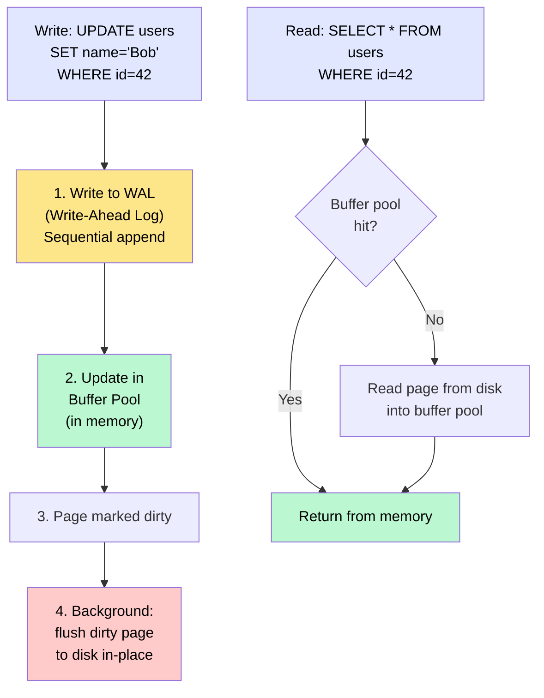
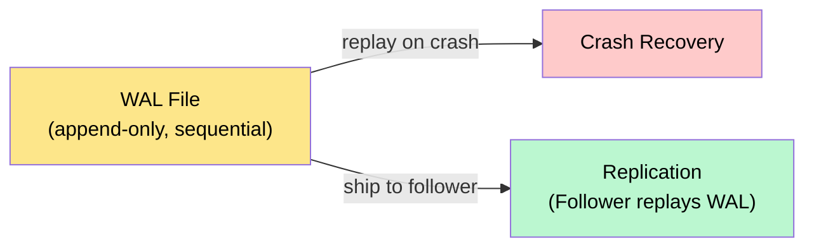
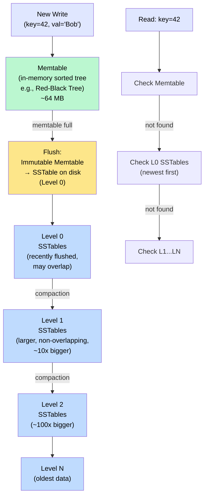
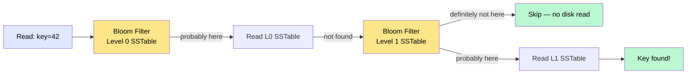
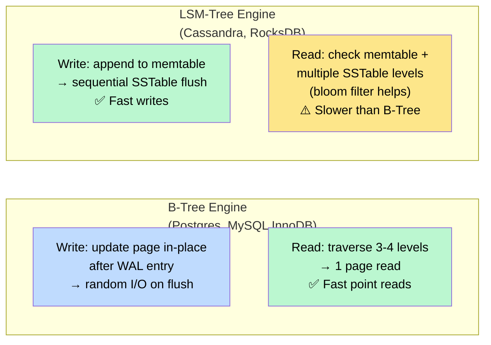

# Database Internals

> Databases use two fundamentally different storage engine designs — **B-Tree** (read-optimized) and **LSM-Tree** (write-optimized) — each making different trade-offs in how data is laid out on disk, how updates are applied, and how reads and writes are amplified.

**Level:** 2 · **Topic:** 4 · **Prerequisites:** [Indexing](../03-Indexing/README.md)

---

## 🎯 The Problem

You're choosing between Postgres and Cassandra for a new service. Both are databases. Both scale. But one inserts 50 000 rows/second with ease while the other struggles at 5 000. The other returns consistent sub-millisecond point lookups while its competitor needs to check multiple files on disk. Why? The difference is almost entirely in the **storage engine** — the component that decides how data gets written to and read from disk.

Understanding storage engines helps you:
- Choose the right database for your workload.
- Explain *why* Cassandra handles writes better than Postgres under high throughput.
- Understand replication logs (WAL) from the previous topic.
- Reason about compaction pauses, write amplification, and read amplification.

---

## 🌍 Real-World Analogy

**B-Tree:** A filing cabinet with labeled dividers. Every file has an exact slot. Finding a file is fast — go to the right drawer, right divider, done. But inserting a file in the middle of a packed drawer requires shuffling everything to make room (expensive random I/O).

**LSM-Tree:** A journalist's inbox. New notes go into an in-memory notebook (fast!). When the notebook is full, it's sealed and filed. Later, a background process merges old sealed notebooks into a single sorted archive. Finding a note might require checking the current notebook, then the recent archives, then the old archives.

---

## 🧠 Core Idea

The core tension in storage engines is between:

- **Random I/O** (B-Trees update data in-place on disk — expensive)
- **Sequential I/O** (LSM-Trees always append and merge — cheaper for magnetic disks and SSDs)

Modern SSDs blur this gap, but the sequential-append advantage of LSM-Trees still matters at very high write rates because it also reduces **write amplification** (the ratio of bytes written to disk vs bytes written by the application).

---

## 📊 How It Works

### Engine 1 — B-Tree (Used by Postgres, MySQL InnoDB, SQLite, SQL Server)

B-Trees store data in sorted, fixed-size pages. Updates happen **in-place** on the page that contains the key.

*Caption: B-Tree writes first go to the WAL (sequential, safe), then update the in-memory buffer pool. Pages are flushed to their fixed disk locations asynchronously.*

**Write-Ahead Log (WAL):**
Before any page is modified in the buffer pool, the change is **first** written to the WAL — a sequential, append-only log file. If the server crashes before the dirty page is flushed to disk, the WAL is replayed on restart to bring the database back to a consistent state. "Write-ahead" means the log always leads the actual data file.

The WAL is also the mechanism behind replication (Topic 01): Postgres ships its WAL stream to followers, who replay it.

*Caption: The WAL serves dual duty — crash recovery and replication.*

**B-Tree read/write amplification:**
- **Write amplification:** a single row update may require reading an entire 8 KB page into the buffer pool, modifying a few bytes, and writing the full 8 KB page back. Also updates every index. Total amplification: 10–30x on write-heavy workloads.
- **Read amplification:** typically 1 read (the page containing the key). B-Trees are excellent for reads.

---

### Engine 2 — LSM-Tree (Log-Structured Merge Tree)

Used by: **Cassandra, RocksDB** (used by Facebook, TiKV, CockroachDB), **LevelDB, HBase, InfluxDB**.

LSM-Trees never update data in place. They always **append** new writes to an in-memory buffer, then flush sorted batches to disk, then periodically merge and compact files in the background.

*Caption: Writes flow from memtable → Level-0 SSTables → deeper levels via compaction. Reads must check multiple levels.*

**Key components:**

- **Memtable:** an in-memory sorted structure (usually a balanced BST or skip list). All writes go here first — it's fast because it's RAM.
- **SSTable (Sorted String Table):** immutable, sorted file on disk. Once written, never modified. New writes for the same key create a new SSTable entry; the old one becomes a "tombstone" or is superseded by version.
- **Compaction:** background process that merges SSTables, removes deleted entries (tombstones), and organizes data into levels. This is what makes future reads efficient.
- **Bloom filter:** a probabilistic structure attached to each SSTable. A read checks the bloom filter first: if it says "key definitely not here," skip this SSTable. Reduces unnecessary disk reads dramatically.

*Caption: Bloom filters prevent unnecessary disk reads for SSTables that don't contain the key.*

**LSM-Tree read/write amplification:**
- **Write amplification:** during compaction, data is rewritten multiple times across levels. Amplification is typically 10–30x, similar to B-Trees in practice, but writes are always sequential (better for SSDs and HDD throughput).
- **Read amplification:** a read may check the memtable + multiple levels of SSTables. Bloom filters reduce this significantly, but worst-case is O(levels). Point reads are slower than B-Trees; range scans are reasonably efficient within a level.

---

### Side-by-Side Comparison

*Caption: B-Trees excel at reads; LSM-Trees excel at writes. Choose based on your workload's read/write ratio.*

---

## 🔧 Types / Variations / Strategies

| Property | B-Tree | LSM-Tree |
|----------|--------|----------|
| **Write pattern** | Random I/O (in-place update) | Sequential I/O (append-only) |
| **Read performance** | Excellent — O(log n) to one page | Good — bloom filter + level check |
| **Write throughput** | Moderate | Very high |
| **Write amplification** | Medium (10–30x) | Medium–High (but sequential) |
| **Read amplification** | Low (1 disk access) | Medium (multi-level check) |
| **Space amplification** | Low (in-place overwrites) | Higher (stale entries until compaction) |
| **Compaction pauses** | None | Yes — background compaction uses I/O |
| **Crash recovery** | WAL replay | WAL replay + redo from memtable |
| **Databases** | Postgres, MySQL, SQLite, SQL Server | Cassandra, RocksDB, HBase, LevelDB |

**Compaction strategies in LSM-Trees:**
- **Leveled compaction (LevelDB/RocksDB default):** data is organized into levels; each level is ~10x larger. Non-overlapping within a level. Better read performance, higher write amplification.
- **Size-tiered compaction (Cassandra default):** when enough same-size SSTables accumulate, merge them into one larger SSTable. Better write performance, worse read performance and space amplification.

---

## 🏢 Real-World Examples

- **Postgres (B-Tree + WAL):** used by Shopify, GitHub, Instagram. The WAL is shipped to standbys for replication (Topic 01). `pg_wal` directory grows rapidly under write load — monitor it.
- **RocksDB (LSM-Tree):** embedded storage engine used by Facebook's `MyRocks` (MySQL with RocksDB backend, uses 50% less storage than InnoDB), TiKV (TiDB's storage layer), and CockroachDB.
- **Cassandra (LSM-Tree, leveled or size-tiered compaction):** Netflix's global metadata store. Handles millions of writes/second by appending to memtables and flushing SSTables. Compaction runs in the background — Netflix tunes compaction strategy per table.
- **LevelDB / RocksDB (Google/Facebook):** LevelDB was created at Google for Chrome's IndexedDB storage. Facebook forked it as RocksDB and optimized it heavily for SSD workloads.
- **SQLite (B-Tree):** the most widely deployed database in the world (every Android phone, iOS app, browser). Uses a B-Tree for both tables and indexes, with WAL mode for concurrency.

---

## ⚖️ Trade-offs

| Pro B-Tree | Con B-Tree |
|-----------|-----------|
| Excellent read performance | Slower writes due to random I/O |
| Predictable latency | Write amplification (every write updates the page + WAL) |
| Mature, well-understood | B-Tree pages can get fragmented ("bloat") over time |
| Simple point-in-time recovery via WAL | Autovacuum/VACUUM needed (Postgres) to reclaim dead tuples |

| Pro LSM-Tree | Con LSM-Tree |
|-------------|-------------|
| Very high write throughput | Compaction pauses can cause latency spikes |
| Sequential writes → SSDs love it | Higher read amplification (multi-level checks) |
| Efficient space usage after compaction | Higher space amplification before compaction |
| Natural fit for time-series, append-heavy workloads | Tombstones — deleted keys aren't immediately removed |

---

## ✅ When to Use / ❌ When NOT to Use

**Use B-Tree engines (Postgres, MySQL InnoDB) when:**
- Your workload is read-heavy or balanced (OLTP: banking, e-commerce, user management).
- You need strong ACID transactions (Topic 05).
- Low, predictable read latency is critical.
- Range queries and sorted scans are common.

**Use LSM-Tree engines (Cassandra, RocksDB) when:**
- Write throughput is the primary constraint (IoT sensors, logging, metrics, time-series).
- You can tolerate eventual consistency (Cassandra is eventually consistent by default).
- You're doing mostly point reads or time-range reads on a single partition key.
- You need to store very large datasets that would overwhelm a B-Tree with write amplification.

---

## ⚠️ Common Pitfalls

1. **Ignoring compaction in Cassandra.** If you never compact, your read performance degrades progressively as more SSTables accumulate per key. Monitor `SSTable count per partition` — when it climbs above ~20–30, trigger a manual compaction.

2. **Postgres WAL bloat.** Replication slots in Postgres hold WAL segments until the replica consumes them. If a replica falls behind (or is deleted but the slot isn't), WAL fills the disk and crashes the primary. Monitor `pg_replication_slots` and set `max_slot_wal_keep_size`.

3. **Cassandra tombstone storms.** In LSM-Trees, deletes are written as "tombstones" — a marker saying "this key was deleted." If tombstones accumulate faster than compaction removes them (heavy delete workloads), reads become very slow because they must scan all tombstones. Design Cassandra schemas to minimize deletes.

4. **Assuming RocksDB = Cassandra.** RocksDB is an embedded storage engine (like SQLite); Cassandra is a full distributed database that happens to use an LSM-Tree design. Know the distinction.

5. **Choosing by popularity, not workload.** Postgres is excellent but not ideal for 1M writes/second. Cassandra is excellent but painful for ACID transactions. Match the engine to the access pattern.

---

## 🎤 Interview Tips

- When asked "how does a database store data?", the answer is "it depends on the storage engine: B-Tree or LSM-Tree — let me walk you through both."
- Lead with the **WAL** for crash recovery — interviewers love durability questions.
- Know the terms: **memtable, SSTable, compaction, bloom filter, write amplification, read amplification**.
- DDIA Chapter 3 (Storage and Retrieval) is the canonical treatment. Read the first half (B-Trees) and second half (LSM-Trees + SSTables) and you'll be ahead of 95% of candidates.
- Connect storage engines to the bigger picture: LSM-Trees' append-only nature is why Cassandra replicates so efficiently — the SSTable logs are easy to ship and replay.

---

## 📝 TL;DR

- **B-Tree engines** (Postgres, MySQL): update in-place after WAL. Great reads, moderate writes. Predictable latency. The WAL is the crash recovery and replication mechanism.
- **LSM-Tree engines** (Cassandra, RocksDB): append to memtable → flush to SSTables → compact. Great writes, slightly slower reads mitigated by bloom filters. Compaction pauses are a concern.
- Both write to a **WAL** first for crash durability.
- **Write amplification** (B-Tree: random I/O per update; LSM: compaction rewrites) and **read amplification** (LSM: multi-level checks) are the key costs to understand.
- Choose B-Tree for OLTP / read-heavy; LSM-Tree for high-write-throughput / time-series / analytics.

---

## 🧪 Test Yourself

1. What is the Write-Ahead Log and why does every database need one?
2. Cassandra is handling 500 000 writes/second with ease. What aspect of its storage engine design makes this possible?
3. A Cassandra table is experiencing very slow reads on partitions that have had many updates and deletes. What is likely happening and how do you fix it?
4. In an LSM-Tree, a DELETE doesn't actually remove the data immediately. How are deletes represented and when is the data actually removed?
5. Facebook switched their MySQL tables from InnoDB to RocksDB and reportedly used 50% less storage. Why would an LSM-Tree use less space than a B-Tree for the same data?

---

## 📚 Further Reading

- **DDIA Chapter 3** — Storage and Retrieval (the most important chapter in the book for this topic).
- [RocksDB Overview (Facebook Engineering)](https://engineering.fb.com/2013/11/21/core-infra/the-history-of-rocksdb/)
- [Cassandra Architecture — Storage Engine](https://cassandra.apache.org/doc/latest/cassandra/architecture/storage-engine.html)
- [PostgreSQL — WAL Internals](https://www.postgresql.org/docs/current/wal-internals.html)
- [LevelDB Implementation Notes](https://github.com/google/leveldb/blob/main/doc/impl.md)
- Previous: [03 — Indexing](../03-Indexing/README.md) · Next: [05 — ACID and Transactions](../05-ACID-and-Transactions/README.md)
