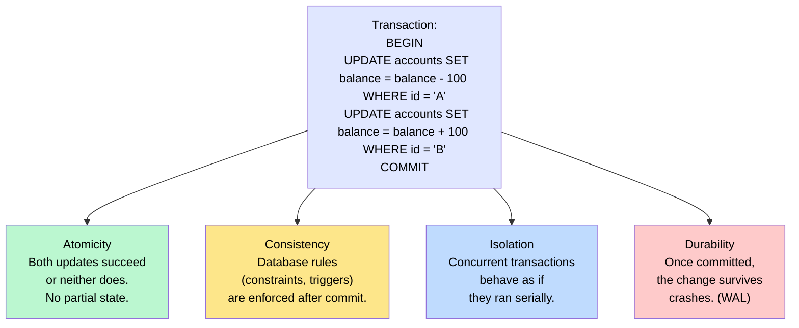
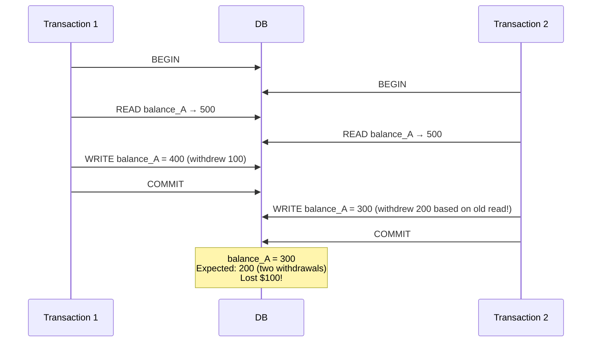
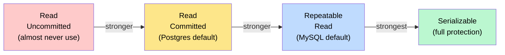
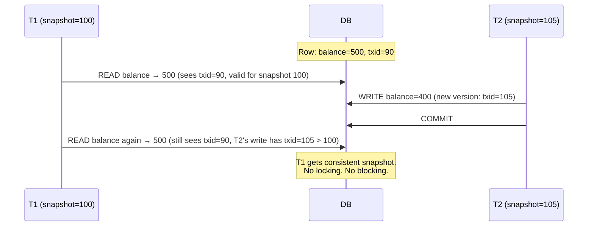

# ACID and Transactions

> A **transaction** is a group of database operations that succeed or fail together as a single unit; **ACID** (Atomicity, Consistency, Isolation, Durability) is the set of guarantees that make transactions safe to use in concurrent, failure-prone systems.

**Level:** 2 · **Topic:** 5 · **Prerequisites:** [Database Internals](../04-Database-Internals/README.md) · [Database Replication](../01-Database-Replication/README.md)

---

## 🎯 The Problem

You're building an online bank. A user transfers $100 from Account A to Account B. This takes two steps:

1. `UPDATE accounts SET balance = balance - 100 WHERE id = 'A';`
2. `UPDATE accounts SET balance = balance + 100 WHERE id = 'B';`

What happens if the server crashes between step 1 and step 2? Account A has $100 less but Account B never received it. Money disappeared. The bank is liable.

What if two transfers happen simultaneously — someone else also withdraws from Account A at the same instant? Both transactions might read the same starting balance and think there's enough money, then both deduct, leaving Account A overdrawn.

Transactions with ACID guarantees solve both problems.

---

## 🌍 Real-World Analogy

Think of an ATM transaction. When you withdraw cash:
- Either the cash dispenses AND your balance decreases — or neither happens (**Atomicity**).
- The bank's rules (no negative balances) are enforced (**Consistency**).
- Your transaction doesn't interfere with simultaneous withdrawals from another ATM (**Isolation**).
- Once the machine prints a receipt, the deduction is permanent even if the bank's servers restart (**Durability**).

---

## 🧠 Core Idea

ACID is four separate guarantees that work together. Understanding each independently first, then seeing how they interact under concurrency, is the key to this topic.

---

## 📊 How It Works

### The Four Properties

*Caption: Each ACID property addresses a different failure mode. Isolation is the most nuanced and the most often misunderstood.*

**Atomicity** is implemented via the WAL (Topic 04): if a crash happens mid-transaction, the WAL log is replayed on restart, and any uncommitted transaction is rolled back. "All or nothing."

**Consistency** is largely an application-level concern: the DB enforces constraints (NOT NULL, UNIQUE, foreign keys), but it's the developer's job to define what "consistent" means for their domain.

**Durability** = the WAL again. A committed transaction's WAL record is fsynced to disk before the commit acknowledgement is sent to the client.

**Isolation** is the hard one. Let's go deep.

---

### Isolation: The Concurrency Problem

Without isolation, concurrent transactions can interfere in nasty ways. These interferences are called **anomalies**.

*Caption: The "lost update" anomaly — both transactions read the same value, then both write back, and T1's write is silently overwritten by T2.*

---

### The Three Classic Anomalies (and a fourth)

**1. Dirty Read:** T1 reads data written by T2 before T2 commits. If T2 rolls back, T1 has read data that never existed.

**2. Non-Repeatable Read:** T1 reads a row. T2 updates and commits that row. T1 reads the same row again — different value. The same read within one transaction returns different results.

**3. Phantom Read:** T1 queries "all accounts with balance > 1000" — gets 3 results. T2 inserts a new account with balance 5000 and commits. T1 re-runs the same query — gets 4 results. A "phantom" row appeared.

**4. Write Skew:** T1 and T2 both read a shared condition, both decide it's safe to write, and both write — but the combined result violates a constraint neither checked against. Classic example: two doctors both check "is there at least one on-call doctor?" — both see yes, both go off-call. Now zero doctors are on call.

---

### Isolation Levels

SQL defines four standard isolation levels, each preventing different anomalies at different performance costs.

| Isolation Level | Dirty Read | Non-Repeatable Read | Phantom Read | Write Skew |
|----------------|:----------:|:-------------------:|:------------:|:----------:|
| **Read Uncommitted** | ✅ possible | ✅ possible | ✅ possible | ✅ possible |
| **Read Committed** | ❌ prevented | ✅ possible | ✅ possible | ✅ possible |
| **Repeatable Read** | ❌ prevented | ❌ prevented | ✅ possible* | ✅ possible |
| **Serializable** | ❌ prevented | ❌ prevented | ❌ prevented | ❌ prevented |

*MySQL InnoDB's Repeatable Read also prevents phantom reads via gap locks.*

*Caption: Isolation levels form a spectrum — stronger levels prevent more anomalies but at higher performance cost.*

**Practical defaults:**
- **Postgres:** Read Committed (prevents dirty reads but not non-repeatable reads or phantoms).
- **MySQL InnoDB:** Repeatable Read (also prevents phantom reads via gap locks).
- **Oracle, SQL Server:** Read Committed with MVCC.

---

### Locking vs MVCC

Two mechanisms implement isolation:

**Pessimistic Locking (traditional):**
- Before reading, acquire a shared lock. Before writing, acquire an exclusive lock.
- Other transactions block until the lock is released.
- Prevents anomalies but causes contention and deadlocks.

**MVCC — Multi-Version Concurrency Control (Postgres, MySQL InnoDB, Oracle):**
- Writers never block readers; readers never block writers.
- Every row has a version. When a transaction starts, it gets a **snapshot ID** (transaction ID in Postgres).
- Reads see the latest version that was committed *before this snapshot*. New writes by concurrent transactions are invisible.
- Old versions are cleaned up by background vacuuming (Postgres: `AUTOVACUUM`; InnoDB: purge thread).

*Caption: MVCC allows T1 to see a consistent snapshot even though T2 committed a new value in between. No locks needed for reads.*

---

### Serializable: The Strongest Level

**Serializable** isolation guarantees that the result of concurrent transactions is equivalent to some serial execution. Two implementations:

- **Two-Phase Locking (2PL):** acquire all locks before releasing any. Prevents all anomalies but high contention.
- **SSI — Serializable Snapshot Isolation (Postgres ≥9.1):** tracks "read-write dependencies" between transactions. No additional locking — only aborts transactions that would create a cycle (rare). Close to the performance of Snapshot Isolation with full Serializable guarantees.

---

### BASE — The Alternative to ACID

In highly distributed systems (like Cassandra or DynamoDB with default settings), strict ACID is often relaxed in favor of **BASE**:

| ACID | BASE |
|------|------|
| **A**tomicity | **B**asically Available |
| **C**onsistency | **S**oft state |
| **I**solation | **E**ventually consistent |
| **D**urability | |

BASE systems prioritize availability and partition tolerance (→ CAP Theorem in [Level 04](../../Level-04-Distributed-Systems/01-CAP-Theorem/README.md)) over strict consistency. A Cassandra write with `W=1` is "basically available" and "eventually consistent" — all replicas will eventually agree, but you might read stale data immediately after a write.

---

## 🔧 Types / Variations / Strategies

| Level | What It Prevents | DB Default? | Cost |
|-------|-----------------|-------------|------|
| Read Uncommitted | Nothing | Rarely (some MySQL configs) | Minimal overhead |
| Read Committed | Dirty reads | Postgres ✅ | Low overhead (no read locks) |
| Repeatable Read | Dirty + non-repeatable reads | MySQL InnoDB ✅ | Medium (snapshot or shared read locks) |
| Serializable | All anomalies including phantoms, write skew | Almost never | High (serialization conflicts, potential aborts) |

---

## 🏢 Real-World Examples

- **Stripe (Postgres, Serializable for money):** Stripe uses Postgres with Serializable isolation for financial transactions where double-charges or lost updates would be catastrophic.
- **PostgreSQL MVCC:** Postgres is famous for readers never blocking writers. This is why high-read systems (web apps) run smoothly even under concurrent writes.
- **MySQL InnoDB (most web apps):** Repeatable Read is the MySQL default. Django, Rails, Laravel all build on this. Gap locks prevent phantom reads but can cause deadlocks.
- **DynamoDB / Cassandra (BASE):** No multi-item transactions by default; each write is eventually consistent. DynamoDB added ACID transactions in 2018 (`TransactWriteItems`) but they're more expensive.
- **Google Spanner:** achieves Serializable isolation at global scale using TrueTime (atomic clocks) and the Paxos consensus algorithm — one of the most impressive engineering feats in database history.

---

## ⚖️ Trade-offs

| Pro Strong Isolation | Con Strong Isolation |
|---------------------|---------------------|
| Correct, predictable behavior under concurrency | Lower throughput (contention, aborts) |
| Eliminates entire classes of bugs (lost updates, phantom reads) | Higher latency per transaction |
| Simpler application code (no manual conflict detection) | Deadlocks possible with pessimistic locking |
| Required for financial, inventory, booking systems | Serializable can abort and retry transactions |

| Pro BASE / Eventual Consistency | Con BASE |
|--------------------------------|---------|
| Very high throughput and availability | Application must handle stale reads |
| No coordination overhead between nodes | Write conflicts must be detected and resolved |
| Scales globally without latency penalties | Some anomalies impossible to avoid without app-level logic |

---

## ✅ When to Use / ❌ When NOT to Use

**Use strong isolation (Serializable / Repeatable Read) when:**
- Money, inventory, or reservation systems — lost updates or phantom reads have real-world consequences.
- You need "read a value, compute on it, write back" patterns (read-modify-write loops).
- Correctness matters more than maximum throughput.

**Drop to weaker isolation / BASE when:**
- You're recording events, logs, or metrics where eventual consistency is fine.
- Each write is independent (no read-modify-write dependency).
- You're building social features where stale likes/follower counts are acceptable.
- You need global distribution and can handle application-level conflict resolution.

---

## ⚠️ Common Pitfalls

1. **Assuming "the default" is safe.** Postgres Read Committed doesn't prevent non-repeatable reads or write skew. For a booking system that checks seat availability before purchasing, Read Committed can double-book. Use `SELECT ... FOR UPDATE` or Serializable.

2. **SELECT … FOR UPDATE forgotten.** The most common ACID bug: `SELECT balance WHERE id=X` (no lock), `UPDATE balance WHERE id=X` (write lock too late). Another transaction modified the balance between the two statements. Always use `SELECT ... FOR UPDATE` when you plan to write based on what you read.

3. **Long-running transactions.** A transaction open for 30 minutes in Postgres holds its MVCC snapshot. Every row version created after the snapshot start must be kept (can't be vacuumed). This causes "table bloat" and kills performance. Never leave transactions open across user interactions or network calls.

4. **Deadlocks.** Two transactions each hold a lock the other needs. Postgres and MySQL detect deadlocks and abort one transaction (the "victim"). Your application must retry on deadlock. Always acquire locks in a consistent order to reduce deadlock frequency.

5. **Thinking BASE = broken.** Eventual consistency isn't wrong — it's a deliberate trade-off. Cassandra's eventual consistency is correct for its contract; it just requires understanding what you're signing up for (stale reads, conflict handling).

---

## 🎤 Interview Tips

- Spell out each letter of ACID with a one-sentence definition — don't rush. Interviewers want to see you actually understand each one, not just recite the acronym.
- Know the **four anomalies** (dirty read, non-repeatable read, phantom read, write skew). The write skew example with on-call doctors is a classic.
- Explain **MVCC** as "readers don't block writers, writers don't block readers — each transaction sees a snapshot." It's why Postgres is popular for web apps.
- When discussing distributed systems, connect to **BASE** and CAP Theorem. "Cassandra sacrifices I (isolation) and C (consistency) for A (availability) — it's BASE, not ACID."
- DDIA Chapter 7 (Transactions) is the single most important chapter for this topic. The section on write skew and the on-call doctor example is famous.

---

## 📝 TL;DR

- **ACID:** Atomicity (all-or-nothing), Consistency (rules enforced), Isolation (concurrent = serial result), Durability (committed = permanent).
- **Isolation** is the hardest part. Weaker levels allow dirty reads, non-repeatable reads, phantom reads, and write skew.
- **MVCC** (Postgres, InnoDB) lets readers and writers coexist without blocking each other by giving each transaction a snapshot.
- **Serializable** is the strongest isolation; SSI achieves it with minimal overhead in Postgres.
- **BASE** (Basically Available, Soft state, Eventually consistent) is the distributed alternative to ACID — used by Cassandra, DynamoDB at default settings.
- Real-world default: Postgres uses Read Committed; MySQL InnoDB uses Repeatable Read.

---

## 🧪 Test Yourself

1. Two users simultaneously try to book the last seat on a flight. Your code: `SELECT available_seats WHERE flight_id=X` (returns 1), then `UPDATE ... SET available_seats = 0`. What isolation level could still allow both to succeed? What's the fix?
2. What is the difference between a non-repeatable read and a phantom read? Give a concrete example of each.
3. Why does Postgres need AUTOVACUUM and what happens if it's disabled?
4. Describe write skew using a bank scenario (not the on-call doctor example). What isolation level prevents it?
5. Why does DynamoDB's default "eventually consistent" mode sometimes return stale data immediately after a write?

---

## 📚 Further Reading

- **DDIA Chapter 7** — Transactions (the definitive treatment of isolation levels and MVCC).
- [PostgreSQL — Transaction Isolation](https://www.postgresql.org/docs/current/transaction-iso.html)
- [MySQL InnoDB — Transaction Model](https://dev.mysql.com/doc/refman/8.0/en/innodb-transaction-model.html)
- [A Critique of ANSI SQL Isolation Levels](https://www.microsoft.com/en-us/research/wp-content/uploads/2016/02/tr-95-51.pdf) (the seminal paper — includes write skew).
- Previous: [04 — Database Internals](../04-Database-Internals/README.md) · Next: [06 — Connection Pooling](../06-Connection-Pooling/README.md)
