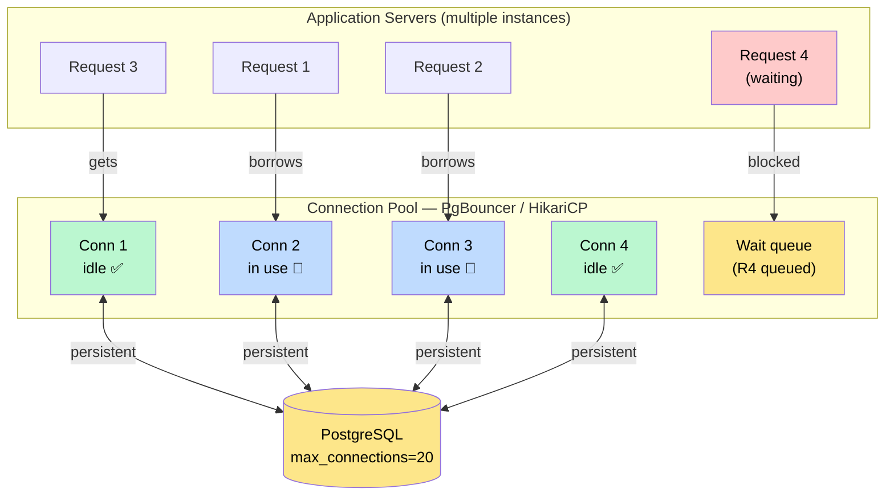
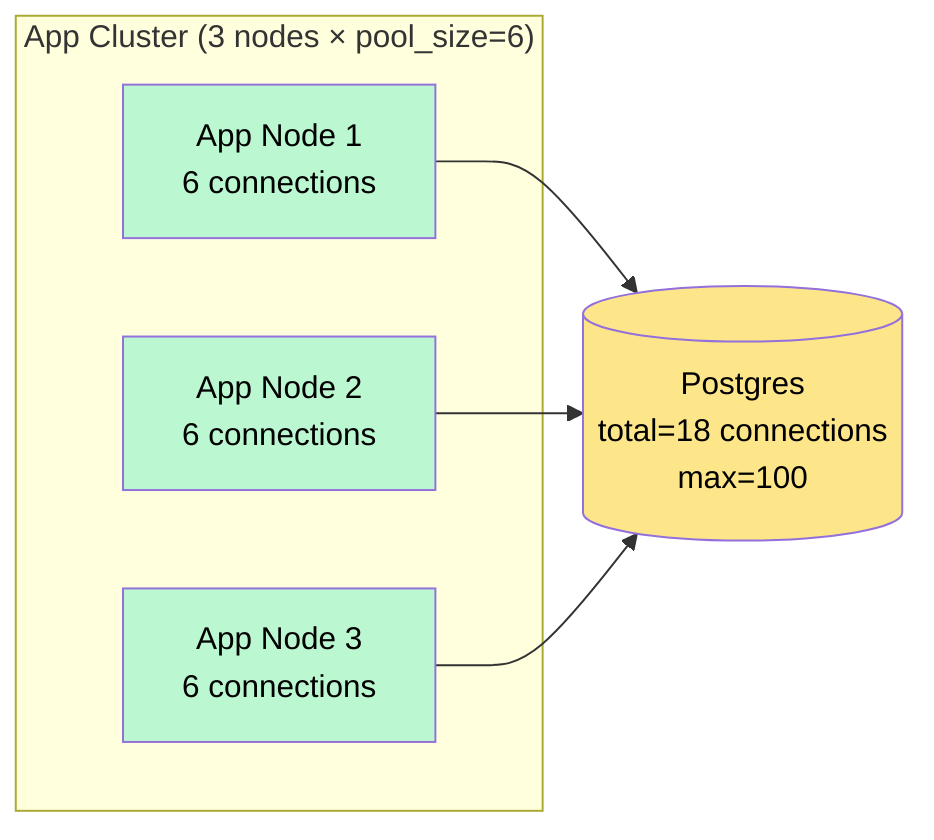
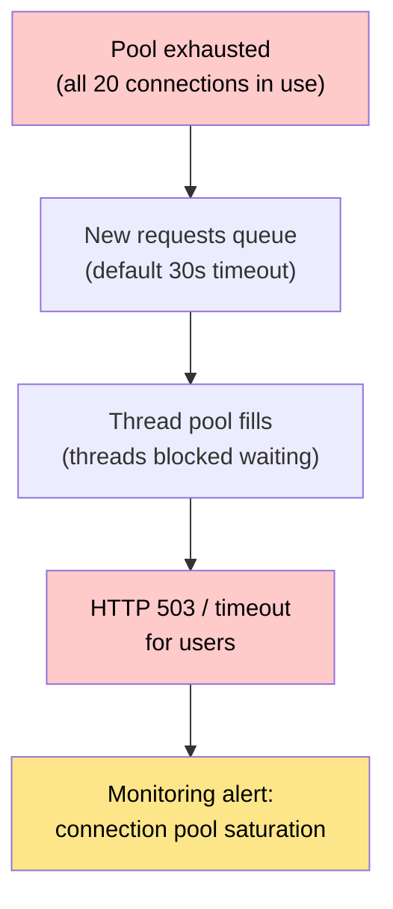

# Connection Pooling

> A **connection pool** is a cache of pre-established database connections that applications reuse across requests, eliminating the per-request overhead of opening a new connection each time.

**Level:** 2 · **Topic:** 6 · **Prerequisites:** [ACID and Transactions](../05-ACID-and-Transactions/README.md)

---

## 🎯 The Problem

Your API server handles 10 000 HTTP requests per second. Each request executes one SQL query. Naively, each request opens a database connection, runs the query, and closes the connection.

Opening a Postgres connection costs:
- **TCP handshake:** ~1ms round-trip
- **TLS negotiation (if enabled):** ~3–5ms
- **Postgres authentication** (password hash, pg_hba.conf check): ~2–5ms
- **Process fork on Postgres side:** Postgres spawns one OS process per connection (~5–10 MB RAM each)

Total overhead: **~5–10ms per connection open**, plus the Postgres server consuming ~10 MB RAM per connection. At 10 000 requests/second you'd need 10 000 simultaneous connections — that's 100 GB of RAM on the DB server just for connection overhead. Postgres's default `max_connections = 100` means your app will be refused connections almost immediately.

Connection pooling solves this by reusing connections across many requests.

---

## 🌍 Real-World Analogy

Think of a taxi company. Without pooling: every customer calls for a new taxi, which is manufactured from scratch, driven to them, used once, then destroyed. Obviously insane.

With a taxi fleet (connection pool): a fixed number of taxis exist. Customers queue for the next available taxi, use it briefly, then return it to the fleet for the next customer. Manufacturing overhead happens once at fleet creation.

The pool is the fleet. Each "taxi" is a database connection. Customers are your application's requests.

---

## 🧠 Core Idea

1. At application startup, open **N connections** to the database. These stay open indefinitely.
2. When a request needs the database, it **borrows** a connection from the pool.
3. The request uses the connection to run its queries.
4. When done, the request **returns** the connection to the pool (does not close it).
5. The next request immediately gets a ready-to-use connection — zero handshake overhead.

The pool manages the lifecycle: creating new connections up to `max_pool_size`, validating idle connections periodically (e.g., `SELECT 1`), and destroying connections that have exceeded a max lifetime.

---

## 📊 How It Works

### The Pool Architecture



*Caption: The pool holds a small number of persistent DB connections. Many app requests share them. Request 4 waits because all connections are busy.*

---

### Pool Sizing Math

Getting pool size right is critical. Too small: requests wait (latency spikes). Too large: you overwhelm the database.

A widely-used rule of thumb from the HikariCP documentation:

```
pool_size = (core_count * 2) + effective_spindle_count
```

For a database server with 8 CPU cores and SSDs (spindle_count ≈ 1):
```
pool_size = (8 * 2) + 1 = 17 connections
```

Why so small? Databases are I/O bound, not CPU bound, during query execution. More connections than the CPU can handle simultaneously just create context-switching overhead. Empirical data from HikariCP shows that a Postgres server with 8 cores handles throughput optimally with ~17–20 connections, even under thousands of concurrent app requests.

For a 3-node app cluster, each node would have:
```
per_node_pool_size = total_pool / node_count = 17 / 3 ≈ 6 connections per node
```

**Total connections that hit Postgres:**
```
total = app_node_count × per_node_pool_size = 3 × 6 = 18
```

This stays comfortably under Postgres's default `max_connections = 100`.



*Caption: 3 app nodes × 6 connections each = 18 total Postgres connections. Plenty of headroom below max_connections=100.*

---

### What Happens When the Pool Is Exhausted

When all connections are busy and a new request arrives, it waits in a queue. Pool libraries have a `connection_timeout` (HikariCP default: 30 seconds). If no connection becomes available within this timeout, the request receives an exception: `HikariPool connection is not available, request timed out after 30000ms`.

This cascades:
1. Requests pile up in the queue.
2. Each waiting request consumes a thread (in thread-per-request servers).
3. Thread pool exhausted → HTTP 503s.
4. Service is effectively down despite the database being healthy.



*Caption: Pool exhaustion cascades into application-level outage even when the database itself is healthy.*

**Fixes:**
- Reduce pool contention: optimize slow queries so connections are held for less time.
- Increase pool size (carefully — don't exceed DB capacity).
- Add a connection proxy like PgBouncer to multiplex further.
- Use async query patterns so threads aren't blocked waiting for pool slots.

---

## 🔧 Types / Variations / Strategies

### Pooling Modes (PgBouncer)

PgBouncer is a lightweight Postgres-specific connection pooler that sits between your app and Postgres. It supports three pooling modes:

| Mode | Connection Held Until… | Session Features | Use When |
|------|------------------------|-----------------|----------|
| **Session pooling** | Client disconnects | All (prepared stmts, SET vars) | Default; safest |
| **Transaction pooling** | Transaction COMMIT/ROLLBACK | Limited (no SET/prepared stmts per session) | High concurrency; most popular |
| **Statement pooling** | Each statement | Very limited | Rarely used; only single-statement workloads |

**Transaction pooling** is the sweet spot: a PgBouncer pool of 20 Postgres connections can serve thousands of app clients because each Postgres connection is only held for the duration of one transaction (~1–10ms).

### Popular Pooling Libraries

| Tool | Language / Layer | Pooling Type | Notes |
|------|-----------------|--------------|-------|
| **PgBouncer** | External proxy (any language) | Session / Transaction / Statement | The Postgres standard; Heroku, Supabase use it |
| **HikariCP** | Java (JDBC) | Connection pool | "Zero overhead" pool; Spring Boot default |
| **pgpool-II** | External proxy | Connection + load balancing | Also handles read/write splitting |
| **SQLAlchemy Pool** | Python | Connection pool | Built into SQLAlchemy; configurable |
| **node-postgres (pg)** | Node.js | Connection pool | `pg.Pool` class; async-friendly |
| **prisma** | Node.js/TypeScript | Connection pool | Built-in pool; Prisma Accelerate for serverless |

---

## 🏢 Real-World Examples

- **Heroku Postgres:** every Heroku Postgres plan comes with PgBouncer via the "connection string" add-on. Without it, the basic plan allows only 25 connections — not enough for a busy app.
- **Supabase:** uses PgBouncer in transaction mode between app connections and Postgres. Allows thousands of simultaneous Supabase clients while holding only ~20 Postgres connections.
- **Airbnb (HikariCP + Postgres):** Airbnb's Java services use HikariCP. They published findings showing pool size of ~10 per service instance was optimal — consistent with the `core_count * 2 + 1` formula.
- **Shopify (ProxySQL for MySQL):** Shopify runs ProxySQL in front of MySQL, which handles connection pooling plus read/write splitting (routing reads to replicas automatically).
- **PlanetScale / Neon:** serverless database platforms handle connection pooling internally so that each serverless function invocation doesn't need its own persistent connection.

---

## ⚖️ Trade-offs

| Pro | Con |
|-----|-----|
| Eliminates per-request connection overhead (~5–10ms) | Pool adds a software layer — one more thing to configure and monitor |
| Reduces RAM usage on DB server dramatically | Pool exhaustion can cascade into total service outage |
| Enables many app instances to share few DB connections | Transaction pooling mode limits session features (SET, LISTEN, prepared stmts) |
| Smoother traffic absorption — pool queues bursts | Pool size misconfiguration causes either starvation or DB overload |
| Validates idle connections, catches stale conn problems | Debugging is harder — "which connection am I on?" is opaque |

---

## ✅ When to Use / ❌ When NOT to Use

**Use connection pooling when:**
- You have any persistent app server (traditional servers, containers, long-lived processes).
- Request rate is high enough that per-connection overhead matters (> ~100 req/sec).
- Multiple app instances all need to share a limited DB connection budget.
- You're using Postgres (especially — it's process-per-connection model demands pooling).

**Connection pooling is harder when:**
- **Serverless functions (AWS Lambda, Vercel Edge Functions):** each invocation might be a fresh process with no persistent state. The pool can't live between invocations. Solutions: external pooler (PgBouncer, PlanetScale, Neon, Supabase), or managed connection proxies like AWS RDS Proxy.
- **Long-lived transactions:** if your app holds a transaction open for seconds (waiting on user input), it occupies a pool slot the entire time. Never hold transactions across user interactions.

---

## ⚠️ Common Pitfalls

1. **Setting pool size too large.** More connections ≠ more throughput. Beyond the optimal size, you add OS scheduler overhead and Postgres process memory. The `(core_count * 2) + 1` formula exists for a reason — trust it before tuning.

2. **Not monitoring pool wait time.** The most important metric is not pool size — it's `pool_wait_time` (how long requests wait for a connection). If this is consistently > 0, your pool is undersized or your queries are too slow.

3. **Serverless + connection pools = connection exhaustion.** Lambda functions each spin up their own pool. 500 concurrent Lambda invocations × 10 connections each = 5 000 connections to Postgres. Use RDS Proxy or PlanetScale, which are designed for this.

4. **Not handling `connection_timeout` exceptions.** When the pool is exhausted, your code gets an exception. Most ORMs/libraries retry, but application code should also handle this gracefully — return HTTP 503 rather than 500, and alert.

5. **Ignoring idle connection validation.** A connection that has been idle for 10 minutes may have been dropped by a firewall. The pool must validate idle connections with a `testQuery` or keepalive before handing them to requests, or you'll get unexpected `connection closed` errors.

---

## 🎤 Interview Tips

- Open with: "Without pooling, each request incurs 5–10ms of connection overhead and Postgres allocates ~10 MB RAM per connection. At scale this kills you."
- Know the **three PgBouncer modes** and why transaction mode is the most popular despite its limitations.
- Mention the **`(core_count * 2) + 1` formula** — it signals you know empirical pool sizing, not just theory.
- Address the **serverless problem** proactively — it's a common follow-up. "Lambda functions can't share a pool across invocations; you need an external pooler like RDS Proxy."
- Connect pool exhaustion to the cascade failure pattern: pool full → threads blocked → thread pool full → 503s.

---

## 📝 TL;DR

- Opening a DB connection costs 5–10ms and significant RAM (Postgres: ~10 MB/connection). Connection pools eliminate this by reusing connections.
- Pool holds N persistent connections. Requests borrow and return them. No re-authentication, no TCP handshake.
- Optimal pool size is small: `(core_count * 2) + 1`. More connections beyond this hurts performance.
- Pool exhaustion cascades: all connections busy → threads blocked → service outage. Monitor pool wait time.
- Serverless functions can't use traditional in-process pools — use RDS Proxy, PgBouncer, or managed databases (Supabase, Neon) that handle pooling externally.

---

## 🧪 Test Yourself

1. Your Postgres server has 4 CPU cores. What's the ideal pool size according to the standard formula? If you have 5 app nodes, how many connections does each get?
2. PgBouncer in transaction pooling mode is running. A developer writes code that does `SET search_path TO myschema` inside a transaction, then relies on that setting persisting for a subsequent query. What goes wrong and why?
3. An AWS Lambda function queries RDS Postgres. After deploying a change, you see Postgres rejecting connections with "FATAL: remaining connection slots are reserved." What is happening and how do you fix it?
4. Your API latency p99 suddenly spikes from 50ms to 3000ms. CPU and memory on both app and DB servers look normal. `pool_wait_time` jumps from 0ms to 2800ms. What happened and what's your first debugging step?
5. Why can't you simply set `max_connections = 10000` on Postgres to avoid pool exhaustion entirely?

---

## 📚 Further Reading

- [HikariCP — About Pool Sizing](https://github.com/brettwooldridge/HikariCP/wiki/About-Pool-Sizing) — the definitive pool sizing guide with benchmarks.
- [PgBouncer Documentation](https://www.pgbouncer.org/usage.html)
- [AWS RDS Proxy](https://aws.amazon.com/rds/proxy/) — managed connection pooler for serverless.
- [Supabase — Connection Pooling](https://supabase.com/docs/guides/database/connection-pooling)
- Previous: [05 — ACID and Transactions](../05-ACID-and-Transactions/README.md) · Next: [07 — Data Modeling](../07-Data-Modeling/README.md)
