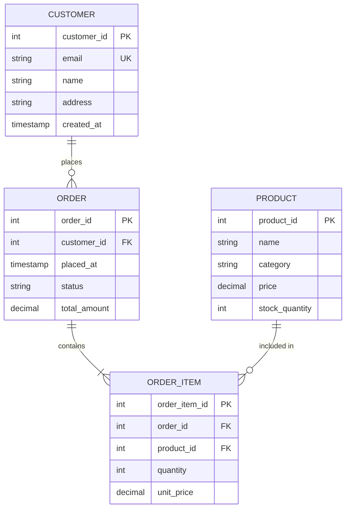
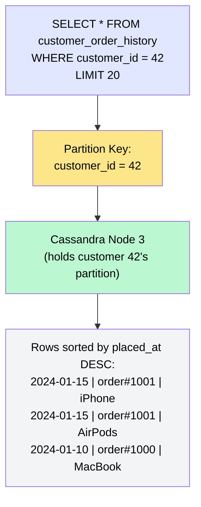
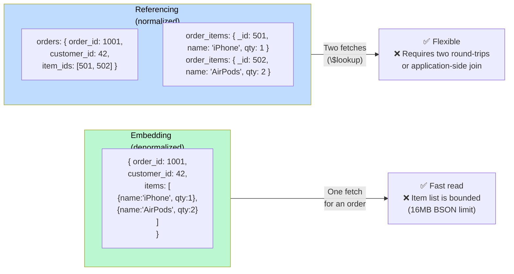

# Data Modeling

> **Data modeling** is the process of deciding how to structure and organize your data — what tables/collections/documents to create, what fields they contain, and how entities relate to each other — driven by the queries your application needs to serve efficiently.

**Level:** 2 · **Topic:** 7 · **Prerequisites:** [Indexing](../03-Indexing/README.md) · [Sharding and Partitioning](../02-Sharding-and-Partitioning/README.md)

---

## 🎯 The Problem

You're building an e-commerce platform. You need to store customers, orders, order items, and products. A junior developer creates five normalized tables with perfect foreign keys. The main page query to show a customer's order history requires joining five tables — and it takes 2 seconds. A senior developer at a company using Cassandra creates a single denormalized table per query pattern and serves the same data in 2 milliseconds.

Both schemas store the same data. The difference is entirely in how the data is modeled for the access pattern.

Data modeling is where design meets reality. A wrong model costs you months of painful migrations later.

---

## 🌍 Real-World Analogy

**Normalization** is like a tidy office: each piece of information lives in exactly one place. The phone number is in the contact book. If it changes, you update one record. But answering "what's Alice's phone number?" requires looking in the contact book. Answering "what did Alice order last Tuesday from which vendor with what phone number?" requires checking four different files.

**Denormalization** is like a sticky note on the desk with everything you frequently need: Alice, Tuesday, Vendor X, +1-555-1234. Redundant but instantly readable. If Alice's phone changes, you have to update every sticky note she's on.

The art is knowing when to normalize (correctness, flexibility) and when to denormalize (read performance, query simplicity).

---

## 🧠 Core Idea

The guiding principle shifts between relational (SQL) and non-relational (NoSQL) databases:

- **SQL / Relational:** "Model your data. Define entities, relationships, and constraints. Queries are flexible because JOINs work."
- **NoSQL / Document / Wide-column:** "**Model your queries, not your data.** Know your access patterns first, then design the schema around them. JOINs don't exist — structure data so a single partition key fetches everything."

---

## 📊 How It Works

### E-Commerce Worked Example

Let's design the data model for an e-commerce system with: Customers, Products, Orders, and Order Items.

#### Step 1 — Entity Relationship Diagram



*Caption: Normalized ER diagram for e-commerce. Each entity has one home. Relationships are expressed as foreign keys.*

This is the **normalized** SQL model. Let's walk through normalization formally.

---

### Normalization: 1NF → 3NF

**First Normal Form (1NF):** Each column holds atomic (indivisible) values. No repeating groups.

```
❌ Violates 1NF:
orders(order_id, customer_name, items="product_a:2,product_b:1")
→ items column stores multiple values

✅ 1NF:
orders(order_id, customer_name)
order_items(order_id, product_id, quantity)
```

**Second Normal Form (2NF):** Must be in 1NF. Every non-key attribute depends on the *entire* primary key (no partial dependencies). Matters for composite keys.

```
❌ Violates 2NF (composite key = order_id + product_id):
order_items(order_id, product_id, quantity, product_name)
→ product_name depends on product_id alone, not the full composite key

✅ 2NF:
order_items(order_id, product_id, quantity)
products(product_id, product_name)
```

**Third Normal Form (3NF):** Must be in 2NF. No transitive dependencies (non-key columns depend only on the primary key, not on other non-key columns).

```
❌ Violates 3NF:
orders(order_id, customer_id, customer_email, customer_city)
→ customer_city depends on customer_email, not order_id directly

✅ 3NF:
orders(order_id, customer_id)
customers(customer_id, email, city)
```

**Result:** 3NF is the standard target for OLTP databases. Data lives in one place; updates don't create inconsistencies.

---

### The SQL Query for Order History

```sql
SELECT
    o.order_id,
    o.placed_at,
    o.total_amount,
    p.name AS product_name,
    oi.quantity,
    oi.unit_price
FROM orders o
JOIN order_items oi ON o.order_id = oi.order_id
JOIN products p ON oi.product_id = p.product_id
WHERE o.customer_id = 42
ORDER BY o.placed_at DESC
LIMIT 20;
```

This query joins three tables and works beautifully in Postgres with proper indexes on `orders(customer_id, placed_at)` and `order_items(order_id)`.

---

### Denormalization: When Reads > Correctness

If this order history query runs 10 000 times/second and joins are too slow, you denormalize:

```
order_history (denormalized, optimized for read)
--------------------------------------------------
customer_id | order_id | placed_at | product_name | quantity | unit_price | total_amount
42          | 1001     | 2024-01-15| iPhone 15    | 1        | 999.00     | 999.00
42          | 1001     | 2024-01-15| AirPods      | 2        | 199.00     | 999.00
```

Now the query is `SELECT * FROM order_history WHERE customer_id = 42 ORDER BY placed_at DESC LIMIT 20` — a single table, single index, no joins. But if a product's name changes, you must update every row in `order_history` that references it.

**The denormalization trade-off:**

| Normalized | Denormalized |
|-----------|-------------|
| Single source of truth | Faster reads (no joins) |
| Updates are simple | Updates are complex (update all copies) |
| More flexible queries | Schema locked to specific queries |
| More storage-efficient | Higher storage cost |

---

### NoSQL Data Modeling: Access-Pattern-First

In **Cassandra** (wide-column) or **MongoDB** (document), you design *per query*, not per entity. Let's model the order history query for Cassandra.

**Cassandra table for "customer order history":**

```
CREATE TABLE customer_order_history (
    customer_id  INT,
    placed_at    TIMESTAMP,
    order_id     UUID,
    product_name TEXT,
    quantity     INT,
    unit_price   DECIMAL,
    PRIMARY KEY (customer_id, placed_at, order_id)
) WITH CLUSTERING ORDER BY (placed_at DESC, order_id ASC);
```

- `customer_id` = **partition key** → determines which Cassandra node holds the data.
- `placed_at, order_id` = **clustering columns** → sort order within the partition.
- Query: `SELECT * FROM customer_order_history WHERE customer_id = 42 LIMIT 20;` — hits one node, one partition, returns sorted results with zero joins.



*Caption: Cassandra routes by partition key to one node. All order history for customer 42 is co-located and sorted.*

**The golden rule in Cassandra:** for each query pattern, create a dedicated table. If you need both "orders by customer" and "orders by product", create two tables and write to both.

---

### MongoDB: Embedding vs Referencing

In MongoDB (document DB), you choose between **embedding** documents and **referencing** them.



*Caption: Embedding = faster reads but duplicated data and bounded size. Referencing = normalized but requires multiple fetches.*

**Embed when:**
- The embedded documents are always accessed with the parent (order items with order).
- The embedded list is bounded and small (< 100 items).
- The embedded data is not shared across parents.

**Reference when:**
- The sub-document has an independent lifecycle (a product exists without an order).
- The list is unbounded (a user's followers list — could be millions).
- The same document is referenced by many parents.

---

### One-to-Many and Many-to-Many

| Relationship | SQL approach | MongoDB approach | Cassandra approach |
|-------------|-------------|-----------------|-------------------|
| **1:many** (order → items) | Foreign key on child table | Embed items array in order doc | Composite primary key (order_id, item_id) |
| **many:many** (orders ↔ products) | Junction table (order_items) | Array of references on one side | Separate table per query direction |
| **1:1** (user → profile) | Foreign key or same table | Embed profile in user doc | Same partition key, different clustering columns |

---

## 🔧 Types / Variations / Strategies

| Approach | Best For | Avoid When |
|----------|----------|------------|
| **Normalized (3NF)** | OLTP, data integrity, flexible queries | Very high-read workloads needing many JOINs |
| **Denormalized** | Read-heavy, fixed access patterns | Frequent updates to duplicated fields |
| **Document (embedded)** | Hierarchical, self-contained documents | Many-to-many relationships, large sub-lists |
| **Wide-column (Cassandra)** | Time-series, high-write, known queries | Ad-hoc queries, complex filtering |
| **Graph (Neo4j)** | Relationship-heavy (social, fraud detection) | Tabular / non-relationship-centric data |

---

## 🏢 Real-World Examples

- **Amazon (DynamoDB — single-table design):** many Amazon services use a single DynamoDB table where different entity types coexist, differentiated by their partition key prefix (`USER#42`, `ORDER#1001`). This is the extreme of access-pattern-driven modeling.
- **Twitter (Cassandra):** the timeline feature is a classic denormalized model. When you follow someone, their tweets are *pre-written* into your personal timeline partition. Reading your feed is a single Cassandra partition read — instant. Writing a tweet causes fan-out writes to all followers' timelines.
- **Shopify (MySQL with Rails):** uses well-normalized SQL with ActiveRecord. Shopify has heavily invested in indexing and query optimization to make normalized SQL scale to millions of merchants.
- **MongoDB Atlas (document model):** e-commerce product catalogs benefit from embedding variant attributes (color, size) directly in the product document — each product has a flexible schema without needing joins.

---

## ⚖️ Trade-offs

| Normalized SQL | Denormalized / NoSQL |
|---------------|---------------------|
| Single source of truth — easy updates | Read performance — fetch everything in one hit |
| Flexible queries — JOINs on any columns | Schema must be decided upfront per query |
| ACID transactions across entities | Scales horizontally (shards well) |
| Smaller storage footprint | Higher storage due to duplication |
| Schema enforced by DB (constraints) | Application must enforce integrity |

---

## ✅ When to Use / ❌ When NOT to Use

**Normalize when:**
- Data changes frequently (product prices, user profiles).
- You need ad-hoc query flexibility — you can't predict every query pattern.
- ACID transactions across multiple entities are required (banking, inventory).
- Team size is large — normalized schemas are easier for many people to understand.

**Denormalize / use NoSQL when:**
- Read performance is critical and query patterns are known and stable.
- Data is append-heavy or rarely updated (event logs, time-series, social feeds).
- You're modeling for a specific access pattern and JOINs are the bottleneck.
- Horizontal scaling is needed and the partition key maps cleanly to your primary query.

---

## ⚠️ Common Pitfalls

1. **Modeling Cassandra like SQL.** Secondary indexes in Cassandra are expensive (they fan out to all nodes). If you find yourself querying by non-partition-key columns frequently, your data model is wrong. Redesign with a new table for that query pattern.

2. **Unbounded embedded arrays in MongoDB.** An "embedded followers list" in a user document: a celebrity with 50 million followers will have a 500 MB document. MongoDB has a 16 MB BSON limit per document. Always reference large lists, never embed.

3. **Premature denormalization.** Normalize first. Only denormalize when you have measured evidence that JOIN latency is the bottleneck. Unnecessary denormalization makes updates fragile.

4. **Ignoring the partition key in Cassandra.** Designing a Cassandra table without thinking about the partition key's cardinality: a partition key that maps to very few distinct values creates "wide partitions" (millions of rows in one partition) which cause memory and compaction problems. Aim for partitions under ~100 MB.

5. **Not accounting for data access patterns changing over time.** A schema optimized for today's queries can become a liability when product requirements change. Document your access patterns, and prefer normalized SQL until query performance forces your hand.

---

## 🎤 Interview Tips

- Lead with the distinction: "In SQL I model my data; in NoSQL I model my queries — and the shift in mindset is the biggest challenge."
- Walk through the ER diagram process (entities → relationships → cardinality → normalize) even if only to show you know it.
- Mention the **Cassandra golden rule**: one table per query pattern. This signals understanding of wide-column modeling.
- The **MongoDB embedding vs referencing** question is extremely common. Know the decision criteria cold.
- For any "design X system" question, data modeling is part of the answer — schema design shows depth.
- DDIA Chapter 2 (Data Models and Query Languages) covers relational, document, and graph models with excellent comparisons.

---

## 📝 TL;DR

- **Normalize** (1NF → 3NF) to eliminate duplication: each fact lives in one place. Good for correctness and flexible queries.
- **Denormalize** to optimize reads: accept data duplication to avoid JOINs. Mandatory in NoSQL.
- **NoSQL golden rule:** model your queries, not your data. Know access patterns first, then design.
- **Cassandra:** partition key = routing + co-location. One table per query. Clustering columns = sort order.
- **MongoDB:** embed when data is hierarchical and always accessed together; reference when lists are large or data is shared.
- Wrong data models cause slow queries, hot partitions, and painful migrations. Get this right early.

---

## 🧪 Test Yourself

1. You have a `users` table: `(user_id, email, city_name, city_population)`. Which normal form does this violate? Fix it.
2. You're building a Cassandra table for a messaging app. Messages need to be fetched by `conversation_id` in reverse chronological order. Write the `CREATE TABLE` statement with an appropriate `PRIMARY KEY`.
3. A MongoDB document for a blog post embeds all comments: `{ post_id: 1, title: "...", comments: [...] }`. A viral post has 500 000 comments. What problems does this cause and how do you fix the model?
4. Twitter uses "fan-out on write" for timelines (pre-writing tweets to followers' timeline partitions). What is the problem with this approach for a user with 100 million followers?
5. In a DynamoDB single-table design, how would you store both `USER#42` and `ORDER#1001` in the same table while still being able to query "all orders for user 42" efficiently?

---

## 📚 Further Reading

- **DDIA Chapter 2** — Data Models and Query Languages (relational, document, graph).
- [The DynamoDB Book](https://www.dynamodbbook.com/) — Alex DeBrie's guide to single-table design.
- [Cassandra Data Modeling](https://cassandra.apache.org/doc/latest/cassandra/data_modeling/intro.html) — official access-pattern-first guide.
- [MongoDB Data Modeling](https://www.mongodb.com/docs/manual/core/data-modeling-introduction/)
- [Use The Index, Luke — Data Structures](https://use-the-index-luke.com/sql/anatomy) — SQL schema design for performance.
- Previous: [06 — Connection Pooling](../06-Connection-Pooling/README.md) · Back to [Level 02 Overview](../README.md)
