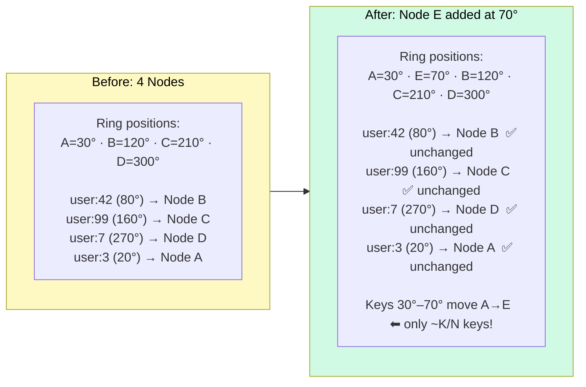
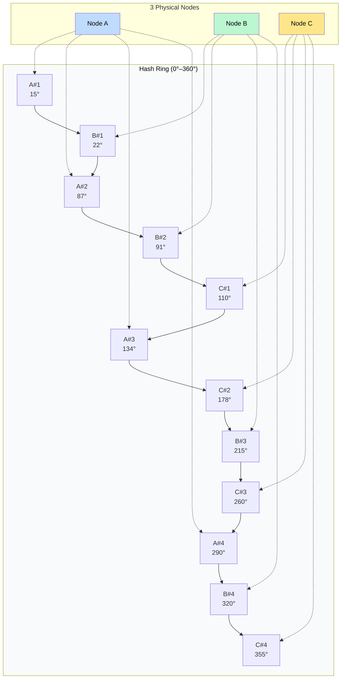

# Consistent Hashing

> **Consistent hashing** is a technique that distributes data across nodes so that when a node is added or removed, only a small fraction of keys (~K/N) need to be remapped, instead of almost everything.

**Level:** 2 · **Topic:** 8 · **Prerequisites:** [Sharding and Partitioning](../02-Sharding-and-Partitioning/README.md) · [Caching](../../Level-01-Building-Blocks/03-Caching/README.md)

---

## 🎯 The Problem

Imagine you have 4 cache servers and you're deciding which server to store a key on using the formula:

```
server = hash(key) % 4
```

This works great — until you add a 5th server. Now the formula is `hash(key) % 5`, and the mapping for nearly **every single key** changes. In a cache of 10 million entries, ~8 million of them now point to the wrong server. Those cache entries are effectively lost — every client will miss and hammer the database simultaneously. This is a **cache stampede**, and it can take down your database.

The same problem hits distributed databases whenever you want to add or remove a shard.

**The core problem:** naive modular hashing ties the mapping of every key to the total number of nodes N. Change N, and you pay a full reshuffle.

---

## 🌍 Real-World Analogy

Picture a circular clock face numbered 0–359 degrees. Each restaurant in a city is placed on the clock based on a hash of its name. Each delivery driver is also placed on the clock based on their driver ID. The rule: "each restaurant is served by the next driver clockwise."

When a new driver joins, they take over only the restaurants between themselves and the previous driver clockwise — a small arc of the clock. When a driver quits, their restaurants fall to the next driver clockwise. Everyone else keeps their existing assignments.

This is the **hash ring**. Only a small neighborhood of assignments changes when the roster changes.

---

## 🧠 Core Idea

### Step 1 — The Hash Ring

Map the entire hash space (0 to 2³²−1, or 0 to 360° conceptually) onto a **circle**. Both **nodes** and **keys** are hashed onto this ring.

```
Node A → hash("NodeA") = 30°
Node B → hash("NodeB") = 120°
Node C → hash("NodeC") = 210°
Node D → hash("NodeD") = 300°
```

### Step 2 — Assigning Keys

To find which node owns a key:
1. Compute `hash(key)` → position on the ring.
2. Walk **clockwise** until you hit a node.
3. That node owns the key.

```
hash("user:42")  = 80°  → owned by Node B (next clockwise after 80°)
hash("user:99")  = 160° → owned by Node C (next clockwise after 160°)
hash("user:7")   = 270° → owned by Node D (next clockwise after 270°)
```

### Step 3 — Adding a Node

When Node E (hash = 70°) is added:

- Keys between 30° and 70° (previously owned by Node B) **transfer to Node E**.
- All other keys are **unaffected**.
- With N nodes, roughly **K/N keys** move on average (where K = total keys). With 4 nodes, adding a 5th moves ~20% of keys — not 80%+.

### Step 4 — Removing a Node

When Node B (120°) is removed:

- Its keys (80°–120°) migrate to Node C (the next clockwise node).
- Everything else stays put.

### Step 5 — Virtual Nodes (Vnodes)

**Problem:** with only one position per physical node, the ring can become uneven. If Node A is at 30° and Node B is at 31°, Node A handles almost nothing. Real data and load cluster unpredictably.

**Solution:** each physical node gets **V virtual positions** on the ring (e.g., V = 150):

```
NodeA → hash("NodeA#1")=15°, hash("NodeA#2")=87°, hash("NodeA#3")=134°, ...
NodeB → hash("NodeB#1")=22°, hash("NodeB#2")=91°, hash("NodeB#3")=178°, ...
```

Virtual nodes provide:
- **Better load distribution** — each node covers many small arcs instead of one large arc.
- **Graceful rebalancing** — when a node is removed, its V arcs spread transfers across many remaining nodes, not just one.
- **Heterogeneous capacity** — a more powerful server can simply be assigned more virtual nodes (e.g., V = 300 vs V = 150).

---

## 📊 How It Works

### The Ring: Before and After Adding a Node

*The diagram below shows 4 nodes on a ring, key assignments, then the effect of adding Node E.*



*Caption: Only the keys between Node A (30°) and the new Node E (70°) are remapped. Every other assignment is untouched.*

### Virtual Nodes: Even Load Distribution



*Caption: Each physical node owns multiple small arcs via virtual nodes. Load is spread evenly; removing one node distributes its keys across all remaining nodes rather than dumping them all on one neighbor.*

---

## 🔧 Types / Variations / Strategies

| Approach | How | Use Case |
|----------|-----|----------|
| **Basic ring** | 1 position per node | Simple, easy to implement — uneven load in practice |
| **Virtual nodes (vnodes)** | V positions per node (typically 100–300) | Production systems; handles heterogeneous node capacities |
| **Rendezvous hashing** | Each key scores each node; picks highest score | Simpler to implement; same minimal remapping property; no ring data structure needed |
| **Jump consistent hash** | Deterministic algorithm, no ring needed | Very fast; harder to remove arbitrary nodes |
| **Maglev hashing** | Lookup-table variant | Google's load balancer; optimized for speed at the cost of complexity |

---

## 🏢 Real-World Examples

### Amazon Dynamo / DynamoDB
The original consistent hashing paper. Dynamo introduced virtual nodes to handle uneven load. Each node is assigned a set of vnodes; when a node is added, its vnodes are populated from several existing nodes, spreading the transfer cost across the cluster.

### Apache Cassandra
Uses consistent hashing with virtual nodes (`num_tokens` setting, default 256 per node). The token ring is visible via `nodetool ring`. Adding a node pulls tokens from across the ring for smooth rebalancing.

### Memcached Clients (libmemcached, twemproxy)
Because Memcached itself is stateless (no cluster coordination), **clients** implement consistent hashing to route requests to the right server. This means adding/removing a Memcached instance only invalidates the fraction of keys it owned.

### Riak
Uses consistent hashing with a ring of 64 partitions (default). Each node owns several partitions. When nodes join or leave, partitions transfer between nodes.

### CDN / Load Balancing
Many CDN edge networks and L7 load balancers use consistent hashing to route requests for the same user to the same backend server (session affinity) — so that caches on that server stay warm. NGINX and HAProxy support this natively.

---

## ⚖️ Trade-offs

| Factor | Naive Modular Hashing | Consistent Hashing |
|--------|----------------------|--------------------|
| **Keys remapped on resize** | ~(N−1)/N of all keys (~80–90%) | ~K/N keys (~20% for 5→6 nodes) |
| **Implementation complexity** | Trivial | Moderate (ring data structure + vnodes) |
| **Load balance (no vnodes)** | Even (by modular arithmetic) | Potentially uneven (depends on hash luck) |
| **Load balance (with vnodes)** | N/A | Near-even; improves with higher V |
| **Node heterogeneity** | Not supported naturally | Supported via vnode count |
| **Lookup speed** | O(1) | O(log N) with sorted ring using binary search |

---

## ✅ When to Use / ❌ When NOT to Use

**Use consistent hashing when:**
- The number of nodes changes frequently (autoscaling, node failures, rolling upgrades).
- You need to minimize cache invalidation during cluster changes.
- You're building a distributed cache, distributed database, or load balancer.
- Node capacity is heterogeneous (different sizes/speeds).

**Do NOT use consistent hashing when:**
- The number of nodes is **fixed and never changes** — naive hashing is simpler.
- You need **strict ordering** by key (range scans) — the ring doesn't preserve key order; use range-based sharding instead.
- Your cluster is tiny (< 3 nodes) and reshuffling cost is acceptable.

---

## ⚠️ Common Pitfalls

1. **No virtual nodes → hotspots.** With one position per node, key distribution can be wildly uneven. One node might own 40% of the ring by chance. Always use virtual nodes in production.

2. **Low V → poor distribution.** Using V = 3 virtual nodes per node gives almost no benefit. Use V ≥ 100 (Cassandra defaults to 256).

3. **Ignoring replication.** In systems like Cassandra, each key is stored on R replicas — the next R nodes clockwise. The replication factor must be factored into capacity planning; adding a node doesn't immediately relieve the most-loaded node because replicas lag.

4. **Hash function quality.** A poor hash function creates clustering on the ring. Use a good uniform hash (MD5, SHA-1 truncated, xxHash, MurmurHash3).

5. **Thundering herd on cache warm-up.** When a new node is added and takes over a slice of keys, those keys are cold. The database may see a spike. Mitigate by warming the new node's cache before routing live traffic to it.

---

## 🎤 Interview Tips

- **Start with the problem:** "Naive `hash(key) % N` remaps ~80% of keys when N changes — cache stampede. Consistent hashing fixes this."
- **Draw the ring** — literally draw a circle with node positions on a whiteboard. Walk through adding a node step by step.
- **Mention virtual nodes** unprompted — it signals you know the practical version, not just the textbook concept.
- **Name real systems:** "Cassandra, Dynamo, and even Memcached clients use this."
- Common follow-up: "How does replication interact with consistent hashing?" — answer: the key's R replicas are the next R clockwise nodes.
- Common follow-up: "What happens to in-flight requests when a node is added?" — answer: you need a brief dual-serve period or request queuing while the new node warms up.

---

## 📝 TL;DR

- Naive `hash(key) % N` remaps almost all keys when N changes → catastrophic cache invalidation.
- Consistent hashing maps keys and nodes onto a ring; adding/removing a node only moves ~K/N keys.
- **Virtual nodes** (vnodes) solve uneven load distribution and allow heterogeneous node capacities.
- Used in Cassandra, Dynamo, Memcached, Riak, and CDN load balancers.
- Always use virtual nodes in production (V ≥ 100 per physical node).
- Not a fit for workloads that need range scans — use range-based sharding for those.

---

## 🧪 Test Yourself

1. You have 5 cache nodes using `hash(key) % 5`. You add a 6th node. Approximately what fraction of all keys will be remapped? Compare this to consistent hashing.
2. Explain what a virtual node is and why it improves consistent hashing. What setting in Apache Cassandra controls the number of vnodes?
3. A Cassandra cluster has 6 nodes with replication factor 3. How many nodes own a copy of a given key? If one node is removed, which nodes take over its responsibilities?
4. You're building a Memcached client library. How would you implement consistent hashing to route requests? What data structure would you use for the ring?
5. Why doesn't consistent hashing work well for range queries? What sharding strategy would you use instead, and what is the trade-off?

---

## 📚 Further Reading

- [Consistent Hashing and Random Trees (Karger et al., 1997)](https://dl.acm.org/doi/10.1145/258533.258660) — the original paper.
- [Amazon Dynamo Paper (2007)](https://www.allthingsdistributed.com/files/amazon-dynamo-sosp2007.pdf) — Section 4.2 on partitioning with virtual nodes.
- [DDIA Chapter 6](https://dataintensive.net/) — Partitioning; consistent hashing vs range partitioning.
- [Tom White — Consistent Hashing](https://tom-e-white.com/2007/11/consistent-hashing.html) — clear walkthrough with code.
- Previous: [07 — Data Modeling](../07-Data-Modeling/README.md) · Next: [09 — Object Storage](../09-Object-Storage/README.md) · Back to [Level 02 Overview](../README.md)
- See also: [Bonus — Distributed Cache](../../Bonus-Real-World-Architectures/README.md) · [Bonus — Key-Value Store](../../Bonus-Real-World-Architectures/README.md)
