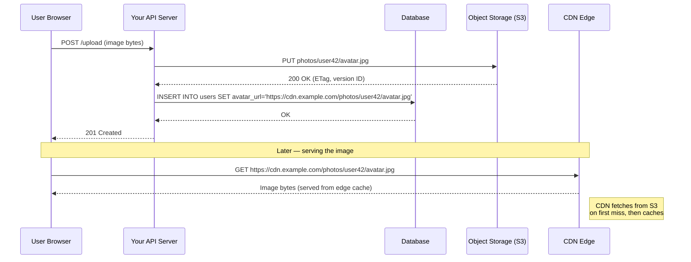
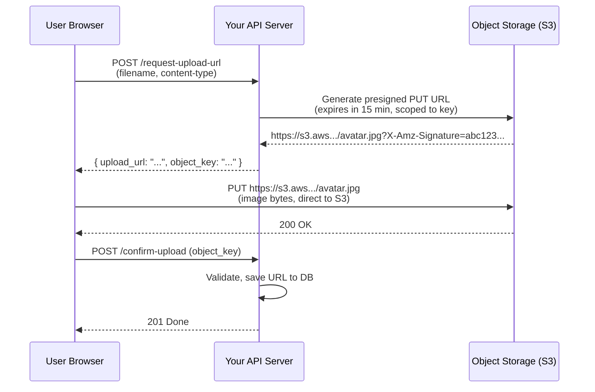

# Object Storage

> **Object storage** is a flat, scalable storage architecture that keeps data as discrete "objects" (files + metadata + a unique key) in buckets, optimized for storing large blobs like images, videos, and backups at virtually unlimited scale with high durability.

**Level:** 2 · **Topic:** 9 · **Prerequisites:** [Databases SQL vs NoSQL](../../Level-01-Building-Blocks/04-Databases-SQL-vs-NoSQL/README.md) · [CDN](../../Level-01-Building-Blocks/06-CDN/README.md)

---

## 🎯 The Problem

Your photo-sharing app is taking off. Users upload 10 000 photos per hour — each 3–8 MB. You need to store them *somewhere*.

**Option A: Put images in the database as BLOBs.**
Your Postgres database balloons to terabytes. Backups take hours. Every image fetch competes with transactional queries for I/O. Your DB engineer quits.

**Option B: Store images on the web server's local disk.**
Great — until you add a second web server. Now Server 2 can't see files uploaded to Server 1. You've created a distributed state problem.

**Option C: A shared NAS/SAN (network-attached storage).**
Expensive, complex, capacity-capped, not designed for millions of tiny concurrent HTTP reads.

You need something that is: cheap per GB, infinitely scalable, accessible via HTTP, highly durable, and completely decoupled from your application servers. That's object storage.

---

## 🌍 Real-World Analogy

Think of object storage as a **post office warehouse** with a magical address book. You drop off any package (your file), label it with a unique tracking number (the object key), and the warehouse keeps it forever. You can retrieve it any time by presenting that tracking number. The warehouse handles millions of packages from millions of customers — it doesn't care what's inside, just how many and how large.

- **Bucket** = your company's section of the warehouse.
- **Object key** = the tracking number (`photos/user42/avatar.jpg`).
- **Metadata** = notes attached to the package (content type, upload date, custom tags).

The warehouse doesn't have folders — it's one giant flat space. The `/` in a key is just part of the name string (a naming convention, not a real directory hierarchy).

---

## 🧠 Core Idea

### Objects vs Block vs File Storage

There are three fundamental storage abstractions:

| Dimension | Block Storage | File Storage | Object Storage |
|-----------|--------------|--------------|----------------|
| **Abstraction** | Raw disk blocks | Files + directories (POSIX) | Objects (key + data + metadata) |
| **Access** | iSCSI/NVMe | NFS, SMB, POSIX filesystem | HTTP(S) REST API |
| **Hierarchy** | None | Tree (folders) | Flat namespace (no real folders) |
| **Best for** | OS volumes, databases, VMs | Shared file access, home dirs | Large blobs: images, video, backups |
| **Scale** | Per-volume capacity limit | Petabytes, but complex | Effectively unlimited |
| **Examples** | AWS EBS, Azure Disk | AWS EFS, NFS | AWS S3, GCS, Azure Blob |

**The golden rule of web-scale systems:**
> Never store large binary files (images, video, audio, PDFs, archives) in a relational database. Store them in object storage and put only the **URL or key** in your database.

### What Is S3?

Amazon S3 (Simple Storage Service) is the archetypal object store. Its model:

- **Bucket**: a named container, globally unique. `my-company-avatars`.
- **Object key**: a string uniquely identifying the object within the bucket. `users/42/avatar-2024.jpg`.
- **Object data**: the raw bytes — an image, a video, a JSON file, anything.
- **Metadata**: key-value pairs describing the object. `Content-Type: image/jpeg`, `Cache-Control: max-age=86400`, custom tags.
- **Version ID**: (optional, with versioning enabled) allows storing multiple versions of the same key.

**Durability:** S3 Standard provides **11 nines of durability** (99.999999999%) — storing 10 million objects, you'd expect to lose one object every 10 000 years. Achieved by automatically replicating objects across at least 3 Availability Zones.

### Consistency Model

Historically S3 was eventually consistent for certain operations. Since December 2020, **S3 offers strong read-after-write consistency** for all operations (PUT, DELETE, LIST). GCS and Azure Blob have always been strongly consistent. This means you can immediately read an object after writing it without stale-read risk.

---

## 📊 How It Works

### The Upload + Serve Flow



*Caption: Your API server never touches image bytes after the upload — S3 stores them, a CDN serves them. Your DB only stores the URL string.*

### Presigned URLs: Secure Direct Upload/Download

For large files, routing bytes through your API server wastes bandwidth and CPU. **Presigned URLs** let clients upload or download directly to/from S3 without your server acting as a proxy.



*Caption: Presigned URL pattern. Your server generates a time-limited, pre-authorized URL. The client uploads directly to S3. Server bandwidth is not used for the file bytes.*

**Presigned URL benefits:**
- Offloads upload bandwidth entirely from your servers.
- Time-limited: expires after N minutes (15 min is common).
- Scoped: the signature encodes the exact bucket, key, and allowed operations — can't be used for anything else.
- Also used for **private downloads**: generate a presigned GET URL for objects that aren't publicly readable.

---

## 🔧 Types / Variations / Strategies

### Storage Tiers / Lifecycle Policies

Object storage offers multiple tiers optimized for different access frequencies. You configure **lifecycle rules** to automatically transition objects between tiers.

| Tier | AWS S3 Class | Access Latency | Cost ($/GB/month) | Best For |
|------|-------------|---------------|-------------------|----------|
| **Hot** | S3 Standard | Milliseconds | ~$0.023 | Frequently accessed (profile photos, active content) |
| **Infrequent** | S3 Standard-IA | Milliseconds | ~$0.0125 | Access < 1/month (old invoices, logs) |
| **Cold** | S3 Glacier Instant | Milliseconds | ~$0.004 | Rarely accessed (compliance archives) |
| **Archive** | S3 Glacier Flexible | Minutes–hours | ~$0.0036 | Long-term archives (regulatory data, 7-year retention) |
| **Deep Archive** | S3 Glacier Deep Archive | Hours | ~$0.00099 | Coldest data (disaster recovery vaults) |

**Example lifecycle rule:**
```
photos/            → S3 Standard (0–30 days)
                   → S3 Standard-IA (31–180 days)
                   → S3 Glacier (181–365 days)
                   → Delete after 3 years
```

### Object Storage Providers

| Provider | Service | Notable Feature |
|----------|---------|----------------|
| **AWS** | S3 | Widest ecosystem, most S3-compatible tools assume S3 |
| **Google Cloud** | Cloud Storage (GCS) | Strong consistency from day one, good global replication |
| **Azure** | Azure Blob Storage | Hierarchical namespace option (ADLS Gen2) for data lake workloads |
| **MinIO** | MinIO | Open-source, self-hosted, S3-compatible API — great for on-premise |
| **Cloudflare** | R2 | S3-compatible, zero egress fees — cost effective for serving traffic |
| **Backblaze** | B2 | Very cheap, S3-compatible |

---

## 🏢 Real-World Examples

### Instagram / Meta
Instagram stores billions of photos in object storage (originally a custom system, later migrated to Haystack, now a mix of on-premise blob stores and cloud). The database stores only a photo ID that maps to the blob storage URL. Serving is done via CDN. The database is tiny compared to the storage itself.

### YouTube / Google Drive
Video files (often hundreds of GB each in raw format) live in Google's blob storage (GCS). The database stores metadata: title, owner, upload timestamp, duration, processing status. A 4K video is never "in" a database row — just a reference to it.

### Airbnb / Dropbox
Listing photos and user files go directly to S3 via presigned URLs. Airbnb uses S3 for all media assets with CloudFront (AWS CDN) in front. Dropbox famously migrated away from S3 to build its own object storage (Magic Pocket) at petabyte scale to reduce cost — a decision only viable at extreme scale.

### Pastebin / GitHub Gists
Text pastes are small, but storing them as `TEXT` blobs in Postgres at scale is wasteful. A better design: store the paste content in S3 keyed by a short hash, store only the hash + metadata in the database.

---

## ⚖️ Trade-offs

| Pro | Con |
|-----|-----|
| **Effectively unlimited scale** — no capacity planning for storage size | **Not POSIX** — cannot append to middle of a file, no random byte-range updates |
| **11 nines durability** — more reliable than any database you'll run | **Eventual consistency for some edge cases** — list operations may lag (though S3 is now strongly consistent for most ops) |
| **Cheap** — ~$0.023/GB/month vs ~$0.10+/GB for block storage | **Latency** — first byte latency 10–100 ms, not suitable for sub-ms random access |
| **HTTP-native** — accessible from anywhere via URL | **No atomic multi-object transactions** — cannot update two objects atomically |
| **Lifecycle automation** — automatic tiering to cold/archive | **Egress fees** — downloading data OUT of cloud object storage is expensive (AWS: $0.09/GB) |
| **Built-in CDN integration** | **No partial updates** — must re-upload the whole object to change any byte |

---

## ✅ When to Use / ❌ When NOT to Use

**Use object storage for:**
- User-uploaded media: profile photos, product images, videos, audio.
- Application backups and database snapshots.
- Static website assets (HTML, CSS, JS, fonts).
- Data lake storage (raw logs, Parquet files for analytics).
- Machine learning datasets and model artifacts.
- Software distribution (installers, Docker layer caches, build artifacts).

**Do NOT use object storage for:**
- Data that your database needs to query (store the path, not the bytes).
- Random-access read/write workloads (use block storage / EBS instead).
- High-frequency tiny writes (thousands of small file creates per second — use a database or message queue).
- Data requiring sub-millisecond latency (object stores are 10–100 ms first byte).
- Transactional data that must be updated atomically.

---

## ⚠️ Common Pitfalls

1. **Storing BLOBs in your relational database.** This is the classic mistake. Postgres and MySQL can store binary data, but they weren't built for it. A 500 MB video in a DB row makes every backup, replica, and index operation much heavier. Put files in object storage; put URLs in your DB.

2. **Forgetting egress costs.** Object storage is cheap for storage and uploads, but **egress (downloading data out of the cloud) is expensive** (~$0.09/GB on AWS). Always put a CDN in front of object storage for user-facing assets. Never serve images directly from S3 to end users at scale.

3. **No access control on public buckets.** Multiple high-profile data leaks have been caused by misconfigured S3 buckets set to public. Default to private. Use presigned URLs or a CDN for access. Regularly audit bucket ACLs.

4. **Not using presigned URLs for uploads.** Routing large file uploads through your API server is wasteful. Generate presigned PUT URLs and let clients upload directly. Your servers will thank you.

5. **Treating object keys as a filesystem.** The `/` in `users/42/avatar.jpg` is just a character — there's no real directory. LIST operations on a large bucket prefix can be slow. Design key namespaces with access patterns in mind.

6. **Not enabling versioning.** Without versioning, a bug in your code can overwrite or delete objects permanently. Enable versioning on critical buckets; pair with lifecycle rules to expire old versions.

---

## 🎤 Interview Tips

- **State the golden rule early:** "Images and files go in object storage; the URL goes in the database — never store BLOBs in Postgres."
- **For any design with user uploads** (Instagram, Dropbox, YouTube, Drive, Pastebin), mention object storage with presigned URLs unprompted.
- **Mention the CDN pairing** — object storage + CDN is a standard combo. Serving directly from S3 to users is an antipattern.
- **Know the lifecycle tiers** — Interviewers love "how would you handle old data?" Answer: S3 lifecycle policy: Standard → IA → Glacier → delete.
- Common follow-up: "How do you handle large video uploads?" Answer: multipart upload (S3 allows uploading in chunks up to 10 000 parts × 5 GB each = 50 TB max object).
- Common follow-up: "How do you make private content accessible temporarily?" Answer: presigned URL with an expiry.

---

## 📝 TL;DR

- Object storage (S3, GCS, Azure Blob) stores data as flat key-value pairs (bucket + key + bytes + metadata).
- **Never put large BLOBs in your relational DB.** Store the object in S3; store the URL/key in the DB.
- Use **presigned URLs** for secure, direct client-to-S3 uploads and private downloads.
- Always put a **CDN in front** of object storage for user-facing assets — egress fees are real.
- **Lifecycle policies** automatically move objects from hot → cold → archive → delete, cutting storage costs.
- Durability is 11 nines; S3 is strongly consistent as of 2020.

---

## 🧪 Test Yourself

1. A user uploads a 200 MB video to your API server, which then forwards it to S3. Why is this a problem at scale, and how would you fix it?
2. Your company stores 10 years of user profile photos in S3 Standard. Only the last 90 days of photos are actively viewed. How would you reduce storage cost without deleting any data?
3. You have a private S3 bucket containing medical imaging files. A user needs to download their scan. How do you give them temporary access without making the bucket public?
4. Explain the difference between block storage, file storage, and object storage. Give a concrete use case where each is the right choice.
5. Why does storing images as BLOBs in Postgres degrade database performance beyond just "taking up space"? Name at least two specific mechanisms.

---

## 📚 Further Reading

- [AWS S3 Documentation](https://docs.aws.amazon.com/s3/index.html) — the canonical reference.
- [Dropbox Magic Pocket Blog](https://dropbox.tech/infrastructure/inside-the-magic-pocket) — how Dropbox built their own object store.
- [How Facebook Stores Billions of Photos (Haystack)](https://www.usenix.org/legacy/event/osdi10/tech/full_papers/Beaver.pdf) — the original paper.
- [DDIA Chapter 3](https://dataintensive.net/) — Storage and Retrieval; covers storage engine trade-offs.
- [The S3 Strong Consistency Announcement](https://aws.amazon.com/blogs/aws/amazon-s3-update-strong-read-after-write-consistency/) — December 2020.
- Previous: [08 — Consistent Hashing](../08-Consistent-Hashing/README.md) · Next: [10 — Change Data Capture](../10-Change-Data-Capture/README.md) · Back to [Level 02 Overview](../README.md)
- See also: [Bonus — Instagram](../../Bonus-Real-World-Architectures/README.md) · [Bonus — YouTube](../../Bonus-Real-World-Architectures/README.md) · [Bonus — Google Drive](../../Bonus-Real-World-Architectures/README.md) · [Bonus — Pastebin](../../Bonus-Real-World-Architectures/README.md)
