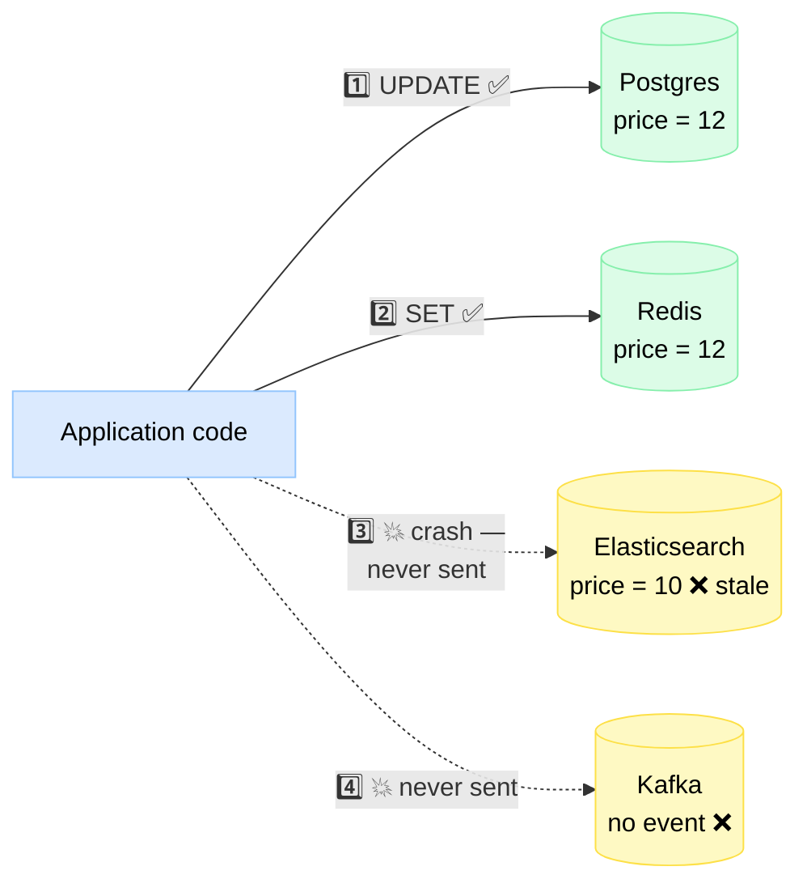
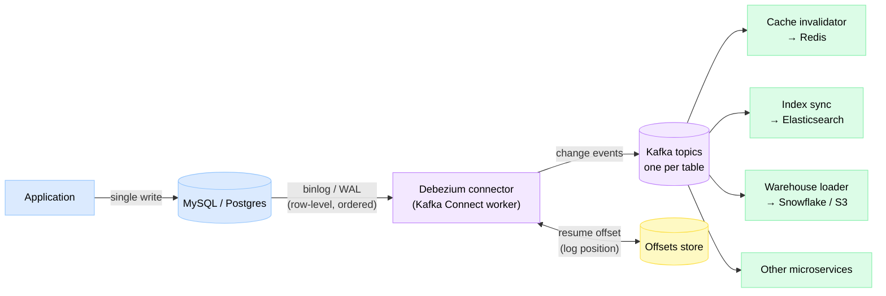
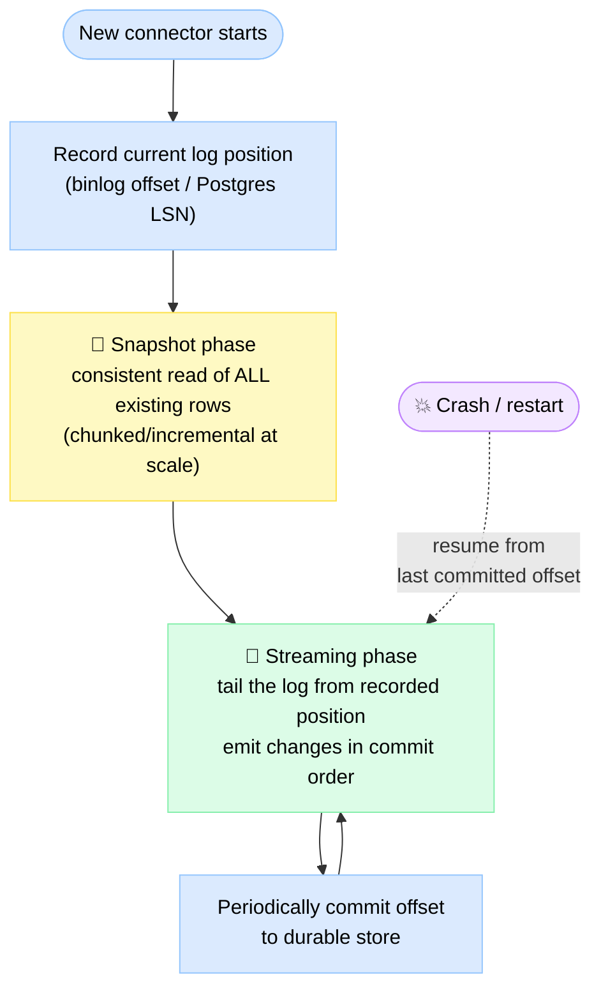
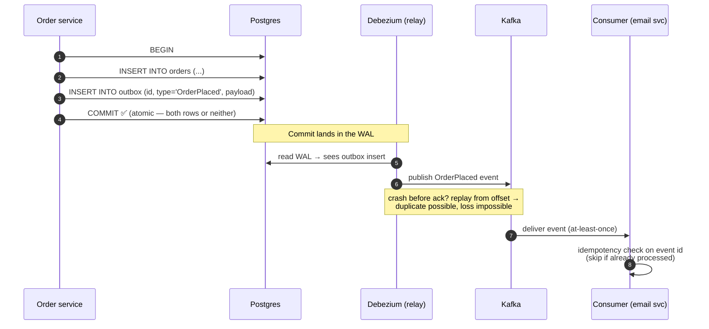

# Change Data Capture (CDC) & Data Synchronization

> **Change Data Capture (CDC)** is a technique that watches a database's own change log and streams every insert, update, and delete — in order — to other systems (caches, search indexes, warehouses, queues), so you write data **once** and everything else stays in sync automatically.

**Level:** 2 · **Topic:** 10 · **Prerequisites:** [Database Replication](../01-Database-Replication/README.md) · [Database Internals](../04-Database-Internals/README.md) · [Message Queues](../../Level-03-Communication/04-Message-Queues/README.md)

---

## 🎯 The Problem: Dual Writes

Your product data lives in Postgres. But it *also* needs to be in Redis (for fast reads), Elasticsearch (for search), and Kafka (so other services hear about changes). The "obvious" solution: write to all of them from your application code.

```python
def update_product(product):
    db.update(product)              # 1. write to Postgres
    cache.set(product.id, product)  # 2. update Redis
    search.index(product)           # 3. update Elasticsearch
    queue.publish("product.updated", product)  # 4. notify others
```

This is the **dual-write problem** (really a quad-write here), and it breaks in two ugly ways:

1. **Partial failure.** Step 1 succeeds, then the process crashes before step 3. Postgres and Redis have the new price; Elasticsearch shows the old one. There is **no transaction spanning four different systems** — you cannot roll back Postgres because Elasticsearch failed. Your data is now silently inconsistent, and nothing will ever fix it.
2. **Race conditions.** Two concurrent updates to the same product: request A writes price=10 to the DB, request B writes price=12, but B's cache write lands *before* A's. The DB says 12; the cache says 10 — forever (or until the TTL mercifully expires).

*The diagram below shows a partial failure: the crash between the DB write and the search write leaves systems permanently disagreeing.*



Retries don't save you (the process is dead), and wrapping it in a try/catch just moves the hole. The fix is a change of philosophy: **stop asking the application to remember to tell everyone. Let the database's own log do the telling.**

---

## 🌍 Real-World Analogy

Think of a courtroom. One approach: after every statement, ask each clerk in the building to *please remember* to write it down and file a copy — the tax clerk, the records clerk, the press office. Some will miss a statement, some will file them out of order, and nobody will notice until the transcripts disagree in an appeal.

The real approach: a **court stenographer** transcribes everything **once, in order, as it happens**. That single authoritative transcript is then copied to whoever needs it — as many copies as you like, whenever you like, and you can even re-print from page one for a new subscriber.

The database's **write-ahead log (WAL)** is the stenographer's transcript: an ordered, complete record of every change. CDC is the copying service that distributes it. (You met the WAL in [Database Internals](../04-Database-Internals/README.md) — it exists for crash recovery and [replication](../01-Database-Replication/README.md); CDC simply gives it a third job.)

---

## 🧠 Core Idea: Three Ways to Capture Changes

### 1. Polling (query-based CDC)

Add an `updated_at` timestamp column; a job runs every N seconds: `SELECT * FROM products WHERE updated_at > :last_seen`. Simple — and full of holes: **deletes are invisible** (the row is gone, so it never matches), intermediate states are missed (5 updates in one poll window → you see only the last), clock skew and long transactions can skip rows, and frequent polling hammers the database.

### 2. Triggers

Attach `AFTER INSERT/UPDATE/DELETE` triggers that copy each change into a shadow "changes" table, which a job drains. Now deletes are captured — but every write pays the trigger tax **inside the transaction** (often 2× write latency), triggers are per-table maintenance burden, and you've built a queue inside your OLTP database.

### 3. Log-based CDC ⭐ (the modern default)

Read the database's replication log directly — **MySQL's binlog** or **Postgres's WAL via logical decoding** — exactly like a replica does. The database already writes this log for every committed transaction, so capture adds **near-zero overhead** to writes, sees every change including deletes, and preserves exact commit order.

| | Polling | Triggers | Log-based |
|---|---|---|---|
| **Captures deletes** | ❌ No | ✅ Yes | ✅ Yes |
| **Captures every intermediate change** | ❌ Only latest per poll | ✅ Yes | ✅ Yes |
| **Write-path overhead** | None (read load instead) | High — runs in the transaction | Near zero |
| **Latency** | Seconds–minutes (poll interval) | Low, but drain job adds lag | Milliseconds–low seconds |
| **Ordering guarantee** | Weak (clock-based) | Per-table | ✅ Exact commit order |
| **Schema/app changes needed** | `updated_at` column everywhere | Trigger per table | None — just DB config |
| **Ops complexity** | Trivial | Medium | Higher (connector infra, log retention) |
| **Use when** | Legacy DB, low freshness needs | No log access (some managed DBs) | Almost always, at scale |

---

## 📊 Log-Based CDC Deep Dive: Debezium + Kafka Connect

The de-facto open-source stack is **[Debezium](https://debezium.io/)** running on **Kafka Connect**. Debezium impersonates a replica: it connects to MySQL as a replication client (reading the **binlog**, with `binlog_format=ROW` so it sees actual row values, not SQL text) or to Postgres through a **logical replication slot** (the `pgoutput` plugin decodes WAL into row-level events). Each change becomes a structured event — `before` state, `after` state, operation type (`c`/`u`/`d`), source position — published to a Kafka topic per table.

*The pipeline: one write to the DB fans out to every downstream system, in order.*



Key mechanics to understand:

- **Snapshot phase → streaming phase.** A new connector first takes an **initial snapshot** (a consistent read of every existing row — the "back-catalog"), records the log position it started at, then switches to **streaming** the log from that position. No gap, no overlap. Modern connectors (Debezium's *incremental snapshots*, inspired by Netflix's DBLog) can even snapshot in chunks *while* streaming, so a 2 TB table doesn't block live changes for hours.

*Connector lifecycle: bootstrap existing data first, then tail the log from the exact position where the snapshot began — nothing missed, nothing doubled.*


- **Offsets = resumability.** The connector durably records its log position (binlog file+offset / Postgres LSN). Crash, restart, and it resumes exactly where it left off — the stenographer's transcript has page numbers.
- **Ordering.** Events for a given row are emitted in commit order, and Kafka preserves order **per partition**. Rule of thumb: partition by primary key, so all events for row 42 are strictly ordered. *Global* cross-table order is not guaranteed — design consumers accordingly.
- **At-least-once delivery.** After a crash, the connector may re-emit a few events it had already published (it replays from the last committed offset). Duplicates are possible; loss is not. Consumers must be **idempotent**: upserts keyed by primary key, versioned writes ("apply only if event version > stored version"), or dedup on a unique event ID. An upsert applied twice is a no-op — that's the whole trick.

### ⚠️ One trap worth its own paragraph

Postgres **replication slots retain WAL until the consumer confirms it**. If your Debezium connector dies on a Friday and nobody notices, the WAL accumulates all weekend and can **fill the database disk**, taking down production. Monitor slot lag (`pg_replication_slots`) like you monitor disk space — because it *is* disk space. Similarly, MySQL binlog retention (`binlog_expire_logs_seconds`) must exceed your worst-case connector downtime, or you'll need a full re-snapshot.

---

## 🔧 The Transactional Outbox Pattern

Log-based CDC gives you raw *row* changes. But often a service wants to publish a clean *business event* ("OrderPlaced", with a well-designed payload) — not "3 rows changed in 2 tables." Writing to the DB **and** publishing to Kafka in app code is… the dual-write problem again. The **transactional outbox** solves it with one elegant move: make the event a row.

1. In **one local ACID transaction**, insert the business rows *and* an event row into an `outbox` table. One transaction → atomic: both happen or neither does.
2. A relay publishes outbox rows to the broker. The best relay? **CDC itself** tailing the outbox table (Debezium ships an outbox router built in). A polling relay also works.

*Sequence: the crash-safe path from business write to published event.*



If the transaction aborts, no outbox row → no event (no ghost events). If the relay crashes, the row is still in the table → published on restart (no lost events). This pattern is the backbone of reliable [event-driven architecture](../../Level-05-Architecture-Patterns/02-Event-Driven-Architecture/README.md) and [sagas](../../Level-05-Architecture-Patterns/07-Saga-and-Orchestration/README.md).

---

## 🔄 Schema Evolution & the Schema Registry

Tables change: columns get added, renamed, retyped. Your CDC events must change with them — without breaking the 12 consumers downstream. The standard answer is a **schema registry** (e.g., Confluent Schema Registry) with **Avro** or **Protobuf** events:

- Each event carries a compact schema ID; the full schema lives in the registry.
- The registry **enforces compatibility rules** on registration — e.g., *backward compatibility*: new-schema consumers can still read old events (add fields only with defaults; don't delete required fields; don't rename — add-and-deprecate instead).
- An incompatible schema is **rejected at publish time**, at the producer — not discovered at 3 a.m. in a consumer stack trace.

Treat your CDC topics as a public API of your database: DBAs changing a column type are now, whether they know it or not, making an API change. Put CDC-consumed tables under the same review discipline as REST contracts.

---

## 🏢 Real-World Examples

### LinkedIn Databus — the origin story
LinkedIn built [Databus](https://engineering.linkedin.com/data-replication/open-sourcing-databus-linkedins-low-latency-change-data-capture-system) (circa 2007–2012) to keep its social graph index and search engine consistent with the source-of-truth Oracle/MySQL databases — after learning firsthand that dual writes drift. Databus pioneered the model everyone now uses: commit-log capture, in-order delivery, consumer-controlled offsets, and "bootstrap" (snapshot) for new consumers that need the full history. Its lessons directly shaped **Kafka** (also born at LinkedIn).

### Netflix DBLog
Netflix's [DBLog](https://netflixtechblog.com/dblog-a-generic-change-data-capture-framework-69351fb9099b) is a CDC framework whose headline feature is **interleaved snapshots**: instead of "snapshot the whole table, then stream," it takes the snapshot in small chunks *woven between* live log events using watermarks — so a multi-terabyte table can be bootstrapped without pausing change capture or hammering the source. This design was adopted by Debezium as *incremental snapshots*.

### Airbnb SpinalTap
Airbnb's [SpinalTap](https://medium.com/airbnb-engineering/capturing-data-evolution-in-a-service-oriented-architecture-72f7c643ee6f) tails MySQL binlogs and publishes mutations to Kafka, guaranteeing per-key ordering, timeline consistency, and exactly-once-*effect* semantics via idempotent consumers. Airbnb uses it for search index sync, cache invalidation, and powering async workflows off the booking database.

### Shopify
Shopify runs **Debezium** at massive scale (100+ high-traffic sharded MySQL databases) to feed Kafka, powering their data warehouse loads, search indexing, and cross-service data exchange. Their engineering write-ups cover hard-won lessons: binlog retention sizing, handling shard splits, large-record handling, and treating connector lag as a paged-on-call metric.

### Uber
Uber's DBEvents/uChange pipelines capture MySQL changes to keep their Hive/HDFS analytical datasets fresh within minutes instead of daily batch dumps — the classic "warehouse replication" use case at extreme scale.

---

## 🧰 Use Cases (What People Actually Build on CDC)

| Use case | How CDC powers it |
|---|---|
| **Cache invalidation** | Consumer sees `product 42 updated` → deletes/updates the Redis key. No TTL guessing, no stale-forever bugs. |
| **Search index sync** | DB → Kafka → Elasticsearch sink connector. Search lags the DB by ~seconds, and reindexing = replay the topic. |
| **Data warehouse replication** | Stream changes into Snowflake/BigQuery/S3 ([Object Storage](../09-Object-Storage/README.md)) — minutes-fresh analytics instead of nightly dumps. |
| **Microservice data exchange** | Services subscribe to each other's change streams (ideally via outbox events) instead of chatty synchronous APIs. |
| **Audit log** | The change stream *is* an immutable who-changed-what history — archive it and you have compliance-grade auditing nearly for free. |
| **CQRS read models** | CDC keeps derived read views in sync with the write model — see [CQRS & Event Sourcing](../../Level-05-Architecture-Patterns/03-CQRS-and-Event-Sourcing/README.md). |
| **Stream processing input** | Change streams feed Flink/Kafka Streams jobs — see [Stream Processing](../../Level-07-Big-Data-and-Specialized/02-Stream-Processing/README.md). |

---

## ⚖️ Trade-offs

| 👍 Pros | 👎 Cons |
|---|---|
| Eliminates dual writes — one write, guaranteed propagation | **Eventual consistency**: downstream lags by ms–seconds; readers of the cache/index can see slightly stale data |
| Near-zero overhead on the write path (log already exists) | New infrastructure to run: connectors, Kafka, registry, monitoring |
| Captures *everything*: deletes, every intermediate state, exact order | At-least-once delivery → consumers must be idempotent (design tax) |
| Replayable: new consumers bootstrap from snapshot + history | Raw row events **couple consumers to your table schema** (mitigate with outbox / registry) |
| Decouples producers from consumers — add sinks without touching app code | Log retention risks: unconsumed Postgres slots can fill the source DB's disk |
| Works with legacy apps — no code changes to the writer | Cross-table transactions arrive as separate per-table events; global ordering needs extra work |

---

## ✅ When to Use / ❌ When NOT to Use

**Use CDC when:** the same data must live in 2+ systems (cache, search, warehouse); you're breaking a monolith and services need the monolith's data without synchronous calls; you need an audit trail; you're implementing outbox-based reliable messaging.

**Skip it when:** a single database serves all needs (no derived stores — don't build a pipeline to nowhere); you need **read-your-write** consistency downstream (CDC is asynchronous by nature); the team can't operate Kafka/connector infra — a periodic batch sync or managed CDC service (AWS DMS, Datastream, Fivetran) may be the pragmatic 80%.

---

## ⚠️ Common Pitfalls & Gotchas

1. **Non-idempotent consumers.** "It worked in testing" — until the first connector restart replays 500 events and your consumer sends 500 duplicate emails. Design for redelivery from day one: upserts, version checks, or processed-event-ID tables.
2. **Forgetting slot/binlog retention.** The #1 production incident: dead connector + Postgres replication slot = disk-full database at 2 a.m. Alert on `pg_replication_slots` lag and connector liveness.
3. **Assuming global ordering.** Order is per-key/per-partition. Two events on different rows (or tables) can be consumed out of order. If consumer logic needs "order line after order header," you must handle the inversion (buffer, retry, or partition by order ID).
4. **Exposing raw table rows as your public event API.** Every downstream team now breaks when you rename a column. Use the outbox pattern (curated payloads) or at minimum a schema registry with compatibility enforcement.
5. **Ignoring the snapshot cost.** Snapshotting a 2 TB table naively can run for hours holding long transactions on the source. Use incremental/chunked snapshots (DBLog-style), snapshot from a replica, or run it off-peak.
6. **Deleting rows and wondering where they went.** Configure tombstone handling deliberately: a delete event must translate to a cache eviction / index delete / warehouse soft-delete — silently dropping deletes recreates the stale-data problem CDC was meant to kill.

---

## 🎤 Interview Tips

- **Trigger phrase:** the moment a design has "DB + cache + search" or "publish an event after saving," say the words **dual-write problem** and reach for CDC or the outbox pattern. This is a strong senior signal.
- **Know the one-liner:** "The DB's WAL is already an ordered log of every committed change; CDC tails it like a replica and streams it to Kafka — so I write once and derive everything else."
- **Outbox in one breath:** "Business row + event row in one ACID transaction; a relay (usually Debezium) publishes the event — atomicity without distributed transactions."
- **Expect the follow-ups:** *"What if the connector crashes?"* → resumes from stored offset; at-least-once; consumers are idempotent. *"How does a new consumer get existing data?"* → initial snapshot, then stream from the recorded position. *"Exactly-once?"* → practically: at-least-once delivery + idempotent apply = exactly-once **effect**.
- **Name-drop with substance:** Debezium (the tool), LinkedIn Databus (the origin), Netflix DBLog (incremental snapshots), Airbnb SpinalTap, Shopify's Debezium fleet.
- **Show you know the sharp edge:** mention Postgres replication-slot disk risk — interviewers who've run CDC will visibly relax.

---

## 📝 TL;DR

| Concept | Remember this |
|---|---|
| Dual-write problem | App writing to DB + cache + queue can partially fail → permanent inconsistency; no cross-system transactions exist |
| CDC | Tail the DB's own log (binlog/WAL) and stream ordered changes to other systems — write once, sync everything |
| Capture methods | Polling (misses deletes), triggers (slows writes), **log-based** (the modern default) |
| Debezium + Kafka | Standard OSS stack: connector reads log → events to Kafka topics → sink consumers; resumes via stored offsets |
| Transactional outbox | Business row + event row in ONE transaction; CDC relay publishes → atomic "save and publish" |
| Delivery semantics | Snapshot then stream; per-key ordering; **at-least-once + idempotent consumers** = exactly-once effect |
| Schema evolution | Registry + compatibility rules; treat CDC topics as a public API of your schema |

---

## 🧪 Test Yourself

**1. Your teammate proposes: "After saving the order, we'll publish to Kafka inside a try/catch, and if publish fails we roll back the DB." What's wrong?**

<details><summary>Show answer</summary>

The failure window is still there, just moved: the publish can *succeed* and then the DB commit can fail (or the process dies after commit but before publish — a rollback can't help because the code never runs). There is no atomic commit across Postgres and Kafka. The fix is the **transactional outbox**: write the order row and an outbox event row in one local ACID transaction, and let a relay (e.g., Debezium tailing the outbox table) publish it. Aborted transaction → no event; crashed relay → event still in the table, published on restart.
</details>

**2. Compare polling, trigger-based, and log-based CDC for syncing a `users` table to Elasticsearch, where GDPR deletions must propagate.**

<details><summary>Show answer</summary>

Polling on `updated_at` **cannot see deletes** — the row vanishes, so it never matches the query; GDPR erasure would silently not propagate (a compliance failure). Triggers capture deletes but add latency inside every write transaction and are per-table maintenance. Log-based CDC captures inserts, updates, **and deletes** in commit order with near-zero write overhead — the right choice. One extra detail: make sure the consumer maps delete events to index deletions (tombstone handling), or you've rebuilt the same bug downstream.
</details>

**3. A Debezium connector crashes and restarts. Some events are delivered twice. Is this a bug? How should the Elasticsearch sink handle it?**

<details><summary>Show answer</summary>

Not a bug — it's **at-least-once delivery**. The connector resumes from its last durably-committed offset, replaying anything published after that offset was recorded. Duplicates are possible; loss is not. The sink must be **idempotent**: index documents keyed by primary key using upserts (indexing the same doc twice = same result), and optionally use versioned writes (apply only if the event's version/LSN exceeds the stored one) to also defuse out-of-order duplicates. At-least-once delivery + idempotent apply = exactly-once *effect*.
</details>

**4. You add a new consumer that needs the full current contents of a 500 GB table plus all future changes, without stopping live capture. How do modern CDC systems do this?**

<details><summary>Show answer</summary>

Snapshot + streaming. Classic approach: take a consistent snapshot, record the log position at its start, then stream from that position — but a naive 500 GB snapshot blocks/burdens the source for hours. Modern approach (**Netflix DBLog**, adopted by Debezium as *incremental snapshots*): read the table in small chunks and interleave them with live log events, using watermarks to deduplicate rows that change mid-snapshot. Result: the consumer converges to a complete, consistent view while live changes keep flowing.
</details>

**5. Postgres alerts: disk 85% full. You find a replication slot with huge `restart_lsn` lag. What happened and what do you do?**

<details><summary>Show answer</summary>

A logical replication slot (probably a dead or stalled CDC connector) hasn't acknowledged WAL, so Postgres is **retaining WAL segments indefinitely** for it — and will fill the disk, eventually taking the database down. Immediate: fix or restart the connector so it consumes and acks (WAL is then released); if the consumer is permanently gone, drop the slot (`pg_drop_replication_slot`) — knowing that consumer must re-snapshot later. Long-term: alert on slot lag and connector liveness, and set `max_slot_wal_keep_size` (Postgres 13+) as a safety valve so a runaway slot gets invalidated before it kills the primary.
</details>

---

## 📚 Further Reading

- [Martin Kleppmann — *Turning the database inside-out*](https://martin.kleppmann.com/2015/11/05/database-inside-out-at-oredev.html) — the talk that reframed the log as the heart of the system.
- [Debezium documentation](https://debezium.io/documentation/) — connector mechanics, snapshots, outbox event router.
- [Netflix Tech Blog — DBLog](https://netflixtechblog.com/dblog-a-generic-change-data-capture-framework-69351fb9099b) — watermark-based incremental snapshots.
- [Airbnb Engineering — SpinalTap](https://medium.com/airbnb-engineering/capturing-data-evolution-in-a-service-oriented-architecture-72f7c643ee6f) — CDC in a service-oriented architecture.
- [LinkedIn — Open-sourcing Databus](https://engineering.linkedin.com/data-replication/open-sourcing-databus-linkedins-low-latency-change-data-capture-system) — the origin story.
- [Microservices.io — Transactional Outbox](https://microservices.io/patterns/data/transactional-outbox.html) — the canonical pattern write-up.
- *Designing Data-Intensive Applications*, Ch. 11 — "Derived data" and log-based integration.

---

⬅️ Previous: [09 — Object Storage](../09-Object-Storage/README.md) · ➡️ Next: [Level 3 — Communication](../../Level-03-Communication/README.md) · 🏠 [Level 2 index](../README.md)
