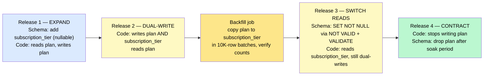
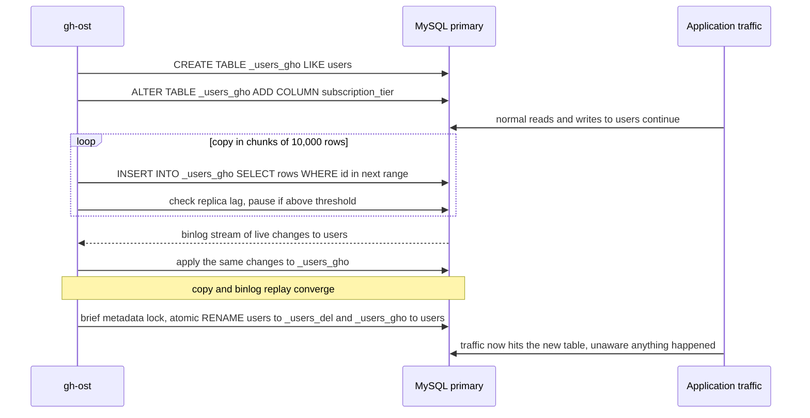
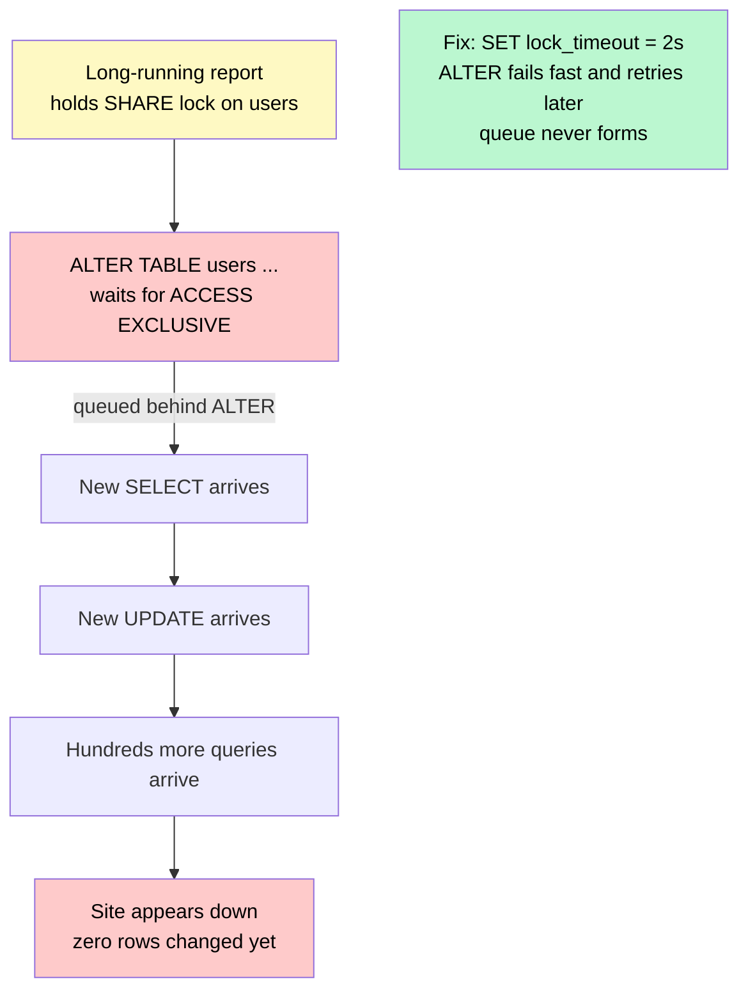

# Schema Migrations & Zero-Downtime Changes

> A **schema migration** changes the shape of your data — tables, columns, indexes, constraints — while the system keeps running. The discipline is doing it without locking a billion-row table, breaking the old code that's still deployed, or losing writes in the middle.

**Level:** 2 · **Topic:** 11 · **Prerequisites:** [ACID & Transactions](../05-ACID-and-Transactions/README.md) · [Indexing](../03-Indexing/README.md) · [Database Replication](../01-Database-Replication/README.md) · [Change Data Capture](../10-Change-Data-Capture/README.md)

---

## 🎯 The Problem

Friday, 4 p.m. A developer ships a harmless-looking change: `ALTER TABLE users ADD COLUMN plan VARCHAR(20) NOT NULL DEFAULT 'free'`. The `users` table has 400 million rows.

What actually happens depends on the database and version — and none of the outcomes are harmless:

- On older MySQL, the `ALTER` **rebuilds the entire table** and holds a lock while it does. The site is read-only for 40 minutes.
- On PostgreSQL, the statement needs an `ACCESS EXCLUSIVE` lock. A long-running analytics query already holds a lock on `users`, so the `ALTER` **waits** — and while it waits, *every new query* on `users` queues behind it. The site freezes within seconds even though the `ALTER` hasn't done anything yet.
- The migration finishes, then the rolling deploy starts. For ten minutes, half the app servers run new code that expects `plan`, and half run old code that does `INSERT INTO users (id, email)` — which now fails because the old code doesn't know about `plan` (or worse, silently writes the wrong default).
- Someone decides to rename `plan` to `subscription_tier`. Every old server crashes on the next query.

**The core problem:** a schema change is not one atomic event. It's a coordination problem between the database, the *old* code, the *new* code, and the data that already exists — all of which must keep working at every instant during the change.

---

## 🌍 Real-World Analogy

Think of replacing a bridge that carries rush-hour traffic. You do not close the bridge, tear it down, and build a new one — that's a migration with downtime.

Instead you **build the new lane alongside the old one** (expand). You **repaint the lines** so cars gradually move onto the new lane while both lanes are open (migrate). Only when nobody is using the old lane anymore do you **demolish it** (contract). At no point does traffic stop, and at every point a driver who "still thinks" the old lane exists can use it.

This three-phase pattern — **expand, migrate, contract** — is the entire foundation of zero-downtime schema changes.

---

## 🧠 Core Idea

### Step 1 — Migrations are versioned code

Every schema change is a numbered, forward-only script checked into the repo and applied by a tool (Flyway, Liquibase, Alembic, Rails migrations, Prisma Migrate, golang-migrate). The tool records which versions have run in a `schema_migrations` table. Nobody types `ALTER TABLE` into production by hand. This gives you review, reproducibility across environments, and a clear history.

### Step 2 — The golden rule: old and new code coexist

During a rolling deploy (or a canary, or a rollback), **version N and version N+1 of the application run at the same time against the same database.** Therefore every schema state must be compatible with *both*. This one rule generates every other rule in this topic:

- Never rename a column in one step.
- Never change a column's type in one step.
- Never drop a column the previous release still reads.
- Never add a `NOT NULL` column without a default that old code can satisfy.

Decouple *migrations* from *deploys*: run the migration first (compatible with old code), deploy the new code, then run a cleanup migration later.

### Step 3 — Expand → Migrate → Contract

Renaming `plan` to `subscription_tier` the safe way takes four releases:

| Release | Schema change | Application code |
|---------|---------------|------------------|
| **1 — Expand** | Add nullable column `subscription_tier` | Unchanged; still reads/writes `plan` |
| **2 — Migrate (write)** | — | **Dual-write:** every write sets both `plan` and `subscription_tier`; reads still use `plan` |
| **2.5 — Backfill** | Batch job copies `plan` → `subscription_tier` for existing rows; verify counts match | — |
| **3 — Migrate (read)** | Add `NOT NULL` constraint now that it's safe | Reads switch to `subscription_tier`; still dual-writes |
| **4 — Contract** | Drop `plan` (after a soak period) | Stop writing `plan` |

At every step, the release before and after can run together. If anything goes wrong you roll *forward* to a fix — you never have to roll the schema backward, which is the change that usually can't be undone.

### Step 4 — Know which operations are dangerous

The same logical change can be free or catastrophic depending on how you write it. PostgreSQL and MySQL 8 both have "instant" paths for the safe versions.

| Operation | ❌ Dangerous form | ✅ Safe form |
|-----------|-------------------|--------------|
| Add column | `ADD COLUMN x NOT NULL DEFAULT now()` (volatile default → full rewrite on PG) | `ADD COLUMN x` nullable, or with a **constant** default (PG 11+ and MySQL 8 are instant) |
| Add index | `CREATE INDEX` (blocks writes for the whole build) | `CREATE INDEX CONCURRENTLY` (PG) / `ALGORITHM=INPLACE, LOCK=NONE` (MySQL) |
| Add NOT NULL to existing column | `ALTER COLUMN x SET NOT NULL` (full table scan under lock) | `ADD CONSTRAINT ... CHECK (x IS NOT NULL) NOT VALID`, then `VALIDATE CONSTRAINT` (scans without blocking writes) |
| Rename column | `RENAME COLUMN` (old code breaks instantly) | Expand / migrate / contract |
| Change type | `ALTER COLUMN x TYPE bigint` (rewrite + lock) | New column + dual-write + backfill + swap |
| Add foreign key | `ADD FOREIGN KEY` (locks both tables for validation) | Add as `NOT VALID`, then `VALIDATE` |
| Delete millions of rows | One giant `DELETE` (huge transaction, replication lag, lock bloat) | Batched deletes of 1–10K rows with a pause between batches |
| Drop column | Immediately after deploying | Only after the old release is fully gone (and ideally a soak period) |

### Step 5 — Backfills that don't take the site down

Copying or transforming existing data is where most migration outages actually happen. A single `UPDATE users SET subscription_tier = plan` on 400M rows is one transaction that runs for hours, holds row locks, bloats the WAL, and sends replication lag through the roof.

The pattern:

1. **Batch by primary key range** — `WHERE id BETWEEN 1 AND 10000`, then the next range. One short transaction per batch.
2. **Throttle** — sleep between batches; watch replica lag and pause if it exceeds a threshold.
3. **Make it resumable** — persist the last completed range so a crash or a deploy can pick up where it left off.
4. **Verify** — compare counts or checksums between old and new representation before switching reads.
5. **Run it as a job, not a migration** — the migration framework should not sit in a "running" state for six hours.

### Step 6 — The lock-queue hazard

Even an instant `ALTER` must first *acquire* a lock. If any transaction — a report, a stuck connection, a long `SELECT` — holds a conflicting lock, the `ALTER` waits. In PostgreSQL, everything that arrives *after* the waiting `ALTER` queues behind it, because the lock manager is fair. The site goes down without a single row being changed.

The fix is one line: `SET lock_timeout = '2s'` before the migration. If the lock isn't available quickly, fail fast and retry — never sit in the queue.

### Step 7 — Online schema change tools

When the database cannot do a change online natively, tools rebuild the table on the side:

- **pt-online-schema-change (Percona):** creates a copy of the table with the new schema, adds **triggers** on the original so live writes are mirrored to the copy, copies rows in chunks, then atomically renames. Triggers add write latency and can deadlock.
- **gh-ost (GitHub):** same idea but **triggerless** — it reads the MySQL binlog to replay live changes onto the copy, throttles itself based on replica lag, and supports pausing and a controlled cut-over. Built precisely because triggers hurt at GitHub's scale.
- **PostgreSQL:** transactional DDL, `CONCURRENTLY`, `NOT VALID` constraints, and `pg_repack` for rebuilding bloated tables online.
- **Vitess / PlanetScale:** schema changes as reviewed "deploy requests" applied online via the same copy-and-cutover strategy, with a revert window.

### Step 8 — Schemaless doesn't mean migration-free

Document stores just move the problem into the application. The usual pattern is a `schema_version` field on every document, code that can read every version still present, **lazy migration** (upgrade a document when it's next read or written), and a background job to sweep the long tail. Event streams need the same care — that's [Data Serialization & Schema Evolution](../../Level-03-Communication/09-Data-Serialization-and-Schema-Evolution/README.md).

---

## 📊 How It Works

### Expand → Migrate → Contract Across Releases

*Follow the column that each release reads and writes. At every vertical slice, adjacent releases are compatible.*

*Caption: Four small, reversible steps replace one dangerous rename. The old column survives until the very end, so any release can be rolled back to its predecessor.*

### How gh-ost Changes a Table Without Locking It

*The application never stops writing to `users`. gh-ost builds the new table on the side and replays live changes from the binlog until the two converge.*

*Caption: The only lock is a sub-second metadata lock during the final rename. Row copying is throttled by replica lag, so the migration slows itself down instead of hurting readers.*

### The Lock-Queue Hazard

*Caption: The ALTER itself would take milliseconds. The damage comes from everything that queues behind it while it waits for the lock.*

---

## 🔧 Types / Variations / Strategies

| Strategy | Mechanism | Locking | Best for |
|----------|-----------|---------|----------|
| **Native instant DDL** | Metadata-only change (PG constant defaults, MySQL 8 `INSTANT`) | Momentary | Adding nullable columns, constant defaults |
| **Native online DDL** | Database rebuilds in background (`CONCURRENTLY`, `INPLACE, LOCK=NONE`) | None or brief | Indexes, some column changes |
| **Trigger-based copy** (pt-osc, LHM) | Copy table + triggers mirror live writes | Brief at rename | MySQL without binlog access |
| **Binlog-based copy** (gh-ost, Ghostferry) | Copy table + replay binlog | Brief at rename | Large MySQL tables at scale |
| **Expand / migrate / contract** | Multi-release application pattern | None | Renames, type changes, moving data between tables |
| **Lazy migration** | Version field per record; upgrade on read | None | Document stores, event payloads |
| **Shadow table + CDC** | New table fed by CDC, cut over when caught up | None | Moving a table to a new database or shape |

---

## 🏢 Real-World Examples

### GitHub — gh-ost
GitHub built gh-ost in 2016 after trigger-based tools caused too much write amplification and too many deadlocks on their busiest tables. Its binlog-driven design lets migrations be throttled, paused, and cut over on an operator's schedule. It has since become the standard for large MySQL fleets.

### Stripe — online migrations at scale
Stripe published the four-step pattern they use to move data between models with zero downtime: dual-write to old and new, change reads to the new store, stop writing the old, then remove the old. The same shape as expand/migrate/contract, applied to a multi-hundred-million-row Mongo collection with continuous verification.

### Shopify — Ghostferry and LHM
Shopify's flagship sale days make any lock unthinkable. They maintain LHM (Large Hadron Migrator) for trigger-based online changes and built Ghostferry to move entire shops between database shards live — copy, tail the binlog, verify, cut over — the migration pattern applied to *rebalancing*.

### Facebook — where "online schema change" started
Facebook open-sourced OSC for MySQL in 2010 because their user tables could never be locked. Percona's pt-online-schema-change and later gh-ost are its descendants.

### PlanetScale / Vitess — schema changes as deploy requests
Every schema change goes through a review like a pull request, is applied online with the copy-and-cutover method, and can be **reverted within a window** because the old table is retained. This turns the scariest operation in a database into a routine one.

### Braintree — safe operations for high-volume PostgreSQL
Braintree's engineering guide (the source of the `lock_timeout` habit for many teams) catalogues exactly which PostgreSQL operations are safe on hot tables and how to rewrite the unsafe ones — much of the table in Step 4 traces back to it.

---

## ⚖️ Trade-offs

| Factor | Direct `ALTER` in one step | Expand / migrate / contract |
|--------|---------------------------|-----------------------------|
| **Downtime risk** | High on large tables | Near zero |
| **Number of releases** | 1 | 3–4 |
| **Code complexity during change** | None | Dual-write logic, feature flags |
| **Storage during change** | 1× (or 2× during rebuild) | 2× for the duplicated column/table |
| **Rollback** | Often impossible (data already rewritten) | Roll forward at any step; old shape intact |
| **Replication lag** | Massive spike | Controlled by batch throttling |
| **Time to complete** | Minutes to hours (blocking) | Days (non-blocking) |

---

## ✅ When to Use / ❌ When NOT to Use

**Use the full zero-downtime playbook when:**
- The table is large (tens of millions of rows or more) or hot (thousands of writes/second).
- The service has an uptime SLO that a 10-minute lock would blow.
- You deploy with rolling or canary strategies where old and new code overlap.

**Just run the `ALTER` when:**
- The table is small (thousands of rows) and the change is instant anyway.
- You're in development, staging, or a maintenance window with real downtime accepted.
- The change is genuinely metadata-only on your database version — but still set `lock_timeout`.

---

## ⚠️ Common Pitfalls

1. **Renaming or retyping a column directly.** The single most common outage. Always expand/migrate/contract.
2. **No `lock_timeout`.** A migration that waits for a lock takes the site down without changing anything. Set it every time.
3. **Backfilling in one statement.** Hours-long transaction, lock bloat, replica lag, and a WAL that fills the disk. Batch, throttle, checkpoint.
4. **Creating indexes without `CONCURRENTLY`.** Blocks all writes for the duration on PostgreSQL. (Note: `CONCURRENTLY` can't run inside a transaction — most migration tools need a flag for this.)
5. **Dropping a column while old pods are still running `SELECT *`.** The previous release is still live during a rolling deploy. Contract in a *later* release.
6. **Trusting ORM auto-migrations in production.** They generate the dangerous forms by default. Review the SQL; use a linter like `strong_migrations` (Rails) or `squawk` (PostgreSQL).
7. **Testing only on a small dev database.** A migration that takes 2 seconds on 10K rows can take 2 hours on 200M. Rehearse on a production-sized snapshot.
8. **Forgetting non-SQL consumers.** CDC pipelines, search indexes, caches, and reporting jobs also depend on the schema — coordinate the change with them.

---

## 🎤 Interview Tips

- **The classic prompt:** "How would you add a `NOT NULL` column to a billion-row table with zero downtime?" Walk through: add nullable → dual-write → batched backfill with throttling → add constraint as `NOT VALID` then `VALIDATE` → switch reads → drop old. Mention `lock_timeout` unprompted.
- **Say the words "expand, migrate, contract"** — it's the name interviewers are listening for, and it shows you know changes span multiple releases.
- **Connect it to deployments:** "Because we roll out gradually, old and new code always coexist, so every intermediate schema must work with both."
- **Name the tools:** gh-ost, pt-online-schema-change, PostgreSQL `CONCURRENTLY` — and say *why* gh-ost exists (triggers hurt).
- **Common follow-up:** "How do you keep dual-writes consistent?" → Write both in one transaction when they're in the same database; use the outbox/CDC pattern when they're not.
- **Common follow-up:** "How do you roll back?" → You roll *forward*. The old column is still there until the contract step, so reverting the app is always safe.

---

## 📝 TL;DR

- A schema change is a coordination problem between the DB, old code, new code, and existing data — never a single atomic event.
- **Golden rule:** old and new application versions always run together, so every schema state must satisfy both.
- **Expand → migrate → contract:** add the new shape, dual-write, backfill in throttled batches, switch reads, then remove the old shape in a later release.
- Know the safe form of every operation: nullable columns, `CONCURRENTLY`, `NOT VALID` + `VALIDATE`, batched deletes.
- **Always set `lock_timeout`** — the lock queue, not the ALTER, is what takes the site down.
- For big MySQL tables use online tools (gh-ost); for document stores use per-record versions and lazy migration.

---

## 🧪 Test Yourself

1. A PostgreSQL `ALTER TABLE orders ADD COLUMN note TEXT` is "instant," yet running it took the site down for three minutes. What most likely happened, and what one-line change prevents it?
2. Lay out the release-by-release plan to change `user_id` from `INT` to `BIGINT` on a 2-billion-row table with zero downtime. Which step is the riskiest, and how do you verify it?
3. Why does gh-ost read the binlog instead of using triggers like pt-online-schema-change? What problem do triggers cause on a hot table?
4. Your backfill job is a single `UPDATE ... SET new_col = old_col`. List three distinct ways this can hurt production and rewrite the approach.
5. A document database "has no schema." A teammate says that means no migrations are needed. Explain what actually happens when you rename a field in 50 million documents, and describe the lazy-migration pattern.

---

## 📚 Further Reading

- [gh-ost: GitHub's online schema migration for MySQL](https://github.com/github/gh-ost) — design doc explains the triggerless, binlog-based approach.
- [Online migrations at scale — Stripe Engineering](https://stripe.com/blog/online-migrations) — the dual-write, four-phase pattern with verification.
- [Safe Operations for High Volume PostgreSQL — Braintree](https://medium.com/paypal-tech/postgresql-at-scale-database-schema-changes-without-downtime-20d3749ed680) — the canonical "which operations lock" guide.
- [PostgreSQL: ALTER TABLE — Notes](https://www.postgresql.org/docs/current/sql-altertable.html) — which forms rewrite the table and which are metadata-only.
- [strong_migrations](https://github.com/ankane/strong_migrations) — catches dangerous migrations in Rails; its README doubles as a checklist for any stack.
- [Parallel Change — Danilo Sato (martinfowler.com)](https://martinfowler.com/bliki/ParallelChange.html) — the expand/contract pattern formalized.
- Previous: [10 — Change Data Capture](../10-Change-Data-Capture/README.md) · Next Level: [Level 03 — Communication](../../Level-03-Communication/README.md) · Back to [Level 02 Overview](../README.md)
- See also: [Deployment Strategies](../../Level-06-Scale-and-Reliability/04-Deployment-Strategies/README.md) · [Data Serialization & Schema Evolution](../../Level-03-Communication/09-Data-Serialization-and-Schema-Evolution/README.md)
