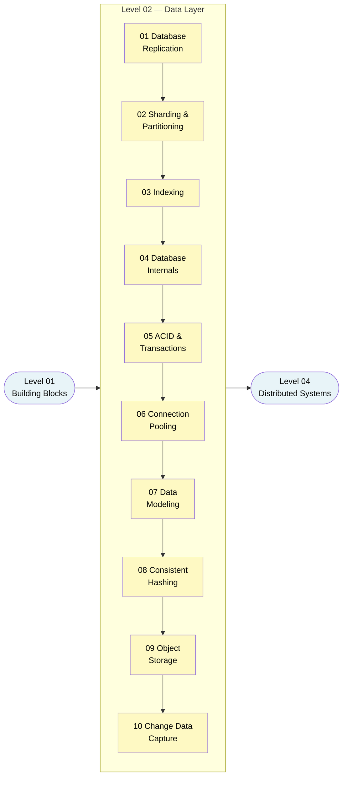

# Level 2 — The Data Layer

> **Theme:** Where your data actually lives — and why it's almost always the bottleneck.

Every fast front-end eventually hits a slow database. This level dives deep into the data layer: how databases store, replicate, shard, and serve data at scale. By the end you'll understand why Postgres behaves differently from Cassandra, why a missing index can kill a production system, and how to talk confidently about trade-offs in any data-heavy interview question.

---

## 🎯 Learning Outcomes

After completing this level you will be able to:

- Explain **replication topologies** and the consistency trade-offs each one makes.
- Choose a **sharding strategy** and reason about hotspots and rebalancing.
- Read a **query plan**, understand when indexes help and when they hurt.
- Contrast **B-Tree** and **LSM-Tree** storage engines and know which fits which workload.
- Map **ACID properties** to isolation levels and spot concurrency anomalies.
- Size a **connection pool** and explain the serverless cold-start problem.
- Design a data model from **access patterns** for both SQL and NoSQL stores.
- Explain how **consistent hashing** minimizes key remapping when cluster nodes change.
- Choose **object storage** for blobs and know why large BLOBs never belong in a relational DB.
- Stream database changes with **CDC** (log-based capture, Debezium) and fix the dual-write problem with the outbox pattern.

---

## 📋 Prerequisites

You should be comfortable with the concepts in [Level 01 — Building Blocks](../Level-01-Building-Blocks/README.md), especially:

- [Scalability](../Level-01-Building-Blocks/01-Scalability/README.md) — vertical vs horizontal scaling.
- [Caching](../Level-01-Building-Blocks/03-Caching/README.md) — because caching often lives in front of the data layer.
- [Databases SQL vs NoSQL](../Level-01-Building-Blocks/04-Databases-SQL-vs-NoSQL/README.md) — high-level distinction before we go deep.

---

## 🗺️ Roadmap

---

## 📚 Topics

| # | Topic | What You'll Learn | Est. Time |
|---|-------|-------------------|-----------|
| 01 | [Database Replication](./01-Database-Replication/README.md) | Leader-follower, multi-leader, leaderless; replication lag; failover | 45 min |
| 02 | [Sharding and Partitioning](./02-Sharding-and-Partitioning/README.md) | Shard keys, range/hash/consistent hashing, hotspots, rebalancing | 45 min |
| 03 | [Indexing](./03-Indexing/README.md) | B-Tree mental model, composite/covering indexes, query plans | 35 min |
| 04 | [Database Internals](./04-Database-Internals/README.md) | B-Trees vs LSM-Trees, WAL, SSTables, compaction, amplification | 50 min |
| 05 | [ACID and Transactions](./05-ACID-and-Transactions/README.md) | Atomicity, isolation levels, dirty reads, MVCC vs locking, BASE | 45 min |
| 06 | [Connection Pooling](./06-Connection-Pooling/README.md) | Pool sizing math, PgBouncer/HikariCP, pool exhaustion, serverless | 30 min |
| 07 | [Data Modeling](./07-Data-Modeling/README.md) | Normalization, access-pattern modeling, embedding vs referencing | 50 min |
| 08 | [Consistent Hashing](./08-Consistent-Hashing/README.md) | Hash ring, virtual nodes, why only K/N keys move when a node changes | 35 min |
| 09 | [Object Storage](./09-Object-Storage/README.md) | S3 / GCS / Azure Blob, presigned URLs, lifecycle tiers, the BLOB-in-DB antipattern | 30 min |
| 10 | [Change Data Capture](./10-Change-Data-Capture/README.md) | Dual-write problem, log-based CDC, Debezium, outbox pattern, cache/search-index sync | 40 min |

**Total estimated time: ~6.5 hours**

---

## 🔗 Where This Level Leads

Once you're comfortable here, the natural next step is [Level 04 — Distributed Systems](../Level-04-Distributed-Systems/README.md), where CAP Theorem and consistency models build directly on what you've learned about replication and ACID.

You'll also find this level referenced heavily in [Bonus — Real-World Architectures](../Bonus-Real-World-Architectures/README.md) case studies.

---

*Recommended reading: **Designing Data-Intensive Applications** (DDIA) by Martin Kleppmann, Chapters 3–7 map almost 1-to-1 with the topics in this level.*
