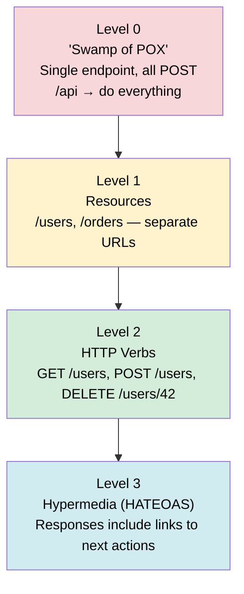

# API Design & REST

> REST (Representational State Transfer) is an architectural style that uses HTTP to expose resources via a uniform interface, making web APIs predictable, scalable, and easy to consume.

**Level:** 3 · **Topic:** 1 · **Prerequisites:** [HTTP & HTTPS](../../Level-00-Foundations/06-HTTP-and-HTTPS/README.md)

---

## 🎯 The Problem

You've built a backend service. Now a mobile app, a web frontend, and a third-party partner all need to talk to it — over the internet, from different languages, on different devices. You need a contract: a way to say "send *this*, get *that* back, every time." Without a standard, every team invents its own wire format and chaos follows.

---

## 🌍 Real-World Analogy

Think of a **restaurant menu**. The menu (API) lists exactly what you can order (endpoints), what information you must give the waiter (request parameters), and what you'll receive in return (response body). The kitchen (server) handles the cooking internally — you never need to know how. The waiter (HTTP) carries messages back and forth. REST is the menu standard that every restaurant agrees to follow.

---

## 🧠 Core Idea

REST was defined by Roy Fielding in his 2000 PhD dissertation. It is **not a protocol** — it is a set of constraints on top of HTTP:

1. **Client–Server** — UI and data storage are separated
2. **Stateless** — every request contains all the info the server needs; no session stored server-side
3. **Cacheable** — responses declare whether they can be cached
4. **Uniform Interface** — resources, standard verbs, self-descriptive messages
5. **Layered System** — client can't tell if it's talking to a CDN, load balancer, or origin
6. **Code on Demand** *(optional)* — server can send executable code (e.g., JavaScript)

The key insight: **treat everything as a resource** (noun), identified by a URL, and manipulate it with standard HTTP verbs (verb).

---

## 📊 How It Works

### HTTP Verbs → CRUD Mapping

| Verb | CRUD | Idempotent? | Safe? | Typical Use |
|------|------|-------------|-------|-------------|
| GET | Read | ✅ Yes | ✅ Yes | Fetch resource |
| POST | Create | ❌ No | ❌ No | Create new resource |
| PUT | Replace | ✅ Yes | ❌ No | Full update (replace) |
| PATCH | Modify | ✅ Usually | ❌ No | Partial update |
| DELETE | Delete | ✅ Yes | ❌ No | Remove resource |

> **Idempotent** = calling it N times gives the same result as calling it once. **Safe** = no side effects (read-only).

### Request / Response Flow

```mermaid
sequenceDiagram
    participant C as Client (App)
    participant LB as Load Balancer
    participant S as API Server
    participant DB as Database

    C->>LB: GET /v1/users/42<br/>Authorization: Bearer <token>
    LB->>S: Forward request
    S->>DB: SELECT * FROM users WHERE id=42
    DB-->>S: Row data
    S-->>LB: 200 OK<br/>Content-Type: application/json<br/>{"id":42,"name":"Alice",...}
    LB-->>C: 200 OK + JSON body

    style C fill:#d4edda,color:#000
    style LB fill:#fff3cd,color:#000
    style S fill:#d1ecf1,color:#000
    style DB fill:#fde8d8,color:#000
```

---

## 🔧 URL Design

### Resource Naming Rules

```
✅ Good                          ❌ Bad
/users                           /getUsers
/users/42                        /user/get?id=42
/users/42/orders                 /getUserOrders?userId=42
/users/42/orders/7               /get_order_by_id
/products?category=shoes         /fetchProductsByCategory
```

**Rules:**
- Use **nouns**, not verbs — the verb is the HTTP method
- Use **plural** nouns (`/users`, not `/user`)
- Use **lowercase + hyphens** for multi-word paths (`/order-items`)
- Nest for **ownership** (max 2–3 levels deep)
- Use **query params** for filtering, sorting, pagination

### Common HTTP Status Codes

| Code | Meaning | When to Use |
|------|---------|-------------|
| 200 | OK | Successful GET, PUT, PATCH |
| 201 | Created | Successful POST that created a resource |
| 204 | No Content | Successful DELETE (no body needed) |
| 400 | Bad Request | Invalid input / validation error |
| 401 | Unauthorized | Missing or invalid auth token |
| 403 | Forbidden | Authenticated but not permitted |
| 404 | Not Found | Resource doesn't exist |
| 409 | Conflict | Duplicate create, version conflict |
| 422 | Unprocessable Entity | Semantic validation failure |
| 429 | Too Many Requests | Rate limit hit |
| 500 | Internal Server Error | Unexpected server failure |
| 503 | Service Unavailable | Downstream dependency down |

---

## 📊 API Versioning Strategies

| Strategy | Example | Pros | Cons |
|----------|---------|------|------|
| **URL path** | `/v1/users` | Simple, visible, easy to route | URL "dirtied" |
| **Header** | `API-Version: 2` | Clean URLs | Harder to test in browser |
| **Query param** | `/users?version=2` | Easy for exploration | Can be missed |
| **Content negotiation** | `Accept: application/vnd.api.v2+json` | RESTful-purist | Complex for clients |

**Recommendation:** URL path versioning (`/v1/`, `/v2/`) is the most practical. Stripe, GitHub, and Twilio all use it.

---

## 📊 Pagination

### Offset Pagination

```
GET /users?limit=20&offset=40   → items 41–60
```

- Simple to implement and understand
- **Problem:** if items are inserted/deleted between pages, you get duplicates or gaps
- **Problem:** `OFFSET 10000` on a large table is slow (database still scans 10 000 rows)

### Cursor Pagination

```
GET /users?limit=20&after=eyJpZCI6NDB9   → stable, efficient
```

- Server returns an opaque cursor pointing to the last seen item
- No duplicates even if data changes; scales to millions of rows
- **Problem:** can't jump to page 50 directly

**Use offset for admin panels / small datasets; cursor for infinite scroll / large datasets.**

---

## 📊 Richardson Maturity Model

A scale for "how RESTful is your API":



Most production APIs live at **Level 2**. Level 3 (HATEOAS) is theoretically pure REST but rarely adopted in practice.

---

## 🏢 Real-World Examples

**GitHub REST API** (`api.github.com/v3`)
- `GET /repos/{owner}/{repo}` → repo details
- `POST /repos/{owner}/{repo}/issues` → create issue
- Uses cursor pagination (`Link` header with `rel=next`)
- Returns `X-RateLimit-Remaining` headers

**Stripe API** (`api.stripe.com/v1`)
- Idempotency keys via `Idempotency-Key` header on POST/PUT
- Versioned by date (`Stripe-Version: 2023-10-16`)
- Consistent error format: `{"error": {"type": "...", "message": "..."}}`
- Cursor pagination with `starting_after` / `ending_before`

**Twilio, SendGrid, Shopify** — all follow the same URL + verb + status code playbook

---

## ⚖️ Trade-offs

| Concern | REST Strength | REST Weakness |
|---------|--------------|---------------|
| Simplicity | Very easy to learn and debug | — |
| Tooling | Ubiquitous (curl, Postman, browsers) | — |
| Over-fetching | — | Returns whole object; client may need 2 fields |
| Under-fetching | — | May require multiple round-trips |
| Real-time | — | Request/response only; need WebSockets or SSE |
| Type safety | — | No built-in schema enforcement on wire |
| Performance | Good for public APIs | Binary protocols (gRPC) are faster internally |

---

## ✅ When to Use REST / ❌ When NOT to Use

**Use REST when:**
- Building a **public API** consumed by unknown clients
- The team values **simplicity and debuggability**
- Operations map cleanly to CRUD
- Clients need to be able to **bookmark or share URLs**

**Don't use REST when:**
- You have deeply nested, relationship-heavy queries → consider **GraphQL**
- Internal microservices need high-throughput, low-latency → consider **gRPC**
- You need real-time push → consider **WebSockets / SSE**
- You need long-running async work → consider **Message Queues**

---

## ⚠️ Common Pitfalls

1. **Verbs in URLs** — `/createUser` defeats the purpose; use `POST /users`
2. **Wrong status codes** — returning `200 OK` with `{"success": false}` in the body
3. **No versioning from day 1** — breaking changes force clients to update immediately
4. **Inconsistent naming** — mixing `camelCase` and `snake_case` in the same API
5. **Forgetting idempotency** — `POST /orders` called twice should not double-charge; use idempotency keys
6. **No pagination** — `GET /users` returning 1 million rows crashes clients and servers
7. **Swallowing errors** — returning 500 for a 404-level problem confuses clients

---

## 🎤 Interview Tips

- **"Design a REST API for X"** — start with: what are the **resources**? Then list endpoints, verbs, and status codes. Mention versioning and pagination.
- **"Is REST stateless?"** — yes; auth token goes in every request header, server holds no session
- **"Difference between PUT and PATCH?"** — PUT replaces the whole resource; PATCH applies partial changes
- **"How would you handle errors?"** — consistent JSON error body: `{"error": {"code": "...", "message": "..."}}` + correct HTTP status code
- **"How do you version an API?"** — URL path (`/v1/`) for simplicity; mention date-based versioning (Stripe style) as an alternative

---

## 📝 TL;DR

- REST = resources (nouns) + HTTP verbs + stateless requests + standard status codes
- URL design: plural nouns, no verbs, nest for ownership (`/users/42/orders`)
- GET/HEAD are safe + idempotent; PUT/DELETE are idempotent; POST is neither
- Version from day 1 (`/v1/`) and add pagination before you need it
- Use cursor pagination for large or changing datasets; offset for small, stable ones
- Most APIs live at Richardson Level 2; HATEOAS (Level 3) is academic in practice

---

## 🧪 Test Yourself

1. Which HTTP verb should you use to partially update a user's email address?
2. What status code do you return when a client is authenticated but lacks permission?
3. Why is `GET /getAllUsers` not RESTful?
4. A client calls `DELETE /users/99` twice. What should both responses return, and why?
5. You have 10 million users. The client requests page 500 with offset pagination. What goes wrong?
6. Stripe wants to ensure a retry of a payment creation doesn't charge the customer twice. What mechanism do they use?

---

## 📚 Further Reading

- [REST Dissertation — Roy Fielding (2000)](https://www.ics.uci.edu/~fielding/pubs/dissertation/rest_arch_style.htm)
- [GitHub REST API Docs](https://docs.github.com/en/rest)
- [Stripe API Reference](https://stripe.com/docs/api)
- [Richardson Maturity Model — Martin Fowler](https://martinfowler.com/articles/richardsonMaturityModel.html)
- Next: [02-GraphQL](../02-GraphQL/README.md) — solving over/under-fetching
