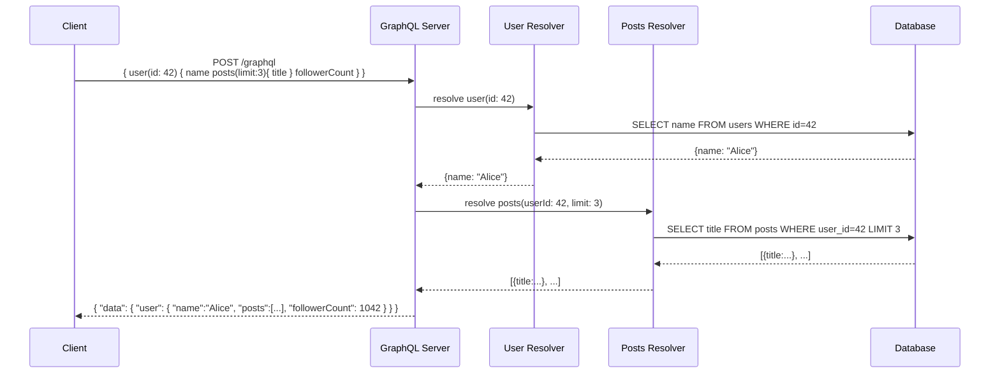
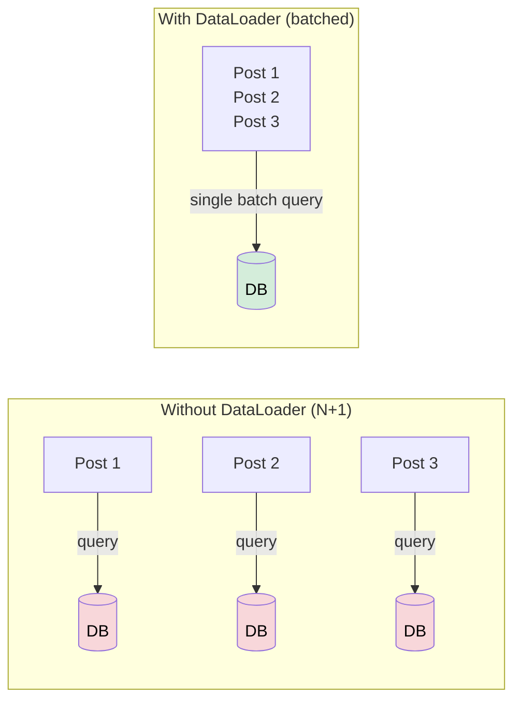

# GraphQL

> GraphQL is a query language for APIs and a runtime for executing those queries, letting clients ask for exactly the data they need — nothing more, nothing less.

**Level:** 3 · **Topic:** 2 · **Prerequisites:** [API Design & REST](../01-API-Design-REST/README.md), [HTTP & HTTPS](../../Level-00-Foundations/06-HTTP-and-HTTPS/README.md)

---

## 🎯 The Problem

Imagine you're building a mobile profile screen. You need:
- The user's name and avatar
- Their last 3 posts (title only)
- A count of their followers

With REST you might hit:
1. `GET /users/42` → returns 20 fields (over-fetching)
2. `GET /users/42/posts?limit=3` → second round-trip
3. `GET /users/42/followers/count` → third round-trip

Three requests, slow on mobile, and the first response dumps fields you'll never use.

**Over-fetching:** Server sends more data than the client needs.
**Under-fetching:** One endpoint doesn't return enough; you need multiple calls.

GraphQL solves both with a single, precise query.

---

## 🌍 Real-World Analogy

REST is like ordering from a **fixed menu** — you get the full combo whether you want the fries or not. GraphQL is like a **custom sandwich bar**: you walk up and say exactly what you want — sourdough, turkey, no tomato, extra avocado — and that's precisely what you get. The kitchen (server) has all the ingredients; you control the assembly.

---

## 🧠 Core Idea

GraphQL has three pillars:

| Pillar | What it does |
|--------|-------------|
| **Schema** | Defines all types and their relationships — the contract |
| **Query** | Client fetches data (read-only) |
| **Mutation** | Client modifies data (create/update/delete) |
| **Subscription** | Client receives real-time updates over a long-lived connection |

Everything goes through **one endpoint**: `POST /graphql`

The schema is the source of truth. Both client and server are bound by it, enabling strong typing and auto-generated documentation.

---

## 📊 How It Works

### Query Flow: Client → Resolvers → Data Sources



### Schema Definition Language (SDL)

```graphql
type User {
  id: ID!
  name: String!
  email: String!
  posts(limit: Int = 10): [Post!]!
  followerCount: Int!
}

type Post {
  id: ID!
  title: String!
  body: String!
  author: User!
  createdAt: String!
}

type Query {
  user(id: ID!): User
  posts(tag: String): [Post!]!
}

type Mutation {
  createPost(title: String!, body: String!): Post!
  deletePost(id: ID!): Boolean!
}

type Subscription {
  postCreated: Post!
}
```

`!` means non-nullable (required). `[Post!]!` = a non-null list of non-null Posts.

### Example Query & Response

**Request:**
```graphql
query GetProfile {
  user(id: "42") {
    name
    posts(limit: 3) {
      title
    }
    followerCount
  }
}
```

**Response:**
```json
{
  "data": {
    "user": {
      "name": "Alice",
      "posts": [
        { "title": "System Design 101" },
        { "title": "REST vs GraphQL" },
        { "title": "Building Scalable APIs" }
      ],
      "followerCount": 1042
    }
  }
}
```

One request. Exactly the fields you asked for.

---

## 🔧 Types / Variations / Strategies

### Operations

| Operation | HTTP Method | Purpose | Example |
|-----------|------------|---------|---------|
| **Query** | POST | Fetch data | `query { user(id: 1) { name } }` |
| **Mutation** | POST | Modify data | `mutation { createPost(...) { id } }` |
| **Subscription** | WebSocket | Real-time events | `subscription { postCreated { title } }` |

### Resolvers

Every field in a GraphQL response is produced by a **resolver function**. A resolver is just a function that returns data for its field:

```javascript
const resolvers = {
  Query: {
    user: (_, { id }, context) => context.db.findUser(id),
  },
  User: {
    posts: (user, { limit }, context) =>
      context.db.findPostsByUser(user.id, limit),
    followerCount: (user, _, context) =>
      context.db.countFollowers(user.id),
  },
};
```

---

## ⚠️ The N+1 Problem

This is the #1 GraphQL gotcha in interviews.

**Scenario:** Fetch 10 posts, each with their author's name.

```graphql
query {
  posts(limit: 10) {
    title
    author { name }   # ← this triggers a resolver per post
  }
}
```

Without batching, the server runs:
1. `SELECT * FROM posts LIMIT 10` → 1 query
2. `SELECT name FROM users WHERE id = ?` × 10 → 10 queries = **N+1 queries**

**Solution: DataLoader**

DataLoader batches and caches resolver calls within a single request tick:

```
Tick 1: collect all user IDs requested → [1, 2, 3, 4, 5, 6, 7, 8, 9, 10]
Tick 2: SELECT name FROM users WHERE id IN (1,2,...,10)  → 1 query
```

Total queries: **2** instead of 11. DataLoader is a must-know for GraphQL interviews.



---

## 🏢 Real-World Examples

**Meta (Facebook)** — GraphQL's birthplace (2012, open-sourced 2015). Built to solve the mobile news feed's over/under-fetching problem.

**GitHub GraphQL API** (`api.github.com/graphql`) — Lets you fetch repo, commits, issues, and pull requests in a single query. Replaced parts of their REST API.

**Shopify** — Entire storefront API is GraphQL. Merchants query exactly the product fields their frontend needs.

**Twitter/X** — Internal use. The GraphQL schema enforces exactly what mobile clients can request.

**Airbnb, Netflix, PayPal** — All use GraphQL for their client-facing data layer.

---

## ⚖️ Trade-offs

| Concern | GraphQL | REST |
|---------|---------|------|
| Fetching efficiency | ✅ Exact data, single request | ❌ Over/under-fetching common |
| Caching | ❌ Harder (single endpoint, POST) | ✅ HTTP cache by URL |
| Learning curve | ❌ Schema + resolvers + DataLoader | ✅ Simple HTTP |
| Tooling | ✅ GraphiQL, schema introspection | ✅ Curl, Postman, browsers |
| Type safety | ✅ Strong schema contract | ❌ JSON is schemaless by default |
| File uploads | ❌ Awkward (multipart spec) | ✅ Straightforward |
| Rate limiting | ❌ Hard to limit by "cost" | ✅ Limit by endpoint |
| Public APIs | ❌ Exposes schema, complex auth | ✅ Easier to secure and document |

---

## ✅ When to Use GraphQL / ❌ When NOT to Use

**Use GraphQL when:**
- Multiple clients (web, iOS, Android) need **different shapes** of the same data
- You want to **reduce round-trips** on mobile or slow networks
- Your data model has **many relationships** (social graphs, e-commerce, CMSes)
- You want **self-documenting APIs** via schema introspection

**Don't use GraphQL when:**
- Simple CRUD with few relationships → **REST is fine**
- You need **HTTP caching** at the CDN level → REST URLs cache better
- Internal microservices → **gRPC** is faster and leaner
- Team is small and unfamiliar with GraphQL → cognitive overhead not worth it
- You primarily deal with **file uploads or binary data**

---

## ⚠️ Common Pitfalls

1. **Ignoring the N+1 problem** — skipping DataLoader brings a GraphQL API to its knees
2. **No query depth limiting** — a malicious client can nest queries infinitely: `{ user { posts { author { posts { author { ... } } } } } }`
3. **No query complexity scoring** — let clients count "cost" of a query before executing
4. **Over-exposing the schema** — introspection in production leaks your entire data model
5. **Mutations without auth checks** — resolver-level authorization is your responsibility
6. **Treating mutations like REST** — mutations should still be atomic and return the modified object
7. **Subscriptions at scale** — WebSocket connections are stateful; you'll need a pub/sub backplane (Redis) to fan out to many servers

---

## 🎤 Interview Tips

- **"When would you choose GraphQL over REST?"** — multiple clients needing different shapes, reducing round-trips, relationship-heavy data
- **"What is the N+1 problem?"** — 10 posts → 10 separate author queries; solve with DataLoader batching
- **"How does caching work with GraphQL?"** — harder because single POST endpoint; use persisted queries or CDN by operation name
- **"What are subscriptions?"** — real-time updates via WebSocket; the client subscribes to events (e.g., new message in a chat room)
- **"What is schema introspection?"** — clients can query `__schema` to discover all types; disable in production for security

---

## 📝 TL;DR

- GraphQL solves REST's over-fetching and under-fetching with a single, typed query endpoint
- Three operations: **Query** (read), **Mutation** (write), **Subscription** (real-time)
- Every field is resolved by a resolver function; N+1 is the killer performance bug
- **DataLoader** batches N resolver calls into 1 database query per tick
- Better than REST when: multiple clients, relationship-heavy data, mobile bandwidth matters
- Worse than REST when: simple CRUD, CDN caching needed, small team, file uploads

---

## 🧪 Test Yourself

1. What does "over-fetching" mean in the context of REST? How does GraphQL fix it?
2. You fetch 100 blog posts and each resolver fetches the author separately. How many DB queries run without DataLoader? With?
3. What is a GraphQL Subscription used for? What transport does it typically use?
4. A client sends a query 50 levels deep. What could go wrong and how do you prevent it?
5. Why is HTTP caching harder with GraphQL than REST?
6. When would you choose REST over GraphQL for a new public API?

---

## 📚 Further Reading

- [GraphQL Official Spec](https://spec.graphql.org/)
- [GitHub GraphQL API Explorer](https://docs.github.com/en/graphql/overview/explorer)
- [DataLoader (Facebook)](https://github.com/graphql/dataloader)
- [How to GraphQL](https://www.howtographql.com/)
- Previous: [01-API-Design-REST](../01-API-Design-REST/README.md) · Next: [03-gRPC-and-RPC](../03-gRPC-and-RPC/README.md)
