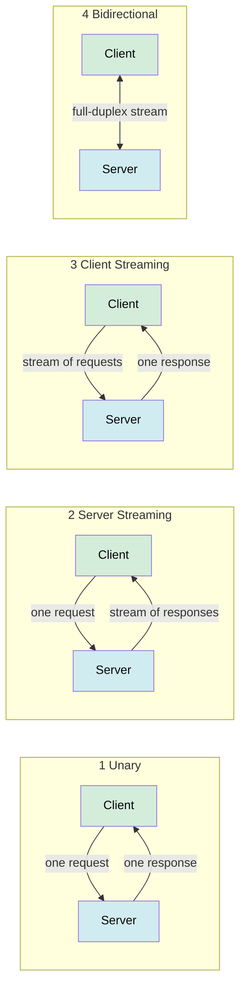

# gRPC and RPC

> Remote Procedure Call (RPC) lets you call a function on another machine as if it were local; gRPC is Google's modern, high-performance RPC framework built on Protocol Buffers and HTTP/2.

**Level:** 3 · **Topic:** 3 · **Prerequisites:** [API Design & REST](../01-API-Design-REST/README.md), [GraphQL](../02-GraphQL/README.md)

---

## 🎯 The Problem

You have 50 microservices. Service A needs to call Service B's "calculate shipping cost" function. REST works, but:
- JSON parsing is slow and verbose (human-readable is not machine-optimal)
- REST is request/response only — no streaming
- You have to write HTTP client boilerplate in every language
- No enforced contract between client and server at compile time

You want something **fast, type-safe, and multi-language** with auto-generated client/server code.

---

## 🌍 Real-World Analogy

Imagine calling a colleague at a remote office. With REST, you're sending **formal letters** (text, verbose, one per interaction). With gRPC, you have a **direct phone line** (binary, fast, can stay open for a conversation). You both agree in advance on the topics you'll discuss (the `.proto` schema), so there's no confusion about what you mean.

---

## 🧠 Core Idea

### The RPC Concept

RPC (Remote Procedure Call) is older than the internet. The idea: hide the network. Client code calls `shippingService.Calculate(order)` — it looks like a local function call, but the framework serializes arguments, sends them over the network, and deserializes the result.

### gRPC's Three Key Technologies

| Technology | Role | Why It Matters |
|-----------|------|---------------|
| **Protocol Buffers (Protobuf)** | Serialization format | Binary, ~3–10× smaller than JSON, schema-enforced |
| **HTTP/2** | Transport | Multiplexing, header compression, full-duplex streams |
| **Code generation** | Client/server stubs | Write `.proto`, generate type-safe code in 10+ languages |

---

## 📊 How It Works

### Protocol Buffers

You define your service in a `.proto` file:

```protobuf
syntax = "proto3";

package shipping;

message OrderRequest {
  string order_id = 1;
  float weight_kg = 2;
  string destination_zip = 3;
}

message ShippingQuote {
  float price_usd = 4;
  int32 estimated_days = 5;
}

service ShippingService {
  rpc CalculateShipping (OrderRequest) returns (ShippingQuote);
  rpc TrackOrder (TrackRequest) returns (stream TrackEvent);    // server streaming
  rpc UploadOrders (stream OrderRequest) returns (Summary);     // client streaming
  rpc Chat (stream Message) returns (stream Message);           // bidirectional
}
```

The `protoc` compiler generates client and server code in Go, Java, Python, C++, Node.js, etc.

### gRPC Call Flow

```mermaid
sequenceDiagram
    participant C as gRPC Client (Go)
    participant S as gRPC Server (Java)
    participant PB as Protobuf Layer

    C->>PB: shippingStub.CalculateShipping(order)
    Note over PB: Serialize to binary<br/>(~60 bytes vs ~200 bytes JSON)
    PB->>S: HTTP/2 POST /shipping.ShippingService/CalculateShipping<br/>Content-Type: application/grpc<br/>[binary body]
    S->>PB: Execute handler, build ShippingQuote
    Note over PB: Serialize response to binary
    PB-->>C: HTTP/2 response [binary]
    Note over C: Deserialize → typed ShippingQuote struct

    style C fill:#d4edda,color:#000
    style S fill:#d1ecf1,color:#000
    style PB fill:#fff3cd,color:#000
```

### The Four Streaming Modes



| Mode | Proto Syntax | Use Case |
|------|-------------|---------|
| **Unary** | `rpc Get(Req) returns (Resp)` | Standard request/response |
| **Server streaming** | `rpc Get(Req) returns (stream Resp)` | Stock prices, log tailing, ML inference chunks |
| **Client streaming** | `rpc Upload(stream Req) returns (Resp)` | File upload, IoT sensor batches |
| **Bidirectional** | `rpc Chat(stream Req) returns (stream Resp)` | Real-time chat, collaborative editing |

---

## 🔧 Why HTTP/2 Matters

HTTP/1.1 (used by most REST APIs) is **head-of-line blocked**: one request at a time per TCP connection. Browsers work around this with 6 parallel connections.

HTTP/2 delivers:
- **Multiplexing** — many streams over one TCP connection, no blocking
- **Header compression** (HPACK) — repeated headers (auth tokens) sent once
- **Binary framing** — more efficient than text HTTP/1.1
- **Full-duplex** — both sides send simultaneously, enabling bidirectional streaming

This is why gRPC handles **thousands of concurrent RPCs** efficiently on a single connection.

---

## 🏢 Real-World Examples

**Google** — Invented gRPC (2015). Used internally for nearly all inter-service calls. Powers Google Cloud APIs.

**Netflix** — Uses gRPC for studio-side microservices. Chose it for performance and the ability to generate typed clients in many languages.

**Cloudflare** — Internal service mesh uses gRPC for low-latency, high-throughput control plane communication.

**etcd (Kubernetes)** — The distributed key-value store underlying Kubernetes uses gRPC for cluster coordination.

**Lyft, Square, Dropbox** — Major gRPC adopters for internal microservice communication.

---

## ⚖️ gRPC vs REST vs GraphQL

| Dimension | REST | GraphQL | gRPC |
|-----------|------|---------|------|
| **Transport** | HTTP/1.1 or HTTP/2 | HTTP/1.1 or HTTP/2 | HTTP/2 only |
| **Format** | JSON (text) | JSON (text) | Protobuf (binary) |
| **Schema** | OpenAPI (optional) | SDL (required) | `.proto` (required) |
| **Code gen** | Optional | Optional | Core feature |
| **Streaming** | ❌ (SSE/WS workaround) | Subscriptions (WS) | ✅ 4 modes built-in |
| **Browser support** | ✅ Native | ✅ Native | ❌ Needs gRPC-Web proxy |
| **Caching** | ✅ HTTP cache | ❌ Hard | ❌ No HTTP cache |
| **Best for** | Public APIs | Multi-client, relational | Internal microservices |
| **Performance** | Good | Good | ✅ Best (binary + H2) |
| **Learning curve** | Low | Medium | Medium–High |

---

## ✅ When to Use gRPC / ❌ When NOT to Use

**Use gRPC when:**
- **Internal microservices** where you control both client and server
- You need **high throughput / low latency** (trading systems, ML serving)
- You want **streaming** (real-time data, file transfer, IoT telemetry)
- You want **multi-language** type-safe clients generated from one source of truth
- Performance matters more than debuggability with curl

**Don't use gRPC when:**
- Building a **public API** — browsers can't call gRPC natively (need gRPC-Web + Envoy proxy)
- Your team needs to **debug with curl / Postman** — binary format is opaque
- Simple CRUD with few performance requirements → REST is simpler
- You need **HTTP caching** — gRPC responses aren't cache-friendly

---

## ⚠️ Common Pitfalls

1. **Forgetting gRPC-Web for browsers** — gRPC uses HTTP/2 trailers that browsers don't support; you need a proxy (Envoy, grpc-gateway)
2. **Backward incompatibility** — never change field numbers in `.proto`; add new fields with new numbers only
3. **No load balancer support** — many L4 load balancers don't understand HTTP/2 streams; use L7 proxies (Envoy, Nginx, Istio)
4. **Deadline propagation** — always set and propagate deadlines; otherwise a slow call chain blocks indefinitely
5. **Error codes** — gRPC has its own status codes (NOT HTTP): `OK`, `NOT_FOUND`, `UNAVAILABLE`, `DEADLINE_EXCEEDED`, etc.
6. **Ignoring interceptors** — use interceptors (like middleware) for auth, logging, tracing — don't implement these in every handler

---

## 🎤 Interview Tips

- **"Why use gRPC over REST internally?"** — binary serialization (~5× faster), HTTP/2 multiplexing, streaming, type-safe code generation, schema enforcement
- **"What are Protocol Buffers?"** — a schema language + binary serialization format; smaller and faster than JSON; requires both sides to have the same `.proto`
- **"What streaming modes does gRPC support?"** — unary, server streaming, client streaming, bidirectional streaming
- **"Can a browser call gRPC directly?"** — No, not natively. You need gRPC-Web (a subset) plus an Envoy proxy to translate
- **"How does gRPC handle errors?"** — its own status code enum (e.g., `DEADLINE_EXCEEDED`, `PERMISSION_DENIED`), not HTTP status codes

---

## 📝 TL;DR

- RPC = call remote functions like local; gRPC = Google's modern, HTTP/2-based RPC framework
- Protocol Buffers = binary schema + serialization; ~3–10× smaller than JSON; requires codegen
- Four streaming modes: unary, server-streaming, client-streaming, bidirectional
- HTTP/2 enables multiplexing many calls over one connection with no head-of-line blocking
- gRPC wins for internal microservices; REST wins for public APIs; GraphQL wins for multi-client flexibility
- Browsers can't call gRPC natively — use gRPC-Web + a proxy for browser clients

---

## 🧪 Test Yourself

1. What problem does gRPC solve that plain JSON over HTTP doesn't?
2. Name the four streaming modes in gRPC and a use case for each.
3. Why can't a browser directly call a gRPC service?
4. What happens if you change a field number in a `.proto` file?
5. When would you choose REST over gRPC for a new service?
6. What is the gRPC equivalent of HTTP status codes?

---

## 📚 Further Reading

- [gRPC Official Documentation](https://grpc.io/docs/)
- [Protocol Buffers Language Guide](https://protobuf.dev/programming-guides/proto3/)
- [HTTP/2 Spec (RFC 7540)](https://httpwg.org/specs/rfc7540.html)
- [gRPC vs REST vs GraphQL — thoughtworks](https://www.thoughtworks.com/radar/techniques/grpc)
- Previous: [02-GraphQL](../02-GraphQL/README.md) · Next: [04-Message-Queues](../04-Message-Queues/README.md)
