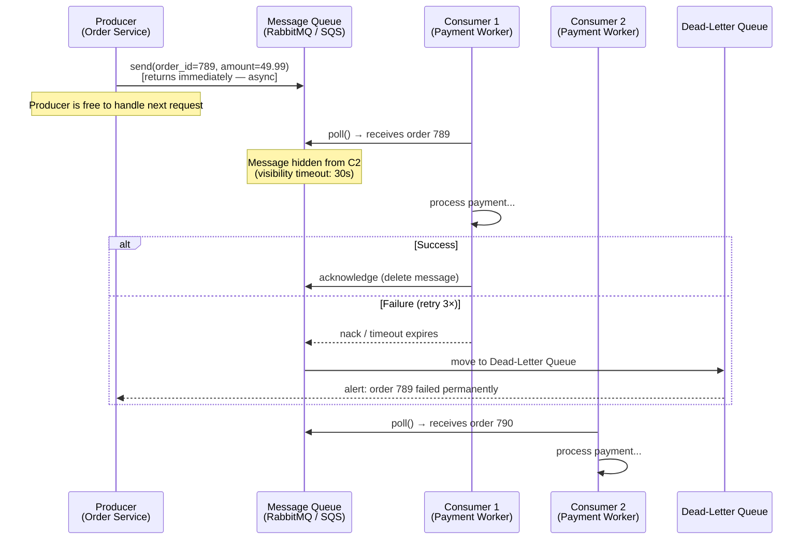
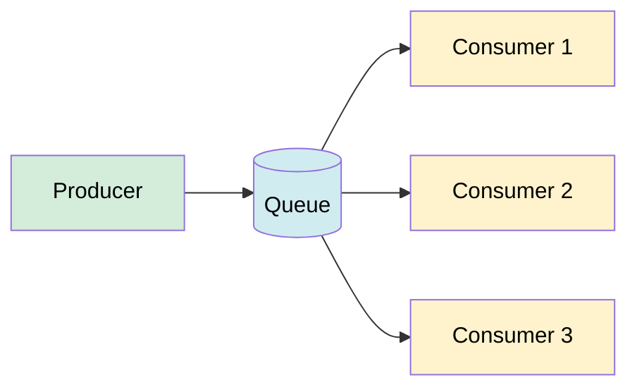

# Message Queues

> A message queue is a durable, asynchronous communication channel that decouples producers (senders) from consumers (receivers), letting each operate at its own pace.

**Level:** 3 · **Topic:** 4 · **Prerequisites:** [API Design & REST](../01-API-Design-REST/README.md), [gRPC and RPC](../03-gRPC-and-RPC/README.md)

---

## 🎯 The Problem

Your e-commerce service processes orders. On Black Friday, 50,000 orders arrive per second. Your payment service can only handle 5,000 per second. With direct synchronous calls:
- The order service times out waiting for payment
- Payment service crashes under load
- Orders are lost

You need a **buffer**: store the work, process it at the rate the consumer can handle, and never lose a message even if the consumer is temporarily down.

---

## 🌍 Real-World Analogy

Think of a **ticket queue at a government office**. Citizens (producers) take a number and sit down. The desk clerks (consumers) call numbers one at a time. Citizens don't need to wait at the counter; they can browse their phone. If a clerk goes on break, the queue holds the numbers — no work is lost. New desks can open (scale out) without changing how citizens take numbers. This is exactly what a message queue does for services.

---

## 🧠 Core Idea

A message queue sits between two services:

```
Producer → [Message Queue] → Consumer
```

The producer **pushes** messages to the queue and immediately returns. The consumer **pulls** messages when it's ready. Neither service knows about the other's timing, language, or implementation.

Key properties:
- **Decoupling** — producer and consumer are independent; either can restart without losing messages
- **Buffering** — absorbs traffic spikes; consumer processes at a sustainable rate
- **Durability** — messages are stored on disk; survive crashes
- **Retry / resilience** — failed processing → message goes back to queue for retry

---

## 📊 How It Works

### Basic Async Flow



### Visibility Timeout

When a consumer receives a message, the queue **hides** it from other consumers for a configurable period (e.g., 30 seconds). This prevents double-processing. If the consumer doesn't acknowledge within the timeout (crash/slow), the message becomes visible again for another consumer to pick up.

```
[Message Visible] → Consumer polls → [Message Hidden: 30s]
                                            ↓
                     ACK received → [Deleted]     OR     Timeout → [Visible again]
```

---

## 🔧 Delivery Guarantees

| Guarantee | What It Means | Risk | Use Case |
|-----------|--------------|------|---------|
| **At-most-once** | Delivered 0 or 1 times | Messages can be lost | Metrics, telemetry |
| **At-least-once** | Delivered 1+ times | Duplicate messages possible | Most business logic (make idempotent) |
| **Exactly-once** | Delivered exactly 1 time | Complex, expensive | Financial transactions |

**Reality:** Most queues give you at-least-once. Design your consumers to be **idempotent** (processing the same message twice has the same effect as once). Example: use `order_id` as the database primary key — inserting twice is a no-op.

See also: [Level-04 Idempotency and Exactly-Once](../../Level-04-Distributed-Systems/07-Idempotency-and-Exactly-Once/README.md)

---

## 🔧 Ordering

| Queue Type | Ordering Guarantee | Notes |
|-----------|-------------------|-------|
| **Standard** (AWS SQS default) | Best-effort (not strict) | Higher throughput, may reorder |
| **FIFO** (AWS SQS FIFO, RabbitMQ with single consumer) | Strict FIFO | Lower throughput, 3,000 msg/s limit |
| **Partitioned** (Kafka) | Per-partition order | Scale + order; same key → same partition |

---

## 🔧 Competing Consumers Pattern

Multiple consumers read from the **same queue** — each message goes to exactly one consumer. This is horizontal scaling of workers:



Add more consumers during a spike, remove them when load drops. The queue doesn't care how many consumers are running.

---

## 🔧 Dead-Letter Queue (DLQ)

A DLQ captures messages that repeatedly fail processing (e.g., after 3 retries). Instead of retrying forever (or losing the message), you:
1. Move it to DLQ
2. Alert the on-call engineer
3. Inspect and replay manually or with a fix

Without a DLQ, a "poison message" (one that always causes a crash) loops forever and blocks the queue.

---

## 🏢 Real-World Examples

**RabbitMQ** — open-source AMQP broker. Used by companies like Instagram (early architecture), Reddit, and many fintech firms. Supports complex routing (topic exchanges, fanout, direct).

**AWS SQS (Simple Queue Service)** — fully managed, infinite scale, per-message pricing. Used by Amazon's own order pipeline. Standard (best-effort) and FIFO variants. Visibility timeout: 0–12 hours.

**Azure Service Bus** — Microsoft's managed queue with sessions (ordered delivery per group), dead-lettering, and scheduled delivery.

**Celery + Redis/RabbitMQ** — popular task queue for Python web apps. Django/Flask push background jobs (email, image resize) to Celery workers.

---

## ⚖️ Trade-offs

| Concern | Message Queue | Direct (Sync) RPC |
|---------|--------------|-------------------|
| Coupling | ✅ Loose (producer doesn't know consumer) | ❌ Tight (must be up at same time) |
| Latency | ❌ Higher (async, not instant) | ✅ Lower (direct call) |
| Throughput | ✅ Smooths spikes | ❌ Consumer must keep up |
| Reliability | ✅ Durable, retry built-in | ❌ Caller must implement retries |
| Complexity | ❌ Extra infrastructure to run | ✅ Simple function call |
| Ordering | ❌ Hard in distributed queues | ✅ Inherent in single call chain |
| Observability | ❌ Need to trace across systems | ✅ Single call stack |

---

## ✅ When to Use Message Queues / ❌ When NOT to Use

**Use message queues when:**
- Work is **time-consuming** and the caller doesn't need an immediate result (image processing, email, report generation)
- You need to **smooth traffic spikes** without scaling the consumer to peak capacity
- Two services are **independently deployable** and you want them to stay decoupled
- You need **retry semantics** without building that logic yourself
- The consumer might be **temporarily unavailable** (maintenance, crash)

**Don't use message queues when:**
- You need a **synchronous response** (user waiting for a search result)
- **Fan-out to many subscribers** is the goal → use Pub/Sub ([05-Pub-Sub](../05-Pub-Sub/README.md))
- The workload is tiny and latency matters more than resilience

---

## ⚠️ Common Pitfalls

1. **Non-idempotent consumers** — at-least-once delivery means duplicates happen; always design for idempotency
2. **Ignoring the DLQ** — messages silently fail forever without a DLQ and alerting
3. **Visibility timeout too short** — if processing takes 45s and timeout is 30s, the message is re-delivered while still being processed → duplicate
4. **Message too large** — SQS limit is 256 KB; store large payloads in S3 and put the S3 key in the message
5. **No backpressure awareness** — if producers outpace consumers indefinitely, the queue grows unboundedly; set queue depth alarms
6. **Ordering assumptions** — standard queues don't guarantee order; don't assume FIFO without a FIFO queue
7. **Not monitoring queue depth** — a growing queue is the first sign of consumer slowness; alert on it

---

## 🎤 Interview Tips

- **"How do you handle a payment service that's temporarily down?"** — buffer orders in a message queue; payment service pulls when it's back up; no orders lost
- **"What is a Dead-Letter Queue?"** — captures messages that fail repeatedly; prevents poison messages from looping; used for alerting and manual inspection
- **"Difference between at-least-once and exactly-once?"** — at-least-once may replay duplicates; exactly-once requires distributed coordination (expensive); design consumers to be idempotent instead
- **"How do you scale message processing?"** — add more consumers (competing consumers pattern); queue distributes work automatically
- **"Queue vs Pub/Sub?"** — queue: one consumer gets each message; pub/sub: all subscribers get each message (fan-out)

---

## 📝 TL;DR

- Message queues decouple producers from consumers via an async, durable buffer
- Producer sends and forgets; consumer pulls when ready — neither depends on the other being live
- At-least-once is the practical standard; design consumers to be **idempotent**
- Visibility timeout prevents double-delivery; DLQ captures permanently failing messages
- Competing consumers = horizontal scaling of workers; each message goes to one worker
- Use queues for async work, spike absorption, and resilience; use Pub/Sub for fan-out to many receivers

---

## 🧪 Test Yourself

1. On Black Friday, orders arrive 10× faster than the payment service can process them. How does a message queue help?
2. What is a visibility timeout and why does it exist?
3. A message causes the consumer to crash every time. What happens without a DLQ? What happens with one?
4. Your consumer sends a confirmation email on each message. The queue delivers the same message twice due to a retry. What problem arises, and how do you fix it?
5. How does the competing consumers pattern enable horizontal scaling?
6. When would you choose pub/sub over a message queue?

---

## 📚 Further Reading

- [AWS SQS Documentation](https://docs.aws.amazon.com/AWSSimpleQueueService/latest/SQSDeveloperGuide/welcome.html)
- [RabbitMQ Tutorials](https://www.rabbitmq.com/tutorials)
- [Enterprise Integration Patterns — Messaging](https://www.enterpriseintegrationpatterns.com/MessagingChannels.html)
- [Idempotency and Exactly-Once](../../Level-04-Distributed-Systems/07-Idempotency-and-Exactly-Once/README.md)
- Previous: [03-gRPC-and-RPC](../03-gRPC-and-RPC/README.md) · Next: [05-Pub-Sub](../05-Pub-Sub/README.md)
