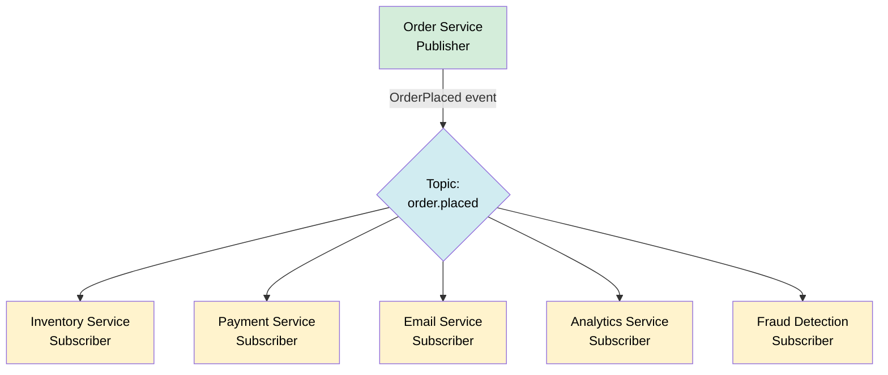
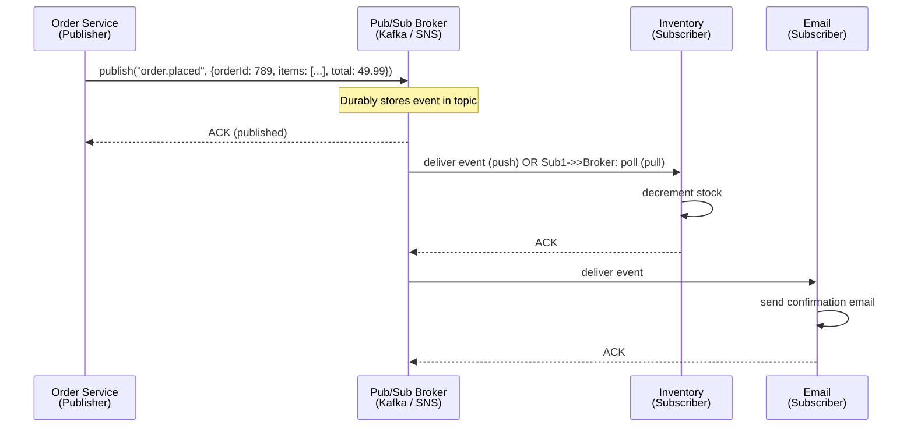
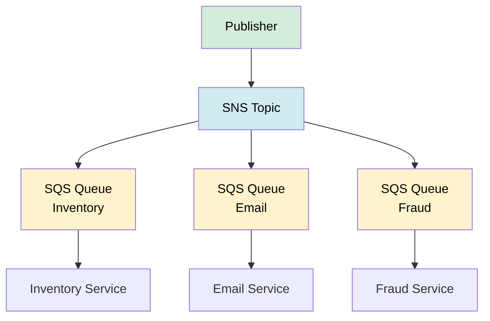

# Pub/Sub (Publish/Subscribe)

> Publish/Subscribe is a messaging pattern where publishers emit events to named topics and any number of subscribers receive those events independently — enabling fan-out, loose coupling, and event-driven architectures.

**Level:** 3 · **Topic:** 5 · **Prerequisites:** [Message Queues](../04-Message-Queues/README.md)

---

## 🎯 The Problem

Your e-commerce platform has an `OrderPlaced` event. Five different systems care about it:
- **Inventory** — decrement stock
- **Payments** — charge the card
- **Email** — send confirmation
- **Analytics** — record the sale
- **Fraud Detection** — score the transaction

With direct RPC calls, the Order Service has to know about and call all five. Every new subscriber requires changing the Order Service. It becomes a dependency nightmare.

You need **fan-out**: one event → many independent receivers, with the publisher knowing nothing about who's listening.

---

## 🌍 Real-World Analogy

Pub/Sub is like **subscribing to a newspaper**. The journalist (publisher) writes an article and hands it to the paper (topic). Every subscriber who opted in gets a copy on their doorstep — independently. The journalist never knows who's reading. A new subscriber signing up doesn't require the journalist to do anything differently. If the paper has 10,000 subscribers or just 1, the writing process is the same.

---

## 🧠 Core Idea

Three actors:

| Actor | Role |
|-------|------|
| **Publisher** | Sends an event to a topic; doesn't know who receives it |
| **Topic** | Named channel that holds events (e.g., `order.placed`, `user.signup`) |
| **Subscriber** | Registers interest in a topic; receives every event published to it |

The critical difference from a message queue:

| | Message Queue | Pub/Sub |
|-|--------------|---------|
| Delivery | Each message → **one** consumer | Each message → **all** subscribers |
| Model | Point-to-point (competing consumers) | Fan-out (broadcast) |
| Use case | Work distribution | Event broadcasting |
| State | Message disappears after ACK | Retained per subscriber or by offset |

---

## 📊 How It Works

### Fan-Out Flow

### Event Flow with a Broker

---

## 🔧 Push vs Pull

| Mode | How It Works | Pros | Cons |
|------|-------------|------|------|
| **Push** | Broker delivers to subscriber's endpoint | Low latency, no polling | Subscriber must be always reachable; broker controls rate |
| **Pull** | Subscriber polls broker for messages | Subscriber controls rate; easier backpressure | Slightly higher latency; need polling loop |

**AWS SNS** → push only (HTTP, Lambda, SQS)
**Kafka** → pull only (consumers poll)
**Google Pub/Sub** → both push and pull supported
**Redis Pub/Sub** → push only (fire-and-forget, no durability)

---

## 🔧 Kafka vs Traditional Pub/Sub

Kafka deserves special mention because it blurs the line between queue and pub/sub:

| Feature | Traditional Pub/Sub (SNS, Redis) | Kafka |
|---------|----------------------------------|-------|
| Retention | Events deleted after delivery | Events retained (days, weeks, forever) |
| Replay | ❌ No | ✅ Yes — consumers can rewind to any offset |
| Ordering | Per-topic (sometimes) | Per-partition (strict) |
| Scale | Millions of topics | Millions of messages/sec per topic |
| Consumer groups | One copy per subscriber | Multiple groups; each group reads independently |
| Use case | Notification fan-out | Stream processing, event sourcing, audit logs |

Kafka is covered in depth at [Level-07 Stream Processing](../../Level-07-Big-Data-and-Specialized/02-Stream-Processing/README.md).

---

## 🔧 Types / Platforms

| Platform | Type | Durability | Best For |
|----------|------|-----------|---------|
| **Apache Kafka** | Distributed log | ✅ Persistent | High-throughput streams, replay, event sourcing |
| **Google Pub/Sub** | Managed pub/sub | ✅ Persistent | GCP workloads, push + pull, global scale |
| **AWS SNS** | Managed fan-out | ❌ Fire-and-forget | Fan-out to SQS queues, Lambda, HTTP |
| **AWS SNS + SQS** | Fan-out + queue | ✅ Via SQS | Fan-out with per-subscriber durability |
| **Redis Pub/Sub** | In-memory | ❌ None | Real-time notifications, chat (not critical data) |
| **NATS** | Lightweight broker | Optional (JetStream) | Low-latency IoT, cloud-native |

### SNS + SQS Fan-Out Pattern

The most common AWS pattern: SNS fans out to multiple SQS queues (one per subscriber). Each service gets its own durable queue with retry:

---

## 🏢 Real-World Examples

**LinkedIn** — Kafka was built at LinkedIn in 2011 to handle the activity stream (profile views, connection requests, messages). Now processes trillions of messages per day.

**Netflix** — Uses Kafka to fan out play events, viewing history, and recommendation triggers to 30+ downstream services.

**Uber** — Pub/Sub for driver location updates (high-frequency, fan-out to dispatch, mapping, and ETA services simultaneously).

**Airbnb** — SNS + SQS fan-out pattern for booking events touching payments, calendars, and notifications.

**Spotify** — Kafka for music play events feeding recommendation models, royalty calculations, and analytics.

---

## ⚖️ Trade-offs

| Concern | Pub/Sub | Message Queue |
|---------|---------|--------------|
| Fan-out (1 → N) | ✅ Native | ❌ Need to send N times |
| Work distribution | ❌ All subscribers get all events | ✅ One worker per message |
| Ordering | Varies by platform | Strict (FIFO queue) |
| Replay | Kafka only | ❌ Not typical |
| Complexity | ❌ More: topics, subscriptions, consumer groups | Simpler |
| Coupling | ✅ Publisher ignores subscribers | Moderate (knows queue name) |

---

## ✅ When to Use Pub/Sub / ❌ When NOT to Use

**Use Pub/Sub when:**
- One event must trigger **multiple independent actions** (fan-out)
- You want **loose coupling** — new subscribers shouldn't require publisher changes
- Building an **event-driven architecture** where services react to facts
- You need **event replay** (Kafka) for new services to catch up on history

**Don't use Pub/Sub when:**
- You need exactly one service to handle each message → message queue
- You need **synchronous response** (user waiting) → RPC/REST
- The system is simple and fan-out isn't needed → direct calls are fine
- **Fire-and-forget with no durability** (Redis Pub/Sub) is insufficient for critical data

---

## ⚠️ Common Pitfalls

1. **Redis Pub/Sub for critical events** — Redis Pub/Sub has no persistence; if a subscriber is down when the event fires, it's gone. Use Kafka or Google Pub/Sub for durability.
2. **No subscriber isolation** — slow subscribers shouldn't slow down others; each subscriber should have its own queue/offset
3. **Schema-less events** — as the event system grows, add a schema registry (Confluent Schema Registry for Kafka); breaking changes in event shape break all subscribers silently
4. **Thundering herd** — a single high-traffic event triggers 20 subscribers simultaneously, all hammering the same database; use rate limiting at the subscriber level
5. **Runaway consumer lag** — monitor consumer group lag in Kafka; a lagging consumer may eventually OOM trying to catch up
6. **Not idempotent subscribers** — at-least-once delivery applies here too; subscribers must handle duplicate events

---

## 🎤 Interview Tips

- **"Design a notification system"** — publisher pushes events to an SNS topic; SQS queues fan out to email, SMS, push notification workers
- **"What's the difference between a queue and pub/sub?"** — queue: one consumer per message; pub/sub: all subscribers per message (fan-out)
- **"Why use Kafka instead of RabbitMQ?"** — Kafka retains events for replay, handles much higher throughput, and supports consumer groups reading independently
- **"How does a new service catch up on past events?"** — Kafka lets consumers seek to any offset; impossible with traditional queues
- **"What happens if a subscriber is slow?"** — in pull model (Kafka), it falls behind but doesn't affect others; in push model, backpressure must be managed

---

## 📝 TL;DR

- Pub/Sub = publisher → topic → all subscribers (fan-out, each gets a copy)
- Message Queue = producer → queue → one consumer (work distribution)
- Use pub/sub for event-driven architectures where one event triggers many services
- Kafka = durable, replayable log; SNS/Google Pub/Sub = managed fan-out; Redis = in-memory fire-and-forget
- SNS + SQS is the standard AWS fan-out pattern (SNS fans out, SQS makes it durable)
- Subscribers must be idempotent; monitor consumer lag; use a schema registry for large systems

---

## 🧪 Test Yourself

1. You publish an `OrderPlaced` event. Five services need to react. Why is pub/sub better than calling each service directly?
2. What is the key difference between a message queue and pub/sub?
3. Redis Pub/Sub vs Kafka — when would you choose each?
4. What is consumer lag in Kafka, and why does it matter?
5. Your inventory service is deployed and needs to process all historical `OrderPlaced` events from the past 7 days. Which platform supports this, and why?
6. Why is the SNS + SQS combination popular on AWS?

---

## 📚 Further Reading

- [Apache Kafka Documentation](https://kafka.apache.org/documentation/)
- [Google Cloud Pub/Sub Overview](https://cloud.google.com/pubsub/docs/overview)
- [AWS SNS + SQS Fan-Out Pattern](https://docs.aws.amazon.com/sns/latest/dg/sns-sqs-as-subscriber.html)
- [The Log — Jay Kreps (LinkedIn)](https://engineering.linkedin.com/distributed-systems/log-what-every-software-engineer-should-know-about-real-time-datas-unifying)
- [Kafka Deep Dive → Level-07](../../Level-07-Big-Data-and-Specialized/02-Stream-Processing/README.md)
- Previous: [04-Message-Queues](../04-Message-Queues/README.md) · Next: [06-WebSockets-and-Realtime](../06-WebSockets-and-Realtime/README.md)
