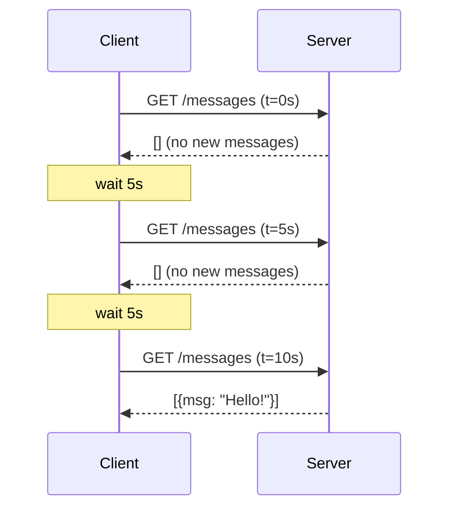
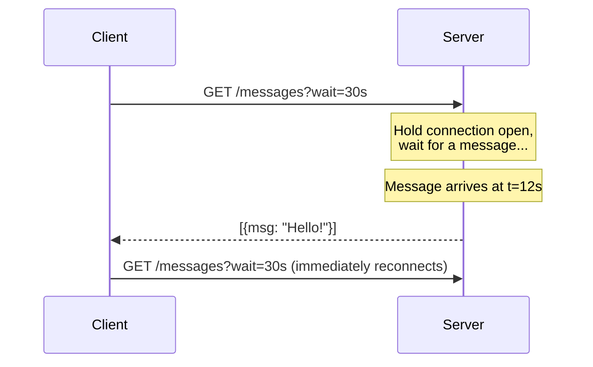
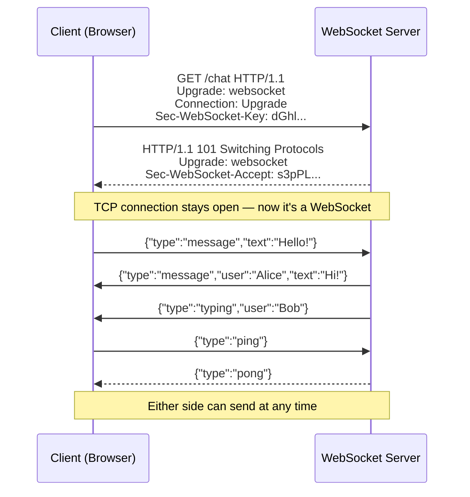
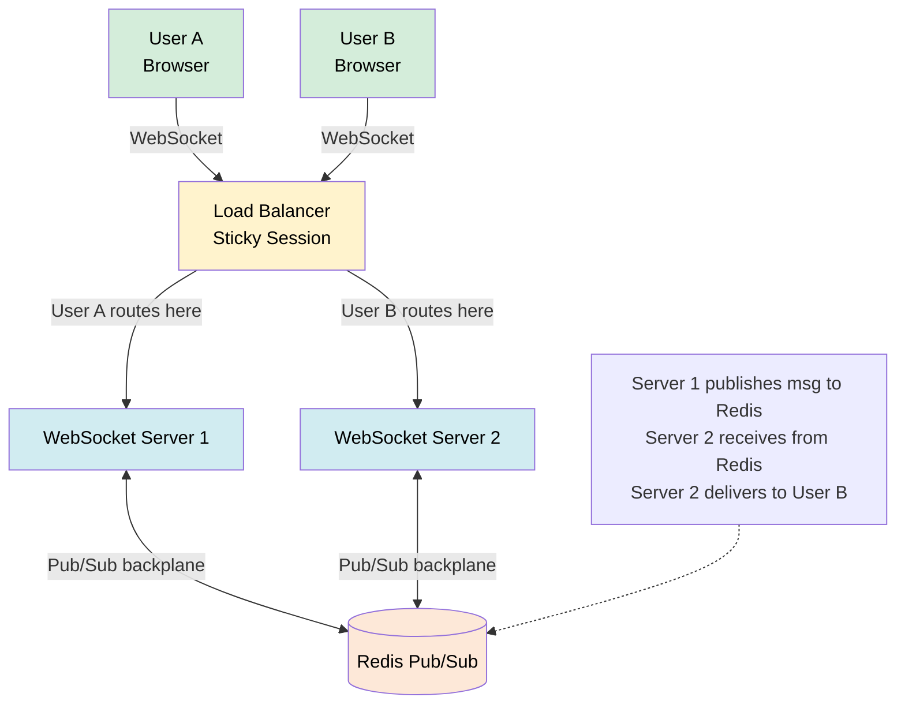

# WebSockets and Real-Time Communication

> WebSockets provide a persistent, full-duplex communication channel over a single TCP connection, enabling servers to push data to clients instantly without repeated HTTP requests.

**Level:** 3 · **Topic:** 6 · **Prerequisites:** [API Design & REST](../01-API-Design-REST/README.md), [HTTP & HTTPS](../../Level-00-Foundations/06-HTTP-and-HTTPS/README.md)

---

## 🎯 The Problem

HTTP is fundamentally request/response: the **client always speaks first**, the server only answers when asked. But modern apps need data delivered the moment it changes:

- A Slack message arrives from a colleague
- A stock price ticks to $142.37
- A chess opponent makes their move
- A Google Doc collaborator types "Hello"

Polling every second technically works, but wastes bandwidth, adds latency, and hammers servers. You need a way for the **server to push data to the client** when something happens.

---

## 🌍 Real-World Analogy

**Polling** is like calling your friend every 5 minutes to ask "did the pizza arrive?" You're burning time and their patience.

**Long polling** is like calling and staying on hold until the pizza arrives — better, but the line is still awkward.

**WebSockets** is like setting up a walkie-talkie. Once you've established the connection, either side can talk whenever they have something to say, instantly, without redialing.

---

## 🧠 Core Idea — The Real-Time Spectrum

There is a spectrum of techniques, from simplest to most capable:

| Technique | Direction | Protocol | Latency | Complexity |
|-----------|-----------|----------|---------|------------|
| **Short Polling** | Client → Server (repeated) | HTTP | High (~poll interval) | Low |
| **Long Polling** | Client → Server (blocked) | HTTP | Medium | Low–Medium |
| **Server-Sent Events (SSE)** | Server → Client only | HTTP | Low | Low |
| **WebSockets** | Full-duplex (both ways) | WS/WSS | Very low | Medium |

---

## 📊 How Each Technique Works

### Short Polling



- Simple to implement — just `setInterval(() => fetch('/messages'), 5000)`
- Wasted requests (99% return empty)
- Up to 5s delay for new messages

### Long Polling



- Lower latency than polling
- Server must hold many open connections (expensive on threads-per-connection servers)
- Works everywhere; was the technique behind early Gmail chat

### Server-Sent Events (SSE)

A persistent HTTP response where the server keeps streaming `data:` lines. Client uses the `EventSource` API.

```
GET /stream HTTP/1.1
# Server response:
Content-Type: text/event-stream

data: {"price": 142.37}

data: {"price": 142.41}

data: {"price": 141.98}
```

- **Server → client only** (no client-to-server messages over same connection)
- Automatic reconnection built into the browser `EventSource` API
- Works over HTTP/1.1 and HTTP/2; proxies/CDNs handle it well
- Perfect for: live dashboards, news feeds, score updates

### WebSockets — Full Duplex

The WebSocket **handshake** starts as an HTTP request and upgrades:



- **Both sides can send at any time** without the other initiating
- Binary or text frames (JSON, MessagePack, Protobuf)
- Latency: typically 5–50 ms (only the message, no HTTP overhead after handshake)
- URL scheme: `ws://` (plain) or `wss://` (TLS)

---

## 🔧 Comparison Table

| Feature | Short Poll | Long Poll | SSE | WebSocket |
|---------|-----------|-----------|-----|-----------|
| Direction | Client→Server | Client→Server | Server→Client | Full-duplex |
| HTTP overhead | Every request | Per reconnect | One connection | Handshake only |
| Server push | ❌ | Simulated | ✅ | ✅ |
| Client→Server on same connection | N/A | N/A | ❌ | ✅ |
| Browser support | ✅ All | ✅ All | ✅ All | ✅ All modern |
| CDN/proxy friendly | ✅ | ✅ | ✅ Usually | ❌ Needs WS-aware LB |
| Auto-reconnect | Manual | Manual | ✅ Built-in | Manual |
| Best for | Simple, low-frequency | Moderate frequency | One-way streams | Chat, games, collab |

---

## 🔧 Scaling WebSocket Connections

WebSocket connections are **stateful**: a user's connection is tied to a specific server. This breaks horizontal scaling.

### Problem

```
User A connects to Server 1
User B connects to Server 2
User A sends a message to User B
Server 1 doesn't know where User B is!
```

### Solution: Sticky Sessions + Pub/Sub Backplane



**Sticky sessions** (IP hash or cookie) route the same user to the same server.
**Redis Pub/Sub backplane** lets servers broadcast messages to each other: when Server 1 receives a message for User B, it publishes to Redis; Server 2 is subscribed and pushes to User B.

Real-world pattern used by **Socket.IO** (the `socket.io-redis` adapter), **Phoenix Channels** (Elixir), and **SignalR** (.NET).

### Connection Limits

A single server can hold ~10,000–100,000 concurrent WebSocket connections (depends on memory and OS file descriptor limits). Node.js / Elixir handle this well (async/event-loop); Java/Go with goroutines also scale well.

---

## 🏢 Real-World Examples

**Slack** — WebSockets for message delivery and presence (typing indicators, online status). Each client maintains a persistent WS connection. Fall back to long polling for restrictive networks.

**Discord** — WebSockets for chat, voice signaling, and guild member lists. Uses Gateway bots (WebSocket-based) for third-party integrations.

**Figma** — WebSockets for collaborative design editing. Real-time cursor positions and edits flow through a WebSocket connection with operational transforms applied.

**Robinhood / Interactive Brokers** — WebSockets for real-time stock price quotes and order status updates.

**Google Docs** — Uses a combination of SSE (server → client) and XHR (client → server) internally; WebSockets for the operational transform engine.

---

## ⚖️ Trade-offs

| Concern | WebSockets | SSE | REST + Polling |
|---------|-----------|-----|----------------|
| Latency | ✅ Lowest | ✅ Low | ❌ High |
| Simplicity | ❌ More complex | ✅ Simple | ✅ Simplest |
| CDN/proxy support | ❌ Limited | ✅ Good | ✅ Full |
| Horizontal scaling | ❌ Sticky sessions + backplane | ❌ Sticky sessions | ✅ Stateless |
| Full-duplex | ✅ Yes | ❌ Server→client only | ❌ Request/response |
| Mobile battery | ❌ Persistent connection drains battery | ❌ Same | ✅ Best |
| Firewall compatibility | ❌ Sometimes blocked | ✅ HTTP-based | ✅ Full |

---

## ✅ When to Use WebSockets / ❌ When NOT to Use

**Use WebSockets when:**
- **Both sides need to send messages** at any time (chat, multiplayer games, collaborative editing)
- Sub-second latency is required (trading, live scores)
- Bi-directional data flow is heavy and continuous

**Use SSE when:**
- Server pushes updates to clients, but clients don't need to reply on the same connection
- Live dashboards, news tickers, progress indicators
- You want simplicity and good CDN compatibility

**Use polling when:**
- Updates are infrequent (a few times per minute)
- Simplicity matters more than latency
- You don't control the server (third-party API)

**Avoid WebSockets when:**
- Data changes rarely — unnecessary persistent connection overhead
- CDN caching is critical (WebSocket responses aren't cacheable)
- Simple REST + webhook pattern suffices

---

## ⚠️ Common Pitfalls

1. **Not handling disconnections** — networks are flaky; always implement reconnect logic with exponential backoff
2. **No heartbeat / ping-pong** — idle connections are dropped by proxies and NAT routers; send a ping every 30s
3. **Scaling without a backplane** — multiple servers without a Redis adapter means messages don't cross servers
4. **Sending too much data** — WebSocket ≠ license to stream megabytes; send only diffs (delta updates)
5. **Authentication on upgrade** — validate auth tokens at the handshake; don't rely on cookies for WS connections in APIs
6. **No rate limiting on WS messages** — a malicious client can flood the server with messages; rate-limit at the message level too
7. **Browser limits** — browsers limit to ~6 WebSocket connections per origin; design to share one connection per tab

---

## 🎤 Interview Tips

- **"Design a chat system"** — clients connect via WebSocket to a server; server routes messages via Redis Pub/Sub backplane to the correct server holding the recipient's connection
- **"What's the difference between WebSockets and SSE?"** — WS is full-duplex (both send); SSE is server→client only but simpler, HTTP-native
- **"How do you scale WebSocket servers?"** — sticky sessions at the load balancer + Redis Pub/Sub backplane between servers
- **"Why not just poll every second?"** — wastes bandwidth, hammers servers, 1s minimum latency even for instant messages
- **"When would you use SSE instead of WebSockets?"** — live dashboards, score feeds — server pushes, client never sends (simpler and CDN-friendly)

---

## 📝 TL;DR

- HTTP is request/response only; WebSockets add full-duplex server push over a single persistent TCP connection
- Spectrum: Short Poll → Long Poll → SSE (server→client) → WebSocket (full-duplex)
- WebSocket handshake = HTTP Upgrade request; after that, it's a raw WS frame protocol
- Scaling challenge: connections are stateful → use sticky sessions + Redis Pub/Sub backplane
- SSE is often underrated: simpler, CDN-friendly, built-in auto-reconnect — use it for one-way streams
- Real apps (Slack, Discord, Figma) use WS for bi-directional, latency-sensitive communication

---

## 🧪 Test Yourself

1. What is "head-of-line blocking" in HTTP/1.1, and why doesn't it affect WebSockets?
2. A user connects to Server A; another user to Server B. User A sends a message to User B. How is it delivered?
3. When would you use SSE instead of WebSockets?
4. What is the WebSocket handshake, and which HTTP status code signals a successful upgrade?
5. Why do idle WebSocket connections sometimes drop, and how do you prevent it?
6. Design the real-time layer for a collaborative whiteboard app. What techniques would you use?

---

## 📚 Further Reading

- [WebSocket RFC 6455](https://datatracker.ietf.org/doc/html/rfc6455)
- [MDN WebSockets API](https://developer.mozilla.org/en-US/docs/Web/API/WebSockets_API)
- [Server-Sent Events — MDN](https://developer.mozilla.org/en-US/docs/Web/API/Server-sent_events/Using_server-sent_events)
- [Socket.IO Scaling with Redis Adapter](https://socket.io/docs/v4/redis-adapter/)
- [How Discord Scaled to Millions](https://discord.com/blog/how-discord-scaled-elixir-to-5-000-000-concurrent-users)
- Previous: [05-Pub-Sub](../05-Pub-Sub/README.md) · Next: [07-Rate-Limiting](../07-Rate-Limiting/README.md)
