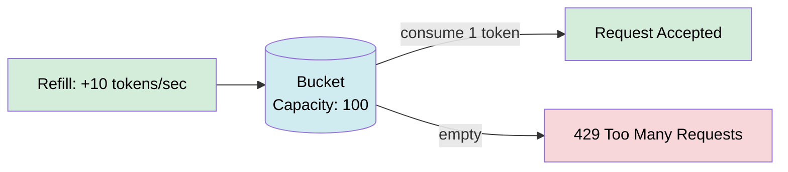
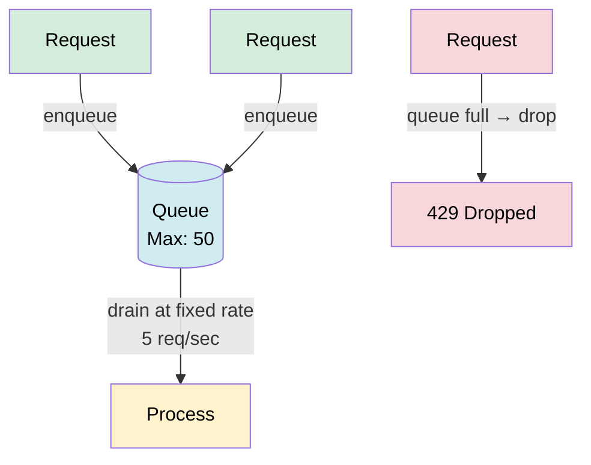
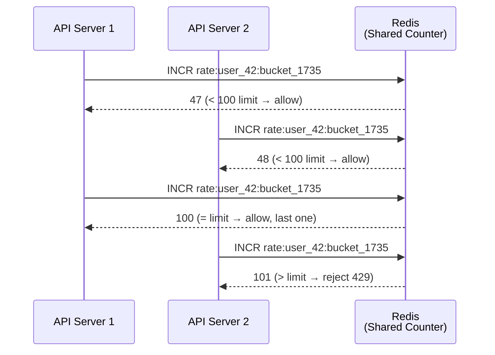
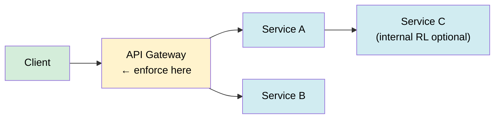

# Rate Limiting

> Rate limiting controls the number of requests a client can make to a service within a time window, protecting systems from abuse, ensuring fair usage, and keeping costs predictable.

**Level:** 3 · **Topic:** 7 · **Prerequisites:** [API Design & REST](../01-API-Design-REST/README.md), [Caching concepts (Level-02)](../../Level-01-Building-Blocks/03-Caching/README.md)

---

## 🎯 The Problem

Without rate limiting, a single bad actor (or a buggy client) can:
- Send 100,000 requests per minute and **crash your API server**
- Scrape your entire user database overnight
- Run up your cloud bill by $10,000 in an hour
- Starve legitimate users of capacity

You need a traffic cop that says: "You've had your share — come back later."

---

## 🌍 Real-World Analogy

Think of a **coffee shop** during morning rush. The barista can make 30 coffees per hour. Without any system, anyone can shout orders and hog the barista's time. With rate limiting, it's like the shop hands out **numbered tokens** at the door — each customer gets up to 3 tokens per hour. Fair, predictable, and keeps the queue from exploding.

---

## 🧠 Core Idea

Rate limiting answers three questions:
1. **Who** is being limited? (IP address, user ID, API key, tenant)
2. **What** counts as a request? (every API call, or by endpoint, or by "cost")
3. **What happens** when the limit is hit? (reject with 429, queue, or throttle)

Limiting is enforced at the **API Gateway** layer (before requests reach your services), so application servers don't need to implement it.

---

## 📊 The Five Algorithms

### 1. Fixed Window Counter

Divide time into fixed windows (e.g., each minute). Count requests per window. Reset when the window rolls over.

```
Window: 12:00:00 – 12:00:59  |  Limit: 100 req/min
          ┌─────────────────────┐
          │ Request count: 73   │  ← accept
          └─────────────────────┘
Window: 12:01:00 – 12:01:59  |  Limit: 100 req/min
          ┌─────────────────────┐
          │ Request count: 100  │  ← next request rejected (429)
          └─────────────────────┘
```

**Problem: Boundary burst.** A client sends 100 requests at 12:00:58 and 100 more at 12:01:01 — 200 requests in 3 seconds, both windows technically valid.

| Pros | Cons |
|------|------|
| Simple; O(1) storage per client | Boundary burst (2× spike possible) |
| Easy to reason about | Not smooth |

---

### 2. Sliding Window Log

Store a timestamp for every request in a sorted list. On each new request, remove timestamps older than the window, then check if count < limit.

```
Window: last 60 seconds. Limit: 100 req
Timestamps: [t-59, t-50, t-30, t-15, t-5, t-1] → count=6 → accept
```

**No boundary burst** — window always covers the true last 60 seconds.

| Pros | Cons |
|------|------|
| Accurate; no burst | O(N) memory per client (one entry per request) |
| Works at any granularity | Expensive at high request rates |

---

### 3. Sliding Window Counter (Approximate)

Hybrid: blend the previous fixed window's count with the current window, weighted by how far we are into the current window.

```
estimate = prev_count × (1 - elapsed/window) + curr_count
```

Example:
- Window = 60s, limit = 100
- Previous window: 80 requests
- Current window: 20 requests so far, 30s elapsed (50%)
- Estimate = 80 × (1 - 0.5) + 20 = 40 + 20 = 60 → allow

| Pros | Cons |
|------|------|
| O(1) space, close to accurate | Slight approximation (typically ±0.1%) |
| Handles burst at boundaries | More complex than fixed window |

This is the algorithm Cloudflare uses at scale.

---

### 4. Token Bucket

A "bucket" holds tokens up to a maximum capacity. Tokens are added at a fixed **refill rate**. Each request consumes 1 token. If the bucket is empty, reject.



- **Allows bursts** up to `capacity` requests (when bucket is full)
- **Sustained rate** is capped by the refill rate
- Two params: `capacity` (burst size) and `refill_rate` (steady-state)

**Used by:** AWS API Gateway, Stripe

| Pros | Cons |
|------|------|
| Allows controlled bursts | Two parameters to tune |
| Smooth average rate | State must be stored (tokens + timestamp) |
| Intuitive semantics | |

---

### 5. Leaky Bucket

Requests enter a queue (bucket). The queue drains at a **fixed output rate** regardless of input. If the queue is full, new requests are dropped.



- **No bursts allowed** — output is always the fixed drain rate
- Smooths traffic for downstream systems that can't handle spikes
- Used in **traffic shaping** (network QoS) more than API rate limiting

| Pros | Cons |
|------|------|
| Output is perfectly smooth | Bursts are absorbed (delayed), not served fast |
| Protects downstream systems | Latency introduced for queued requests |

---

### Algorithm Comparison

| Algorithm | Space | Burst Handling | Accuracy | Best For |
|-----------|-------|---------------|----------|---------|
| Fixed Window Counter | O(1) | ❌ Boundary burst | Approximate | Simple use cases |
| Sliding Window Log | O(N) | ✅ None | ✅ Exact | Low-traffic, accuracy critical |
| Sliding Window Counter | O(1) | ✅ Minimal | ~99.9% | High-traffic production (Cloudflare) |
| Token Bucket | O(1) | ✅ Controlled burst | Exact | API gateways, SDKs (AWS, Stripe) |
| Leaky Bucket | O(Q) | ❌ No burst | Exact output | Network shaping, smooth downstream |

---

## 📊 Distributed Rate Limiting with Redis

Single-server rate limiting is easy. But with 50 API servers, each server's local counter only tracks its own requests. A user hitting all 50 servers could send 50× the limit.

**Solution: Atomic Redis operations as the shared counter.**

### Redis INCR + TTL (Fixed Window)

```
# On each request for user_id=42, window=60s:
count = INCR rate:42:1735000000   # increments atomically
EXPIRE rate:42:1735000000 60      # TTL = window size
if count > limit:
    return 429
```

The key `rate:42:<window_bucket>` changes each minute. `INCR` is atomic — no race conditions.

### Redis Lua Script (Token Bucket)

For token bucket, you need to atomically: read current tokens, calculate refill, update tokens, check. A **Lua script** runs atomically on the Redis server:

```lua
local tokens = tonumber(redis.call('GET', KEYS[1]) or ARGV[1])
local refill = (now - last_refill) * rate
tokens = math.min(capacity, tokens + refill)
if tokens >= 1 then
    tokens = tokens - 1
    redis.call('SET', KEYS[1], tokens)
    return 1  -- allowed
else
    return 0  -- rejected
end
```

Atomicity guarantees no two requests simultaneously "see" the same token count.



---

## 🔧 Where to Enforce Rate Limiting



| Layer | Pros | Cons |
|-------|------|------|
| **API Gateway** (Kong, AWS API GW, Nginx) | Centralized; services don't implement RL | Single point of configuration |
| **Service-level** | Fine-grained per-service control | Every service must implement; harder to coordinate |
| **Client SDK** | Can warn user before hitting limit | Bypassable; unenforceable on malicious clients |

**Best practice:** enforce at the API Gateway with Redis as the shared store.

---

## 🔧 Response Headers & Status Code

When a request is rate-limited, return:
- **HTTP 429 Too Many Requests**
- Headers to tell the client what happened and when to retry:

```
HTTP/1.1 429 Too Many Requests
X-RateLimit-Limit: 100
X-RateLimit-Remaining: 0
X-RateLimit-Reset: 1735000060
Retry-After: 47
Content-Type: application/json

{"error": "rate_limit_exceeded", "message": "Too many requests. Retry in 47 seconds."}
```

Good clients use `Retry-After` to implement **exponential backoff** and avoid hammering the API.

---

## 🏢 Real-World Examples

**Stripe** — Token bucket per API key. Free plans: 100 req/s. Exceeding returns `429` with `Retry-After`. Idempotency keys help with safe retries.

**GitHub API** — Fixed window: 5,000 authenticated requests/hour. Returns `X-RateLimit-Remaining` and `X-RateLimit-Reset` headers on every response.

**Cloudflare** — Sliding window counter at massive scale (handles trillions of requests). Enforces at the edge (PoP level), not at origin.

**Twitter/X API** — Tiered limits by plan. Free tier: 1,500 tweets/month. Basic: 3,000/month. Rate limits per endpoint.

**AWS API Gateway** — Built-in token bucket per stage/method. Default: 10,000 req/s steady state, 5,000 burst.

---

## ⚖️ Trade-offs

| Concern | Rate Limiting | No Rate Limiting |
|---------|--------------|-----------------|
| Abuse protection | ✅ Essential | ❌ Vulnerable |
| Fairness | ✅ Equal share | ❌ Loudest client wins |
| Complexity | ❌ Extra infrastructure (Redis) | ✅ None |
| Legitimate burst traffic | ❌ May block valid bursts | ✅ Always served |
| Cost predictability | ✅ Bounded | ❌ Unbounded |

---

## ✅ When to Use Rate Limiting / ❌ When NOT to Use

**Always rate-limit:**
- **Public APIs** — always; no exceptions
- **Login / auth endpoints** — prevent credential stuffing
- **Expensive operations** — ML inference, video transcoding, report generation
- **Webhook receivers** — protect your internal services from external floods

**Be careful with:**
- **Internal service-to-service** — rate limiting here adds latency for legitimate traffic; use circuit breakers instead
- **Admin APIs** — usually need higher limits or exclusion for operations tooling

---

## ⚠️ Common Pitfalls

1. **Only rate limiting by IP** — shared NAT/VPN makes millions of users look like one IP; always add user-ID-based limiting
2. **Not returning `Retry-After`** — clients without this header retry immediately and hammer the server harder
3. **Race conditions without atomicity** — non-atomic counter updates (two servers INCR simultaneously) allow bursts above limit; use Redis INCR or Lua scripts
4. **No grace for legitimate bursts** — token bucket is friendlier than fixed window for bursty-but-fair clients
5. **Forgetting to rate-limit login endpoints** — the most common entry point for brute force attacks; must be rate-limited by IP *and* username
6. **Single Redis as SPOF** — use Redis Cluster or a sentinel setup; rate limiting falling over means your entire API is unprotected

---

## 🎤 Interview Tips

- **"Design a rate limiter"** — token bucket with Redis as the shared state; enforce at API Gateway; return 429 + `Retry-After`
- **"What algorithm does Stripe use?"** — token bucket; allows bursts (good for retry scenarios) while capping sustained rate
- **"What's the boundary burst problem?"** — fixed window allows 2× the limit at window boundaries; sliding window or token bucket fixes this
- **"How do you rate-limit across multiple servers?"** — centralized Redis counter (INCR + TTL) or Lua script for atomic multi-step operations
- **"What status code for rate limited?"** — HTTP 429 with `Retry-After` header

---

## 📝 TL;DR

- Rate limiting = controlling request rate per client to prevent abuse, ensure fairness, bound costs
- Five algorithms: fixed window (simple, boundary burst), sliding window log (accurate, expensive), sliding window counter (Cloudflare's choice), token bucket (bursts OK, AWS/Stripe), leaky bucket (smooth output)
- Distributed: use Redis `INCR` + TTL for fixed window; Lua script for atomic token bucket
- Enforce at the API Gateway, not in each service
- Return HTTP 429 + `Retry-After` + `X-RateLimit-*` headers
- Always rate-limit public APIs, auth endpoints, and expensive operations

---

## 🧪 Test Yourself

1. A client sends 100 requests at 11:59:59 and 100 more at 12:00:01. With a fixed window (100 req/min limit), are these requests allowed? What's the vulnerability?
2. How does the token bucket algorithm handle a client that sends 10 requests per second, with a bucket capacity of 50 and a refill rate of 10/sec?
3. You have 20 API servers. How do you ensure rate limiting counts are accurate across all of them?
4. What is the purpose of the `Retry-After` response header?
5. Why is rate limiting login endpoints especially important?
6. Compare sliding window log vs. sliding window counter — when would you choose each?

---

## 📚 Further Reading

- [Stripe Rate Limiting Blog Post](https://stripe.com/blog/rate-limiters)
- [Cloudflare How We Built Rate Limiting](https://blog.cloudflare.com/counting-things-a-lot-of-different-things/)
- [GitHub REST API Rate Limiting](https://docs.github.com/en/rest/overview/rate-limits-for-the-rest-api)
- [Redis INCR Command](https://redis.io/commands/incr/)
- [System Design — Designing a Rate Limiter (ByteByteGo)](https://bytebytego.com/courses/system-design-interview/design-a-rate-limiter)
- Previous: [06-WebSockets-and-Realtime](../06-WebSockets-and-Realtime/README.md)
- Next: [08-Authentication-and-Authorization](../08-Authentication-and-Authorization/README.md)
