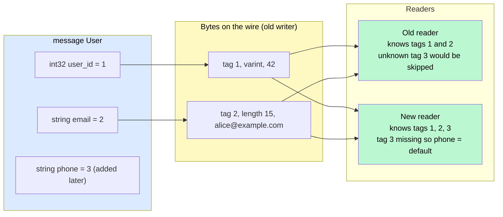
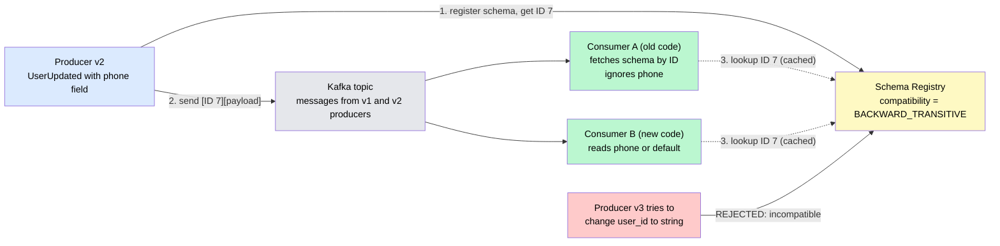
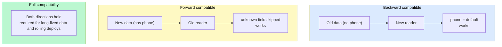

# Data Serialization & Schema Evolution

> **Serialization** turns in-memory objects into bytes that can cross a network or sit on a disk. **Schema evolution** is the discipline of changing that byte layout — adding, removing, renaming fields — without breaking the services, consumers, and archived files that still speak the old version.

**Level:** 3 · **Topic:** 9 · **Prerequisites:** [gRPC & RPC](../03-gRPC-and-RPC/README.md) · [Message Queues](../04-Message-Queues/README.md) · [API Design & REST](../01-API-Design-REST/README.md) · [Change Data Capture](../../Level-02-Data-Layer/10-Change-Data-Capture/README.md)

---

## 🎯 The Problem

The user-service team ships a new version of the `UserUpdated` event. They add a `phone_number` field and, while they're at it, rename `name` to `full_name` because it's clearer.

Within minutes:

- The **order-service**, deployed last Tuesday, reads `name`, finds nothing, and starts creating orders addressed to `null`.
- The **notifications consumer** was written to reject any message with unknown fields "for safety." It now rejects every event and its queue backs up for hours.
- The **data warehouse** job that reprocesses two years of archived events crashes halfway through, because half the files have `name` and half have `full_name`.
- A **mobile app** version from six months ago — which some users will never update — parses the JSON response and shows a blank profile.

Nobody did anything obviously wrong. They just changed a data format in a world where **old and new code always run at the same time** and **old data lives forever**.

**The core problem:** any format that crosses a process boundary or outlives a deploy needs explicit rules about what kinds of change are safe, and a way to enforce them.

---

## 🌍 Real-World Analogy

Imagine a government form with **numbered boxes**. Box 1 is your name, box 2 is your address, box 7 is your date of birth. Thousands of clerks in hundreds of offices process these forms, and the offices upgrade to new form versions at different times.

- A new version adds **box 12: mobile number**. Old clerks simply don't look at box 12 and carry on — that's **forward compatibility** (old reader, new data).
- A clerk with the new form receives an old one with no box 12. They treat it as "not provided" — **backward compatibility** (new reader, old data).
- Now someone reuses **box 7** to mean "passport number." Every old clerk reads a passport number as a date of birth. Chaos in every office at once.

Protocol Buffers' field numbers are exactly these box numbers. The rules of schema evolution are the rules for a form that many offices fill in at different versions: add new boxes, never renumber old ones, never change what a number means.

---

## 🧠 Core Idea

### Step 1 — Text formats vs binary formats

| | JSON / XML / CSV | Protobuf / Thrift / Avro / MessagePack |
|---|---|---|
| Human-readable | Yes | No |
| Schema | Optional, external (JSON Schema, OpenAPI) | Required and central |
| Size | Verbose — repeats field names in every record | Compact — field *numbers* or no names at all |
| Speed | Slow to parse (text scanning) | Fast (fixed layouts, varints) |
| Type safety | Weak (numbers, dates, binary are ambiguous) | Strong |

A user record that is ~120 bytes in JSON is typically ~40 bytes in Protobuf. At a billion messages a day that's terabytes of bandwidth and a meaningful slice of CPU spent on parsing.

### Step 2 — Schema-driven binary encodings

**Protocol Buffers (Google):** every field has a **tag number** and a type. The wire format stores `(tag, wire-type, value)` triples — never the field name. Readers skip unknown tags (and modern versions preserve them for re-serialization). Fields are optional by design; missing ones take a default. Field numbers are the contract — they can never change meaning.

**Thrift (Facebook):** same model as Protobuf (numbered fields), with its own RPC framework. Common at Meta, Twitter, Airbnb, Pinterest.

**Avro (Apache / Hadoop world):** no tag numbers *and* no field names in the payload. Data is just values in schema order, so it's the most compact of all. The catch: the reader must know the **writer's schema** exactly. Avro resolves differences between the writer's schema and the reader's schema by field *name* at read time — which makes it excellent for data lakes and Kafka, where a schema registry supplies the writer's schema.

**MessagePack / CBOR:** binary JSON — compact and schemaless. Good for caches and internal payloads where you want JSON semantics with less bulk, but they don't help with evolution.

**Parquet / ORC:** columnar file formats for analytics — store one column's values together for compression and fast scans. They carry their schema in the file footer and support additive evolution.

### Step 3 — The compatibility vocabulary

- **Backward compatible:** new code can read data written by old code. (You added a field with a default; old records simply lack it.)
- **Forward compatible:** old code can read data written by new code. (Old readers ignore the new field.)
- **Full compatibility:** both. This is what you want for anything with a long tail of deployed versions or archived data.

The safe-change rules fall straight out of the wire formats:

| Change | Protobuf / Thrift | Avro | JSON API |
|--------|-------------------|------|----------|
| Add a field | ✅ (new tag number, has default) | ✅ if it has a default | ✅ if readers ignore unknown fields |
| Remove a field | ✅ but **reserve** the tag number forever | ✅ if the reader has a default | ⚠️ only after all clients stop needing it |
| Rename a field | ✅ wire-safe (name isn't sent) but breaks generated code | ⚠️ needs an alias | ❌ breaking — treat as add + remove |
| Change a type | ❌ (int32 ↔ string is corruption) | ⚠️ only within promotion rules (int → long) | ❌ breaking |
| Reuse an old tag number | ❌ **never** | n/a | n/a |
| Make an optional field required | ❌ old data will fail validation | ❌ | ❌ |
| Add an enum value | ⚠️ old readers see an unknown value — must handle it | ⚠️ needs a default | ⚠️ same |

### Step 4 — The schema registry pattern

For event streams you can't just "deploy the new schema" — a topic can hold months of messages written by many producer versions. The industry answer (Confluent Schema Registry, AWS Glue Schema Registry, Apicurio):

1. The producer **registers** its schema and gets back a small integer **schema ID**.
2. Each Kafka message is `[magic byte][4-byte schema ID][Avro/Protobuf payload]` — about 5 bytes of overhead instead of embedding the whole schema.
3. The consumer reads the ID, fetches (and caches) the schema, and decodes.
4. The registry **enforces a compatibility mode** at registration time — `BACKWARD` (default), `FORWARD`, `FULL`, or their `_TRANSITIVE` variants that check against *all* previous versions, not just the last one. An incompatible schema is rejected before a single bad message is produced.

This moves compatibility from "a code review someone might do" to "a gate the pipeline cannot pass."

### Step 5 — Evolution across every boundary

The same rules show up wherever data crosses time or process boundaries:

- **REST/JSON APIs:** the **Tolerant Reader** principle — ignore fields you don't recognize, never fail on extra data, treat missing fields as defaults. Make only additive changes. Version the API (`/v2/`, or a dated header like Stripe's) only when a change is truly breaking.
- **Databases:** covered in [Schema Migrations](../../Level-02-Data-Layer/11-Schema-Migrations/README.md) — the same expand/contract discipline.
- **Event streams and CDC:** schema registry + compatibility mode; consumers must handle every version still in the topic's retention window.
- **Data lakes:** Parquet/Avro files written years apart are read by one query. Table formats (Apache Iceberg, Delta Lake) track schema versions and map columns by ID, so renames and adds don't break old files.
- **Mobile clients:** the oldest deployed version is your real compatibility floor — some users never update.

### Step 6 — Choosing a format

| Use case | Choose | Why |
|----------|--------|-----|
| Service-to-service RPC | **Protobuf (gRPC)** | Compact, typed, generated clients, strict evolution rules |
| Kafka / event streams | **Avro or Protobuf + schema registry** | Registry-enforced compatibility; Avro is smallest |
| Public / browser APIs | **JSON** | Universal, debuggable, no toolchain for consumers |
| Analytics at rest | **Parquet** | Columnar compression and scan speed |
| Caches, compact internal payloads | **MessagePack / CBOR** | JSON semantics, fewer bytes |
| Config files | **YAML / TOML / JSON** | Human-edited |

---

## 📊 How It Works

### Protobuf on the Wire: Field Numbers, Not Names

*The field name `user_id` never leaves the process. Only tag 1 does — which is why renaming is free and renumbering is fatal.*

*Caption: Both readers decode the same bytes correctly. Backward and forward compatibility are properties of the tag-number design, not of careful programming.*

### Schema Registry in an Event Pipeline

*Producers register once; every message carries a 4-byte ID instead of a full schema. The registry rejects incompatible changes before they reach the topic.*

*Caption: Compatibility becomes a pipeline gate. The breaking change is stopped at registration, not discovered by a crashed consumer at 3 a.m.*

### Backward vs Forward Compatibility

*Caption: Rolling deploys need forward compatibility (old pods read new events). Archived data and reprocessing jobs need backward compatibility (new code reads old events). Aim for both.*

---

## 🔧 Types / Variations / Strategies

| Format | Schema location | Relative size | Evolution mechanism | Typical home |
|--------|-----------------|---------------|---------------------|--------------|
| **JSON** | External / none | 1.0× | Tolerant reader, additive changes | Public APIs, browsers |
| **Protobuf** | Compiled into code | ~0.3–0.5× | Tag numbers, reserved fields, defaults | gRPC, internal RPC |
| **Thrift** | Compiled into code | ~0.3–0.5× | Tag numbers (same model) | Meta, Twitter, Airbnb |
| **Avro** | Registry / file header | ~0.25–0.4× | Writer vs reader schema resolution by name | Kafka, Hadoop, data lakes |
| **MessagePack / CBOR** | None | ~0.6–0.8× | Same as JSON | Caches, Redis values |
| **Parquet** | File footer | very small (columnar + compressed) | Column IDs, additive changes | Analytics, lakehouses |
| **FlatBuffers / Cap'n Proto** | Compiled | ~0.4× | Zero-copy access, tag-based | Games, mobile, low-latency |

---

## 🏢 Real-World Examples

### Google — Protocol Buffers everywhere
Protobuf was created inside Google in the early 2000s precisely because thousands of services evolve independently and a broken serialization change would cascade across the company. Every `.proto` at Google follows the same rules — reserve deleted tags, never renumber, add-only — and gRPC carries that discipline to the rest of the industry.

### LinkedIn / Confluent — Kafka and the schema registry
LinkedIn built Kafka and standardized on Avro for its event streams; the schema registry was born there to stop producers from breaking hundreds of downstream consumers. Confluent spun out to commercialize it, and "Avro + registry + compatibility mode" became the default architecture for event-driven systems.

### Stripe — dated API versions with transformation layers
Stripe's public JSON API has made breaking changes many times, but each customer stays pinned to the API version from the date they signed up. Internally, a chain of small **transformation layers** converts the current response shape back through each historical version. Customers upgrade when they choose — evolution without forcing anyone to move.

### Facebook — Thrift
Facebook created Thrift in 2007 for cross-language RPC between its C++, PHP, and Java services. Its numbered-field model is the same idea as Protobuf, and its longevity at Meta, Twitter, and Airbnb shows the pattern is the point, not the specific tool.

### Netflix — Avro in the data pipeline, tolerant readers at the edge
Netflix's Keystone pipeline moves trillions of events a day using Avro with registry-managed schemas, while its API gateways follow the tolerant-reader principle so that hundreds of device types on many client versions keep working as the backend evolves.

### Apache Iceberg — schema evolution for data lakes
Iceberg tracks every column by a **stable ID** rather than by name or position, so you can rename, reorder, add, or drop columns and still query files written under any previous schema. It's the Protobuf tag-number idea applied to petabytes of Parquet.

---

## ⚖️ Trade-offs

| Factor | JSON | Protobuf / Thrift | Avro |
|--------|------|-------------------|------|
| **Debuggability** | Read it in `curl` | Need a decoder | Need schema + decoder |
| **Payload size / CPU** | Largest, slowest | Small, fast | Smallest |
| **Toolchain burden** | None | Code generation for every language | Registry infrastructure |
| **Evolution safety** | Convention only | Enforced by tag numbers | Enforced by registry compatibility modes |
| **Schema must be shared out-of-band?** | No | Yes (compiled in) | Yes (via registry or file header) |
| **Dynamic / unknown structures** | Natural | Awkward (`Any`, `Struct`) | Awkward |

---

## ✅ When to Use / ❌ When NOT to Use

**Reach for a schema-driven binary format when:**
- Services are owned by different teams and deploy independently — you need enforced compatibility.
- Volume is high enough that bytes and parse CPU cost real money.
- Data outlives code: event topics with long retention, archives, data lakes.

**Stick with JSON when:**
- The consumers are browsers or third-party developers who won't install your toolchain.
- Payloads are small and infrequent; readability and `curl`-ability matter more than bytes.
- The structure is genuinely dynamic (arbitrary user-defined documents).

**Whatever you pick:** define the compatibility rules in writing, automate the check, and treat a schema change like an API change — because it is one.

---

## ⚠️ Common Pitfalls

1. **Reusing a field number.** Deleting `int32 age = 4` and later adding `string city = 4` makes every old message decode age bytes as city. Mark deleted tags `reserved` forever.
2. **JSON numbers and 64-bit IDs.** JavaScript represents numbers as IEEE doubles — integers above 2⁵³ silently lose precision. Snowflake IDs and Twitter IDs must be sent as **strings** in JSON. This bug appears in production constantly.
3. **proto3 scalar defaults hide "unset."** A `count = 0` is indistinguishable from "no count sent." Use `optional` (proto3.15+) or wrapper types when presence matters.
4. **Floats for money.** Serialize amounts as integers in minor units (cents) or as decimal strings. Never as `float`/`double`.
5. **Timestamps without zones.** `"2025-03-01 09:00"` means different instants in different offices. Use RFC 3339 with a UTC offset, or epoch milliseconds, and say which.
6. **Unknown enum values crash old readers.** Adding `STATUS_PAUSED` breaks consumers that `switch` exhaustively without a default. Always handle the unknown case.
7. **Registry compatibility set to `NONE`.** Someone did it "just for this one migration" and it's still there two years later.
8. **Strict readers.** A consumer that rejects unknown fields makes every additive change a breaking one. Be a tolerant reader.
9. **Assuming "no schema" means "no evolution problem."** Schemaless just means the schema lives implicitly in your code — in *every* version of your code that ever wrote data.

---

## 🎤 Interview Tips

- **The classic prompt:** "How do you change an event schema in Kafka without breaking consumers?" Answer: add-only changes with defaults, a schema registry enforcing `BACKWARD_TRANSITIVE` (or `FULL`), consumers that ignore unknown fields, and reserve removed fields. Then note that rolling deploys need *forward* compatibility too.
- **Define backward vs forward precisely** — many candidates mix them up. "Backward: new code reads old data. Forward: old code reads new data."
- **Show depth with the JSON 64-bit integer pitfall.** Mentioning that Twitter sends `id_str` because JavaScript can't hold a 64-bit ID is a memorable signal.
- **Connect formats to layers:** Protobuf for RPC, Avro for streams, JSON for public API, Parquet for analytics — and why each fits.
- **Common follow-up:** "When do you version a REST API instead of evolving it?" → Only for genuinely breaking changes; prefer additive evolution; cite Stripe's dated versions with transformation layers as the mature approach.
- **Common follow-up:** "What about a field that must become required?" → You can't; add validation in the application after all writers are upgraded, or introduce a new field and migrate.

---

## 📝 TL;DR

- Old and new code always run together, and old data lives forever — so every serialized format needs explicit **compatibility rules**.
- **Backward** = new reader, old data. **Forward** = old reader, new data. Long-lived systems need **both**.
- Schema-driven binary formats (**Protobuf, Thrift, Avro**) are smaller, faster, and make compatibility a property of the wire format: add fields with defaults, never renumber or retype, reserve deleted tags.
- Event streams need a **schema registry** that rejects incompatible schemas at registration time.
- JSON APIs evolve via the **tolerant reader** principle and additive changes; version only for truly breaking changes.
- Watch the classics: 64-bit integers in JSON, floats for money, timestamps without zones, unknown enum values.

---

## 🧪 Test Yourself

1. A teammate deletes `int32 discount = 6` from a Protobuf message and a month later adds `string coupon_code = 6`. Nothing fails in tests. Explain what happens when a consumer reads a message written before the deletion, and what the `reserved` keyword would have prevented.
2. Define backward and forward compatibility. Which one does a rolling deploy of *consumers* require, and which one does reprocessing a year of archived events require?
3. Your mobile app displays wrong user IDs for about 1 in 20 users after you switched IDs to Snowflake format. The API returns them as JSON numbers. Diagnose the bug and fix the API contract.
4. Compare Avro and Protobuf on the wire: why is Avro smaller, and what does that force you to provide at read time that Protobuf does not?
5. A schema registry is configured with compatibility `BACKWARD` (not `_TRANSITIVE`). Describe a sequence of three schema versions that each pass the check but leave a consumer on version 1 broken.

---

## 📚 Further Reading

- [Designing Data-Intensive Applications, Chapter 4 — Encoding and Evolution](https://dataintensive.net/) — the definitive treatment of formats and compatibility.
- [Protocol Buffers: Updating a Message Type](https://protobuf.dev/programming-guides/proto3/#updating) — the official rules for safe changes.
- [Confluent: Schema Evolution and Compatibility](https://docs.confluent.io/platform/current/schema-registry/fundamentals/schema-evolution.html) — compatibility modes explained with examples.
- [APIs as infrastructure: future-proofing Stripe with versioning](https://stripe.com/blog/api-versioning) — dated versions and transformation layers.
- [Tolerant Reader — Martin Fowler](https://martinfowler.com/bliki/TolerantReader.html) — the principle behind forgiving consumers.
- [Apache Avro Specification — Schema Resolution](https://avro.apache.org/docs/current/specification/#schema-resolution) — how writer and reader schemas are reconciled.
- [Apache Iceberg: Schema Evolution](https://iceberg.apache.org/docs/latest/evolution/) — column IDs for data lakes.
- Previous: [08 — Authentication & Authorization](../08-Authentication-and-Authorization/README.md) · Next Level: [Level 04 — Distributed Systems](../../Level-04-Distributed-Systems/README.md) · Back to [Level 03 Overview](../README.md)
- See also: [Schema Migrations](../../Level-02-Data-Layer/11-Schema-Migrations/README.md) · [Event-Driven Architecture](../../Level-05-Architecture-Patterns/02-Event-Driven-Architecture/README.md) · [Data Warehouses & Lakes](../../Level-07-Big-Data-and-Specialized/03-Data-Warehouses-and-Lakes/README.md)
