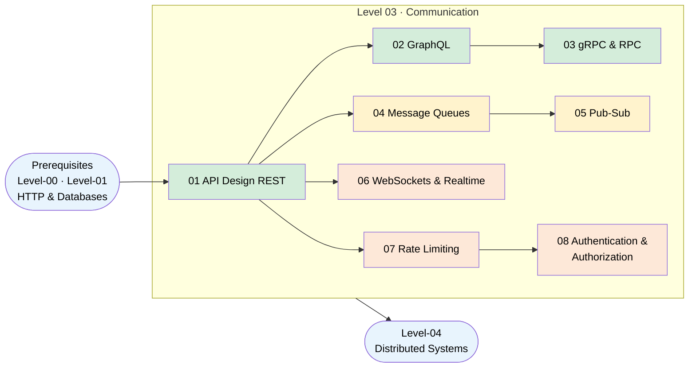

# Level 03 · Communication

> **Theme:** How services talk to clients and each other — the protocols, patterns, and trade-offs that move data across process boundaries.

---

## 🎯 Learning Outcomes

By the end of this level you will be able to:

- Design clean REST APIs with proper verbs, status codes, URL structure, versioning, and pagination
- Explain the over-fetching / under-fetching problem and when GraphQL is the right solution
- Describe the gRPC + Protocol Buffers model and its four streaming modes
- Choose between synchronous RPC and asynchronous messaging based on coupling and latency requirements
- Contrast message queues (point-to-point) with pub/sub (fan-out) and name real platforms for each
- Architect real-time features using the right transport (polling → SSE → WebSockets) and scale stateful connections
- Implement and compare five rate-limiting algorithms and defend your choice in an interview
- Secure APIs end-to-end: sessions vs JWTs, OAuth 2.0 + PKCE, OIDC, SSO/SAML, API keys, mTLS, and RBAC/ABAC authorization

---

## 🗺️ Topic Roadmap

---

## 📚 Topics

| # | Folder | What You'll Learn | Est. Time |
|---|--------|-------------------|-----------|
| 1 | [01-API-Design-REST](./01-API-Design-REST/README.md) | Resources, HTTP verbs, status codes, URL design, versioning, pagination, idempotency | 45 min |
| 2 | [02-GraphQL](./02-GraphQL/README.md) | Schema/types, queries/mutations/subscriptions, N+1 problem, DataLoader | 45 min |
| 3 | [03-gRPC-and-RPC](./03-gRPC-and-RPC/README.md) | Protocol Buffers, HTTP/2, 4 streaming modes, gRPC vs REST vs GraphQL | 40 min |
| 4 | [04-Message-Queues](./04-Message-Queues/README.md) | Producer→queue→consumer, delivery guarantees, DLQ, competing consumers | 40 min |
| 5 | [05-Pub-Sub](./05-Pub-Sub/README.md) | Topics, fan-out, push vs pull, event-driven architecture | 35 min |
| 6 | [06-WebSockets-and-Realtime](./06-WebSockets-and-Realtime/README.md) | Polling → SSE → WebSockets, handshake, scaling stateful connections | 45 min |
| 7 | [07-Rate-Limiting](./07-Rate-Limiting/README.md) | Fixed window, sliding window, token bucket, leaky bucket, Redis INCR | 45 min |
| 8 | [08-Authentication-and-Authorization](./08-Authentication-and-Authorization/README.md) | Sessions vs JWT, OAuth 2.0 + PKCE, OIDC, SSO/SAML, API keys, mTLS, RBAC/ABAC | 50 min |

**Total estimated time: ~6 hours**

---

## ✅ Prerequisites

Before starting this level, you should be comfortable with:

- **HTTP basics** — [Level-00 · 06-HTTP-and-HTTPS](../Level-00-Foundations/06-HTTP-and-HTTPS/README.md)
- **Database fundamentals** — Level-01 (SQL, NoSQL, indexing)
- **Caching concepts** — Level-02 (optional but helpful for rate limiting)

---

## 🔗 What Comes Next

- **Level-04 · Distributed Systems** — consensus, replication, idempotency ([07-Idempotency-and-Exactly-Once](../Level-04-Distributed-Systems/07-Idempotency-and-Exactly-Once/README.md))
- **Level-07 · Big Data** — Kafka deep-dive ([02-Stream-Processing](../Level-07-Big-Data-and-Specialized/02-Stream-Processing/README.md))

---

## 💡 How to Navigate

Work through topics **1 → 3** first (synchronous communication), then **4 → 5** (async), then **6 → 7** (real-time + control). Each topic README is self-contained with diagrams, trade-off tables, interview tips, and quiz questions.
