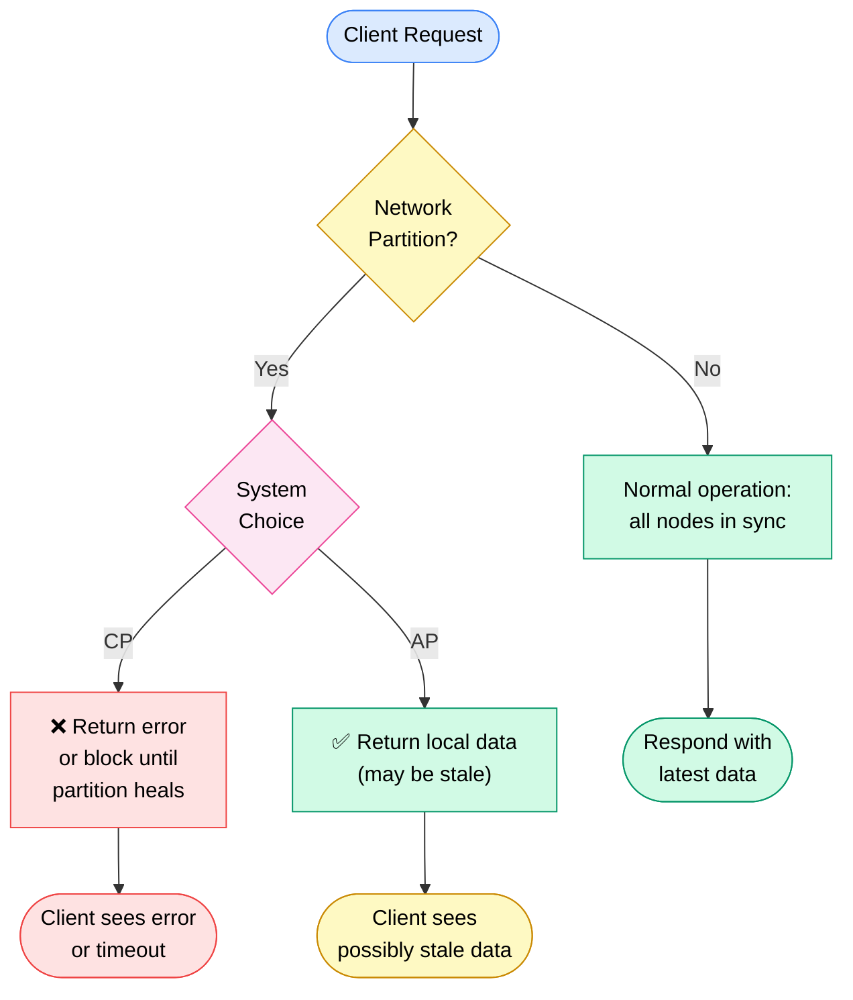
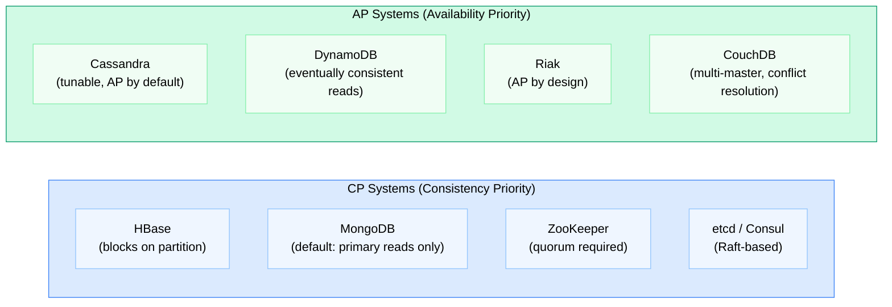
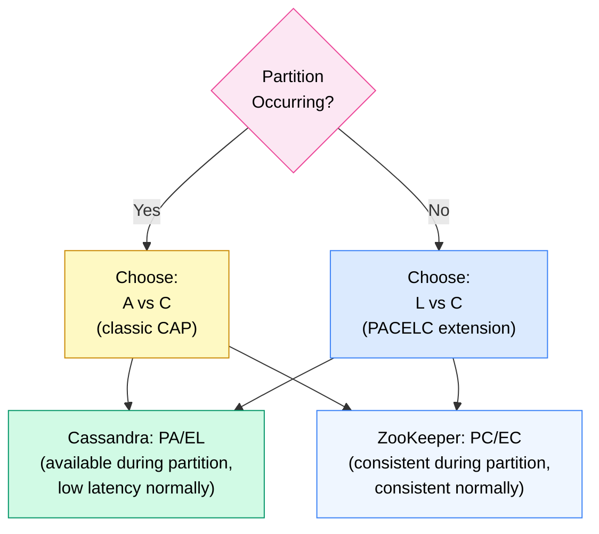

# CAP Theorem

> **CAP Theorem** states that a distributed system can guarantee at most **two** of three properties: **C**onsistency, **A**vailability, and **P**artition tolerance — and since network partitions are unavoidable in practice, the real trade-off is always **CP vs AP**.

**Level:** 4 · **Topic:** 1 · **Prerequisites:** [Database Replication](../../Level-02-Data-Layer/01-Database-Replication/README.md) · [Sharding and Partitioning](../../Level-02-Data-Layer/02-Sharding-and-Partitioning/README.md)

---

## 🎯 The Problem

You're building a distributed database with nodes in multiple data centers. You get a request to write a value. A moment later, a network cable fails — the nodes can no longer talk to each other.

Now a read request arrives at Node B. What do you do?

- **Option A:** Refuse to answer (unavailable) until you reconnect and confirm the latest data.
- **Option B:** Answer with whatever you have locally (possibly stale).

That forced choice — in the moment a network partition occurs — is exactly what CAP Theorem describes.

---

## 🌍 Real-World Analogy

Imagine you run a chain of banks with branches in New York and London. The undersea cable connecting them breaks (partition).

A customer walks into the London branch and says "What's my balance?" — just hours after a big withdrawal was made in New York.

- **CP choice:** "Sorry, our systems are offline. Please come back later." — Consistent (won't show a wrong balance) but unavailable.
- **AP choice:** "Your balance is $50,000" — but that's pre-withdrawal. Available but potentially inconsistent.

There is no third option. You can't be both accurate **and** serve the customer when the cable is cut.

---

## 🧠 Core Idea

### The Three Properties

| Property | What it means |
|---|---|
| **C — Consistency** | Every read returns the most recent write (or an error). All nodes see the same data at the same time. |
| **A — Availability** | Every request receives a (non-error) response — but it might not be the most recent data. |
| **P — Partition Tolerance** | The system continues operating when network messages are dropped or delayed between nodes. |

### Why P is Not Optional

In any system running on real hardware over real networks, partitions *will* happen:
- Network switches fail
- Data center cables get cut
- Asymmetric packet loss occurs
- Nodes restart for maintenance

You cannot choose "no partition tolerance" and build a real distributed system. The internet is not reliable. **So the real choice is always CP or AP.**

> "Giving up P means giving up on distributed computing." — Eric Brewer

### CP vs AP

- **CP systems** prioritize correctness. During a partition they may reject reads/writes rather than serve stale data. They favor consistency over uptime.
- **AP systems** prioritize uptime. During a partition they continue serving requests, accepting that some nodes may return stale data. They favor availability over correctness.

---

## 📊 How It Works

### The Partition Decision

### CP vs AP Systems in Practice

---

## 🔧 Types / Variations / Strategies

### CP System Behaviors During Partition

| Strategy | Behavior | Example |
|---|---|---|
| Reject writes, allow reads | Reads may succeed from local replica; writes blocked | MongoDB secondary reads |
| Block all operations | Wait until quorum restored | ZooKeeper |
| Serve only from leader | Non-leaders return errors | etcd |

### AP System Behaviors During Partition

| Strategy | Behavior | Example |
|---|---|---|
| Serve local replica | May return stale data | Cassandra with ONE consistency level |
| Multi-master accept | Accept writes everywhere, resolve conflicts later | Riak, CouchDB |
| Last-write-wins | Use timestamp to pick winner on merge | DynamoDB |

---

## 🌐 PACELC — The Extension You Need to Know

CAP only describes behavior **during partitions**. But what about **normal operation** (no partition)?

**PACELC** (proposed by Daniel Abadi, 2012) extends CAP:

> If there is a **P**artition, choose between **A**vailability and **C**onsistency.
> **E**lse (normal operation), choose between **L**atency and **C**onsistency.

### PACELC Classification

| System | Partition | Else | Classification |
|---|---|---|---|
| Cassandra | Available (serve stale) | Low latency | PA/EL |
| DynamoDB | Available | Low latency | PA/EL |
| ZooKeeper | Consistent (block) | Consistent | PC/EC |
| HBase | Consistent (block) | Consistent | PC/EC |
| MongoDB | Consistent (primary) | Consistent | PC/EC |
| CockroachDB | Consistent | Consistent (higher latency) | PC/EC |
| Spanner | Consistent | Consistent | PC/EC |

---

## 🏢 Real-World Examples

### HBase (CP)
HBase uses HDFS and ZooKeeper as its coordination layer. During a network partition, HBase will **stop serving** rather than return inconsistent data. This is the right choice for financial ledgers and metadata stores where stale reads would be harmful.

### Cassandra (AP)
Cassandra was designed at Facebook for the inbox search feature — availability was paramount. During a partition, Cassandra continues accepting reads and writes on all reachable nodes, then reconciles when the partition heals using techniques like last-write-wins and read repair. You can *tune* toward consistency using quorum reads/writes (see [Consistency Models](../02-Consistency-Models/README.md)), but it defaults to AP.

### ZooKeeper (CP)
ZooKeeper is a coordination service used for leader election and configuration management. It uses a majority quorum — if it can't reach a quorum of nodes, it **refuses to serve** reads or writes. This is exactly right for its use case: you'd rather have "ZooKeeper unavailable" than elect two leaders simultaneously.

### DynamoDB (AP with options)
Amazon DynamoDB defaults to eventually consistent reads for performance. It offers strongly consistent reads as an option — but that option incurs higher latency and uses twice the read capacity. Classic PACELC trade-off: you pay in latency to get consistency in normal operation.

---

## ⚖️ Trade-offs

| Dimension | CP | AP |
|---|---|---|
| During partition | May refuse requests | Serves (possibly stale) data |
| Data correctness | Guaranteed | Best-effort |
| Latency (normal) | May be higher (quorum) | Lower |
| Client complexity | Simpler (errors are explicit) | Higher (must handle stale data) |
| Best for | Financial systems, coordination, metadata | User-facing features, shopping carts, DNS |

---

## ✅ When to Use / ❌ When NOT to Use

### CP Systems — Use When:
- Correctness is non-negotiable: financial ledgers, inventory counts, lock services
- You're doing leader election or distributed coordination
- A stale read could cause real-world harm (e.g., selling the same seat twice)

### CP Systems — Avoid When:
- You need 99.99%+ availability and can tolerate brief staleness
- You're serving global users and partition probability is high

### AP Systems — Use When:
- Availability is the primary requirement (social feeds, product catalogs)
- You can design around eventual consistency (shopping carts, user profiles)
- Write conflicts can be resolved after the fact

### AP Systems — Avoid When:
- You need to read your own writes reliably
- Conflicting writes would cause real damage (e.g., double-spending)

---

## ⚠️ Common Pitfalls

1. **"CA systems exist."** They don't — not in distributed computing. A single-node RDBMS is "CA" only because it doesn't deal with partitions at all. Once you add a second node, you must handle P.

2. **Treating CAP as binary.** Real systems are tunable. Cassandra can operate more like CP with quorum settings. "It's an AP database" is often an oversimplification.

3. **Ignoring PACELC.** Many interview candidates stop at CAP. PACELC matters because latency vs consistency in *normal* operation often drives real product decisions.

4. **Conflating CAP Consistency with ACID Consistency.** They are different! CAP-C means "all nodes see the same data." ACID-C means "a transaction leaves the database in a valid state." See [ACID and Transactions](../../Level-02-Data-Layer/05-ACID-and-Transactions/README.md).

5. **Assuming partitions are rare.** At scale, in multi-region deployments, partitions happen regularly. Design for them, not around them.

---

## 🎤 Interview Tips

- **Lead with the real trade-off:** "Since partitions are unavoidable, CAP is really about CP vs AP." This immediately signals senior understanding.
- **Use PACELC** when asked about latency vs consistency. It shows you know the theorem has been extended.
- **Name specific systems:** "Cassandra is AP by default but tunable; ZooKeeper is CP and intentionally unavailable during partitions."
- **Connect to the use case:** "For a payment system I'd choose CP. For a product catalog, AP is fine because showing a slightly stale price is acceptable."
- **Common question:** "Design a distributed counter." Answer depends on CAP: an AP counter (Cassandra counter column) can lose increments during partitions; a CP counter (Redis with Redlock) won't but may be unavailable.

---

## 📝 TL;DR

- CAP says you can have at most 2 of 3: Consistency, Availability, Partition Tolerance
- Partitions always happen → the real choice is **CP vs AP**
- **CP** = refuse to serve during partitions (HBase, ZooKeeper, etcd)
- **AP** = serve stale data during partitions (Cassandra, DynamoDB, Riak)
- **PACELC** extends CAP: in normal operation, choose between Latency and Consistency
- Most real systems are tunable — they aren't strictly one or the other

---

## 🧪 Test Yourself

1. A customer support system shows ticket status. Is it better as CP or AP? Why?
2. You're designing a distributed lock service. Which does it need to be: CP or AP? What happens if you choose wrong?
3. Where does DynamoDB fall in PACELC classification? What configuration options move it toward C?
4. A colleague says "Let's use a CA database — best of both worlds." How do you respond?
5. Cassandra with quorum reads (R + W > N) behaves more like CP. Why? What's the failure mode?

---

## 📚 Further Reading

- **Brewer's original CAP conjecture (2000):** Eric Brewer's keynote at PODC — search "Towards Robust Distributed Systems Brewer 2000"
- **Gilbert & Lynch CAP proof (2002):** "Brewer's Conjecture and the Feasibility of Consistent, Available, Partition-Tolerant Web Services" — the formal proof
- **PACELC (2012):** Daniel Abadi, "Consistency Tradeoffs in Modern Distributed Database System Design" — IEEE Computer
- **DDIA Chapter 9:** *Designing Data-Intensive Applications* by Martin Kleppmann — "Consistency and Consensus" — best practical treatment
- **"Please stop calling databases CP or AP" (2015):** Martin Kleppmann's blog post on why the classification is often misleading
- **Amazon Dynamo paper (2007):** "Dynamo: Amazon's Highly Available Key-Value Store" — SOSP 2007 — the canonical AP system paper
