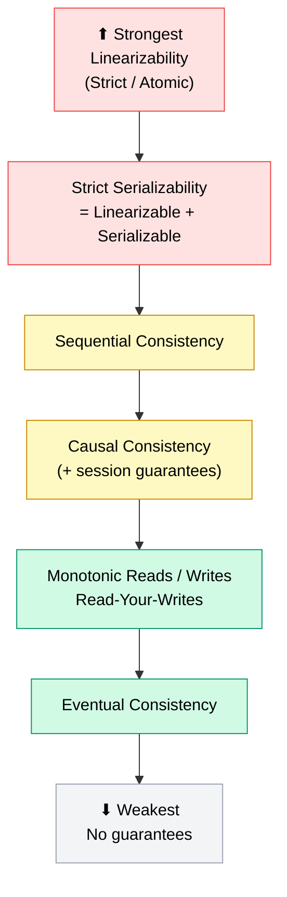
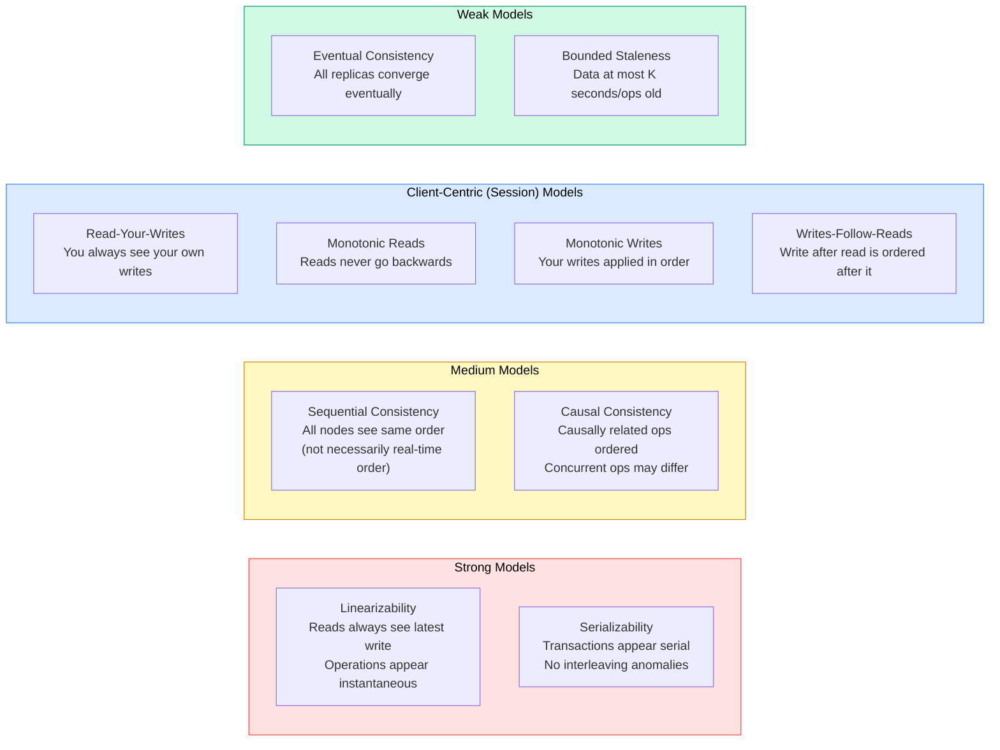
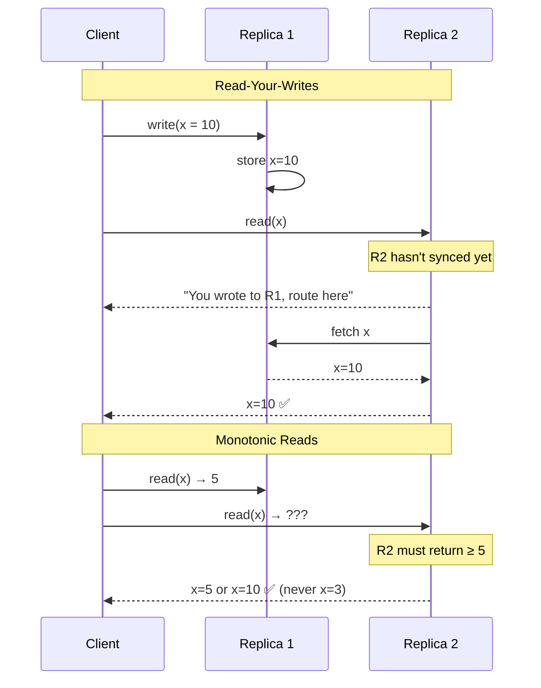
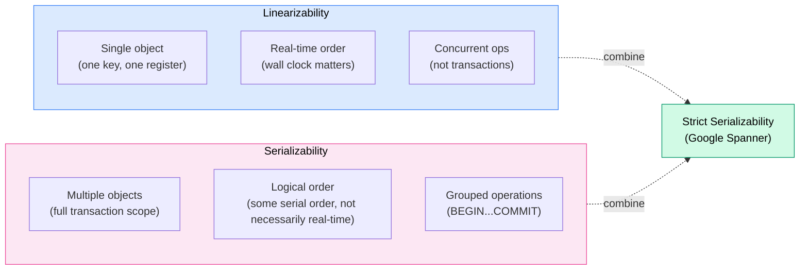

# Consistency Models

> A **consistency model** is a contract between a distributed system and its clients that defines what values a read is allowed to return relative to prior writes — ranging from "always the absolute latest" (linearizability) to "eventually the same" (eventual consistency).

**Level:** 4 · **Topic:** 2 · **Prerequisites:** [CAP Theorem](../01-CAP-Theorem/README.md) · [Database Replication](../../Level-02-Data-Layer/01-Database-Replication/README.md)

---

## 🎯 The Problem

Your distributed database has three replicas. A client writes `x = 42`. A millisecond later, *another* client reads `x` from a different replica. What should it get?

The answer depends on the **consistency model** the system promises. Should the read always see `42`? Is it okay to see `0` for a while? Can it see `42` and then `0` on the next read?

These aren't bugs — they're intentional design choices, each with different performance and correctness implications.

---

## 🌍 Real-World Analogy

Think of updating your profile photo on a social network:

- **Linearizability:** The moment you tap "Save," everyone in the world sees your new photo instantly. Like magic — but expensive.
- **Read-your-writes:** *You* see your new photo immediately. Your friends might see the old one for a few seconds.
- **Eventual consistency:** The photo will propagate to everyone... eventually. Right after you save it, some of your friends see the old photo and some see the new one.
- **Strong eventual consistency:** Everyone will converge to the same photo, and no two people will ever see the changes in a different order.

Each model trades off freshness, performance, and reasoning complexity.

---

## 🧠 Core Idea

Consistency models form a **spectrum** — stronger models give you more guarantees but cost more (latency, coordination). Weaker models perform better but require you (the application developer) to handle more edge cases.

### The Critical Distinction: Linearizability vs Serializability

These are **different** and commonly confused — even in interviews.

| | **Linearizability** | **Serializability** |
|---|---|---|
| **Domain** | Single-object, concurrent operations | Multi-object transactions |
| **Guarantee** | Operations appear instantaneous, in real-time order | Transactions appear to run one-at-a-time (some serial order) |
| **Scope** | Per-object (register) model | Transaction model |
| **Analogy** | Atomic flip of a switch | Multiple books checked out in a consistent library state |
| **Where used** | etcd, ZooKeeper, Spanner (for single ops) | PostgreSQL, MySQL (transactions) |

> Combining both gives you **strict serializability** (also called "external consistency") — what Google Spanner provides.

---

## 📊 How It Works

### The Consistency Spectrum

*Stronger = more guarantees, higher cost. Weaker = more performance, more application complexity.*

### Consistency Model Definitions

---

## 🔧 Types / Variations / Strategies

### Complete Model Reference Table

| Model | Guarantee | Example Systems | Cost |
|---|---|---|---|
| **Linearizability** | Every operation appears instantaneous; reads reflect all prior writes | etcd, ZooKeeper, Spanner | High (consensus required) |
| **Strict Serializability** | Linearizable + serializable transactions | Google Spanner, FoundationDB | Highest |
| **Serializability** | Transactions appear to run one at a time | PostgreSQL (SERIALIZABLE isolation) | High |
| **Sequential Consistency** | All nodes agree on operation order, but order may lag real time | Early Lamport papers; some CPUs | Medium |
| **Causal Consistency** | If A causes B, everyone sees A before B; unrelated ops may differ | Cassandra lightweight transactions, MongoDB causal sessions | Medium |
| **Read-Your-Writes** | After you write, your subsequent reads reflect it | Most web sessions, sticky sessions | Low |
| **Monotonic Reads** | Once you read a value, you never read an older one | Pinned replica sessions | Low |
    | **Monotonic Writes** | Your writes are applied in the order you sent them | Most single-threaded clients | Low |
| **Bounded Staleness** | Reads are at most T seconds or K versions behind | Azure Cosmos DB option | Low-Medium |
| **Eventual Consistency** | Replicas will converge if writes stop; no ordering guarantee | Cassandra, DynamoDB, DNS | Lowest |

### Session / Client-Centric Guarantees Detail

Session guarantees are *per-client* — they describe what *you* see, not what everyone sees.

---

## 🏢 Real-World Examples

### 1. Google Spanner — Strict Serializability
Spanner provides externally consistent (strict serializable) transactions globally. It achieves this via TrueTime (GPS + atomic clock synchronization — see [Clocks and Ordering](../06-Clocks-and-Ordering/README.md)) and Paxos. The cost is real: commits must wait for the uncertainty window to close (commit-wait), adding ~7ms of guaranteed latency. For global financial transactions, that's worth it.

### 2. Cassandra — Tunable Consistency
Cassandra lets you specify the consistency level per operation. The formula:
- `R + W > N` → strong consistency (quorum reads + writes cover all replicas)
- `W = 1, R = 1` → eventual consistency (fastest, weakest)

With `N=3, R=2, W=2` (quorum), you get strong consistency *without* strict linearizability — two reads in parallel can still see different things if timed just right.

### 3. DynamoDB — Eventually Consistent + Strongly Consistent Reads
DynamoDB defaults to eventually consistent reads (replicated asynchronously). Strongly consistent reads (`ConsistentRead: true`) route to the leader and always return the latest committed data — but cost 2× read capacity units and add latency.

### 4. MongoDB — Causal Consistency Sessions
MongoDB 3.6+ supports causal consistency via session tokens. Operations tagged with a session are routed to replicas that have applied at least that session's writes — guaranteeing read-your-writes and monotonic reads within a session, without requiring global coordination.

### 5. Azure Cosmos DB — Five Consistency Levels
Cosmos DB is notable for explicitly exposing five tunable consistency levels to developers: Strong, Bounded Staleness, Session, Consistent Prefix, and Eventual. This is the clearest commercial implementation of the consistency spectrum concept.

---

## ⚖️ Trade-offs

### The Fundamental Triangle

| Goal | Cost You Pay |
|---|---|
| Strong consistency | Higher latency, more coordination overhead, lower availability |
| High availability | Possible stale reads, application must handle conflicts |
| Low latency | Weaker consistency guarantees |

### Linearizability vs Serializability — Side by Side

---

## ✅ When to Use / ❌ When NOT to Use

### Linearizability — Use When:
- Distributed locks, leader election, sequence number generation
- Any operation where two concurrent actors MUST NOT both think they succeeded
- Financial account balances where reads must reflect the latest state

### Linearizability — Avoid When:
- You need low latency at scale (linearizability requires coordination)
- Geographic distribution across continents (round-trip time dominates)

### Eventual Consistency — Use When:
- Social feeds, product recommendations, DNS
- High write throughput systems where perfect freshness isn't required
- You can design conflict resolution into the application

### Eventual Consistency — Avoid When:
- Users expect to immediately see their own changes
- Two processes must agree on a single value (use consensus instead)

---

## ⚠️ Common Pitfalls

1. **Confusing linearizability and serializability.** These are orthogonal concepts. A system can be serializable (transactions run in some serial order) without being linearizable (that order might not match real-time). Spanner gives you both — most systems give you only one.

2. **Thinking "eventually consistent" means "briefly inconsistent then fine."** Eventual consistency has no time bound. Under high write load, "eventual" could be seconds, minutes, or longer. Design accordingly.

3. **Sticky sessions as a consistency hack.** Routing all of a user's requests to the same replica achieves read-your-writes, but it concentrates load and doesn't help with cross-user coordination.

4. **Quorum doesn't always mean linearizable.** With Cassandra quorum (`R + W > N`), you get *strong* consistency for single values in most cases — but there are still edge cases with concurrent writes and last-write-wins that can violate linearizability.

5. **Assuming strong consistency is always the safe default.** Strong consistency prevents some bugs but introduces others (availability loss, timeout failures, increased latency). Pick the right model for the data type.

---

## 🎤 Interview Tips

- **The top distinction to know cold:** "Linearizability is about single-object operations appearing atomic in real time. Serializability is about transactions over multiple objects appearing to run one at a time. They're different axes."
- **Mention the spectrum proactively.** "Consistency isn't binary — it ranges from linearizability through causal to eventual, and each step trades off differently."
- **Name session guarantees.** Read-your-writes and monotonic reads come up in "how would you ensure a user sees their own profile update" questions.
- **For Cassandra questions:** explain the `R + W > N` quorum formula and when it approximates strong consistency.
- **Cosmos DB** is a great example to name because it explicitly exposes all five levels as product features.

---

## 📝 TL;DR

- Consistency models define what values a read can return relative to prior writes
- **Linearizability:** every read sees the latest write; operations are instantaneous — strongest and most expensive
- **Serializability:** transactions appear to run one at a time — different from linearizability!
- **Causal consistency:** if A causes B, everyone sees A first — practical middle ground
- **Read-your-writes, monotonic reads:** session-scoped guarantees — cheap and practical
- **Eventual consistency:** replicas converge eventually — weakest, highest performance
- Systems like Cassandra let you **tune** per-operation; Cosmos DB makes the spectrum explicit

---

## 🧪 Test Yourself

1. Explain the difference between linearizability and serializability. Give a concrete example of a system that has one but not the other.
2. A user updates their email address and immediately logs out and back in. What consistency guarantee do you need to ensure they see the new email on login?
3. You have N=3 replicas, W=2, R=2 in Cassandra. Is this linearizable? What's the failure mode?
4. Your team argues about whether to use strong or eventual consistency for a user's shopping cart. What questions would you ask before deciding?
5. Azure Cosmos DB's "Session Consistency" is described as "within a session, guaranteeing read-your-writes, monotonic reads, and monotonic writes." How would you implement this in a system that uses multiple replicas?

---

## 📚 Further Reading

- **DDIA Chapter 9:** *Designing Data-Intensive Applications* by Martin Kleppmann — the best practical coverage of linearizability vs serializability
- **Herlihy & Wing (1990):** "Linearizability: A Correctness Condition for Concurrent Objects" — the original paper defining linearizability
- **Vogels (2009):** "Eventually Consistent" — Werner Vogels (Amazon CTO) in ACM Queue — excellent overview of session guarantees
- **Google Spanner (2012):** "Spanner: Google's Globally Distributed Database" — OSDI 2012 — see how TrueTime achieves external consistency
- **Dynamo (2007):** "Dynamo: Amazon's Highly Available Key-Value Store" — SOSP 2007 — the canonical eventually-consistent system
- **Bailis et al. (2013):** "Highly Available Transactions: Virtues and Limitations" — VLDB — which consistency models are achievable under high availability
- **Azure Cosmos DB consistency levels documentation** — excellent interactive diagrams showing each level
