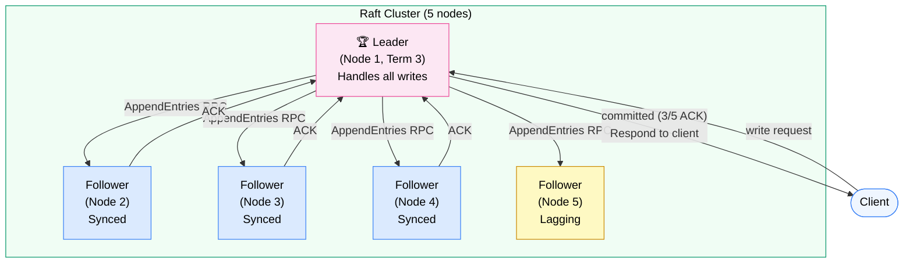
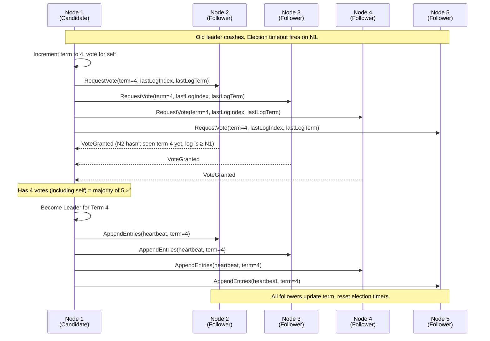
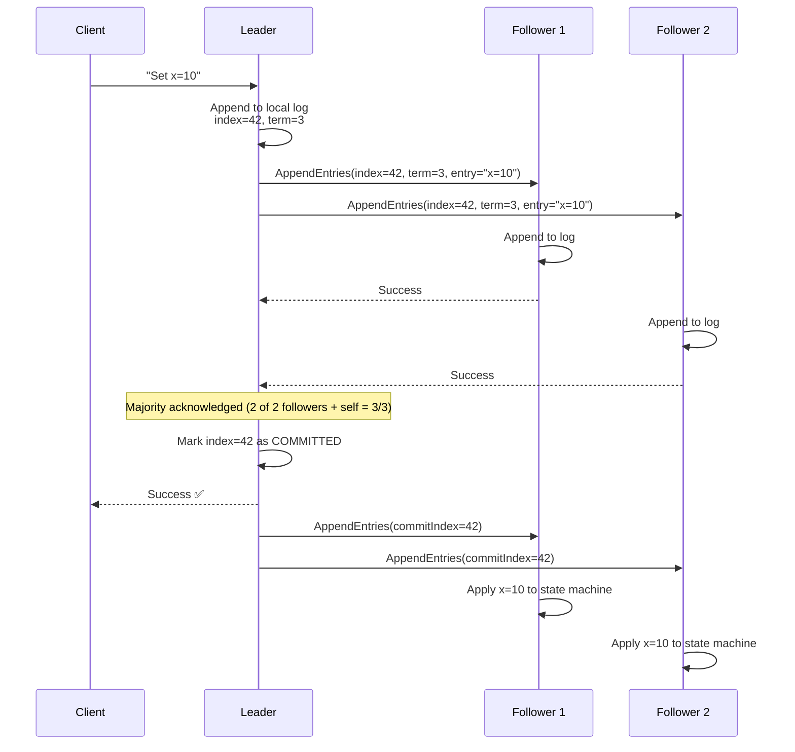
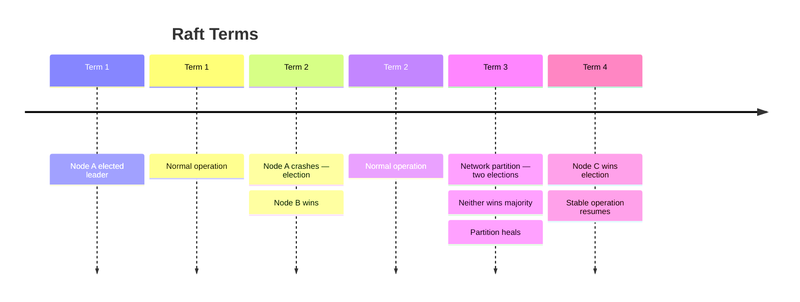

# Consensus: Paxos and Raft

> **Consensus** is the problem of getting multiple distributed nodes to **agree on a single value** — even when some nodes crash or messages get lost. Raft and Paxos are the two most important algorithms that solve it.

**Level:** 4 · **Topic:** 3 · **Prerequisites:** [CAP Theorem](../01-CAP-Theorem/README.md) · [Consistency Models](../02-Consistency-Models/README.md) · [Database Replication](../../Level-02-Data-Layer/01-Database-Replication/README.md)

---

## 🎯 The Problem

You have five database nodes. You need them to agree on a sequence of log entries — "what was the Nth command executed?" — so all replicas stay identical.

Sounds simple. But:
- Messages can be delayed or reordered
- Any node can crash at any time
- Crashed nodes can restart and rejoin
- You cannot tell the difference between "a node is slow" and "a node is dead"

**FLP Impossibility (Fischer, Lynch, Paterson, 1985):** In a purely asynchronous system (no timing guarantees), *no* deterministic algorithm can achieve consensus if even one node might fail.

This sounds catastrophic. The escape hatch: real systems are *partially* asynchronous — we can use timeouts. That's enough for practical consensus. Paxos and Raft work by assuming messages *eventually* arrive and timeouts allow detecting failure.

---

## 🌍 Real-World Analogy

Imagine a committee of five members trying to pass a resolution. Any member can leave the room (crash) at any time. Messages passed between rooms can arrive late.

The committee's rules:
1. A resolution only passes if a **majority** (3 of 5) agree to it
2. Once passed, the resolution **cannot be undone**
3. A new chairperson (leader) can be elected if the current one leaves — but only if a majority elect them

This is essentially Raft's leader election and log replication. The majority rule (quorum) is the key insight: any two majorities overlap in at least one member, which prevents two conflicting decisions from both being "approved."

---

## 🧠 Core Idea

### The Key Insight: Quorum Overlap

With N nodes, any two majorities of size ⌊N/2⌋ + 1 must share at least one node:

```
N=5: majority = 3
Two groups of 3 from 5 always share ≥1 node
→ That shared node cannot agree to two conflicting decisions
```

This overlap property is what makes consensus possible. No decision can be made without a quorum, and any two quorums share a witness.

### Why Consensus Is Hard

- **Crashes:** A node can fail mid-vote — did it vote? Did it not?
- **Network splits:** Messages arrive out of order; you can't distinguish "slow" from "dead"
- **Leader failures:** What if the leader crashes after sending commit to 2 of 5 nodes?
- **The "two generals" problem:** You cannot guarantee message delivery in the face of unreliable networks

Consensus algorithms solve these by sacrificing one thing: **liveness** under certain conditions. They guarantee safety (never decide wrong) always; they guarantee liveness (eventually decide) only when the system is partially synchronous.

---

## 📊 How It Works — Raft In Depth

Raft was designed by Diego Ongaro and John Ousterhout (2014) with one explicit goal: **understandability**. It decomposes the consensus problem into three relatively independent sub-problems:

1. **Leader Election** — elect exactly one leader per term
2. **Log Replication** — leader receives commands, replicates to followers
3. **Safety** — if a log entry is committed, it will appear in all future leaders' logs

### Raft Architecture



### Raft Leader Election



**Election rules:**
- Each node starts as a **Follower**, with an election timeout (randomized 150–300ms)
- If no heartbeat received before timeout → become **Candidate**, increment term, request votes
- A node grants a vote only if: (a) it hasn't voted in this term yet, AND (b) the candidate's log is at least as up-to-date as its own
- Win a majority → become **Leader** for this term
- Randomized timeouts prevent split votes (two candidates get same vote count) from persisting

### Raft Log Replication



**Commit rule:** An entry is committed only when stored on a majority of nodes. Once committed, it's permanent.

### Raft Safety Guarantee

The log matching property ensures:
- If two logs have the same index and term for an entry, all preceding entries are identical
- A leader only commits entries from its *own* term (this prevents subtle re-commit bugs)
- A candidate can only win election if its log is at least as up-to-date as the majority

This means: once an entry is committed, every future leader will have it.

### Raft Terms

Terms are monotonically increasing logical clocks:
- Each election starts a new term
- All nodes follow the node with the highest term they've seen
- Stale leaders (lower term) immediately step down when they receive a message with a higher term



### Raft Membership Changes

Adding or removing nodes from a Raft cluster is tricky — if you go from 5 to 6 nodes, for a moment you have two different "majority" definitions.

Raft handles this with **joint consensus** (or single-server changes):
1. Single-server changes (one node at a time) are the simplest approach — a majority of the old and new configuration always overlap
2. Joint consensus: cluster transitions through a joint config where both old and new majorities must agree

---

## 📊 Paxos — The Original (Briefly)

Paxos was invented by Leslie Lamport (1989, published 1998 in "The Part-Time Parliament"). It's the original consensus algorithm — notoriously hard to understand, which motivated Raft.

### The Three Roles

- **Proposer:** Tries to get a value accepted
- **Acceptor:** Votes on proposed values
- **Learner:** Learns the decided value

### Single-Decree Paxos (Two Phases)

**Phase 1 — Prepare:**
1. Proposer picks a ballot number N, sends `Prepare(N)` to majority of acceptors
2. Acceptors: if N > any seen ballot, respond `Promise(N, previously_accepted_value_if_any)`

**Phase 2 — Accept:**
1. Proposer sends `Accept(N, v)` where `v` is either proposer's value or the highest-ballot value from phase 1
2. Acceptors: if N ≥ their promised ballot, accept. Send `Accepted(N, v)` to learners.

Once a majority accepts → value is decided.

### Multi-Paxos (for a Log)

For a replicated log (which is what you actually need for a database), you run Paxos repeatedly. In practice, you optimize by electing a stable leader who skips Phase 1 for subsequent entries — which is essentially what Raft formalizes.

### Paxos vs Raft

| | **Paxos** | **Raft** |
|---|---|---|
| **Designed for** | Single-value consensus | Replicated log |
| **Understandability** | Very hard (Lamport himself called it confusing) | Designed to be understandable |
| **Leader election** | Not specified (Multi-Paxos implied) | Explicit, term-based |
| **Log management** | Not specified in basic form | Explicit AppendEntries, commit index |
| **Membership changes** | Not specified in basic form | Defined (joint consensus / single-server) |
| **Used in** | Chubby (Google), some academic systems | etcd, CockroachDB, TiKV |

---

## 🏢 Real-World Examples

### etcd (Raft)
etcd is a distributed key-value store used as Kubernetes' primary data store. It implements Raft directly and is used for leader election, service discovery, and configuration storage across the entire Kubernetes control plane. Every `kubectl` command touching cluster state goes through etcd consensus.

### CockroachDB (Raft)
CockroachDB runs a separate Raft group per range (contiguous span of key space, default 64MB). Each Raft group independently elects leaders and replicates that range's data. A 3-node CockroachDB cluster might run hundreds of Raft groups simultaneously.

### Apache ZooKeeper (ZAB — Zookeeper Atomic Broadcast)
ZooKeeper uses ZAB, not Raft or Paxos, but ZAB achieves the same goals. ZooKeeper is used for leader election in Kafka, HBase, and many other systems. Unlike etcd/Raft, ZAB distinguishes between "recovery mode" and "broadcast mode."

### Consul (Raft)
HashiCorp's Consul uses Raft for its consensus and is commonly used for service mesh coordination and distributed locking. The Consul leader handles all writes; followers forward writes to the leader.

### Google Chubby / Bigtable (Paxos)
Google's Chubby lock service (described in a 2006 paper) uses Paxos internally. Chubby underpins Bigtable and many other Google systems. The Chubby paper is a great case study in how to build a practical lock service on top of consensus.

---

## ⚖️ Trade-offs

| Property | Behavior |
|---|---|
| **Safety** | Always guaranteed — never commits conflicting values |
| **Liveness** | Guaranteed only in partial synchrony (not under Byzantine failures or infinite message delays) |
| **Throughput** | Limited by leader throughput and network RTT |
| **Latency** | 1 RTT for leader→follower on commit (2 for initial election) |
| **Availability** | Can survive ⌊N/2⌋ failures — with N=5, tolerates 2 failures |
| **Write scalability** | All writes through the leader — vertical bottleneck |

### Fault Tolerance

| Cluster Size | Can Tolerate | Requires |
|---|---|---|
| 3 nodes | 1 failure | 2 nodes up |
| 5 nodes | 2 failures | 3 nodes up |
| 7 nodes | 3 failures | 4 nodes up |

> Adding nodes increases fault tolerance but decreases throughput (more nodes to replicate to).

---

## ✅ When to Use / ❌ When NOT to Use

### Use Consensus When:
- You need a single source of truth: leader election, distributed locks, configuration
- You're building a replicated state machine (database, coordination service)
- You need linearizable reads and writes

### Don't Use Consensus When:
- You can tolerate eventual consistency — consensus is expensive
- You need very high write throughput — a single leader is a bottleneck
- Latency is critical and you're geographically distributed — a Raft round-trip from US to EU adds 100ms+

### Use an Existing Library Instead:
- Don't implement Raft yourself. Use etcd, ZooKeeper, or Consul as a coordination service.
- For databases: CockroachDB, TiDB, FoundationDB already embed Raft.

---

## ⚠️ Common Pitfalls

1. **Leader bottleneck.** All writes go through the leader. High write throughput systems need to shard across multiple Raft groups (like CockroachDB).

2. **Stale reads from followers.** A follower might have a slightly old log entry. For linearizable reads, either read from the leader or use a "read index" (leader confirms its commit index with a heartbeat before serving read).

3. **Election storms.** If election timeouts are too short (or too similar across nodes), you'll see constant elections. Raft's randomized timeouts help, but it's still a tuning concern in practice.

4. **Log compaction and snapshots.** The Raft log grows forever unless you compact it. Snapshotting lets you truncate old log entries — but sending a snapshot to a lagging follower is expensive.

5. **Byzantine fault assumption.** Raft (and Paxos) assume crash-stop failures — nodes either run correctly or crash. They cannot handle **Byzantine** failures (nodes that lie, send corrupt data, or act maliciously). For Byzantine fault tolerance, you need BFT algorithms like PBFT.

6. **Confusing Raft safety with Raft liveness.** Raft guarantees it will never commit conflicting values (safety). It does NOT guarantee it will always make progress (liveness) — a network partition can stall indefinitely.

---

## 🎤 Interview Tips

- **Walk through Raft leader election step-by-step.** This is the most common ask. Know: election timeout fires → increment term → request votes → win majority → send heartbeats.
- **Explain commit:** "A log entry is committed once a majority of nodes have written it to their log. The leader then tells followers to apply it."
- **Know the FLP impossibility** by name — just "in a purely async system with even one crash, consensus is impossible — so Raft uses timeouts" is enough.
- **Know the fault tolerance formula:** N nodes → tolerate ⌊N/2⌋ failures → need ⌊N/2⌋+1 alive.
- **Why Raft over Paxos?** "Raft was explicitly designed for understandability. Paxos doesn't fully specify multi-decree consensus or membership changes — Raft does."
- **Real systems:** etcd (Kubernetes), ZooKeeper (Kafka, HBase), CockroachDB.
- **Common question:** "How do you ensure linearizable reads in Raft?" Answer: route reads to leader, or use read index (leader sends heartbeat, confirms it's still the leader, then serves read).

---

## 📝 TL;DR

- Consensus = getting N nodes to agree on one value, even when some crash
- FLP impossibility → consensus is impossible in pure async systems; timeouts are the escape hatch
- **Raft** decomposes into leader election (terms + randomized timeouts), log replication (AppendEntries RPC), and safety (log matching property)
- **Commit** = majority of nodes have the entry in their log
- **Paxos** is the original; Raft is easier to understand and more fully specified
- Fault tolerance: N=5 tolerates 2 failures; need majority alive
- Real systems: etcd (Kubernetes), ZooKeeper (Kafka), CockroachDB, Consul

---

## 🧪 Test Yourself

1. Walk through Raft leader election from scratch. What triggers it? What are the voting rules? How does a node become leader?
2. When is a Raft log entry considered "committed"? Can a committed entry ever be lost?
3. With a 5-node Raft cluster, how many nodes can fail before the cluster can no longer commit new entries?
4. What is the FLP impossibility result, and why doesn't it make Raft useless in practice?
5. How would you achieve linearizable reads in a Raft cluster? (Reading from a follower is not sufficient — why?)
6. How does Raft prevent two leaders from existing simultaneously (split brain)?

---

## 📚 Further Reading

- **Raft paper (2014):** "In Search of an Understandable Consensus Algorithm" — Diego Ongaro & John Ousterhout — the primary source; also see ongaro.net/thesis for the extended dissertation
- **Raft visualization:** raft.github.io — interactive demo, absolutely essential for understanding
- **Paxos Made Simple (2001):** Leslie Lamport — the most readable Paxos description (only 14 pages)
- **The Part-Time Parliament (1998):** Leslie Lamport — the original Paxos paper
- **DDIA Chapter 9:** *Designing Data-Intensive Applications* by Martin Kleppmann — "Consensus and Total Order Broadcast"
- **Chubby (2006):** "The Chubby Lock Service for Loosely-Coupled Distributed Systems" — Google — practical consensus in production
- **ZooKeeper (2010):** "ZooKeeper: Wait-free Coordination for Internet-scale Systems" — USENIX ATC
- **CockroachDB blog:** "How CockroachDB Does Distributed Atomic Transactions" — explains per-range Raft groups
