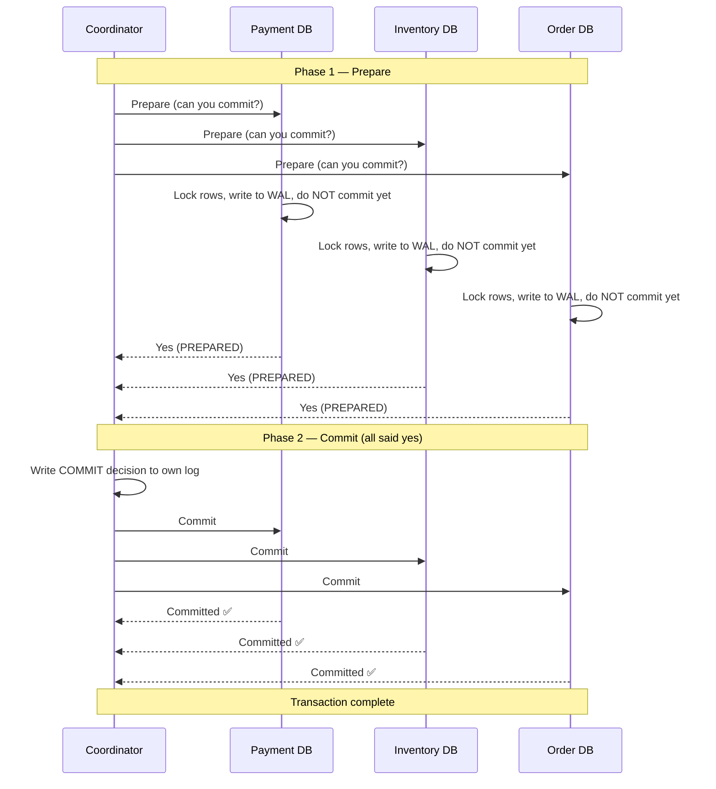
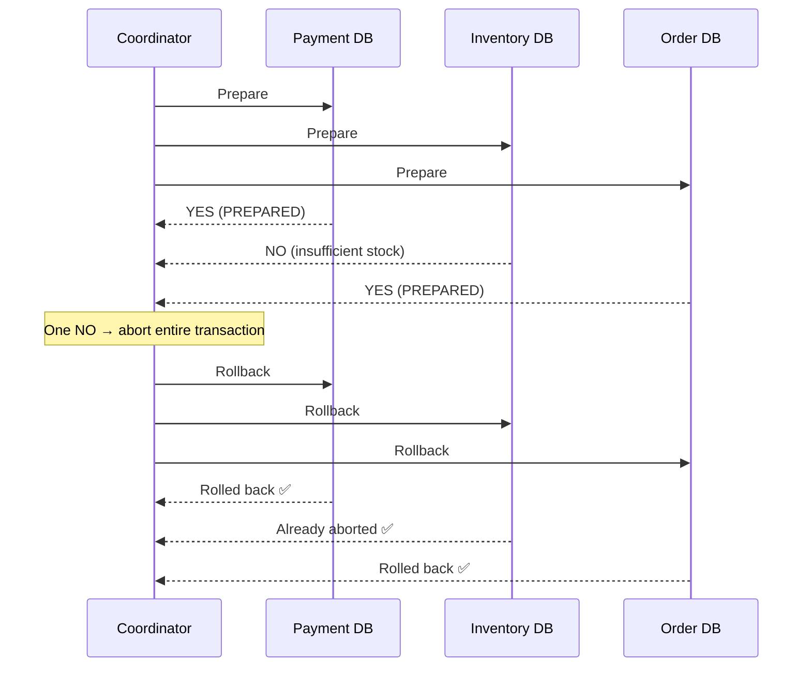
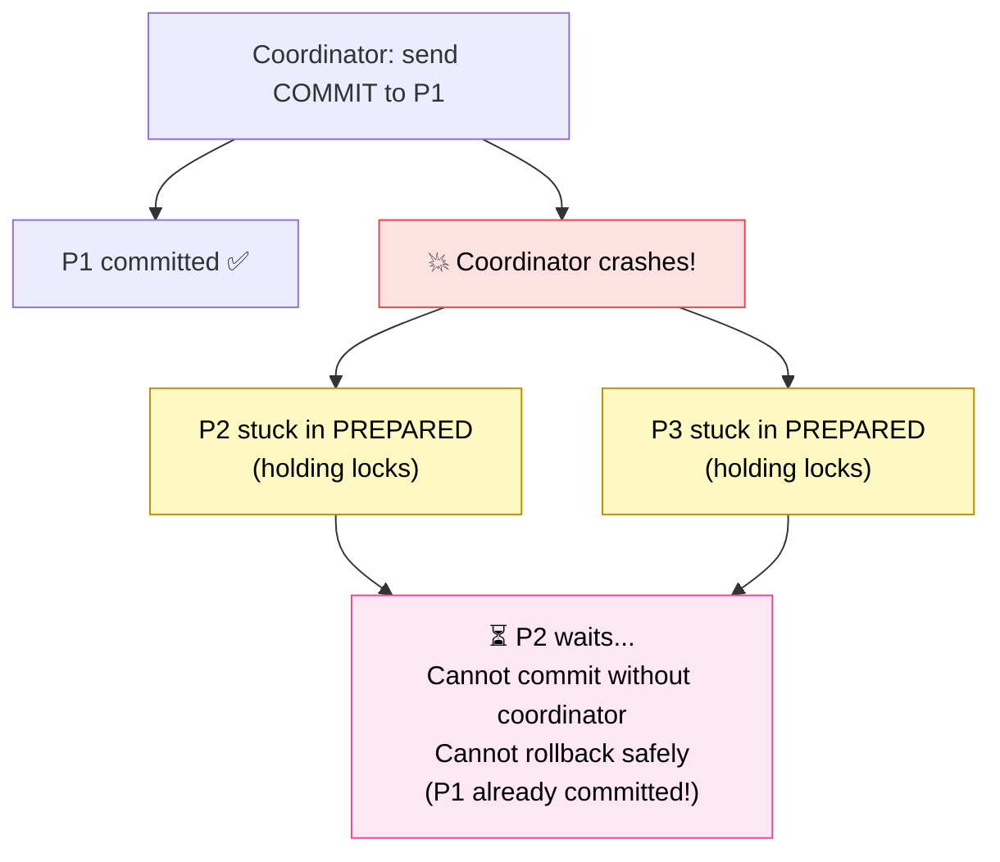
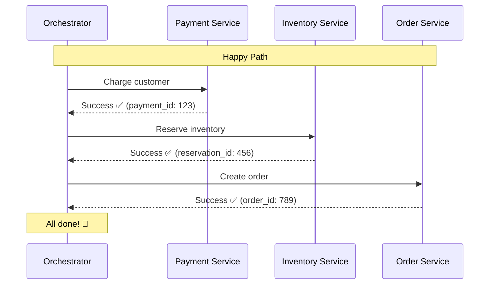
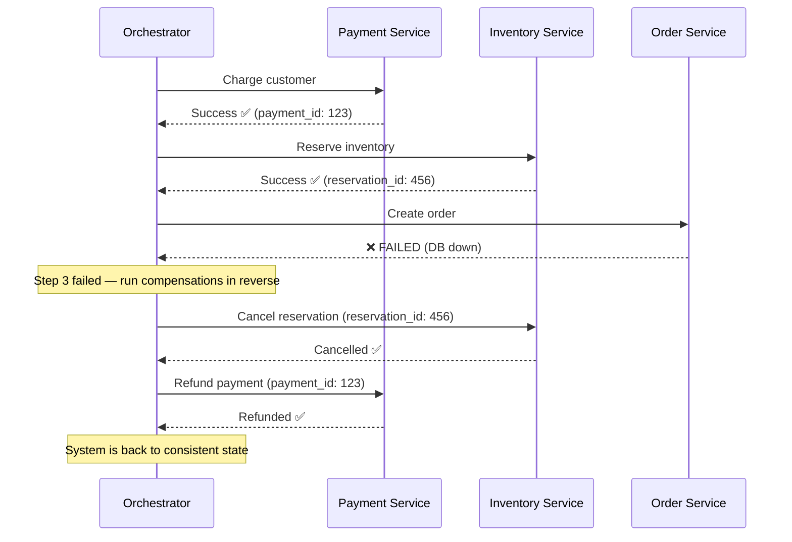
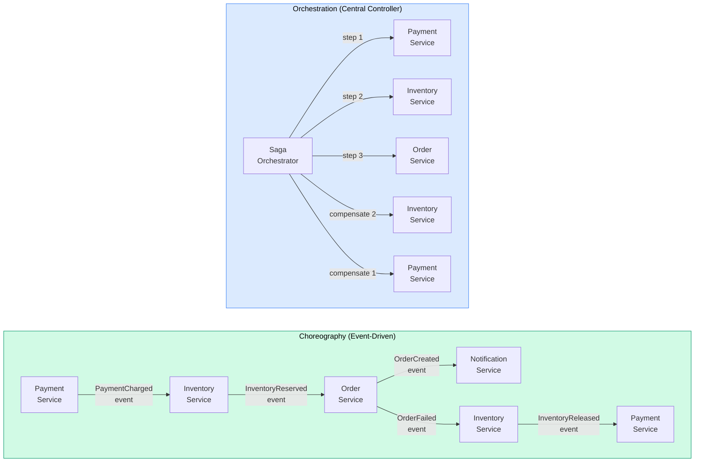
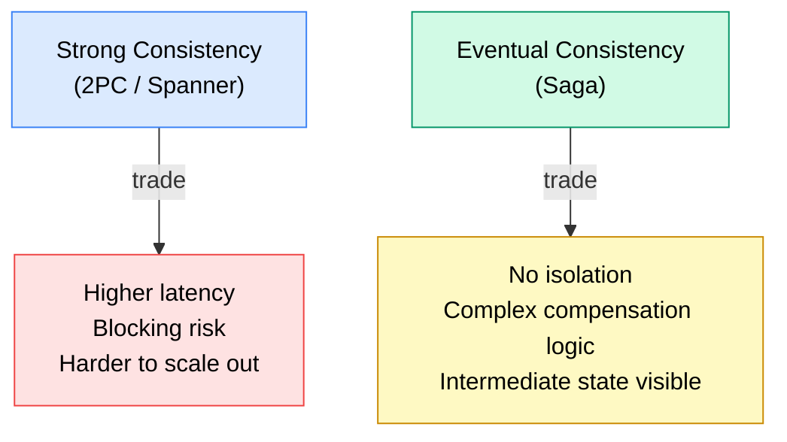

# Distributed Transactions

> A **distributed transaction** is an atomic operation that spans multiple services, databases, or shards — ensuring either all parts commit or all parts roll back, even when those parts live on different machines.

**Level:** 4 · **Topic:** 4 · **Prerequisites:** [ACID and Transactions](../../Level-02-Data-Layer/05-ACID-and-Transactions/README.md) · [Consensus: Paxos and Raft](../03-Consensus-Paxos-Raft/README.md) · [CAP Theorem](../01-CAP-Theorem/README.md)

---

## 🎯 The Problem

You're building an e-commerce checkout. When a customer pays:
1. Debit the customer's account (Payment Service / Database A)
2. Reserve the inventory (Inventory Service / Database B)
3. Create the order record (Order Service / Database C)

These must all succeed **together** or all fail together. But they live in separate services, possibly on separate machines. A regular database transaction can't span all three.

What happens if steps 1 and 2 succeed, then step 3 crashes? You've charged the customer and reserved inventory, but there's no order. That's a disaster.

This is the distributed transaction problem.

---

## 🌍 Real-World Analogy

Imagine buying a house: you need to simultaneously sign the purchase contract, transfer the money, and receive the deed. Three separate legal/financial institutions are involved. If any one step fails after the others complete, there's chaos.

Real estate closings solve this with an escrow agent — a trusted third party who holds everything until all conditions are met, then releases simultaneously.

**Two-Phase Commit** is the escrow agent pattern. **Saga** is the "sequence of individual steps with undo procedures if anything goes wrong" pattern.

---

## 🧠 Core Idea

Two main approaches:

| Approach | Mechanism | Guarantees | Drawbacks |
|---|---|---|---|
| **Two-Phase Commit (2PC)** | Coordinator orchestrates prepare → commit | ACID atomicity | Blocking on coordinator failure |
| **Three-Phase Commit (3PC)** | Adds a pre-commit phase | Non-blocking in theory | Doesn't work with network partitions |
| **Saga** | Sequence of local transactions + compensations | Eventual consistency | No isolation between steps |

---

## 📊 How It Works

### Two-Phase Commit (2PC)

2PC uses a **coordinator** (also called a transaction manager) to orchestrate participants.

**If any participant says NO in Phase 1:**

### The Blocking Problem — 2PC's Fatal Flaw

What if the **coordinator crashes** after sending COMMIT to P1 but before sending to P2 and P3?

- P1 is committed (locks released, data visible)
- P2 and P3 are in "PREPARED" — they've locked rows and cannot proceed until they hear from the coordinator

This is the **blocking** problem. Participants can be stuck in PREPARED state indefinitely, holding locks, unable to commit or rollback, until the coordinator recovers.

**Solutions to blocking:**
- **Coordinator recovery log:** Coordinator writes decision to durable log before sending — restart can resume
- **Coordinator replication:** Use Paxos/Raft to replicate the coordinator (Google Spanner does this)
- **Timeouts with heuristic decisions:** Dangerous — participants may guess wrong

### Three-Phase Commit (3PC)

3PC adds a "pre-commit" phase between prepare and commit. This allows participants to determine the coordinator's intent even if it crashes.

In theory, 3PC avoids blocking. In practice, it doesn't work under network partitions (which split the cluster and may cause different participants to make different decisions). 3PC is mostly a theoretical solution; real systems rarely use it.

---

## 📊 The Saga Pattern

Saga is the practical alternative. Instead of one giant atomic transaction, you run a **sequence of local transactions**. If any step fails, you run **compensating transactions** to undo the prior steps.

**When a step fails — compensating transactions run:**

### Choreography vs Orchestration

There are two ways to coordinate a Saga:

| | **Choreography** | **Orchestration** |
|---|---|---|
| **Control** | Decentralized — services react to events | Centralized — orchestrator drives steps |
| **Coupling** | Services know each other's events | Services only know the orchestrator |
| **Observability** | Hard — flow spread across logs | Easy — flow visible in orchestrator |
| **Failure handling** | Complex — each service handles compensations | Easier — orchestrator manages state |
| **Cycle risk** | Easy to create event cycles | Less likely |
| **Best for** | Simple flows, high autonomy | Complex flows, business process visibility |

> See [Level-05-Architecture-Patterns/07-Saga-and-Orchestration](../../Level-05-Architecture-Patterns/07-Saga-and-Orchestration/README.md) for a deep dive into Saga implementation patterns.

---

## 🔧 Types / Variations / Strategies

### Compensating Transactions — Key Properties

A compensating transaction must:
- **Be idempotent** — running it twice has the same effect as once (see [Idempotency](../07-Idempotency-and-Exactly-Once/README.md))
- **Always succeed eventually** — you can't compensate a compensation
- **Return the system to a semantically valid state** — not necessarily the original state

| Action | Compensation |
|---|---|
| Charge payment | Refund payment |
| Reserve inventory | Release reservation |
| Create order | Cancel order |
| Send email | (Cannot un-send! Mark "cancel confirmed" in user account) |

> Note: Some actions like "send email" are **irreversible**. These are called **pivot transactions** — once you reach them, you must succeed forward. Design Sagas to put irreversible steps last.

### 2PC vs Saga Comparison

| Dimension | 2PC | Saga |
|---|---|---|
| **Atomicity** | True ACID atomicity | Eventual consistency |
| **Isolation** | Full isolation (locks held) | No isolation — intermediate states visible |
| **Blocking** | Yes — on coordinator failure | No — each step is independent |
| **Performance** | Multiple round trips, locks held | Async, no cross-service locks |
| **Complexity** | Protocol complexity | Application logic complexity (compensations) |
| **Best for** | Same-database multi-table ops, Spanner | Microservices, cross-service workflows |

---

## 🏢 Real-World Examples

### Google Spanner — 2PC Over Paxos
Spanner is one of the few systems that makes 2PC practical at scale by making the coordinator itself a Paxos group. If the coordinator fails, Paxos elects a new leader and the transaction can resume. This gives 2PC atomicity without the single-point-of-failure blocking problem. The cost is higher latency.

### Uber — Saga with Choreography
Uber's trip booking uses a choreography-based Saga. When a trip is booked, a chain of events fires: payment authorization, driver matching, route calculation. Each service subscribes to relevant events and publishes its own. Compensation events (e.g., "payment authorization failed") trigger rollbacks in prior steps.

### Amazon — Saga with Orchestration
Amazon's order fulfillment uses orchestration-based Sagas. An order orchestrator tracks state through steps: reserve inventory, charge payment, ship, confirm. If any step fails, the orchestrator runs compensation logic. This keeps the flow visible and auditable.

### Apache Kafka + Kafka Streams — Exactly-Once Semantics
Kafka's "exactly-once semantics" (EOS) uses a form of 2PC internally between the producer, the transaction coordinator (a Kafka broker), and the consumer. This provides atomic multi-partition writes — useful for building reliable Saga steps.

---

## ⚖️ Trade-offs

### The Core Tension

### When 2PC Holds Locks — Example

With 2PC across Payment and Inventory:
- During Phase 1 ("Prepare"), both databases lock the affected rows
- Locks are held until Phase 2 completes
- If the checkout takes 2 seconds, inventory is locked for 2 seconds
- Under high load, this causes lock contention and slow transactions

---

## ✅ When to Use / ❌ When NOT to Use

### Use 2PC When:
- All participants support XA (the standard 2PC protocol) — e.g., PostgreSQL, MySQL, Oracle
- You need true ACID atomicity across a small number of resources
- Coordinator failure can be tolerated (or coordinator is replicated — like Spanner)
- Transactions are short-lived (minimize lock hold time)

### Use Saga When:
- You're in a microservices architecture — services have separate databases
- Long-running workflows that can't hold locks for their duration
- You can design meaningful compensating transactions
- High throughput is required (no cross-service locks)

### Avoid 2PC When:
- Services are independently owned and don't share a transaction manager
- Transactions are long-running (minutes+)
- You need high availability — 2PC's blocking is unacceptable

### Avoid Saga When:
- You need true isolation — Sagas expose intermediate states
- Compensations are impossible or very complex (many irreversible steps)
- Your team lacks discipline to implement idempotent compensations

---

## ⚠️ Common Pitfalls

1. **Saga without idempotency.** If a Saga step is retried (e.g., network timeout on "charge payment"), you might charge twice. Every Saga step AND its compensation must be idempotent. See [Idempotency](../07-Idempotency-and-Exactly-Once/README.md).

2. **Ignoring intermediate state visibility.** Between steps, the system is in an inconsistent state. Other users might see "order created" before payment succeeds. Design your UI and downstream systems to handle this.

3. **Compensations that can fail.** If your compensation itself can fail and you don't have a retry strategy, you're stuck. Compensations should be retried with exponential backoff until they succeed.

4. **Not considering pivot transactions.** Identify which steps are irreversible early. These should be last in the sequence, not in the middle.

5. **Using 2PC across microservice boundaries.** If you don't own both services, you can't guarantee both will participate in XA transactions. Saga is the answer.

6. **Forgetting about timeouts in 2PC.** The "Prepare" lock must have a timeout. If a participant waits forever, it deadlocks. 2PC implementations must define maximum lock duration.

---

## 🎤 Interview Tips

- **Name the 2PC phases:** "Prepare" (can you commit?) and "Commit/Rollback." This is a quick signal of familiarity.
- **Lead with the blocking problem:** "2PC's main weakness is blocking — if the coordinator crashes after COMMIT, participants holding locks are stuck." This shows real understanding, not just protocol knowledge.
- **Distinguish Saga from 2PC clearly:** "2PC gives real atomicity but holds locks and can block. Saga is eventually consistent, releases locks immediately per step, but has no isolation between steps."
- **Choreography vs Orchestration:** Know both and when to use each. "For a checkout flow with 5+ steps, I'd use orchestration for observability. For a simple 2-step flow between decoupled services, choreography is fine."
- **Always mention idempotency in Saga** — it shows you've thought about failure modes.
- **Mention Spanner** as an example of 2PC done right (coordinator = Paxos group → no blocking).

---

## 📝 TL;DR

- Distributed transactions are needed when a single business operation spans multiple services/databases
- **2PC:** Coordinator asks everyone "can you commit?" → all say yes → coordinator sends commit. Problem: blocking if coordinator fails in phase 2
- **3PC:** Adds a phase to avoid blocking — doesn't work under network partitions
- **Saga:** Sequence of local transactions + compensating transactions for rollback. No isolation, but no cross-service locks and no blocking
- Saga implementations: **Choreography** (event-driven, decentralized) vs **Orchestration** (central controller)
- Key Saga requirements: idempotent steps, idempotent compensations, pivot transactions last
- 2PC works great within a single database or with Spanner; Saga is the answer for microservices

---

## 🧪 Test Yourself

1. Describe the two phases of 2PC. What does each participant do in each phase?
2. The coordinator in 2PC crashes after sending COMMIT to participant P1. What happens to P2 and P3, which are in PREPARED state? How do real systems handle this?
3. Design a Saga for hotel + flight + car rental booking. What are the compensating transactions? Which step is the pivot transaction?
4. You're designing a payment service. A client times out on "charge" — should you retry? What property must the "charge" operation have to make retrying safe?
5. Your team debates: use 2PC or Saga for an order checkout that spans three microservices (payment, inventory, order). What factors drive your decision?

---

## 📚 Further Reading

- **DDIA Chapter 9:** *Designing Data-Intensive Applications* by Martin Kleppmann — "Distributed Transactions and Consensus" — best practical overview of 2PC
- **Gray & Reuter (1992):** "Transaction Processing: Concepts and Techniques" — the definitive textbook on 2PC and distributed transactions
- **Saga paper (1987):** Garcia-Molina & Salem, "Sagas" — SIGMOD — the original Saga paper
- **Google Spanner (2012):** "Spanner: Google's Globally Distributed Database" — OSDI 2012 — see Section 4 on transactions and 2PC over Paxos
- **Microservices Patterns (Chris Richardson):** Chapter 4 covers Saga in depth with choreography and orchestration examples
- **Saga pattern deep dive:** [Level-05-Architecture-Patterns/07-Saga-and-Orchestration](../../Level-05-Architecture-Patterns/07-Saga-and-Orchestration/README.md)
- **Kafka EOS:** "Exactly Once Semantics are Possible: Here's How Kafka Does It" — Confluent engineering blog
