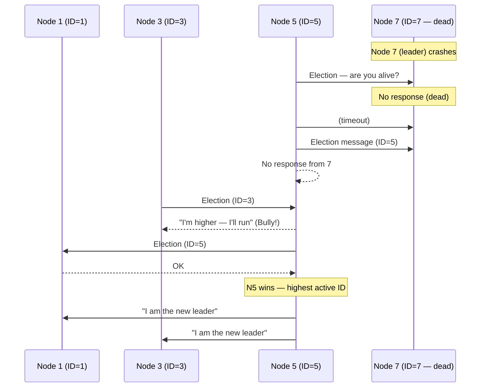
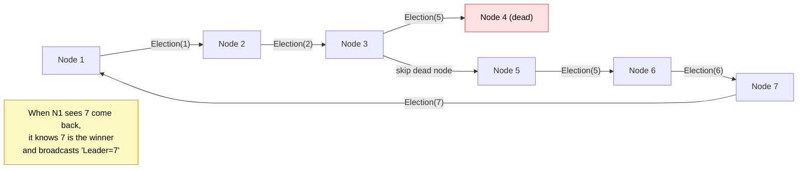
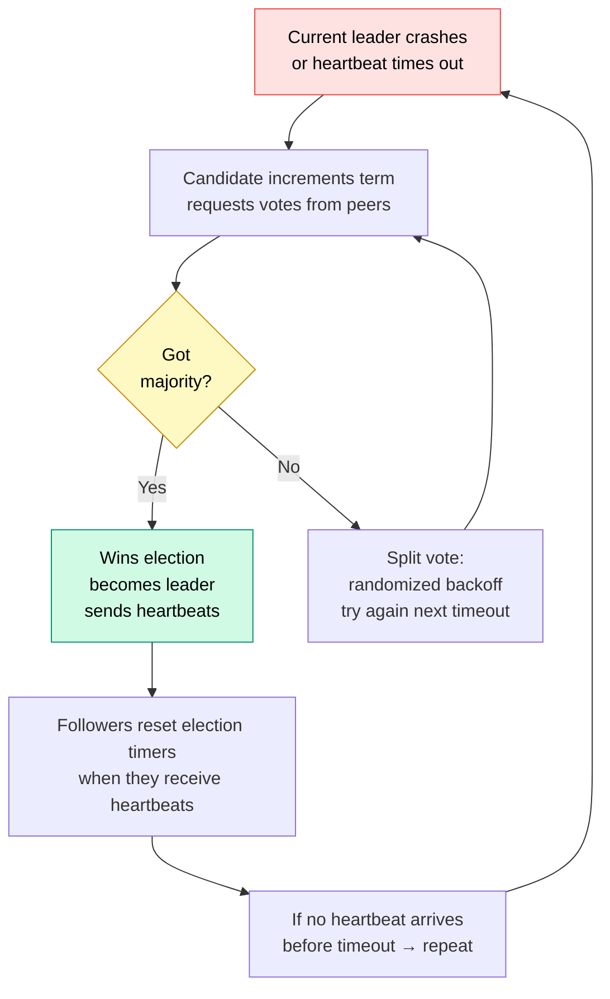
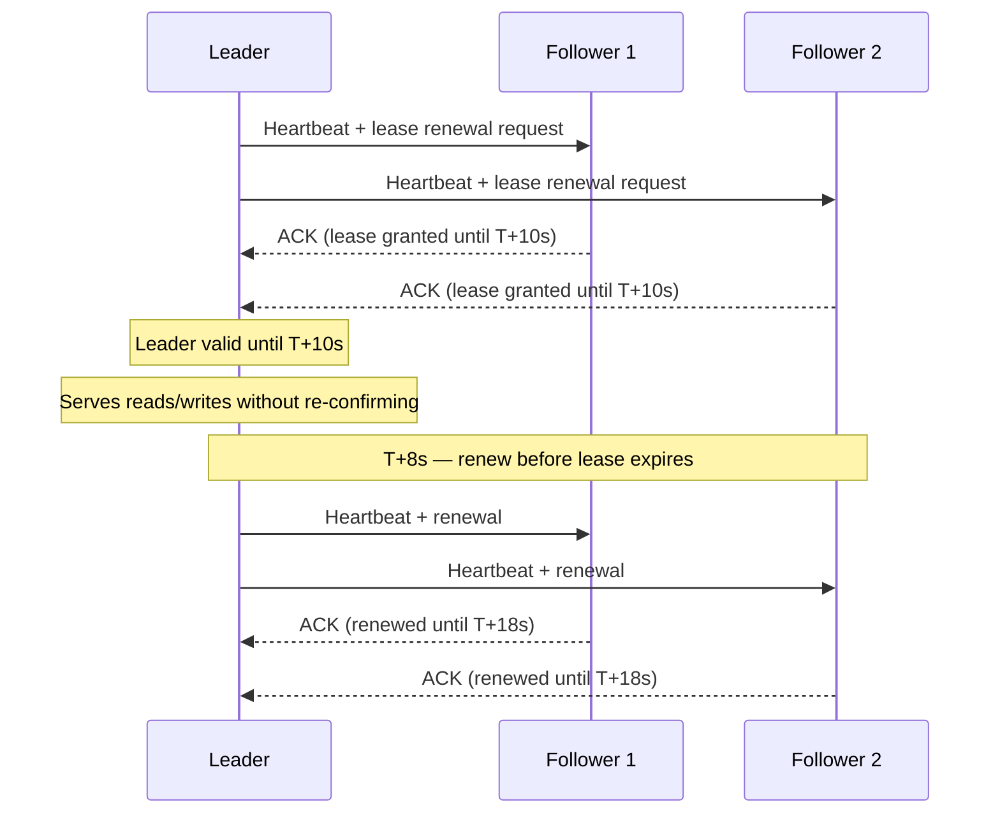
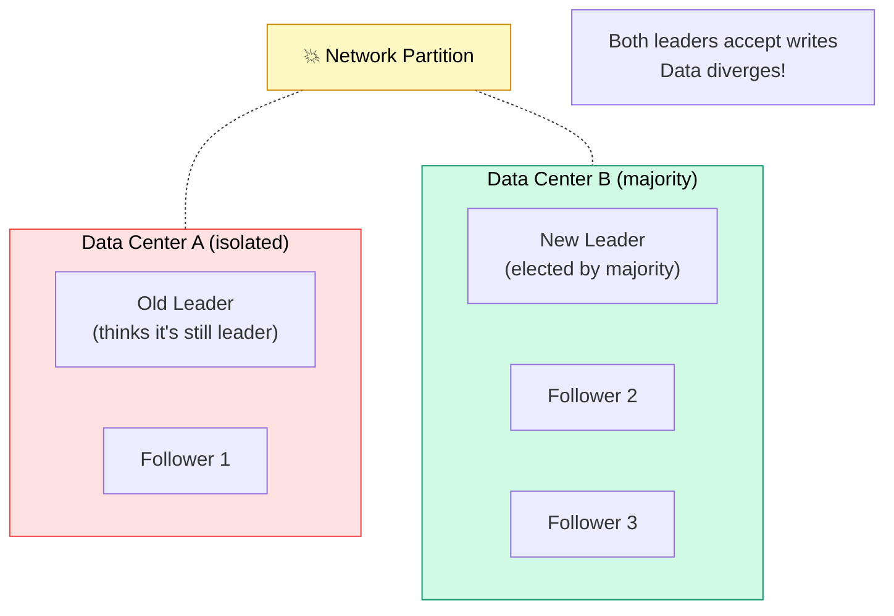
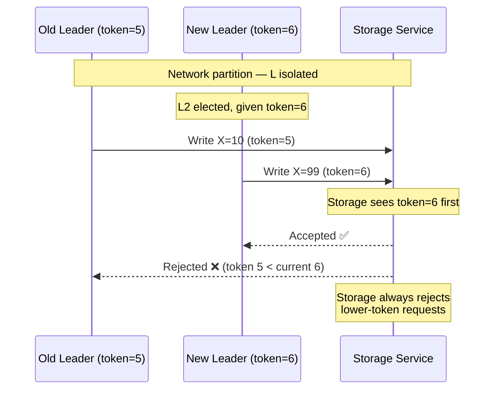

# Leader Election

> **Leader Election** is the process by which distributed nodes collectively choose one node as the designated coordinator — ensuring that exactly one leader exists at any time, even when nodes crash and rejoin.

**Level:** 4 · **Topic:** 5 · **Prerequisites:** [Consensus: Paxos and Raft](../03-Consensus-Paxos-Raft/README.md) · [CAP Theorem](../01-CAP-Theorem/README.md)

---

## 🎯 The Problem

You have a distributed database with five nodes. For consistency, you want all writes to flow through a single **primary** node — the leader. But:

- Leaders crash. Who takes over?
- Network partitions can make it *look* like the leader died when it's just unreachable
- If two nodes both think they're the leader (**split-brain**), they'll accept conflicting writes, corrupting data

Leader election solves this: when the current leader fails, the remaining nodes run an algorithm to elect exactly one new leader and agree on who it is.

---

## 🌍 Real-World Analogy

Think of a country's government. The President (leader) has executive authority. If the President dies mid-term, there's a defined succession process — the Vice President takes over. Everyone agrees on the succession because the rules are established in advance.

The challenge in distributed systems: imagine if, during the succession, news of the President's death took different amounts of time to reach different officials. Some might declare a new leader while the "dead" President is actually alive and making decisions on the other side of the country. That's split-brain.

---

## 🧠 Core Idea

### Why a Single Leader Simplifies Things

With a single leader:
- **Writes** have one authoritative entry point — no conflicts
- **Reads** from the leader are always fresh (linearizable)
- **Ordering** is straightforward — the leader sequences all operations

Without a single leader (multi-master), you must handle:
- Write conflicts (two nodes accept conflicting updates to the same key)
- Complex merge logic
- Cycle detection in replication graphs

Leader election is the mechanism that maintains the single-leader property when the current leader fails.

### The Core Requirements

1. **Safety (at most one leader):** Never have two simultaneous leaders
2. **Liveness (eventual progress):** Eventually, a leader is elected
3. **Agreement:** All nodes agree on who the leader is

These map directly to consensus requirements. In fact, reliable leader election **requires consensus**.

---

## 📊 How It Works

### Algorithm 1 — The Bully Algorithm

Each node has a unique numeric ID. The node with the **highest ID** becomes the leader.

**Bully Algorithm Properties:**
- Simple to implement
- Deterministic (highest ID always wins)
- **Not safe under network partitions** — N5 might bully N7 when N7 is alive but temporarily unreachable
- High message complexity: O(N²) in worst case

### Algorithm 2 — Ring Election

Nodes are arranged in a logical ring. The election message circulates around the ring, accumulating the highest ID seen.

**Ring Algorithm Properties:**
- Lower message count: O(N)
- Still fragile under multiple simultaneous failures
- Not widely used in modern systems

### Algorithm 3 — Consensus-Based Election (the Right Way)

Modern systems use a consensus protocol (Raft, ZAB, Paxos) for leader election. This provides the strongest guarantees.

This is exactly what Raft does (see [Consensus: Paxos and Raft](../03-Consensus-Paxos-Raft/README.md)). The randomized election timeout is key: nodes wait a random duration before calling an election, which prevents all nodes from calling elections simultaneously and causing a split vote.

### Algorithm 4 — Leases

A **lease** is a time-bounded grant of leadership. The leader holds a lease (e.g., "you are the leader until t+10s"). During that window, it can act as leader without constantly re-confirming.

**Lease properties:**
- Low overhead — no per-request consensus
- Leader must renew before expiry (heartbeats serve double duty)
- On expiry without renewal → lease lapses → others can elect new leader
- **Critical:** The old leader must stop acting as leader when its lease expires — even if it thinks it's still healthy

---

## ⚠️ Split-Brain and Fencing Tokens

### The Split-Brain Problem

A network partition can isolate the leader from the majority. The majority elects a new leader. Now there are **two leaders** — one on each side of the partition.

The old leader on the isolated side must eventually realize it's no longer the leader and **stop acting**. How?

### Fencing Tokens

A **fencing token** is a monotonically increasing number issued with each leadership grant.

**How fencing tokens work:**
1. Each leadership grant comes with a monotonically increasing token (e.g., a Raft term number)
2. Every write to external services includes the token
3. External services (storage, lock managers) reject any write with a token lower than the highest they've seen
4. Even if the old leader thinks it's the leader, its writes are rejected

### STONITH (Shoot The Other Node In The Head)

Some systems use **STONITH** as a more aggressive split-brain remedy. When a new leader is elected, it actively powers off (via IPMI/DRAC) or fences the old leader before taking over. This guarantees the old leader cannot make any more writes — but requires hardware-level access and adds operational complexity.

---

## 🔧 Types / Variations / Strategies

### Leader Election Service Comparison

| Service | Algorithm | Use Case |
|---|---|---|
| **ZooKeeper** | ZAB (Zookeeper Atomic Broadcast) | Kafka broker leader election, HBase master election |
| **etcd** | Raft | Kubernetes node/pod leadership, general distributed locking |
| **Consul** | Raft | Service mesh, distributed locks, service leader election |
| **PostgreSQL Patroni** | etcd/Consul/ZooKeeper-backed | PostgreSQL primary election and failover |
| **Redis Sentinel** | Custom (majority-based) | Redis master failover |

### Heartbeats and Timeouts — Tuning

| Parameter | Too Small | Too Large |
|---|---|---|
| **Heartbeat interval** | Network chatter, CPU overhead | Slow failure detection |
| **Election timeout** | Spurious elections (leader load spike = election) | Slow recovery after real failure |
| **Lease duration** | Frequent renewals | Long split-brain window if leader crashes |

**Rule of thumb:** Election timeout should be 10–50× the heartbeat interval. Raft uses 150–300ms election timeout with ~50ms heartbeats.

---

## 🏢 Real-World Examples

### Kafka — ZooKeeper-Based (Legacy) / KRaft (Modern)
Kafka used ZooKeeper for controller election (which broker is the "controller" responsible for partition leader assignments). Modern Kafka (2.8+) uses KRaft — Raft built into Kafka itself — eliminating the ZooKeeper dependency. The KRaft controller leader is elected via Raft among a dedicated set of controller nodes.

### Kubernetes — etcd + kube-controller-manager
Kubernetes runs multiple controller-manager replicas for HA. They use etcd to elect a single active controller-manager leader. The leader holds a lease in etcd; if the lease expires (heartbeat missing), another replica acquires it and becomes the new leader.

### Elasticsearch — Master Node Election
Elasticsearch runs a cluster with dedicated master-eligible nodes. They elect a master via a custom voting process requiring a majority of master-eligible nodes. Minimum master nodes (`discovery.zen.minimum_master_nodes`) must be set to ⌊N/2⌋+1 to prevent split-brain — one of the most common Elasticsearch operational mistakes when not set correctly.

### Redis Sentinel
Redis Sentinel monitors Redis instances and performs automatic failover. When the master is unreachable, Sentinels vote (majority required) to elect a new master and reconfigure slaves to replicate from it. Sentinels themselves must reach a quorum — a deployment with 3 Sentinels can tolerate 1 failure.

---

## ⚖️ Trade-offs

| Trade-off | Faster Election | Safer Election |
|---|---|---|
| **Timeout tuning** | Short timeout → fast election → more false elections | Long timeout → fewer false elections → slower recovery |
| **Quorum size** | Smaller quorum → faster agreement | Larger quorum → more fault tolerant |
| **Algorithm** | Bully: simple, O(N²) msgs | Consensus: safe, requires majority |
| **Leases** | Fast leader serving (no per-op consensus) | Risk of acting as leader past lease expiry |

---

## ✅ When to Use / ❌ When NOT to Use

### Use Leader Election When:
- You have a primary-secondary replication model and need automatic failover
- You're building any coordination service (distributed locks, sequence numbers, config)
- You need a single point of decision-making to avoid conflicts

### Avoid Rolling Your Own When:
- Use ZooKeeper, etcd, or Consul instead — they're battle-tested
- The correctness stakes are high; subtle bugs in leader election cause data loss

### Consider Leaderless Designs When:
- You need write throughput a single leader can't provide (Cassandra, DynamoDB)
- You're willing to accept eventual consistency in exchange for no single-leader bottleneck

---

## ⚠️ Common Pitfalls

1. **Split-brain without fencing.** If your system doesn't use fencing tokens or STONITH, a partitioned old leader can continue making writes that conflict with the new leader's writes.

2. **Asymmetric network issues.** The leader can reach followers, but followers can't reach each other. The leader is "healthy" but followers time out and call elections. This is a real production scenario and requires careful timeout tuning.

3. **Clock skew in lease-based election.** If the leader's clock runs fast, its lease expires earlier than expected. If the clock runs slow, it might act as leader past the safe window. Lease-based systems must account for clock uncertainty.

4. **Too-small election quorum.** Elasticsearch's split-brain comes from setting `minimum_master_nodes` too low. Always set quorum to ⌊N/2⌋+1.

5. **Slow election after leader crash.** If election timeouts are too long, there's significant downtime after a crash. Tune timeouts based on your SLA requirements.

6. **Leader doing too much work.** All writes go through the leader — it's a bottleneck. Use read replicas for reads; shard your data across multiple Raft groups for write scale.

---

## 🎤 Interview Tips

- **State the requirements first:** "We need at-most-one leader (safety) and we need to eventually elect one (liveness)."
- **Lead with consensus:** "The right way to do leader election is through a consensus protocol like Raft. Simpler algorithms like Bully aren't safe under network partitions."
- **Mention split-brain and fencing tokens** — this distinguishes candidates who've thought about failure modes.
- **Name real services:** "In production, I'd use etcd or ZooKeeper rather than implementing election myself. Kubernetes does this with kube-controller-manager holding a lease in etcd."
- **For database failover questions:** "Patroni uses etcd/Consul/ZooKeeper to elect a PostgreSQL primary. The key is that only one node gets the fencing token at a time, and the storage layer rejects writes from old tokens."
- **Lease vs Raft consensus per-read:** "Leases are cheaper for leader-serving reads but require careful clock management. For strict linearizability, you need Raft's read-index approach."

---

## 📝 TL;DR

- Leader election ensures exactly one node acts as primary, even through failures
- **Bully algorithm:** highest ID wins — simple but unsafe under partitions
- **Ring algorithm:** message circulates, highest ID wins — O(N) messages but fragile
- **Consensus-based (Raft/ZAB):** the right way — safe, handles partitions
- **Leases:** time-bounded leadership — efficient, requires clock discipline
- **Split-brain** is the critical failure mode: two nodes both think they're leader
- **Fencing tokens** prevent split-brain writes: reject writes with stale tokens
- Use ZooKeeper, etcd, or Consul — don't implement election yourself

---

## 🧪 Test Yourself

1. Explain the Bully algorithm. What's its failure mode under a network partition?
2. What is split-brain? Give a concrete example of data corruption it could cause in a database.
3. How do fencing tokens prevent split-brain? Walk through a scenario.
4. A Raft cluster of 5 nodes has a network partition that isolates 2 nodes from the other 3. What happens? Which side can elect a leader?
5. Your Redis Sentinel setup has 3 Sentinels. The Redis master fails. Walk through how failover happens.
6. Why does lease-based leader serving require careful clock management?

---

## 📚 Further Reading

- **DDIA Chapter 8 & 9:** *Designing Data-Intensive Applications* by Martin Kleppmann — "The Trouble with Distributed Systems" and "Consistency and Consensus" — excellent coverage of split-brain, fencing tokens, and leases
- **Raft paper (2014):** "In Search of an Understandable Consensus Algorithm" — Ongaro & Ousterhout — leader election is a core component
- **Chubby (2006):** "The Chubby Lock Service for Loosely-Coupled Distributed Systems" — Google — real-world lease-based leadership
- **ZooKeeper (2010):** "ZooKeeper: Wait-free Coordination for Internet-scale Systems" — USENIX ATC — ZAB-based election
- **Patroni documentation:** github.com/zalando/patroni — PostgreSQL HA using etcd/Consul/ZooKeeper for election
- **Elasticsearch: Zen Discovery:** Elasticsearch docs on master node election and split-brain prevention
- **"Fencing and STONITH" chapter in "Database Reliability Engineering"** — Campbell & Majors, O'Reilly
