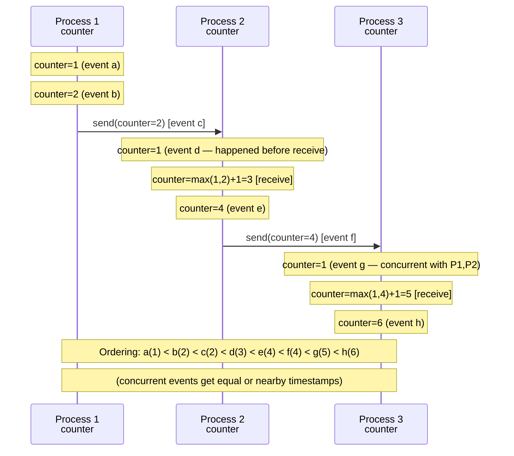
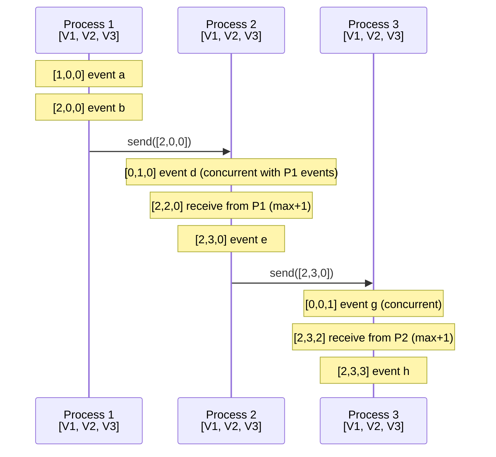
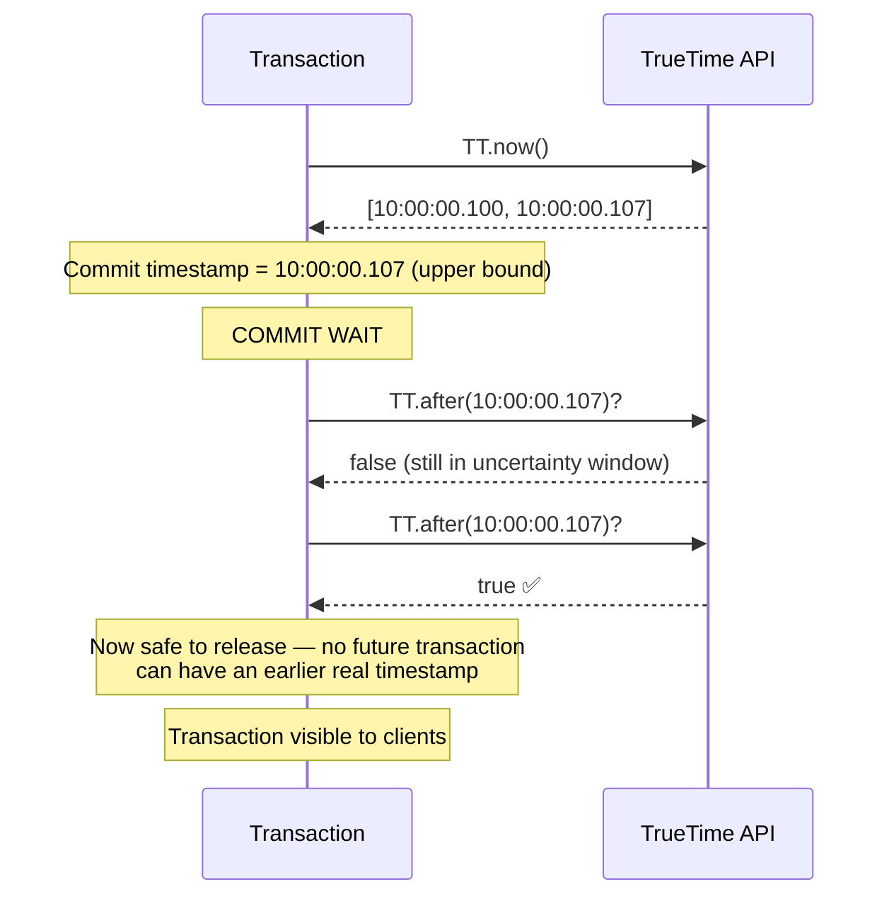
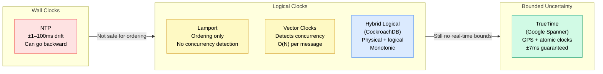

# Clocks and Ordering

> In a distributed system, **wall clocks cannot be trusted** to order events — clock skew means two nodes' clocks can disagree by milliseconds or more. Logical clocks (Lamport timestamps, vector clocks) and hybrid approaches (HLC, TrueTime) provide correct event ordering without relying on synchronized hardware clocks.

**Level:** 4 · **Topic:** 6 · **Prerequisites:** [CAP Theorem](../01-CAP-Theorem/README.md) · [Consistency Models](../02-Consistency-Models/README.md) · [Consensus: Paxos and Raft](../03-Consensus-Paxos-Raft/README.md)

---

## 🎯 The Problem

You have two servers. Server A handles a user's "update profile" request and writes it at time 10:00:00.100. Server B handles a "delete account" request and writes it at 10:00:00.099.

Server B's clock shows 10:00:00.099, but its system clock runs 1ms slow. In reality, the "delete account" happened *after* the profile update. But a naive "sort by timestamp" would process the profile update last — potentially updating an already-deleted account.

Wall clocks in distributed systems:
- Are synchronized via NTP, but NTP only gets you to ~1–100ms accuracy
- Can drift, jump forward, jump backward (after NTP correction)
- Can skew by seconds in degraded environments
- **Cannot be trusted to determine the order of events** across machines

---

## 🌍 Real-World Analogy

Imagine two historians, each with their own wristwatch, writing journals of the same event in different rooms. When they merge their journals by timestamp, the entries might be in the wrong order — because one watch was 3 minutes fast.

Lamport's insight: instead of relying on watches, we can use **message passing** itself as our clock. If Alice sends a letter to Bob, Bob's next journal entry *must* have happened after Alice sent the letter. We can use the message chain to order events without trusting any watch.

---

## 🧠 Core Idea

### The Happens-Before Relation

Leslie Lamport (1978) defined **happens-before** (written →) as:
1. **Within a process:** If event A occurs before event B in the same process, then A → B
2. **Messages:** If process P sends a message M (event A) and process Q receives M (event B), then A → B
3. **Transitivity:** If A → B and B → C, then A → C

If neither A → B nor B → A, the events are **concurrent** — we cannot determine their order.

---

## 📊 How It Works

### Lamport Logical Clocks

Each process maintains a counter. The rules:
1. Increment before any event
2. When sending a message: include current counter value
3. When receiving a message: `counter = max(local, received) + 1`



**Lamport clock property:**
- If A → B, then Lamport(A) < Lamport(B)
- **BUT** if Lamport(A) < Lamport(B), we CANNOT conclude A → B (concurrent events can have any order)

Lamport clocks tell you about *definite* ordering; they don't help you distinguish concurrent events from causally ordered ones.

### Vector Clocks — Detecting Concurrency

Vector clocks give each process a vector of counters — one per process. They let you detect whether two events are concurrent or causally ordered.



**Vector clock comparison:**
- V1 < V2 (V1 happened-before V2): all components of V1 ≤ V2, at least one strictly <
- V1 = V2: identical vectors
- V1 and V2 are **concurrent**: neither is ≤ the other component-wise

```
[1,0,0] vs [0,1,0]
→ 1 > 0 in position 1 (P1 wins)
→ 0 < 1 in position 2 (P2 wins)
→ Neither dominates → CONCURRENT ✅
```

```
[2,3,0] vs [2,3,2]
→ [2,3,0] ≤ [2,3,2] in all positions → [2,3,0] happened-before [2,3,2] ✅
```

**Real use of vector clocks:** Amazon Dynamo uses vector clocks to detect conflicting versions of the same object. When two clients write concurrently to the same key, both writes are retained as "siblings" — the application must resolve the conflict. (Dynamo showed that the complexity of vector clocks pushed to clients was too high; they moved to a simpler "last-write-wins with version vectors" approach.)

### Hybrid Logical Clocks (HLC)

Hybrid Logical Clocks (Kulkarni et al., 2014) combine physical time and logical time:
- Track physical time for human readability and cross-system debugging
- Use logical increments to break ties within the same physical millisecond
- Ensure HLC timestamps always advance (no going backward)

Format: `HLC = (physical_time, logical_counter)`

HLC is used in **CockroachDB** and **YugabyteDB** — it lets them use timestamps for MVCC (multi-version concurrency control) with the correctness of logical clocks.

---

## 🔧 Google Spanner's TrueTime

Google Spanner takes a different approach: instead of logical clocks, use **bounded uncertainty** about real time.

### The Problem TrueTime Solves

For Spanner's globally-distributed transactions to have external consistency, commits must be ordered in real time. If two transactions both commit, the one that committed "first" in real time must have the lower timestamp.

With normal NTP (±100ms uncertainty), you'd need to wait 100ms after every commit to ensure no future transaction could have an earlier real timestamp. That's too slow.

### TrueTime's Solution

Spanner deploys **GPS receivers and atomic clocks** in each data center. This reduces clock uncertainty to ~7ms worst-case (typically 1–4ms).

TrueTime provides three calls:
- `TT.now()` → `[earliest, latest]` — the true current time is within this interval
- `TT.after(t)` → true if t is definitely in the past
- `TT.before(t)` → true if t is definitely in the future



### Commit Wait

The key insight: after choosing a commit timestamp, Spanner **waits** until `TT.after(commit_timestamp)` is true before making the transaction visible. This guarantees that when you read data committed by this transaction, TrueTime's current interval is entirely after the commit timestamp.

This "commit wait" is ~7ms — the cost of external consistency. For global financial transactions, it's worth it.

### Clock Mechanisms Compared



---

## 🔧 Types / Variations / Strategies

### Clock/Ordering Mechanism Summary

| Mechanism | Concurrency Detection | Real-Time Bounds | Cost | Used In |
|---|---|---|---|---|
| Wall clock (NTP) | No | No (±100ms drift) | Cheap | Logging, monitoring (not ordering) |
| Lamport clock | No | No | Very cheap | Cassandra timestamps, simple ordering |
| Vector clocks | Yes | No | O(N) per message | Amazon Dynamo (historically) |
| Version vectors | Partial | No | O(N) per object | Git, Riak |
| HLC | Partial | Bounded by NTP | Cheap | CockroachDB, YugabyteDB |
| TrueTime | No (but bounded) | Yes (±7ms) | Expensive (GPS hardware) | Google Spanner |

### NTP Accuracy in Practice

| Environment | Typical Accuracy |
|---|---|
| Internet (public NTP) | ±10ms–100ms |
| Data center (private NTP) | ±1ms–10ms |
| PTP (hardware timestamping) | ±1µs–1ms |
| GPS + atomic clock (TrueTime) | ±1ms–7ms guaranteed |

---

## 🏢 Real-World Examples

### Amazon Dynamo — Vector Clocks
Dynamo used vector clocks to track version history of each object. When two clients concurrently write to the same key, Dynamo keeps both versions and marks them "siblings." The next read returns both, and the client or application merges them. The famous shopping cart example: two browser windows both add items → both additions are kept, not one overwriting the other.

In practice, vector clocks grew large (each client update added an entry). Amazon found that after a few hundred updates, most clock entries were ancient and pruned them with a time-based truncation — sacrificing theoretical correctness for practicality.

### Google Spanner — TrueTime
Spanner uses TrueTime for externally consistent transactions. Every Spanner commit performs commit-wait (waiting for TrueTime uncertainty to pass). This is how Spanner can guarantee that if transaction T1 commits before T2 in real time, T1's timestamp is lower. Used for Google's global financial systems, F1 (ad backend), and others.

### CockroachDB — Hybrid Logical Clocks
CockroachDB uses HLC for MVCC timestamps. Each transaction gets an HLC timestamp. Reads at a given timestamp see all committed writes with lower HLC timestamps. HLC's monotonicity guarantee ensures timestamps never go backward, which would break MVCC.

### Apache Cassandra — Lamport-Style Timestamps
Cassandra uses client-supplied timestamps (wall clock, typically) for conflict resolution (last-write-wins). This is why clock skew in Cassandra clients causes "mysterious" data overwrites — a slow-clock client's writes look older and get overwritten by a fast-clock client even if the slow-clock writes were logically later. A real operational hazard.

---

## ⚖️ Trade-offs

| Approach | Ordering Accuracy | Concurrency Detection | Overhead | Infrastructure Cost |
|---|---|---|---|---|
| Wall clock | Poor (drift/skew) | No | None | None |
| Lamport | Good (causal) | No | Very low | None |
| Vector clock | Best | Yes | O(N) per message | None |
| HLC | Good (NTP-bounded) | Partial | Low | NTP sync |
| TrueTime | Excellent (±7ms) | No (but real-time) | Low (7ms wait) | GPS + atomic clocks |

---

## ✅ When to Use / ❌ When NOT to Use

### Use Logical Clocks (Lamport/Vector) When:
- You need causal ordering but don't care about real time
- Building event sourcing, CRDT systems, or distributed logs
- Your system is small enough that O(N) vector entries don't hurt

### Use HLC When:
- You want physical-time-approximate ordering for debuggability
- Building a distributed database with MVCC
- NTP-synchronized clocks are available but not perfectly reliable

### Use TrueTime When:
- You need **externally consistent** global transactions
- You have the infrastructure budget for GPS receivers
- You're Google (literally — no one else has deployed this at scale)

### Don't Use Wall Clocks For:
- Ordering distributed events (use logical or hybrid clocks)
- Fencing tokens (use monotonic counters instead)
- Anything where "last write wins by timestamp" can be gamed (Cassandra clients with adjustable clocks)

---

## ⚠️ Common Pitfalls

1. **Trusting wall clock order across machines.** A 1ms clock skew is small, but a 100ms skew turns into reversed event ordering at scale. Never compare timestamps from different machines to determine causality.

2. **Forgetting NTP can go backward.** NTP adjusts clocks by slewing (speeding up/down) or stepping (jumping). A step backward breaks any system that assumes monotonic time. Use `CLOCK_MONOTONIC` (not `CLOCK_REALTIME`) for elapsed time measurements.

3. **Vector clock explosion.** In high-churn environments (many clients), vector clocks grow unbounded. Need a truncation/pruning strategy.

4. **Cassandra clock skew bugs.** Cassandra uses client timestamps for LWW. A client with a clock 5 minutes in the future will "win" all conflicts for 5 minutes, even overwriting legitimately newer writes from other clients.

5. **Confusing logical order with real order.** Lamport timestamps tell you A happened-before B in the causal sense, not that A happened before B in wall clock time. A message sent at 10:00:01 local time can have a lower Lamport timestamp than a concurrent event at 09:59:59 local time.

6. **Underestimating commit-wait cost.** Spanner's ~7ms commit-wait matters for latency-sensitive operations. For a payment system, 7ms is fine. For a real-time game, it's not.

---

## 🎤 Interview Tips

- **Lead with the problem:** "Wall clocks can't be trusted in distributed systems — NTP has ±100ms accuracy and clocks can go backward after sync."
- **Explain happens-before** clearly: "Event A happens-before B if: A and B are on the same process and A precedes B, OR A sends a message that B receives, OR transitively."
- **Lamport vs Vector:** "Lamport clocks can tell you 'definitely causally before.' Vector clocks can also tell you 'concurrent' — neither happened-before the other."
- **Name TrueTime by mechanism:** "Google Spanner uses GPS receivers and atomic clocks per data center, giving ±7ms bounds on uncertainty. Before returning a committed transaction, Spanner waits out that uncertainty — 'commit-wait.' This guarantees external consistency."
- **CockroachDB vs Spanner comparison** is a great interview topic: "Both achieve serializable transactions. Spanner uses TrueTime hardware. CockroachDB uses HLC with NTP, which is cheaper but requires uncertainty restarts rather than commit-waits."

---

## 📝 TL;DR

- Wall clocks can't order distributed events — NTP drift and clock skew make them unreliable
- **Happens-before (→):** foundational relation — A → B means A causally precedes B
- **Lamport clocks:** cheap, give causal ordering — if A → B then Lamport(A) < Lamport(B) — but concurrent events can't be distinguished
- **Vector clocks:** detect concurrency — if neither V(A) ≤ V(B) nor V(B) ≤ V(A), events are concurrent
- **Hybrid Logical Clocks (HLC):** physical + logical, monotonic, no backward jumps — used in CockroachDB
- **TrueTime:** GPS + atomic clocks, ±7ms uncertainty — Spanner uses commit-wait to guarantee external consistency

---

## 🧪 Test Yourself

1. Why can't you use wall clock timestamps to order events across two servers? Give a specific failure scenario.
2. Draw Lamport clock timestamps for this sequence: P1 sends a message to P2 (event a→b), P2 sends a message to P3 (event c→d), P3 sends a message back to P1 (event e→f). P2 also has an event g between c and d.
3. Two Dynamo nodes concurrently update the same key. Node A has vector clock [2,1] and Node B has [1,2]. Are these concurrent or causally ordered? What does Dynamo do?
4. Explain Google Spanner's "commit-wait." Why is it necessary, and what's the cost?
5. CockroachDB uses HLC. A client reads data from Node A with HLC timestamp 100. Node B has HLC timestamp 90. What happens when the client's next request goes to Node B?
6. You're using Cassandra with last-write-wins. One application server has a clock 2 minutes in the future. What bad behavior could occur?

---

## 📚 Further Reading

- **Lamport (1978):** "Time, Clocks, and the Ordering of Events in a Distributed System" — Leslie Lamport — Communications of the ACM — the foundational paper; short and worth reading
- **Vector clocks:** "Detecting Causal Relationships in Distributed Computations" — Mattern (1988) / Fidge (1988) — two independent discoverers
- **Dynamo (2007):** "Dynamo: Amazon's Highly Available Key-Value Store" — SOSP — Section 4 covers vector clocks in detail
- **Spanner (2012):** "Spanner: Google's Globally Distributed Database" — OSDI — Section 3 on TrueTime and Section 4 on transactions
- **HLC (2014):** "Logical Physical Clocks and Consistent Snapshots in Globally Distributed Databases" — Kulkarni et al. — the HLC paper
- **DDIA Chapter 8:** *Designing Data-Intensive Applications* — "The Trouble with Distributed Systems" — excellent practical coverage of clock unreliability
- **"There is No Now" (2013):** Justin Sheehy — ACM Queue — beautiful essay on why clocks in distributed systems are fundamentally broken
