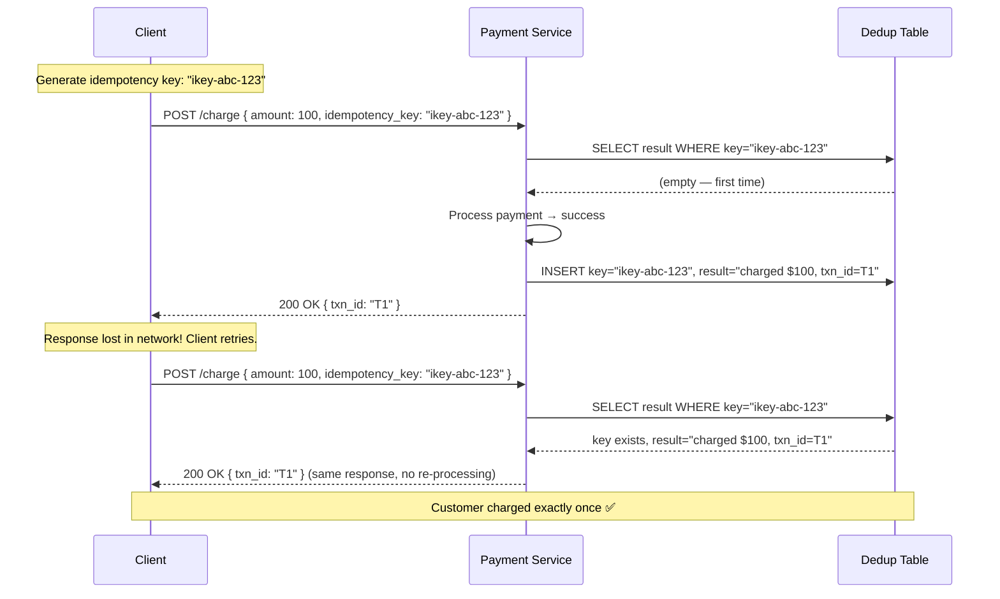
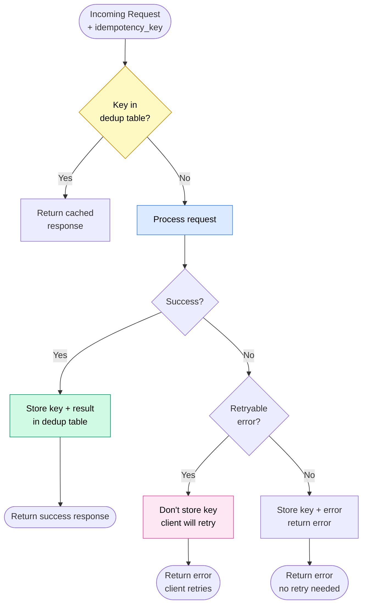
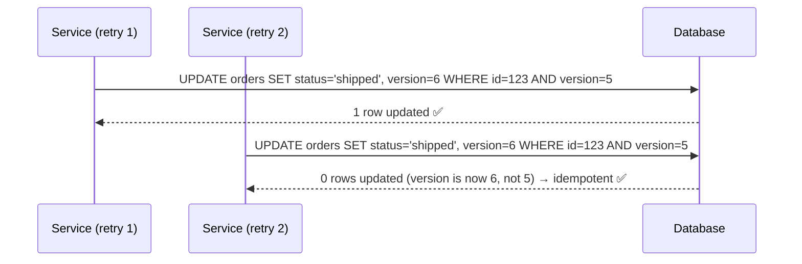
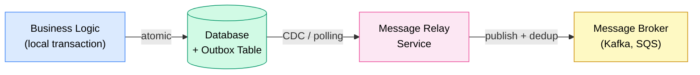

# Idempotency and Exactly-Once Processing

> **Idempotency** means an operation can be applied multiple times with the same effect as applying it once. In distributed systems, where networks force retries, idempotency is the mechanism that makes **effectively-once processing** possible — because "exactly-once delivery" is a myth.

**Level:** 4 · **Topic:** 7 · **Prerequisites:** [CAP Theorem](../01-CAP-Theorem/README.md) · [Distributed Transactions](../04-Distributed-Transactions/README.md) · [Consistency Models](../02-Consistency-Models/README.md)

---

## 🎯 The Problem

A client sends a "charge $100" request to a payment service. The service processes it successfully but the response gets lost in the network. The client times out and retries. Now the service has received two "charge $100" requests.

Does the customer get charged $200? If your system isn't designed for idempotency — yes.

This is not a hypothetical edge case. In distributed systems, **at-least-once delivery** is the norm. Networks drop messages. Services crash mid-operation. Load balancers time out. **Every retry without idempotency is a potential duplicate.**

---

## 🌍 Real-World Analogy

Think about pressing an elevator button. If you press it once, the elevator comes. If you press it five more times because you're impatient, the elevator *still just comes once*. Pressing the button is idempotent — multiple presses have the same effect as one.

Compare this to a vending machine that dispenses a snack every time you press the button. That's **not** idempotent — multiple presses multiply the result.

In distributed systems, you want your payment, order creation, and email-send operations to behave like the elevator button, not the vending machine.

---

## 🧠 Core Idea

### Why "Exactly-Once Delivery" Is a Myth

In a distributed system, message delivery has three possible semantics:
- **At-most-once:** Message is delivered 0 or 1 times. If it's lost, it's gone. (Fire and forget)
- **At-least-once:** Message is delivered 1 or more times. Retried until acknowledged. May duplicate.
- **Exactly-once:** Message is delivered exactly once. **Impossible** in a system with crashes and network failures.

Why is exactly-once impossible? To guarantee exactly-once delivery, you'd need to:
1. Know the message was received before you stop retrying
2. Know it was NOT applied if you're going to retry

But in an asynchronous network, you can't distinguish "server applied it but response was lost" from "server never received it." Without that distinction, you can't make the retry-or-not decision deterministically.

### The Practical Solution: Effectively-Once

**Effectively-once processing = At-least-once delivery + Idempotent consumer**

Accept that messages will arrive multiple times. Design the consumer so that processing the same message twice has the same effect as processing it once. The combination gives you the *effect* of exactly-once without the impossibility.

---

## 📊 How It Works

### Idempotency Keys

The standard mechanism: the **client** generates a unique key per logical operation and includes it with every request. The **server** stores a record of processed keys and deduplicates.



**Key properties of the idempotency key:**
- Generated by the **client** (not the server) — the client owns the retry decision
- Globally unique — typically UUID or ULID
- Stored with TTL — expire old keys (e.g., 24 hours for payments, 7 days for job queues)
- Tied to the specific operation and parameters — "charge $100 for order 456" not just "charge"

### The Dedup Table Approach



**Important detail:** Only store the idempotency key after **success** (or unretryable error). If the request fails with a retryable error, don't store the key — let the client retry, and process it fresh next time.

### What Makes an Operation Idempotent?

| Operation Type | Idempotent? | Notes |
|---|---|---|
| `PUT /resource/{id}` | Yes | Replace at given ID — same result if called again |
| `GET /resource` | Yes | Read-only |
| `DELETE /resource/{id}` | Yes | Delete non-existent → same result (already deleted) |
| `POST /resource` | No (by default) | Creates a new resource each time |
| `POST /charge` with idempotency key | Yes (with dedup) | Add dedup table to make it idempotent |
| Increment counter | No | Each call adds to the count |
| `SET x = 10` | Yes | Same value each time |
| `SET x = x + 1` | No | Each call increments |
| Send email | No (by nature) | Use dedup to prevent re-sending |
| Send email with dedup | Yes | Check "email sent for event X" before sending |

---

## 🔧 Types / Variations / Strategies

### Strategy 1 — Natural Idempotency

Some operations are inherently idempotent. Design your API to use them:
- Use `PUT` not `POST` for creates-or-updates
- Use `SET x = <value>` not `INCREMENT x`
- Use "upsert" patterns: `INSERT ... ON CONFLICT DO UPDATE SET ...`

### Strategy 2 — Idempotency Keys (Client-Generated)

The Stripe pattern. Client generates a UUID per logical operation.

```
POST /v1/charges
Headers: Idempotency-Key: a4b1c2d3-e5f6-7890-abcd-ef1234567890
Body: { "amount": 2000, "currency": "usd", "source": "tok_visa" }
```

Stripe stores the key → response mapping for 24 hours. Same key → same response, no re-processing.

### Strategy 3 — Sequence Numbers / Deduplication Windows

Message queues (Kafka, SQS) use sequence numbers or message IDs for dedup:
- Producer assigns a monotonic sequence number per message
- Broker or consumer checks: "have I seen this sequence number?" → skip if yes
- Kafka EOS (exactly-once semantics) uses producer ID + sequence number at the broker level

### Strategy 4 — Conditional Writes

Use optimistic locking / version numbers to prevent re-application:

```sql
UPDATE orders SET status='shipped', version=6
WHERE order_id=123 AND version=5;
-- Returns 0 rows affected if version already updated → idempotent
```



### Strategy 5 — The Outbox Pattern (Preview)

For Saga steps and event-driven systems, the **outbox pattern** ensures exactly-once message publishing:



Write the business change AND the "to-send" message in the same local transaction. A relay process reads from the outbox and publishes to the message broker. The relay can retry safely because consumers are idempotent.

---

## 🏢 Real-World Examples

### Stripe — Idempotency Keys
Stripe's payment API requires clients to supply an `Idempotency-Key` header for any write operation. Stripe stores the key → result mapping for 24 hours. This is the canonical example of idempotency keys in production. Stripe also handles partial failure: if a charge succeeds but the response is lost, the same key returns the same successful response. If the charge itself failed, it retries internally before returning an error.

### Kafka — Exactly-Once Semantics (EOS)
Kafka EOS (introduced in 0.11) uses two mechanisms:
1. **Idempotent producer:** Each producer is assigned a Producer ID (PID). Sequence numbers per partition prevent duplicates from retries.
2. **Transactions:** Producers can group writes to multiple partitions/topics in a transaction — atomic across all of them.

Combined: `enable.idempotence=true` + `transactional.id` + consumer with `isolation.level=read_committed` gives effectively-once semantics end-to-end.

### AWS SQS — Message Deduplication
SQS FIFO queues have a built-in deduplication window (5 minutes). Producers include a `MessageDeduplicationId`. Within 5 minutes, SQS ignores messages with the same ID. Consumers must still be idempotent — SQS guarantees at-least-once delivery, not exactly-once.

### Payment Systems — Ledger Entries
Double-entry bookkeeping is naturally idempotent at the transaction level. Each ledger entry has a unique transaction ID. Inserting the same transaction ID twice is a no-op (unique constraint). The payment processing layer sits on top of this idempotent foundation.

---

## ⚖️ Trade-offs

| Approach | Dedup Accuracy | Storage Cost | Latency | Complexity |
|---|---|---|---|---|
| Natural idempotency (PUT/SET) | Perfect | None | None | Low |
| Idempotency keys + dedup table | Very high (TTL-bound) | Low-medium | +1 DB read | Medium |
| Conditional writes (optimistic lock) | Perfect | None (uses existing version col) | +1 compare | Low |
| Sequence numbers (Kafka EOS) | Very high | Low | Minimal | Medium |
| Outbox pattern | Very high | Medium (outbox table) | Async | Medium-high |

### The Dedup Window Tradeoff

Every dedup strategy has a time limit:
- Stripe keeps idempotency keys for 24 hours
- SQS FIFO deduplicates within 5 minutes
- Kafka EOS uses sequence numbers (no expiry on producer lifetime)

After the window, the same key is treated as a new request. This is acceptable for most use cases — retries don't happen days later.

---

## ✅ When to Use / ❌ When NOT to Use

### Always Use Idempotency For:
- Any financial operation: payments, refunds, transfers
- Order creation, cancellation
- Email/SMS/notification sending
- Any state-changing operation that clients might retry

### Natural Idempotency is Sufficient For:
- Read operations (GET)
- PUT with full replacement
- Upserts with `ON CONFLICT DO UPDATE`

### Idempotency Keys Required For:
- POST endpoints that create new resources
- Operations where "apply twice" would cause harm
- Any external API call that can't be rolled back

### Don't Over-Engineer When:
- The operation truly is idempotent by nature (no need to add dedup overhead)
- The message queue guarantees exactly-once at the infrastructure level (but verify this claim carefully — it's often not true)

---

## ⚠️ Common Pitfalls

1. **Generating the idempotency key on the server.** The key must come from the client — the entity making the retry decision. If the server generates the key, a new key is generated on each request, defeating the purpose.

2. **Not making compensating transactions idempotent.** In a Saga (see [Distributed Transactions](../04-Distributed-Transactions/README.md)), the compensating transaction (e.g., refund) must also be idempotent. A compensation that runs twice must not refund twice.

3. **Too-short dedup windows.** If a client retries after 25 hours and the window is 24 hours, the request processes fresh — potential duplicate. Set windows to match your retry policy's maximum retry interval.

4. **Confusing idempotency with safety.** Idempotency is about "same effect on multiple calls." Safety is about "no harmful side effects on any call." A DELETE is idempotent (delete twice = same result) but not necessarily safe (you're deleting data).

5. **Relying on "at-most-once" delivery thinking.** Developers sometimes add `try/catch` that swallows errors on first failure and don't retry — this gets at-most-once. But for critical operations, you need retries (at-least-once) + idempotency.

6. **Not handling partial failures in Saga steps.** If step 3 of a Saga starts but doesn't complete (server crash mid-operation), the retry of step 3 must be idempotent. If it created a partial record, the idempotency key ensures the full record is completed, not a second partial one created.

7. **Timestamp-based dedup.** Using "within the last 5 seconds" as a dedup window is fragile — network delays and clock skew can make this window wrong. Use explicit keys instead.

---

## 🎤 Interview Tips

- **Lead with the impossibility:** "Exactly-once delivery is impossible in distributed systems — you can't distinguish 'server got it but response was lost' from 'server never got it.' The practical solution is at-least-once delivery plus idempotent consumers."
- **Explain idempotency keys concisely:** "The client generates a UUID per logical operation. The server checks: has this key been processed? If yes, return cached result. If no, process and store result."
- **Stripe is the canonical example** — name it. "Stripe's payment API requires an Idempotency-Key header and caches results for 24 hours."
- **Kafka EOS** — know that it's producer sequence numbers + transactions + `read_committed` isolation. Don't claim "Kafka guarantees exactly-once" without explaining the mechanism.
- **Connect to Saga** — "Saga compensating transactions must also be idempotent. If the Saga engine retries a compensation, it can't refund twice."
- **Common interview question:** "How do you prevent double-charging a customer?" Answer: idempotency key from client, dedup table on server, unique constraint on transaction_id in the ledger.

---

## 📝 TL;DR

- Networks force retries → at-least-once delivery → potential duplicates
- **Exactly-once delivery is impossible** — can't tell "server got it" from "response was lost"
- **Effectively-once = at-least-once delivery + idempotent consumer**
- **Idempotency keys:** client generates UUID per operation → server checks dedup table → return cached result on repeat
- Natural idempotency: PUT, GET, DELETE, SET — inherently safe to retry
- Non-idempotent by default: POST (creates new), INCREMENT, send email
- **Kafka EOS:** producer ID + sequence numbers + transactions + `read_committed` consumer
- **Stripe pattern:** `Idempotency-Key` header, 24h cache, same key → same response
- Compensating transactions in Sagas must also be idempotent

---

## 🧪 Test Yourself

1. Why is exactly-once delivery impossible in a distributed system with crashes and network failures?
2. A payment service receives the same `POST /charge` request twice (same idempotency key). Walk through what the service should do on each call.
3. What's the difference between "idempotent" and "safe" for HTTP methods?
4. Your Saga's step 3 ("create shipment") crashes mid-execution. The Saga engine retries. What property must the "create shipment" step have? How would you implement it?
5. Kafka's "exactly-once semantics" claim — what are the three components that together make it work? What happens if the consumer doesn't use `read_committed` isolation?
6. A client generates idempotency keys on the server side. Why is this a bug?

---

## 📚 Further Reading

- **Stripe idempotency docs:** stripe.com/docs/api/idempotent_requests — the best real-world documentation of idempotency keys in production
- **Kafka EOS (2017):** "Exactly-Once Semantics Are Possible: Here's How Kafka Does It" — Confluent engineering blog — detailed explanation of producer IDs, sequence numbers, and transactions
- **DDIA Chapter 11:** *Designing Data-Intensive Applications* by Martin Kleppmann — "Stream Processing" — covers exactly-once semantics in message queues
- **"You Cannot Have Exactly-Once Delivery" (2015):** Kyle Kingsbury (Aphyr) blog — clear proof of why exactly-once delivery is impossible
- **Outbox pattern:** microservices.io/patterns/data/transactional-outbox.html — Chris Richardson's pattern catalog
- **Dynamo (2007):** "Dynamo: Amazon's Highly Available Key-Value Store" — SOSP — Section 4.4 on handling failures and vector clocks
- **"Idempotency is not a silver bullet" (2021):** Brandur Leach (Stripe) blog — nuanced treatment of where idempotency keys don't help
- **Connection to payment systems:** [Bonus Real-World Architectures](../../Bonus-Real-World-Architectures/README.md) — see payment system design, which applies idempotency end-to-end
