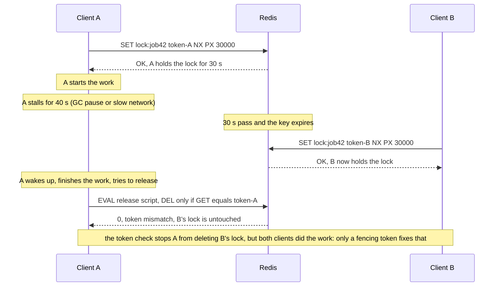
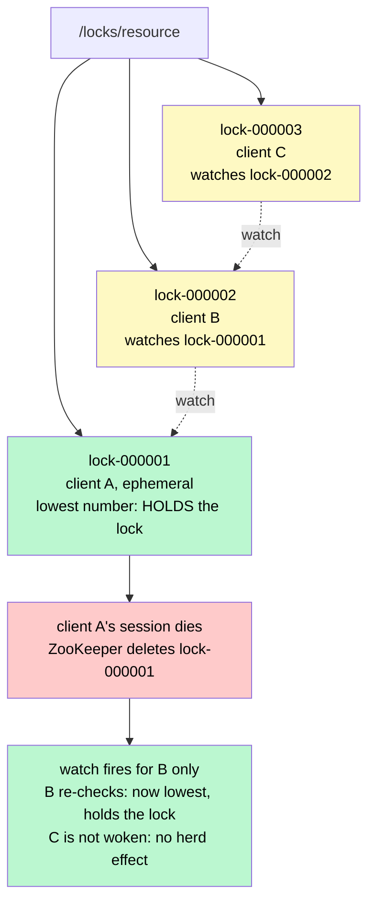
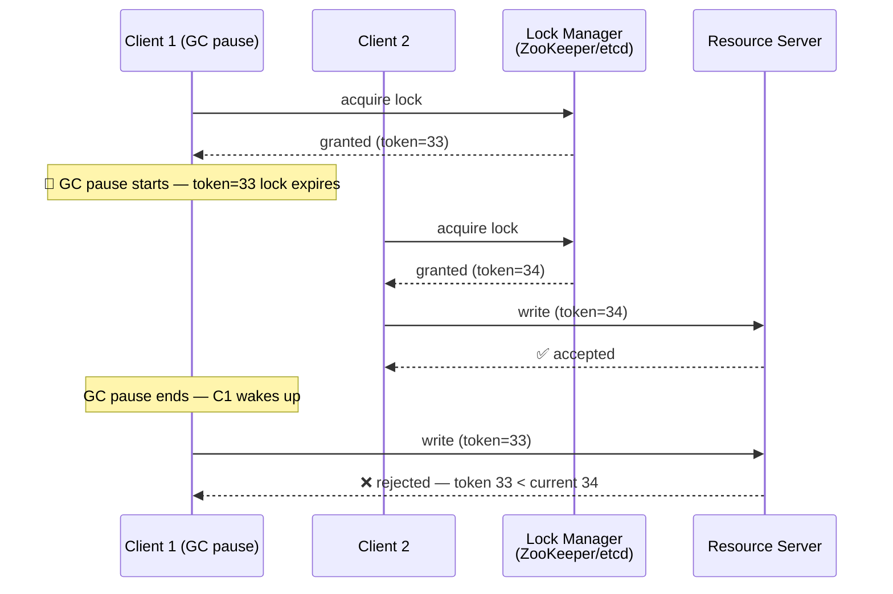
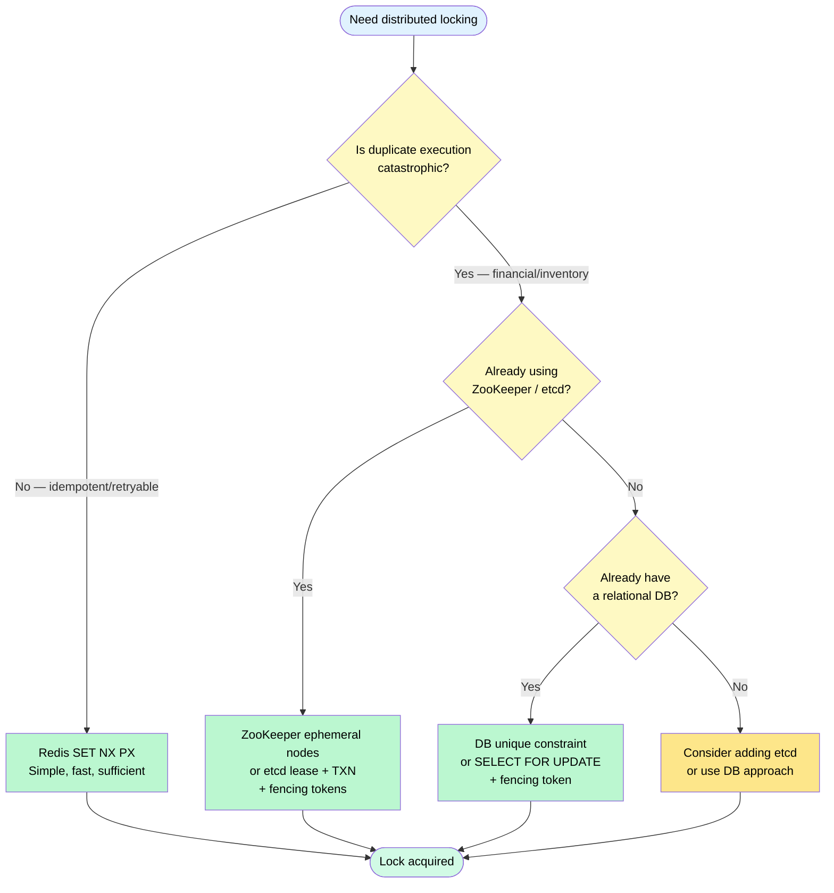

# Distributed Locking

> **Distributed locking** is a mechanism that ensures only one process across multiple machines can hold exclusive access to a shared resource at a given time — the distributed equivalent of a mutex.

**Level:** 4 · **Topic:** 8 · **Prerequisites:** [Leader Election](../05-Leader-Election/README.md) · [Idempotency and Exactly-Once](../07-Idempotency-and-Exactly-Once/README.md) · [Consensus: Paxos & Raft](../03-Consensus-Paxos-Raft/README.md)

---

## 🎯 The Problem

On a single machine, mutual exclusion is easy: a mutex or semaphore prevents two threads from entering the same critical section. But what happens when you have 10 instances of a service running on 10 different machines?

**Real scenarios where you need distributed locking:**

- **Double-processing a job:** your job queue delivers a payment task to two workers simultaneously. Both process it. The customer is charged twice.
- **Exclusive resource access:** two instances of a cron job both try to run the "send monthly reports" task at midnight. Both succeed. Users get two emails.
- **Leader-only actions:** only one instance should be the "leader" allowed to write to an external API that doesn't tolerate concurrent calls.
- **Inventory management:** two shoppers simultaneously try to buy the last item in stock. Both succeed. You ship one item and disappoint one customer.

You need a way for distributed processes to **agree** that only one of them holds the lock at any given time.

---

## 🌍 Real-World Analogy

Imagine a small-town bank vault with only one key. When a teller needs access, they take the physical key from a locked cabinet at the front desk. While they have it, no other teller can enter the vault. When they're done, they return the key.

Now imagine the "key" has an **expiry label**: "This key expires in 10 minutes." If a teller takes the key and then has a medical emergency, the key self-expires after 10 minutes so other tellers aren't locked out forever.

That expiry is a **lease** — the core concept behind safe distributed locks. The lock must expire automatically so a crashed process doesn't hold it forever.

But here's the twist: what if the teller finishes their work at minute 9, walks back to return the key... and gets stuck in a long conversation in the hallway? The key expires at minute 10. At minute 11, another teller takes the freshly issued key. Now at minute 12, the first teller shows up to return the expired key. There are now **two tellers in the vault**. This is the **GC-pause problem** — and it's why distributed locks are genuinely hard.

---

## 🧠 Core Idea

A distributed lock must satisfy two properties:

- **Safety:** At most one process holds the lock at any given time.
- **Liveness:** A process can eventually acquire the lock (it doesn't wait forever).

These properties are in tension. Stronger safety (longer TTL, more checks) weakens liveness, and vice versa.

### Approach 1 — Database-Based Locking

**Option A: Unique constraint**

Insert a row with a unique lock name. Whoever succeeds holds the lock. Whoever fails gets a constraint violation.

```sql
INSERT INTO distributed_locks (lock_name, owner, expires_at)
VALUES ('payment_job_42', 'worker-7', NOW() + INTERVAL '30 seconds');
```

Release: `DELETE FROM distributed_locks WHERE lock_name = 'payment_job_42' AND owner = 'worker-7';`

**Option B: `SELECT ... FOR UPDATE`**

```sql
BEGIN;
SELECT * FROM locks WHERE lock_name = 'report_job' FOR UPDATE NOWAIT;
-- do your work
COMMIT;  -- releases the lock
```

Holds until the transaction commits or the DB connection closes.

**DB locking pros:** simple, uses infrastructure you already have, ACID guarantees.
**DB locking cons:** DB becomes a bottleneck; what if the DB fails? Lock is tied to a DB connection, which may not survive network blips.

---

### Approach 2 — Redis-Based Locking (SET NX PX)

Redis's `SET key value NX PX milliseconds` command is atomic: it sets a key only if it doesn't already exist, with an automatic TTL. This is the building block of Redis-based distributed locks.

```
SET lock:payment_job_42 <unique-token> NX PX 30000
```

- `NX`: only set if Not eXists.
- `PX 30000`: expire after 30 000 milliseconds.
- `<unique-token>`: a UUID generated by this specific client.

**Release:** you must verify you still own the lock before deleting (use a Lua script for atomicity):

```lua
if redis.call("GET", KEYS[1]) == ARGV[1] then
    return redis.call("DEL", KEYS[1])
else
    return 0
end
```

Why the token check? Without it, a process whose lock expired could delete the lock now held by a *different* process.

*The full lifecycle, including the failure the token check prevents — and the one it doesn't.*



*Caption: The unique token makes release safe. It does not make the lock safe — A still believed it held the lock while B was working. That gap is the subject of the GC-pause section below.*

---

### Approach 3 — Redlock (and Its Controversy)

For higher fault tolerance, antirez (Salvatore Sanfilippo, Redis creator) proposed **Redlock**: acquire the lock on a majority of N Redis nodes (typically 5). If you get it on ≥ 3 nodes within half the TTL, you hold the lock.

**Martin Kleppmann's critique (2016):** In his essay "How to do distributed locking," Kleppmann argued Redlock is not safe under the GC-pause scenario:

1. Client A acquires Redlock on all 5 nodes, TTL = 10s.
2. Client A pauses (GC) for 12 seconds.
3. Lock expires on all nodes.
4. Client B acquires the lock.
5. Client A resumes, believes it still holds the lock.
6. **Both A and B think they hold the lock** — safety violated.

antirez countered that Redlock is designed for efficiency (not distributed correctness) and that this scenario requires hardware-level clock drift or extreme GC pauses. The debate remains unresolved in the community.

**Practical consensus:**
- For **efficiency** (prevent duplicate work, idempotent operations are acceptable): Redis `SET NX` or Redlock is fine.
- For **correctness** (financial transactions, inventory, anything where duplicates are catastrophic): use fencing tokens with ZooKeeper or etcd.

---

### Approach 4 — ZooKeeper / etcd (Consensus-Based)

ZooKeeper and etcd use a consensus protocol (ZAB / Raft respectively), making them strongly consistent.

**ZooKeeper ephemeral sequential nodes:**

1. All clients try to create an **ephemeral sequential** node under `/locks/resource/`.
2. ZooKeeper assigns each a sequential number: `/locks/resource/lock-000001`, `lock-000002`, etc.
3. The client with the **lowest sequence number** holds the lock.
4. Other clients watch the node just below theirs. When it's deleted, they re-check.
5. If the lock holder's ZK session dies (crash or network partition), ZK automatically deletes the ephemeral node — the next client inherits.

*The recipe as a picture. Each waiter watches only the node just ahead of it, so a release wakes exactly one client.*



*Caption: Ephemeral nodes tie the lock to the holder's session, so a crashed holder releases automatically. The sequence number doubles as a fencing token — it only ever increases.*

**etcd** approach: use `PUT` with a lease, watch for key deletion. `etcd`'s `Grant` + `Lease` + `TxN` provides the same guarantee.

**Why consensus is stronger:** ZooKeeper and etcd provide linearizable reads and writes — you can't have split-brain under network partition (it prefers consistency over availability). Redis does not guarantee this.

---

### The GC-Pause Problem and Fencing Tokens

Even with a consensus system, the GC-pause scenario is real. The solution is a **fencing token**: a monotonically increasing number issued with each lock grant.



*Caption: The resource server tracks the highest fencing token it has seen. Any request with a lower token is rejected, even if the sender believes it holds the lock. This is the only reliable way to handle process pauses.*

**The key insight:** the fencing token makes the resource server the final arbiter, not the lock service. Even if the lock service has a bug or the client has a stale belief, the token prevents unsafe operations.

---

## 📊 How It Works

### Decision Flow for Choosing a Locking Strategy



*Caption: Choose your locking strategy based on consequence of failure. Redis is fine for efficiency; consensus (ZK/etcd) + fencing tokens for correctness.*

---

## 🔧 Types / Variations / Strategies

| Strategy | Implementation | Guarantee | Complexity | Best For |
|----------|---------------|-----------|------------|----------|
| **DB unique constraint** | `INSERT` + unique index | ACID (single DB) | Low | Simple systems with existing DB |
| **SELECT FOR UPDATE** | DB transaction | ACID per connection | Low | Row-level locking in SQL systems |
| **Redis SET NX PX** | Single Redis instance | Best-effort | Low | Deduplication, idempotent jobs |
| **Redlock** | Majority of 5 Redis nodes | Better availability (contested) | Medium | High-availability Redis setups |
| **ZooKeeper ephemeral** | Ephemeral sequential znodes | Linearizable | High | Critical sections, leader election |
| **etcd lease + TXN** | Lease + conditional PUT | Linearizable | High | Kubernetes, critical sections |
| **Any above + fencing token** | Resource server validates token | Truly safe | Medium add-on | Financial, inventory, any correctness-critical |

---

## 🏢 Real-World Examples

### Apache Hadoop / HDFS — ZooKeeper-based Lock
HDFS uses ZooKeeper for NameNode leader election (a form of distributed locking). Only one NameNode may be active at a time. ZooKeeper's ephemeral sequential nodes guarantee exactly one holder even across failover.

### Kubernetes — etcd Lease
Kubernetes uses etcd leases for controller leader election. Every controller (deployment controller, node controller, etc.) tries to acquire a lease. Only the holder runs reconciliation logic. If the holder crashes, the lease expires and another instance takes over.

### Redis `SET NX` in Job Queues
Many job-queue libraries (Sidekiq Pro, Celery with Redis, Faktory) use Redis `SET NX PX` to implement job uniqueness: "don't allow a second copy of job X to be enqueued while one is already processing." The operation is idempotent, so expiry of the lock is acceptable.

### Ticketmaster / Seat Reservation
Seat selection must be locked briefly while a user completes payment. A distributed lock on `seat:event42:row5:seatC` prevents two users from being shown the same seat as available simultaneously. Typically implemented with Redis (short TTL = checkout window, e.g., 10 minutes) + idempotent payment processing.

---

## ⚖️ Trade-offs

| Approach | Safety | Availability | Performance | Complexity |
|----------|--------|-------------|-------------|------------|
| DB constraint | High (ACID) | Limited by DB availability | Low (DB round-trip) | Low |
| Redis SET NX | Best-effort (GC-pause risk) | High | Very high (sub-ms) | Low |
| Redlock | Contested (see debate) | High (quorum) | High | Medium |
| ZooKeeper / etcd | Linearizable | Medium (leader election delay) | Medium | High |
| + Fencing tokens | Near-perfect | Same as underlying | Same + token check | Low add-on |

---

## ✅ When to Use / ❌ When NOT to Use

**Use distributed locking when:**
- Exactly one process must perform an action at a time (cron jobs, leader tasks).
- You need to prevent double-processing of a queue message that is not naturally idempotent.
- Resource access genuinely requires mutual exclusion (e.g., writing to a shared file, reserving a ticket).

**Prefer idempotency over locking when:**
- You can design the operation to be safely retryable (see [Idempotency and Exactly-Once](../07-Idempotency-and-Exactly-Once/README.md)).
- The cost of duplicate execution is low and detectable.

**Do NOT use distributed locks when:**
- A database transaction with `SELECT FOR UPDATE` would suffice — use the simplest tool that works.
- You want to prevent concurrent reads — that's not mutual exclusion, that's access control.
- The "lock" would be held for minutes or hours — you need a different architecture (e.g., a saga or queue-based workflow).

---

## ⚠️ Common Pitfalls

1. **Not setting a TTL.** A lock without an expiry held by a crashed process blocks everyone forever. Always set a TTL on distributed locks.

2. **TTL too short.** If your critical section takes 5 seconds but your TTL is 3 seconds, you'll release the lock before finishing. The next holder enters while you're still working. Measure your critical section's worst-case duration and set TTL to 2–3× that.

3. **Not using fencing tokens.** Redis `SET NX` with a TTL prevents most duplicates but cannot prevent the GC-pause split-brain. If correctness truly matters, implement fencing tokens at the resource server.

4. **Deleting someone else's lock.** Always embed a unique client-generated token in the lock value and verify it before releasing. Without this, you can accidentally release a lock granted to another process.

5. **Making the lock too coarse-grained.** Locking the entire "payment service" instead of "payment for order #42" serializes all payments unnecessarily. Lock the narrowest resource possible.

6. **Ignoring lock contention.** High lock contention (many waiters, one slot) is a performance bottleneck. Consider partitioning the resource to allow parallel locks on different subsets.

---

## 🎤 Interview Tips

- **Lead with the use case:** "We need a distributed lock when we have multiple instances and need to prevent double-processing — for example, charging a customer twice for a payment."
- **Name the approaches:** DB constraint (simple), Redis SET NX (fast), ZooKeeper/etcd (strongly consistent).
- **Mention the GC-pause problem** — it shows you understand why this is genuinely hard, not just "use Redis."
- **Propose fencing tokens** for correctness-critical scenarios — this is a senior-level concept that will impress interviewers.
- **Know the Kleppmann vs antirez debate** at a high level — don't take a strong side, acknowledge the trade-off.
- For **Ticketmaster** or similar: seat reservation lock + TTL = checkout window, payment must complete before TTL expires.

---

## 📝 TL;DR

- Distributed locking prevents multiple machines from entering a critical section simultaneously.
- **DB unique constraint / SELECT FOR UPDATE:** simple, strong, limited by DB availability.
- **Redis SET NX PX:** fast, best-effort, vulnerable to GC-pause split-brain.
- **ZooKeeper / etcd:** linearizable, higher complexity, the right choice for correctness-critical sections.
- **Fencing tokens** are the only reliable defense against the GC-pause problem — the resource server rejects requests with stale tokens.
- Always set a **TTL** (lease) on locks so crashed processes don't hold them forever.
- Prefer **idempotency** over locking whenever the operation can be safely retried.

---

## 🧪 Test Yourself

1. A payment worker acquires a Redis lock with a 5-second TTL. The worker's GC pause lasts 7 seconds. What happens? How do fencing tokens help?
2. Explain the difference between `SET lock NX PX 10000` and a bare `SET lock 1`. Why does the `NX` matter?
3. Why must the lock release (DELETE) be done with a Lua script that checks the token value, rather than a simple `DEL` command?
4. Your job queue delivers the same job to two workers simultaneously. Both acquire a Redis lock on the job ID. Worker A finishes and releases the lock. Worker B's lock expires after 30 seconds. Is there a double-processing risk? Why or why not?
5. Compare ZooKeeper ephemeral sequential nodes and Redis SET NX for distributed locking. In which scenarios would you choose each?

---

## 📚 Further Reading

- [Martin Kleppmann — How to do distributed locking](https://martin.kleppmann.com/2016/02/08/how-to-do-distributed-locking.html) — the definitive critique of Redlock.
- [antirez — Is Redlock safe?](http://antirez.com/news/101) — the original author's response.
- [Redis Distributed Locks (Redlock)](https://redis.io/docs/latest/develop/use/patterns/distributed-locks/) — official Redis documentation.
- [ZooKeeper Recipes — Distributed Lock](https://zookeeper.apache.org/doc/current/recipes.html#sc_recipes_Locks) — official ZK lock recipe.
- [etcd — Distributed Locking](https://etcd.io/docs/v3.5/dev-guide/api_concurrency_reference_v3/) — concurrency primitives in etcd.
- [DDIA Chapter 8 & 9](https://dataintensive.net/) — The Trouble with Distributed Systems; Consistency and Consensus.
- Previous: [07 — Idempotency and Exactly-Once](../07-Idempotency-and-Exactly-Once/README.md) · Next: [09 — CRDTs & Conflict Resolution](../09-CRDTs-and-Conflict-Resolution/README.md) · Back to [Level 04 Overview](../README.md)
- See also: [Bonus — Job Scheduler](../../Bonus-Real-World-Architectures/README.md) · [Bonus — Ticketmaster](../../Bonus-Real-World-Architectures/README.md)
