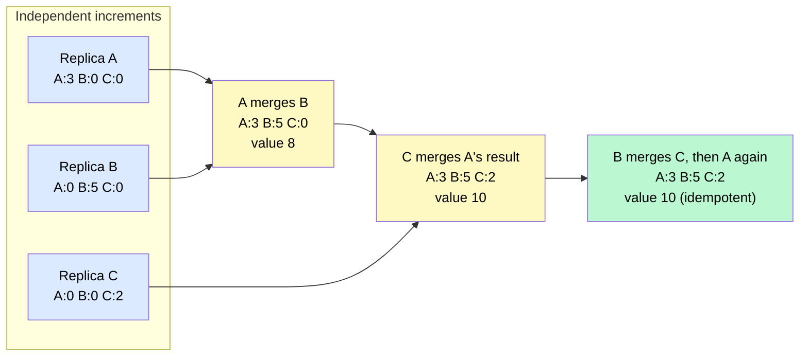
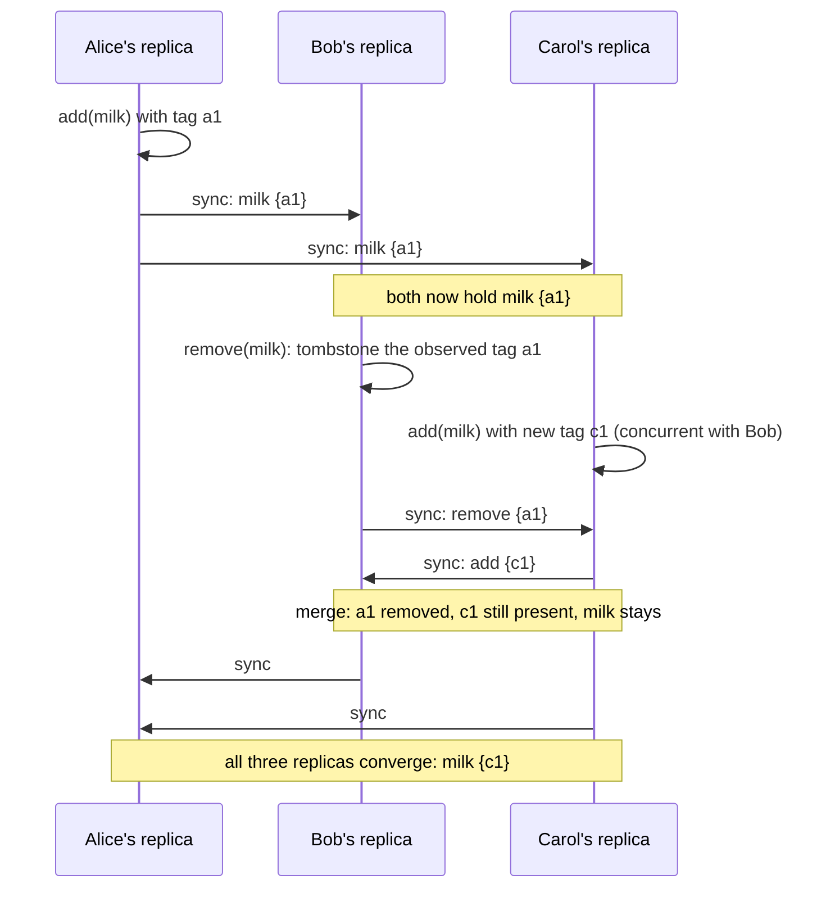
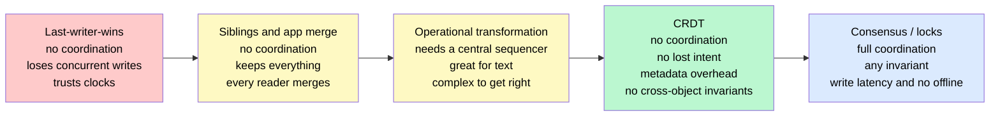

# CRDTs & Conflict Resolution

> A **CRDT** (Conflict-free Replicated Data Type) is a data structure whose replicas can be updated independently and concurrently — with no coordination — and are *mathematically guaranteed* to converge to the same state when they merge. Conflicts aren't detected and resolved; they're made impossible by the shape of the data.

**Level:** 4 · **Topic:** 9 · **Prerequisites:** [Consistency Models](../02-Consistency-Models/README.md) · [Clocks & Event Ordering](../06-Clocks-and-Ordering/README.md) · [Database Replication](../../Level-02-Data-Layer/01-Database-Replication/README.md)

---

## 🎯 The Problem

Two replicas accept writes at the same time. This happens whenever you have **multi-leader replication** (two data centers both taking writes), **leaderless replication** (Dynamo-style quorums), or **offline clients** (a phone editing a note on a plane). Eventually the replicas talk, and they disagree.

The classic story is Amazon's shopping cart. Two sessions add items concurrently; Dynamo keeps both versions and hands the conflict to the application. Amazon's merge rule was "union of the carts" — which is why, famously, **deleted items sometimes came back**. A removal on one replica and an addition on another both look like "the cart changed," and union can't tell a deliberate deletion from a missing addition.

The easy answers all lose something:

- **Last-writer-wins (LWW):** pick the write with the latest timestamp. Simple — and it silently throws away the other write. With skewed clocks it may throw away the *newer* one.
- **Keep both, let the app sort it out** (Riak "siblings", Dropbox "conflicted copy"): correct, but every application now needs merge logic, and most write it wrong.
- **Coordinate** (locks, consensus): correct, but now writes wait for a round-trip to a quorum, and offline writes are impossible.

**The core problem:** we want replicas to accept writes locally and immediately, *and* end up identical, *and* not lose intent. That requires the merge to be defined by the data type, not improvised by the application.

---

## 🌍 Real-World Analogy

A family keeps a shared grocery list, but everyone carries their own paper copy and they only compare notes occasionally.

If the rule is "the most recently written copy replaces all the others," then whoever compared last wins, and Dad's "add coffee" vanishes because Mom's copy was written a minute later. That's **LWW**.

Now change the rules of the list itself. Items are only ever *added*, and an item is never erased — it gets a **cross-out with the name of who crossed it and when they saw it**. When two copies meet, the merged list is: every item anyone wrote, and every cross-out anyone made. It doesn't matter who compares with whom, or in what order, or how many times — after enough comparisons, **every copy is identical**, and nobody's addition or removal was lost. That's a CRDT: the list's rules make merging automatic and order-independent.

The one thing the family list can't do is enforce a rule like "never more than ten items." Two people can each add the tenth item independently. Some guarantees need everyone in the same room — that's coordination, and it's where CRDTs stop.

---

## 🧠 Core Idea

### Step 1 — Concurrent means "neither happened before the other"

Two writes conflict only if they're **concurrent**: neither replica saw the other's write first. [Vector clocks / version vectors](../06-Clocks-and-Ordering/README.md) detect this precisely. If write B happened *after* the replica had seen write A, there's no conflict — B simply supersedes A. Conflict resolution is only about the genuinely concurrent case.

### Step 2 — The resolution ladder

| Strategy | How | What you give up |
|----------|-----|------------------|
| **Last-writer-wins** | Highest timestamp wins | One of the writes, silently; correctness under clock skew |
| **Application merge** (siblings) | Store all concurrent versions; app merges on read | Simplicity — every reader needs merge logic |
| **Operational Transformation (OT)** | Transform each operation against concurrent ones | Needs a central server to order operations |
| **CRDT** | The data type's merge function is commutative, associative, idempotent | Ability to enforce cross-object invariants; some metadata overhead |

### Step 3 — What makes a merge "conflict-free"

A CRDT's merge must satisfy three properties, and together they're the whole trick:

- **Commutative:** `merge(a, b) = merge(b, a)` — order of arrival doesn't matter.
- **Associative:** `merge(merge(a, b), c) = merge(a, merge(b, c))` — grouping doesn't matter.
- **Idempotent:** `merge(a, a) = a` — receiving the same update twice is harmless.

Mathematically this makes the states a **join-semilattice**: every update moves a replica "upward" in a partial order, and merge takes the least upper bound. The consequence is **Strong Eventual Consistency (SEC)**: any two replicas that have received the same *set* of updates — in any order, with any duplicates — have the same state. No rollbacks, no coordination, no consensus.

### Step 4 — State-based vs operation-based vs delta

| Flavor | What's shipped | Requirements | Cost |
|--------|----------------|--------------|------|
| **State-based (CvRDT)** | The whole state; receiver merges | Any transport, any order, duplicates OK | Bandwidth grows with state size |
| **Operation-based (CmRDT)** | Each operation ("add x") | Reliable, **causally ordered** delivery, exactly-once or idempotent ops | Small messages; harder transport guarantees |
| **Delta-state** | Only the part of the state that changed | Same as state-based | Best of both; the modern default |

### Step 5 — The catalog

| CRDT | Semantics | How it works | Use it for |
|------|-----------|--------------|------------|
| **G-Counter** | Grow-only counter | One slot per replica; increment your own slot; value = sum; merge = per-slot max | Page views, likes |
| **PN-Counter** | Increment and decrement | Two G-Counters (P and N); value = P − N | Inventory-ish counts, votes |
| **G-Set** | Grow-only set | Union on merge | Seen-IDs, tags that never go away |
| **2P-Set** | Add and remove, once | Add-set and tombstone-set; removed forever | Rarely — the "once" rule bites |
| **LWW-Element-Set** | Add/remove with timestamps | Latest timestamp per element wins; bias configurable | Simple sets when clocks are trusted |
| **OR-Set** (Observed-Remove) | Add wins over concurrent remove | Each add gets a unique tag; remove deletes only the tags the remover *observed* | Shopping carts, membership, presence |
| **LWW-Register** | Single value | Latest timestamp wins | Config values, profile fields |
| **MV-Register** | Multi-value | Keep all concurrent values (with version vectors) | When you'd rather show both than guess |
| **Sequence CRDTs** (RGA, Logoot, LSEQ, YATA/Yjs, Automerge) | Ordered list / text | Every character gets a unique, totally ordered position ID between its neighbors | Collaborative text, lists |
| **JSON / Map CRDTs** | Nested documents | Composition of registers, sets, and sequences | Local-first apps, offline-first sync |

### Step 6 — The OR-Set: the workhorse

The Observed-Remove Set solves the shopping-cart problem directly. Every `add(x)` attaches a fresh unique tag `(replica, counter)`. A `remove(x)` records the tags for `x` that this replica has *seen*. On merge, `x` is present if any add-tag exists that isn't covered by a remove. A concurrent add (new tag) therefore survives a concurrent remove (which couldn't have observed the new tag): **add-wins**. Amazon's resurrected items were exactly a remove losing to a concurrent add without the tags to tell them apart.

### Step 7 — The costs nobody mentions in the demo

- **Tombstones and metadata.** Removes must be remembered (so a late-arriving add of the same tag is correctly cancelled), and every element carries tags or timestamps. State grows with history, not with live data.
- **Garbage collection needs causal stability.** You can drop a tombstone only once *every* replica has seen it — which requires knowing all replicas and their progress. Delta encodings (Yjs, Automerge's columnar compression) keep this manageable; naive implementations balloon.
- **Convergence ≠ correctness.** All replicas agree — on whatever the merge rule produced. Add-wins vs remove-wins is a *product* decision; pick the one users expect.
- **No cross-object invariants.** "Balance never below zero," "usernames are unique," "at most 10 seats" cannot be guaranteed without coordination. CRDTs are for state that can tolerate concurrent, independent progress.

---

## 📊 How It Works

### G-Counter: Three Replicas, Any Merge Order, Same Answer

*Each replica increments only its own slot. Merge takes the maximum of each slot, so re-merging or merging in a different order changes nothing.*

*Caption: Per-replica slots plus max-merge make the counter commutative, associative, and idempotent. This is why "likes" can be counted in ten data centers with zero coordination.*

### OR-Set: A Concurrent Remove Loses to a Concurrent Add

*Alice adds milk; Bob removes it; Carol re-adds it at the same time. Bob's remove only covers the tag he observed, so Carol's add survives.*

*Caption: Amazon's cart lost this race because it lacked per-add tags. With them, the merge is unambiguous and add-wins is guaranteed.*

### The Resolution Ladder

*Move right for less data loss and less coordination — and more careful data-type design.*

*Caption: CRDTs sit at the sweet spot for state that can tolerate independent progress; consensus remains necessary for invariants that span objects.*

---

## 🔧 Types / Variations / Strategies

| Situation | Recommended approach |
|-----------|---------------------|
| Counter across regions (likes, views, metrics) | PN-Counter / G-Counter |
| Set membership with concurrent add/remove (cart, presence, tags) | OR-Set (add-wins) |
| A single field where the latest value is fine (profile bio) | LWW-Register with hybrid logical clock timestamps |
| A single field where losing a write is unacceptable | MV-Register — surface both to the user |
| Collaborative text or ordered lists | Sequence CRDT (Yjs, Automerge, RGA) |
| Nested documents, offline-first apps | JSON CRDT (Automerge, Yjs maps) |
| Uniqueness, balances, capacity limits | **Not a CRDT** — use consensus, a lock, or a single leader |

---

## 🏢 Real-World Examples

### Amazon Dynamo and Riak — the origin story
Dynamo's paper describes returning concurrent versions ("siblings") to the client for the shopping cart, and the resurrection bug that union-merging caused. Riak, Dynamo's open-source descendant, later shipped **built-in CRDTs** (counters, sets, maps, flags, registers) so applications could stop writing merge code. Riak's OR-Set variant ("ORSWOT") is optimized to avoid tombstone growth.

### Redis Enterprise Active-Active (CRDB)
Redis's multi-region active-active databases implement counters, sets, sorted sets, hashes, and strings as CRDTs so that every region accepts writes locally and converges asynchronously. Their documentation is a practical catalog of add-wins vs LWW semantics per data type.

### Figma — multiplayer without OT
Figma's multiplayer design uses a server to order operations but resolves concurrent property changes with **LWW per property** and CRDT-like structures for the object tree, deliberately avoiding full OT for a design tool where "last change to this color wins" is what users expect.

### Automerge and Yjs — local-first software
Automerge (JSON CRDT with columnar compression) and Yjs (sequence CRDT behind many collaborative editors) power the "local-first" movement: apps that work offline, sync peer-to-peer, and never show a merge dialog. Yjs's YATA algorithm and its compact encoding are why real-time text CRDTs became practical in browsers.

### Phoenix Presence (Elixir)
Phoenix's Presence feature tracks "who is online in this channel" across a cluster with an OR-Set variant (ORSWOT) and no central store — joins and leaves from different nodes merge without coordination, and a node partition never produces phantom users.

### SoundCloud Roshi
SoundCloud built Roshi, an LWW-element-set on top of Redis, to serve its activity streams across replicas without a coordinator — a small, well-documented example of choosing a *specific* CRDT for a specific product semantics.

---

## ⚖️ Trade-offs

| Factor | LWW | CRDT | OT | Consensus |
|--------|-----|------|----|-----------|
| **Coordination on write** | None | None | Central server | Quorum round-trip |
| **Works offline** | Yes | Yes | No (needs the sequencer) | No |
| **Lost updates** | Yes | No | No | No |
| **Cross-object invariants** | No | No | No | Yes |
| **Metadata overhead** | Timestamp | Tags, tombstones, version vectors | Operation history | Log |
| **Implementation difficulty** | Trivial | Moderate (use a library) | Hard | Hard (use a library) |

---

## ✅ When to Use / ❌ When NOT to Use

**Use CRDTs when:**
- Writes must succeed locally with no round-trip: multi-region active-active, mobile/offline-first, peer-to-peer.
- The data is a counter, a set, a map of registers, or a collaborative document — things whose merge has an obvious "right answer."
- Availability during partitions matters more than enforcing global rules.

**Don't use CRDTs when:**
- The state has invariants across objects or replicas — uniqueness, non-negative balances, reservations, capacity. Use a single leader, locks, or consensus.
- A simple LWW register is honestly fine (a "last updated bio" field) and you have decent clocks.
- The history is unbounded and you can't afford the metadata (very high-churn sets without causal-stability GC).

---

## ⚠️ Common Pitfalls

1. **LWW with wall clocks.** Clock skew of seconds is normal; the "latest" write may be the older one. If you must use LWW, use hybrid logical clocks and accept that you're choosing to lose a write.
2. **Expecting invariants.** A PN-Counter for inventory can go negative when two replicas each sell the last unit. CRDTs converge; they don't referee.
3. **Tombstone bloat.** OR-Sets and sequence CRDTs remember removals. Without causal-stability garbage collection (or a library that compresses history), state grows forever.
4. **Op-based CRDTs without causal delivery.** Applying "remove x" before the "add x" it depends on breaks the guarantees. Use a transport that preserves causality, or use state/delta-based types.
5. **Picking the wrong bias.** Add-wins vs remove-wins is a product decision; "I deleted it and it came back" is a bug report waiting to happen if you chose wrong.
6. **Mixing CRDT and non-CRDT writes to the same data.** One direct overwrite bypassing the merge function destroys the convergence guarantee.
7. **Assuming convergence is instant.** Replicas converge when they *communicate*; users can see divergent states in between. Design the UI for it.

---

## 🎤 Interview Tips

- **The prompts that want this answer:** "design a globally distributed like counter," "a shopping cart that works across regions," "presence / who's online across a cluster," "offline-first notes," "collaborative editing." Name the specific CRDT (PN-Counter, OR-Set, sequence CRDT).
- **Say the three properties** — commutative, associative, idempotent — and what they buy: any order, any grouping, duplicates harmless → strong eventual consistency.
- **Show the boundary:** "CRDTs can't enforce uniqueness or a non-negative balance; for those I'd route to a single leader or use consensus." Knowing what they *can't* do is the senior signal.
- **Contrast with OT** for collaborative editing: OT needs a central sequencer; CRDTs don't, at the cost of metadata. Google Docs chose OT (it has a server); local-first tools choose CRDTs.
- **Common follow-up:** "How do you keep the metadata from growing forever?" → causal stability + garbage collection, delta encodings, or bounded history; be honest that it's the hard part.
- **Common follow-up:** "What's wrong with last-writer-wins?" → lost concurrent updates and clock skew; fine for a bio field, wrong for a cart.

---

## 📝 TL;DR

- Concurrent writes are inevitable with multi-leader, leaderless, or offline replication; the question is how to merge them without losing intent.
- **LWW loses writes, app-merge pushes complexity to every reader, OT needs a central server; CRDTs make merge a property of the data type.**
- A CRDT's merge is **commutative, associative, and idempotent**, giving **strong eventual consistency** with no coordination.
- Know the catalog: **G/PN-Counter** for counts, **OR-Set** (add-wins) for sets, **LWW/MV-Register** for values, **sequence CRDTs** (Yjs, Automerge) for text and lists.
- The costs are **tombstones and metadata**, garbage collection needing causal stability, and **no cross-object invariants** — those still need consensus.
- Used in Riak, Redis Active-Active, Figma, Phoenix Presence, and the whole local-first ecosystem.

---

## 🧪 Test Yourself

1. Two data centers each accept a write to the same user's cart during a partition: one adds "headphones," the other removes "keyboard." Explain what LWW would produce, what a naive set-union would produce, and what an OR-Set produces — and why.
2. Define the three algebraic properties a CRDT merge must have. For each, give a concrete failure that would occur if it were violated.
3. Design a "who's online" presence system across 20 servers with no central store. Which CRDT fits, what happens when a server crashes without sending "leave," and how does the system converge?
4. A teammate proposes using a PN-Counter for warehouse stock so that every region can decrement locally. What can go wrong, and what would you use instead for the sell-the-last-unit case?
5. Why do sequence CRDTs for text need unique position identifiers rather than integer indexes? What grows without bound in a naive implementation, and how do Yjs/Automerge keep it in check?

---

## 📚 Further Reading

- [Conflict-free Replicated Data Types — Shapiro, Preguiça, Baquero, Zawirski (2011)](https://hal.inria.fr/inria-00609399/document) — the paper that defined CRDTs and the CvRDT/CmRDT split.
- [CRDTs: The Hard Parts — Martin Kleppmann (talk)](https://martin.kleppmann.com/2020/07/06/crdt-hard-parts-hydra.html) — interleaving anomalies, moves, and the metadata problem.
- [crdt.tech](https://crdt.tech/) — the community catalog of types, papers, and implementations.
- [Amazon Dynamo paper, §4.4 — Data Versioning](https://www.allthingsdistributed.com/files/amazon-dynamo-sosp2007.pdf) — the shopping-cart siblings and resurrection story.
- [How Figma's multiplayer technology works](https://www.figma.com/blog/how-figmas-multiplayer-technology-works/) — a pragmatic middle path between OT and CRDTs.
- [Automerge](https://automerge.org/) and [Yjs](https://docs.yjs.dev/) — production CRDT libraries and their design docs.
- [Designing Data-Intensive Applications, Ch. 5 — Handling Write Conflicts](https://dataintensive.net/) — the surrounding replication context.
- Previous: [08 — Distributed Locking](../08-Distributed-Locking/README.md) · Next: [10 — Gossip Protocols, Membership & Failure Detection](../10-Gossip-and-Failure-Detection/README.md) · Back to [Level 04 Overview](../README.md)
- See also: [Google Docs (OT vs CRDTs)](../../Bonus-Real-World-Architectures/28-Google-Docs-Collaborative-Editing/README.md) · [Distributed Counter / Analytics](../../Bonus-Real-World-Architectures/23-Distributed-Counter-Analytics/README.md) · [Key-Value Store (Dynamo)](../../Bonus-Real-World-Architectures/27-Key-Value-Store/README.md)
