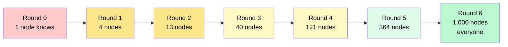
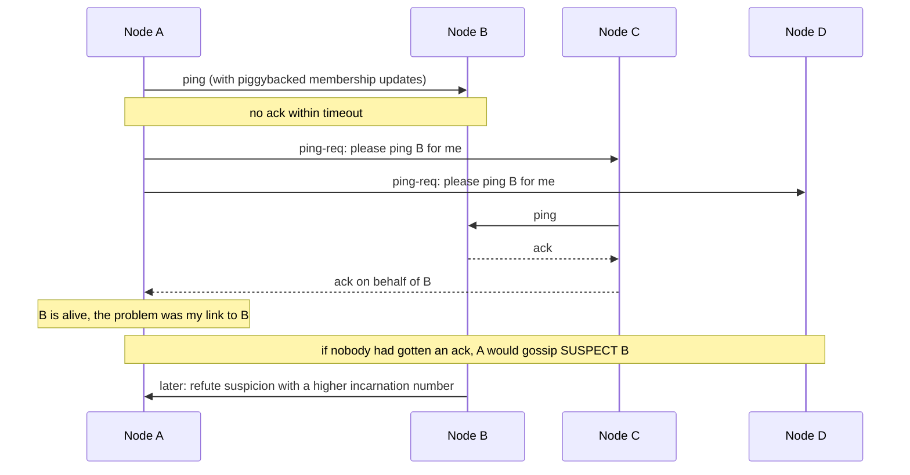
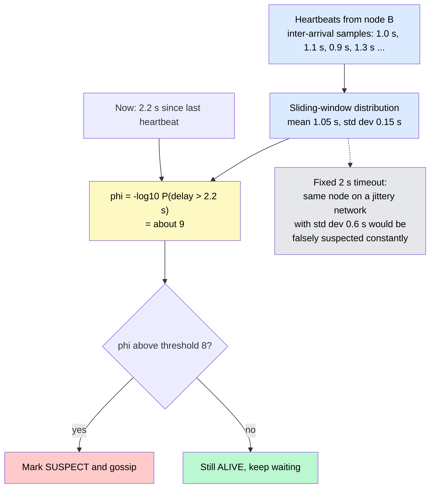
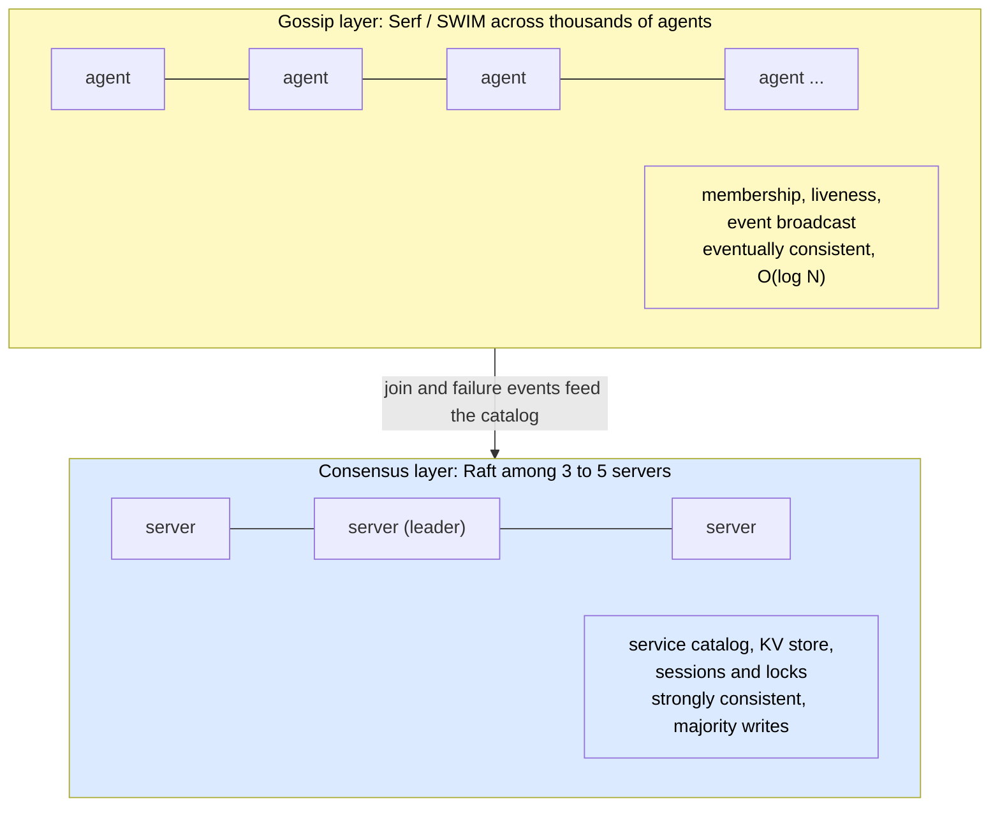

# Gossip Protocols, Membership & Failure Detection

> **Gossip** (epidemic) protocols spread information through a cluster the way a rumor spreads through a crowd: every node periodically tells a few random peers what it knows. The result is that every node learns who's alive, who's dead, and what changed — with no central coordinator, and with cost that grows with **log N** instead of N.

**Level:** 4 · **Topic:** 10 · **Prerequisites:** [Leader Election](../05-Leader-Election/README.md) · [Consensus — Paxos & Raft](../03-Consensus-Paxos-Raft/README.md) · [Clocks & Event Ordering](../06-Clocks-and-Ordering/README.md)

---

## 🎯 The Problem

A Cassandra cluster has 1,000 nodes. Every node needs to know: which nodes exist, which are alive, which token ranges each one owns, and what the current schema version is. Nodes join, crash, reboot, and get partitioned all day long.

The obvious designs fail at this size:

- **A central registry** ("ask the master who's alive") is a single point of failure and a hot spot — and you'd need a coordination service just to elect the master.
- **Everyone heartbeats everyone**: 1,000 × 999 messages per round. A million messages a second just to say "still here."
- **Consensus for membership**: correct, but a Raft round for every heartbeat across 1,000 nodes is far too slow and expensive for state that is *soft* by nature — a node's liveness is an observation, not a fact to be voted on.

And the deeper question: how do you tell **dead from slow**? A node in a 10-second garbage-collection pause looks exactly like a crashed one. Declare it dead too eagerly (a **false positive**) and you trigger pointless data rebalancing or a leader failover; declare it too late (a **false negative**) and you keep routing requests to a corpse.

**The core problem:** thousands of nodes need a shared, roughly current picture of cluster membership, with sub-linear cost and a failure detector whose suspicion adapts to real network conditions.

---

## 🌍 Real-World Analogy

Office rumors. Nobody sends an all-staff memo; each person mentions the news to two or three colleagues, who each tell two or three more. After a handful of rounds the entire company knows — a few thousand people reached in about eight steps — and any one person only ever talked to a few others. That's **gossip dissemination**.

Failure detection is like a friend who normally replies to texts within five minutes. If two hours pass, you get suspicious — but you calibrate that suspicion to *their* habits, not to a fixed rule, and if they're usually slow you wait longer. That's the **phi-accrual detector**. And before declaring them missing, you ask a mutual friend to check on them, in case the problem is your phone, not theirs. That's **SWIM's indirect ping**.

---

## 🧠 Core Idea

### Step 1 — Epidemic dissemination

Two flavors of gossip:

- **Anti-entropy:** every interval, each node picks a random peer and they **reconcile their full state** (push, pull, or push-pull). Slow but relentless; guarantees convergence.
- **Rumor mongering:** a node with a *new* update pushes it to random peers while it's "hot," and stops after enough peers already had it. Fast propagation of changes.

Both converge in **O(log N)** rounds: with a fanout of 3, one update reaches ~3ᵏ nodes after k rounds, so 1,000 nodes need about 7 rounds — a few seconds at a 1-second interval. Total messages are O(N log N); per node, per round, it's a constant.

To avoid shipping whole state maps, nodes exchange **digests** first — "here's each node I know about and the version of its info I hold" — and then only the entries where one side is newer. Cassandra's three-message handshake (SYN with digests → ACK with what's newer and what's needed → ACK2 with the rest) is exactly this.

### Step 2 — Membership state and versioning

Each node's view is a map from node ID to:

| Field | Purpose |
|-------|---------|
| Address, data center, rack | Where it is |
| **Generation** (incarnation) | Bumped when a node restarts, so old info about the previous life is superseded |
| **Version** / heartbeat counter | Increments every gossip interval; the freshness of this entry |
| Status: ALIVE / SUSPECT / DEAD / LEFT | The detector's current opinion |
| Application metadata | Token ranges, schema version, load, capabilities |

When two entries for the same node meet, the one with the higher **(generation, version)** wins. This is what stops a stale copy of "node 7 is alive" from resurrecting a node that everyone else knows is gone — the resurrection is only possible if you forget to version.

### Step 3 — Failure detection fundamentals

A failure detector observes heartbeats (a node announces itself) or pings (someone probes it) and outputs "alive" or "suspected." In an asynchronous network there is **no perfect failure detector**: a slow node and a dead one are indistinguishable until the slow one eventually answers. Detectors are judged on two axes:

- **Completeness:** every crashed node is eventually suspected.
- **Accuracy:** live nodes are (mostly) not suspected.

A fixed timeout trades these against each other blindly. The two protocols below do better.

### Step 4 — SWIM: scalable, weakly consistent, infection-style membership

SWIM (Das, Gupta, Motivala, 2002) is the protocol behind Consul, Serf, Nomad, and Uber's Ringpop. Each **protocol period** (say, 1 second), every node:

1. Picks **one** random member B and sends a **ping**.
2. If no ack arrives within the timeout, asks **k** other random members to ping B on its behalf (**indirect ping**). This rules out a problem on the path from A to B.
3. If nobody gets an ack, A marks B **SUSPECT** and gossips the suspicion.
4. A suspected node that is actually alive **refutes** the suspicion by broadcasting a higher **incarnation number** for itself; anyone seeing it un-suspects B.
5. If the suspicion isn't refuted within a timeout, B is marked **DEAD** and that too is gossiped.

Membership updates ride **piggybacked** on the ping and ack messages ("infection-style") rather than in separate traffic, so the failure detector and the disseminator are the same message flow. Per-node cost is constant regardless of cluster size; detection time is bounded by a few protocol periods. HashiCorp's **Lifeguard** extensions reduce false positives when a node is *slow itself* (a node under load lengthens its own timeouts and de-weights its own suspicions).

### Step 5 — The phi-accrual failure detector

Instead of "alive or dead," output a **suspicion level** φ that grows continuously the longer a heartbeat is overdue, calibrated to history:

1. Keep a sliding window of recent heartbeat **inter-arrival times** from node B.
2. Model their distribution (mean and variance).
3. φ(now) = −log₁₀ of the probability that a heartbeat would arrive *later* than it already is.

A threshold of φ = 8 (Cassandra's default) means "the chance this delay is normal is about 1 in 10⁸." On a jittery network the distribution widens and the detector automatically becomes more patient; on a quiet network it becomes sharper. Cassandra and Akka use it; the tunable is one number instead of a timeout per environment.

### Step 6 — What gossip is for — and what it isn't

| Use gossip for | Use consensus for |
|----------------|-------------------|
| Membership and liveness | Deciding *the* leader |
| Spreading config, schema versions, metadata | Anything that must be agreed exactly once |
| Failure detection | Locks, leases, fencing tokens |
| Computing aggregates (cluster load, counts) | Strongly consistent config |
| Anti-entropy of replicas (with Merkle trees) | Ordering writes |

The production pattern is **both**: Consul runs Serf (SWIM gossip) for membership across thousands of agents *and* Raft among 3–5 servers for the consistent catalog and locks. Cassandra runs gossip only — it has no leader to elect. Redis Cluster uses a gossip bus of PING/PONG frames carrying slot ownership. Kubernetes, by contrast, centralizes: nodes heartbeat to the API server backed by etcd, which is fine because a Kubernetes cluster is thousands of nodes at most and already has the consensus store.

### Step 7 — Practical parameters and the partition case

Typical settings: 1-second interval, fanout 3, a suspicion timeout of a few periods, and a list of **seed nodes** that new members contact to bootstrap. During a network partition, each side converges on a view in which the other side is DEAD; when the partition heals, the higher generation/version entries win and the views re-merge. Applications built on gossip membership must tolerate that two nodes can briefly disagree about who's alive — which is why anything that must be exactly right (leadership, locks) sits on consensus instead.

---

## 📊 How It Works

### A Rumor Reaches a Thousand Nodes in Seven Rounds

*Fanout 3: each informed node tells three random peers per round. The informed set roughly triples each round.*

*Caption: Logarithmic rounds and constant per-node cost are why gossip scales where all-to-all heartbeats cannot. Random peer choice also makes it robust — no single link matters.*

### One SWIM Protocol Period

*A can't reach B directly, so it asks C and D to try. C succeeds, so B is not suspected — the fault was on A's path, not at B.*

*Caption: Indirect pings separate "B is down" from "I can't reach B," and incarnation numbers let a slow-but-alive node overturn a wrong suspicion.*

### Phi-Accrual vs a Fixed Timeout

*The fixed timeout is either too eager on a jittery network or too slow on a quiet one. Phi adapts to the observed heartbeat distribution.*

*Caption: One threshold, self-calibrating per peer. Cassandra ships with phi = 8; raising it trades slower detection for fewer false positives.*

### Gossip and Consensus Side by Side (Consul)

*Caption: Cheap, soft, eventually consistent state on gossip; small, hard, strongly consistent state on consensus. Most large systems draw exactly this line.*

---

## 🔧 Types / Variations / Strategies

| Mechanism | Per-node cost | Detection time | False-positive control | Used by |
|-----------|---------------|----------------|------------------------|---------|
| All-to-all heartbeats | O(N) | One timeout | Fixed timeout | Small clusters only |
| Central monitor | O(1) (monitor is O(N) and a SPOF) | One timeout | Fixed timeout | Kubernetes kubelet → API server |
| Gossip anti-entropy | O(fanout) | O(log N) rounds | Versioned state | Cassandra, Dynamo, Riak |
| Rumor mongering | O(fanout) while hot | O(log N) rounds | Versioned state | Redis Cluster bus, blockchains |
| **SWIM** | O(1) ping + O(k) indirect | A few protocol periods | Indirect pings, suspicion + refutation | Consul/Serf, Nomad, Ringpop |
| **Phi accrual** | Same as heartbeats | Adaptive | Statistical threshold | Cassandra, Akka |
| Lease-based (via consensus) | Consensus writes | Lease expiry | Exact but expensive | ZooKeeper sessions, etcd leases |

---

## 🏢 Real-World Examples

### Apache Cassandra — gossip only, no leader
Every second each node gossips with up to three peers (one random, one seed, one unreachable) using the SYN/ACK/ACK2 digest exchange. Liveness uses the phi-accrual detector. Cluster state — tokens, schema, load, status — is nothing but gossiped entries versioned by generation and heartbeat. There is no coordinator to fail.

### HashiCorp Consul and Serf — SWIM plus Lifeguard
Serf's `memberlist` library is the reference SWIM implementation, extended with Lifeguard to cut false positives on overloaded nodes. Consul layers Raft on top for the consistent parts. The split is the textbook example of gossip and consensus used for what each does best.

### Amazon Dynamo — membership and partition maps
Dynamo's paper describes a gossip-based protocol that propagates membership changes and the token-to-node mapping so that every node can route any key without a directory service — and explicitly notes that an administrator's explicit join/leave commands are what keep the ring from drifting.

### Redis Cluster — the cluster bus
Every Redis Cluster node exchanges PING/PONG frames on a dedicated port carrying the sender's view of slot ownership and node states; a node is flagged PFAIL by one node and FAIL once a majority of masters agree — a gossip-plus-quorum hybrid for failure detection.

### Uber Ringpop
Ringpop combined SWIM membership with consistent hashing so that application processes could shard requests among themselves with no external coordinator — gossip as the substrate for a self-organizing service layer.

### Akka Cluster
Akka's clustering uses a gossip protocol with vector clocks for convergence and the phi-accrual detector for reachability; its documentation is one of the clearest explanations of tuning φ in practice.

---

## ⚖️ Trade-offs

| Factor | Gossip membership | Centralized monitor | Consensus-based membership |
|--------|-------------------|---------------------|----------------------------|
| **Scale** | Tens of thousands of nodes | Limited by the monitor | Handfuls to hundreds |
| **Consistency of the view** | Eventual — nodes can briefly disagree | Single view | Strongly consistent |
| **Coordinator required** | No | Yes (SPOF unless replicated) | The quorum itself |
| **Cost per node** | Constant | Constant (monitor pays) | Consensus round per change |
| **Partition behavior** | Each side keeps going with its own view | Minority side blind | Minority side stalls |
| **Suited to** | Soft state: liveness, metadata | Small clusters with an existing store | Hard state: leaders, locks |

---

## ✅ When to Use / ❌ When NOT to Use

**Use gossip when:**
- The cluster is large or the node count changes constantly (autoscaling, spot instances).
- The state is soft and eventually consistent by nature: who's up, what version, rough load.
- You must avoid a coordinator or a coordination-service dependency for the data plane.

**Don't use gossip when:**
- The decision must be exact and unique — leader, lock owner, committed value. Put that on consensus.
- The cluster is small and already has a consistent store (Kubernetes-style centralization is simpler).
- Membership changes must take effect atomically everywhere (rare; usually a sign the state belongs in consensus).

---

## ⚠️ Common Pitfalls

1. **Fixed timeouts.** A single timeout is wrong in every environment but one. Under GC pauses or load spikes it produces flapping — nodes marked dead, then alive, then dead — which triggers rebalancing storms. Use phi accrual or SWIM's suspicion mechanism.
2. **Unversioned state → zombies.** Without generation and version numbers, an old "node 7 is ALIVE" entry from a lagging peer resurrects a dead node in everyone's view. Version everything; keep DEAD entries as tombstones with a TTL.
3. **Treating the gossip view as truth.** Two nodes may disagree for a few seconds. Never make an exclusive decision (who owns this range, who is leader) from the gossip view alone — use it as a hint and confirm via consensus or leases.
4. **Unbounded message size.** Full-state exchange grows with N; at thousands of nodes the gossip payload itself becomes the bottleneck. Use digests and only ship diffs.
5. **Seed misconfiguration.** Two groups with disjoint seed lists form two clusters that never learn about each other.
6. **Confusing unreachable with dead.** During a partition each side declares the other dead. Systems must handle the heal — merging views, not double-owning data.
7. **Ignoring the detector's own health.** A node that is itself overloaded suspects everyone. Lifeguard's insight: a slow node should distrust its own suspicions first.

---

## 🎤 Interview Tips

- **The prompts:** "How do 1,000 Cassandra nodes know who's alive?" "How does the cluster detect a dead node without a master?" "Why not just heartbeat everyone?" — answer with gossip's O(log N) rounds and constant per-node cost, then the failure detector.
- **Say "dead vs slow"** explicitly and explain false positives vs false negatives; then name a mechanism that manages the trade-off (phi accrual, SWIM indirect pings + refutation).
- **Draw the line** between gossip (membership, soft state) and consensus (leaders, locks). "Consul does both: Serf for membership, Raft for the catalog" is a crisp, correct sentence.
- **Common follow-up:** "What happens during a partition?" → both sides converge on views where the other is dead; on heal, versioned entries merge; exclusive decisions must not have been made from gossip alone.
- **Common follow-up:** "How does a wrongly-suspected node clear its name?" → it gossips a higher incarnation number (SWIM refutation).
- **Numbers help:** fanout 3, 1-second interval, ~7 rounds for 1,000 nodes, φ = 8.

---

## 📝 TL;DR

- Large clusters can't afford a coordinator or N² heartbeats; **gossip** spreads membership and metadata in **O(log N) rounds** with constant per-node cost.
- Every entry is versioned by **(generation, version)** so newer information always wins and dead nodes can't be resurrected by stale peers.
- No failure detector is perfect in an asynchronous network; **SWIM** (random ping, indirect ping, suspicion + refutation) and **phi accrual** (adaptive, statistical suspicion) manage the dead-vs-slow trade-off.
- Gossip is for **soft state** (liveness, config); **consensus** is for hard state (leaders, locks). Consul runs both; Cassandra runs gossip only; Kubernetes centralizes on etcd.
- Watch for flapping from fixed timeouts, zombies from unversioned state, and decisions made from a view that two nodes may disagree on.

---

## 🧪 Test Yourself

1. With fanout 3 and a 1-second gossip interval, roughly how long does an update take to reach all 10,000 nodes? How does the total message count compare to all-to-all heartbeats?
2. Node A can't reach node B, but B is healthy. Walk through what SWIM does in that protocol period and explain why B is not declared dead. Then explain how B recovers if it *was* wrongly suspected.
3. Why does a lagging node's stale "ALIVE" entry not resurrect a node the rest of the cluster knows is dead? Which two fields make this work?
4. Compare a fixed 2-second timeout with a phi-accrual detector at φ = 8 on (a) a quiet data-center network and (b) a cross-region link with high jitter. Which produces more false positives in each case, and why?
5. Consul uses gossip *and* Raft. For each of the following, say which layer owns it and why: "is agent 42 alive," "which node holds the lock on /deploy," "the list of healthy instances of the payments service."

---

## 📚 Further Reading

- [SWIM: Scalable Weakly-consistent Infection-style Process Group Membership Protocol (Das, Gupta, Motivala, 2002)](https://www.cs.cornell.edu/projects/Quicksilver/public_pdfs/SWIM.pdf) — the protocol behind Serf, Consul, and Ringpop.
- [The φ Accrual Failure Detector (Hayashibara et al., 2004)](https://www.researchgate.net/publication/29682135_The_ph_accrual_failure_detector) — adaptive suspicion levels.
- [Epidemic Algorithms for Replicated Database Maintenance (Demers et al., Xerox PARC, 1987)](https://dl.acm.org/doi/10.1145/41840.41841) — the original anti-entropy and rumor-mongering analysis.
- [Lifeguard: Local Health Awareness for More Accurate Failure Detection (HashiCorp, 2017)](https://arxiv.org/abs/1707.00788) — cutting SWIM false positives under load.
- [Cassandra Gossip documentation](https://cassandra.apache.org/doc/latest/cassandra/architecture/dynamo.html#gossip) — SYN/ACK/ACK2 and the phi detector in practice.
- [Consul Architecture — Gossip and Consensus](https://developer.hashicorp.com/consul/docs/architecture) — the two-layer design explained by its authors.
- [Akka Cluster — Failure Detector](https://doc.akka.io/docs/akka/current/typed/cluster-concepts.html#failure-detector) — tuning φ in a real system.
- Previous: [09 — CRDTs & Conflict Resolution](../09-CRDTs-and-Conflict-Resolution/README.md) · Next Level: [Level 05 — Architecture Patterns](../../Level-05-Architecture-Patterns/README.md) · Back to [Level 04 Overview](../README.md)
- See also: [Key-Value Store (Dynamo)](../../Bonus-Real-World-Architectures/27-Key-Value-Store/README.md) · [Distributed Cache (Redis)](../../Bonus-Real-World-Architectures/18-Distributed-Cache/README.md) · [Distributed Coordination Service](../../Bonus-Real-World-Architectures/39-Distributed-Coordination-Service/README.md)
