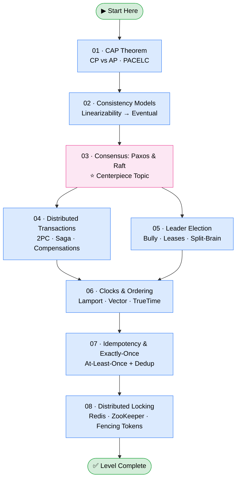
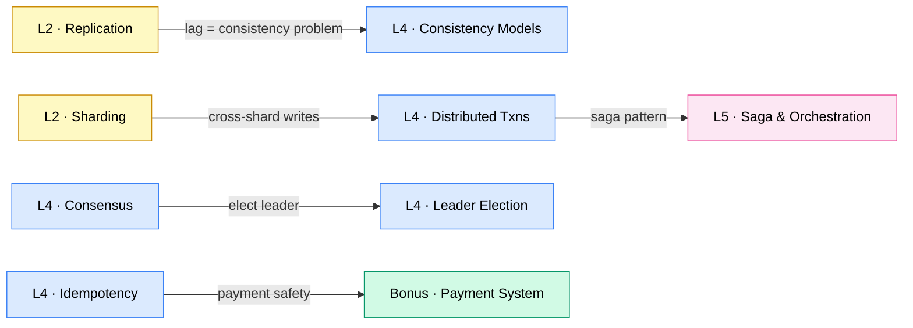

# Level 4 — Distributed Systems

> **Theme:** The hard, beautiful core where senior interviews live.

Distributed systems are what happen when a single machine isn't enough — when you need multiple computers to work *together* as one. This level covers the fundamental theorems, algorithms, and patterns that govern how those computers coordinate, agree, and stay consistent even when the network misbehaves.

This is where senior engineers live. These topics come up in nearly every staff+ interview and are the conceptual backbone behind every large-scale system.

---

## 🎯 Learning Outcomes

By the end of this level you will be able to:

- Explain the CAP theorem and PACELC without oversimplifying
- Describe the full consistency spectrum from linearizability down to eventual consistency
- Walk through Raft leader election and log replication from memory
- Compare Two-Phase Commit vs Saga for distributed transactions
- Explain split-brain, fencing tokens, and how leader election really works
- Order events in a distributed system using Lamport and vector clocks
- Design an idempotent API that achieves effectively-once processing
- Implement distributed locking safely using Redis, ZooKeeper, or etcd — and explain fencing tokens

---

## 📋 Prerequisites

Before starting this level you should be comfortable with:

- **[Level-02 · Database Replication](../Level-02-Data-Layer/01-Database-Replication/README.md)** — leader/follower, lag, failover
- **[Level-02 · Sharding and Partitioning](../Level-02-Data-Layer/02-Sharding-and-Partitioning/README.md)** — why data lives on multiple nodes
- **[Level-02 · ACID and Transactions](../Level-02-Data-Layer/05-ACID-and-Transactions/README.md)** — what we're trying to preserve across machines

---

## ⏱️ Estimated Time

| Format | Time |
|---|---|
| Read-only (skim) | 4–6 hours |
| Read + diagrams + notes | 8–12 hours |
| Full mastery (test yourself) | 2–3 days |

---

## 🗺️ Topic Roadmap

---

## 📚 Ordered Topic List

| # | Topic | One-Line Summary | Difficulty |
|---|---|---|---|
| 01 | [CAP Theorem](./01-CAP-Theorem/README.md) | Why you must choose between consistency and availability when partitions hit | ⭐⭐⭐ |
| 02 | [Consistency Models](./02-Consistency-Models/README.md) | The full spectrum: linearizability, causal, eventual, and everything between | ⭐⭐⭐ |
| 03 | [Consensus: Paxos & Raft](./03-Consensus-Paxos-Raft/README.md) | How distributed nodes agree on a single value — the hardest problem | ⭐⭐⭐⭐⭐ |
| 04 | [Distributed Transactions](./04-Distributed-Transactions/README.md) | Atomic changes across multiple services/shards: 2PC and Sagas | ⭐⭐⭐⭐ |
| 05 | [Leader Election](./05-Leader-Election/README.md) | Picking one coordinator — and safely surviving split-brain | ⭐⭐⭐⭐ |
| 06 | [Clocks and Ordering](./06-Clocks-and-Ordering/README.md) | Why wall clocks lie and how Lamport/vector clocks fix ordering | ⭐⭐⭐⭐ |
| 07 | [Idempotency and Exactly-Once](./07-Idempotency-and-Exactly-Once/README.md) | Retries cause duplicates — here's how to make them safe | ⭐⭐⭐ |
| 08 | [Distributed Locking](./08-Distributed-Locking/README.md) | Mutual exclusion across machines: Redis SET NX, Redlock, ZooKeeper, fencing tokens | ⭐⭐⭐⭐ |

---

## 🧭 How to Use This Level

1. **Read topics in order.** Each one builds on the last — CAP → Consistency → Consensus is a natural progression.
2. **Draw diagrams from memory** after each topic. Raft especially only sticks when you can sketch it cold.
3. **Connect to real systems.** Every topic names real databases/services — look them up in their own docs.
4. **Use the "Test Yourself" sections** before moving on.
5. **Return here after Level 05** (Architecture Patterns) — Saga in [Level-05-Architecture-Patterns/07-Saga-and-Orchestration](../Level-05-Architecture-Patterns/07-Saga-and-Orchestration/README.md) extends what you learn in Topic 04.

---

## 🔗 Cross-Level Connections

---

*You're about to enter the deep end. Take it one topic at a time — and enjoy it. This is the stuff that makes distributed systems beautiful.*
