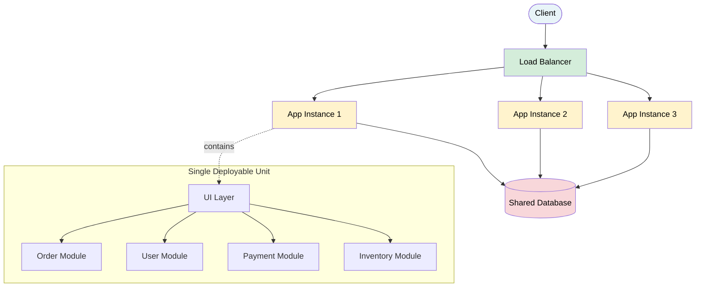
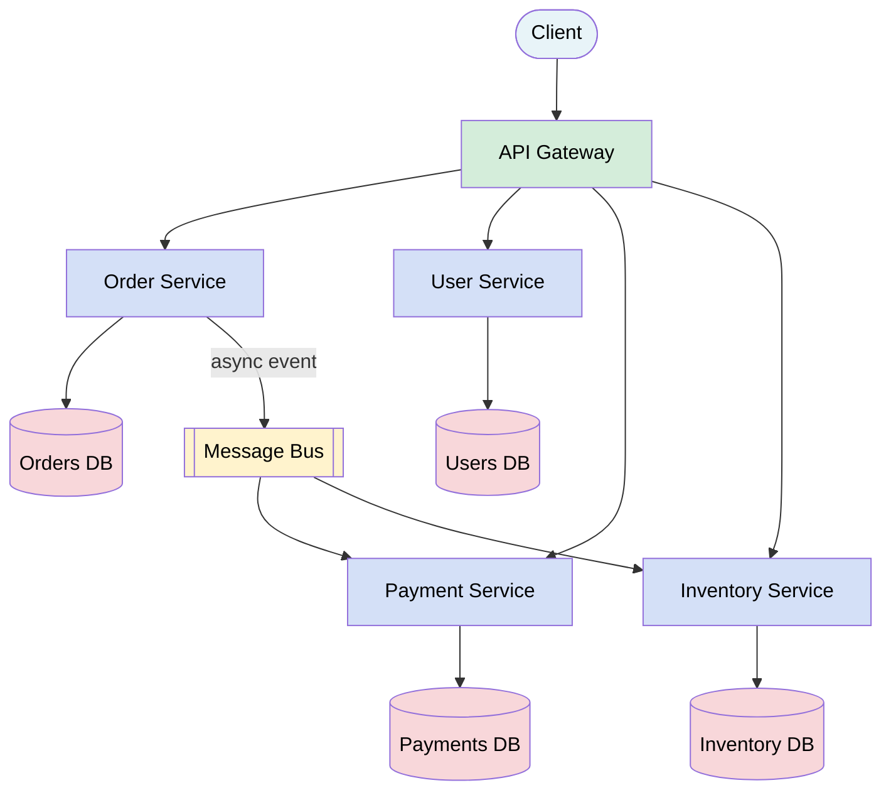
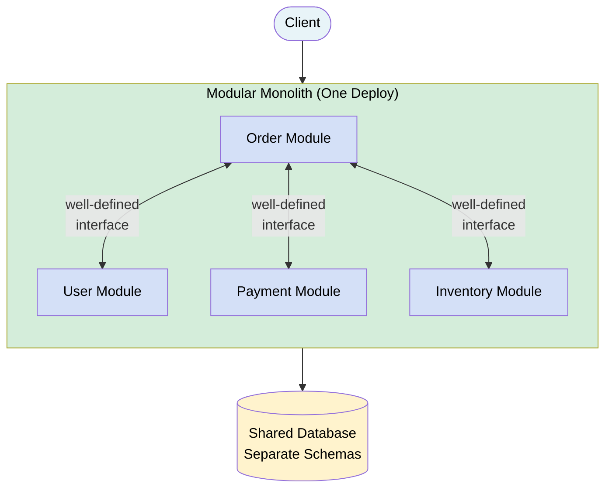
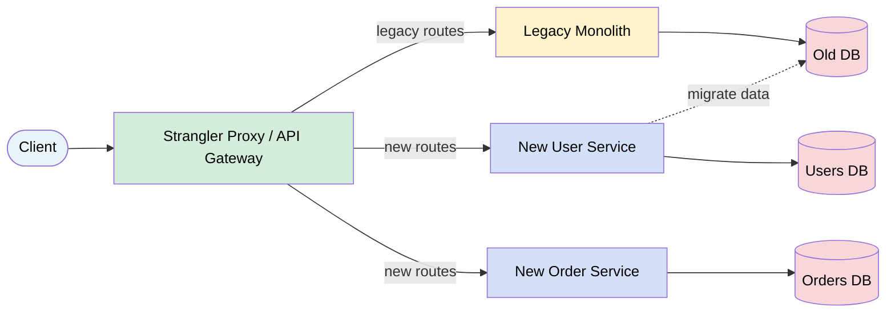

# Monolith vs Microservices

> A **monolith** is a single deployable unit containing all your application's functionality. **Microservices** decompose that into independently deployable services, each owning a focused business capability.

**Level:** 5 · **Topic:** 1 · **Prerequisites:** [Level 01 Fundamentals](../../Level-01-Building-Blocks/README.md) · [Distributed Transactions](../../Level-04-Distributed-Systems/04-Distributed-Transactions/README.md)

---

## 🎯 The Problem

Your startup's app starts as a single codebase. Life is good — one deploy, one database, fast development. Then you hire 50 engineers. Now a change to the checkout page requires coordinating with the team that owns user profiles, because they share the same database tables. A bug in the recommendation engine takes down the entire site. Deploy takes 45 minutes. Teams block each other constantly.

Do you split everything into microservices? Not so fast. Many teams have jumped to microservices too early and ended up with something worse: a **distributed monolith** — all the complexity of microservices with none of the benefits.

This topic helps you make the right call at the right time.

---

## 🌍 Real-World Analogy

Imagine a restaurant. A **monolith** is like a small family restaurant where one chef does everything — takes orders, cooks, plates, handles billing. Efficient for a small place, terrible when you're serving 500 covers a night.

**Microservices** are like a large restaurant with specialized stations: a head chef, a pasta station, a grill station, a pastry chef, a separate billing team. Each station can be scaled independently (hire more pasta cooks on Friday nights), but they need clear communication protocols, and if the communication breaks down, the whole dinner service suffers.

A **modular monolith** is the sweet spot for a mid-size restaurant: clear station separation, but they share the same kitchen.

---

## 🧠 Core Idea

The key question is not "monolith or microservices?" — it's **"what are the correct boundaries for our system right now, given our team and traffic?"**

Conway's Law (1967) says: *"Organizations which design systems are constrained to produce designs which are copies of the communication structures of those organizations."*

In practice: if you have 3 developers, you get a monolith. If you have 20 independent teams, you get microservices. Your architecture will mirror your org chart whether you plan it or not.

---

## 📊 How It Works

### Monolith Architecture

*Caption: A monolith scales by running multiple identical copies. All modules share the same process and (usually) the same database.*

---

### Microservices Architecture

*Caption: Microservices each own their database. They communicate via APIs (sync) or message bus (async). Each service deploys independently.*

---

### The Modular Monolith

*Caption: A modular monolith keeps clear module boundaries (each module only touches its own DB schema) but deploys as one unit. Shopify famously uses this approach.*

---

### The Strangler Fig Migration

Named after the strangler fig tree that slowly grows around and replaces its host tree.

*Caption: You introduce a proxy in front of the monolith. New features go into new services. Existing functionality migrates piece by piece. The monolith shrinks until it can be retired.*

---

## 🔧 Types / Variations / Strategies

### Architectural Styles Compared

| Dimension | Monolith | Modular Monolith | Microservices |
|-----------|----------|------------------|---------------|
| Deployment | Single unit | Single unit | Per-service |
| Database | Shared | Shared (separate schemas) | Per-service |
| Team scale | 1–15 devs | 10–50 devs | 50+ devs |
| Operational complexity | Low | Low-Medium | High |
| Independent scaling | No | No | Yes |
| Technology flexibility | Low | Low | High |
| Network latency | None | None | Yes (ms per hop) |
| Development speed (early) | Fast | Fast | Slow |
| Development speed (at scale) | Slow | Medium | Fast |

### Data Ownership Patterns

| Pattern | Description | When |
|---------|-------------|------|
| Shared database | All services use one DB | Monoliths, small teams |
| Database per service | Each service owns its data | True microservices |
| Shared schema, separate tables | One DB, enforced module boundaries | Modular monolith |
| Event-sourced shared log | Services sync via event stream | Advanced EDA systems |

---

## 🏢 Real-World Examples

**Amazon (2001–2004):** Started as a monolith ("the obidos" system). As they scaled to hundreds of engineers, teams were blocking each other constantly. Jeff Bezos issued the famous "API Mandate" memo in 2002: every team must expose data and functionality only through service interfaces, with no other allowed communication. This forced microservices adoption and eventually produced AWS itself.

**Netflix (2008–2012):** Netflix's monolith had a catastrophic database corruption incident in 2008 that took the service down for 3 days. They used this as a catalyst to migrate to AWS and microservices over 7 years. Today they run 700+ microservices. They also open-sourced Hystrix (circuit breaker) and Eureka (service discovery) from this journey.

**Uber (2014–2016):** Uber's original monolith (called "the monorepo") worked fine for one city. When they expanded globally with driver-side and rider-side apps plus internationalization, the monolith couldn't keep up. They decomposed into microservices but struggled with "distributed monolith" anti-patterns before adding proper API gateways and service meshes.

**Shopify:** Chose to stay with a **modular monolith** (called a "modular Rails app"). By enforcing strict module boundaries and separate schemas — using a tool called `packwerk` to lint cross-module violations — they serve millions of merchants from a single deployable unit. This lets them move fast without the operational overhead of hundreds of services.

---

## ⚖️ Trade-offs

### Monolith

| Pros | Cons |
|------|------|
| Simple to develop, test, deploy | Tight coupling slows large teams |
| No network latency between modules | Entire app scales together (wasteful) |
| Easy transactions (single DB) | One language/framework for everything |
| Great for early-stage products | Long build/deploy cycles at scale |
| Simple observability | Single point of failure |

### Microservices

| Pros | Cons |
|------|------|
| Independent deploy & scale per service | Distributed system complexity |
| Team autonomy (each team owns a service) | Network latency, partial failures |
| Technology flexibility | Hard to do cross-service transactions |
| Fault isolation | Much more DevOps/infra required |
| Scales to 100s of engineers | Significantly harder to debug/trace |

---

## ✅ When to Use / ❌ When NOT to Use

**Start with a monolith (or modular monolith) when:**
- You're a startup or have < 15 engineers
- Your domain model isn't fully understood yet
- You need to move fast and iterate
- You don't have dedicated DevOps capacity

**Move toward microservices when:**
- Different parts of your system have very different scaling needs (e.g., your image processing needs 100x more CPU than your user auth)
- Teams are blocking each other due to tight coupling
- You have 50+ engineers and need team autonomy
- You need to use different technologies in different domains
- Deployment frequency is bottlenecked by coupling

**Never use microservices when:**
- You're pre-product-market-fit
- You have a small, generalist team
- You don't have strong DevOps/platform engineering capability
- Your domain boundaries aren't clear yet

---

## ⚠️ Common Pitfalls

**The Distributed Monolith:** You split into services but they're still tightly coupled — sharing databases, calling each other synchronously in long chains, deploying together. You get all the pain of microservices with none of the benefits. This is the #1 failure mode.

**Premature decomposition:** Splitting before you understand the domain leads to wrong service boundaries. It's much harder to merge services later than to split a well-understood monolith.

**Ignoring Conway's Law:** Your services will reflect your team structure. If you want a certain architecture, first redesign the team structure.

**No data ownership discipline:** If Service A is allowed to read Service B's database directly, you have a distributed monolith regardless of how many services you have.

**Forgetting operational maturity:** Microservices require centralized logging, distributed tracing, service discovery, health checks, CI/CD per service, and container orchestration. Without these, you'll drown in operational complexity.

---

## 🎤 Interview Tips

- **"Start with a monolith, migrate with the strangler fig"** is almost always the right answer for a new system.
- Mention **Conway's Law** — interviewers love it, few candidates bring it up.
- When asked to design a system for a startup, explicitly say "I'd start with a modular monolith and extract services when we hit scaling bottlenecks or team autonomy needs."
- For an existing large system, describe the strangler fig pattern step by step.
- Know the **distributed monolith anti-pattern** — it shows you understand the real challenges, not just the buzzwords.
- If asked "when do you split a service?", the answer involves: scaling needs diverge, team boundaries exist, and the module has clear, stable interfaces.

---

## 📝 TL;DR

- **Monolith:** single deployable unit, great for early stage, gets painful at scale
- **Modular monolith:** best of both worlds — clear boundaries, single deploy (Shopify loves this)
- **Microservices:** independent services, each with their own DB, enables team autonomy at the cost of distributed system complexity
- **Distributed monolith:** the anti-pattern — looks like microservices, acts like a tightly coupled mess
- **Conway's Law:** your architecture mirrors your org chart
- **Migrate with the Strangler Fig:** add a proxy, build new services alongside the monolith, route traffic incrementally

---

## 🧪 Test Yourself

1. Your team of 8 engineers is building a new e-commerce site. What architecture would you choose and why?
2. You have a 3-year-old monolith with 80 engineers struggling to release more than once per week. How would you migrate to microservices without a "big bang" rewrite?
3. A team claims they've moved to microservices but their services all share the same PostgreSQL database. What's the problem and how would you fix it?
4. Two services communicate synchronously in a chain: A calls B calls C calls D. What risks does this introduce, and how would you redesign it?
5. How does Conway's Law apply if you want to build a microservices architecture but all your engineers are in one team?

---

## 📚 Further Reading

- [Martin Fowler — Microservices](https://martinfowler.com/articles/microservices.html) — the canonical introduction
- [Martin Fowler — Modular Monolith](https://martinfowler.com/bliki/MonolithFirst.html) — why "monolith first" is often right
- [Sam Newman — Building Microservices](https://samnewman.io/books/building_microservices/) — the book on the topic
- [Shopify — Deconstructing the Monolith](https://engineering.shopify.com/blogs/engineering/deconstructing-monolith-designing-software-maximizes-developer-productivity) — real-world modular monolith
- [Netflix Tech Blog — Microservices Journey](https://netflixtechblog.com) — how Netflix did it

---

*← [Level 05 Overview](../README.md) · Next: [Event-Driven Architecture](../02-Event-Driven-Architecture/README.md) →*
