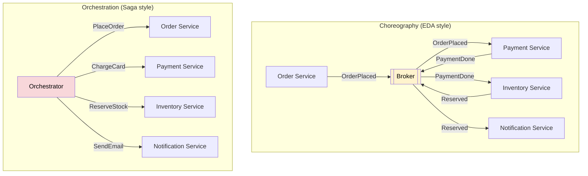
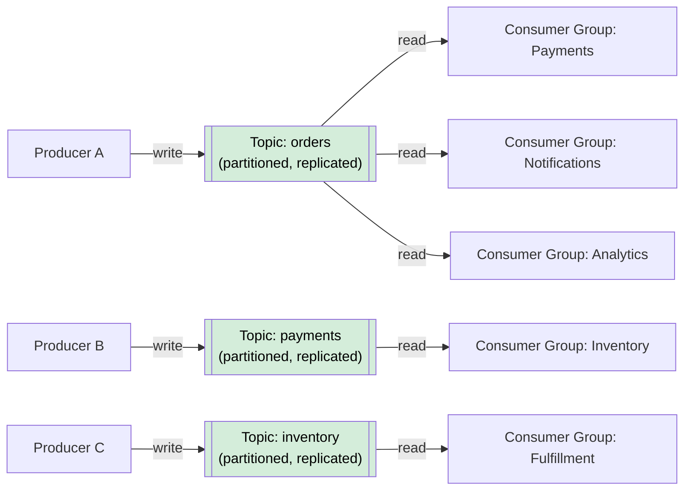
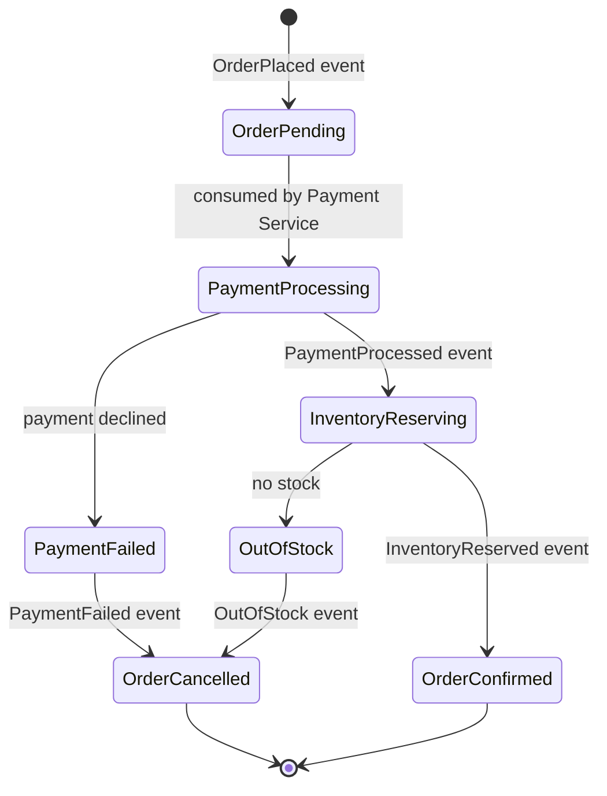

# Event-Driven Architecture

> In **Event-Driven Architecture (EDA)**, services communicate by producing and consuming **events** — records of things that happened — rather than making direct calls to each other.

**Level:** 5 · **Topic:** 2 · **Prerequisites:** [Monolith vs Microservices](../01-Monolith-vs-Microservices/README.md) · [Message Queues](../../Level-03-Communication/04-Message-Queues/README.md) · [Pub-Sub](../../Level-03-Communication/05-Pub-Sub/README.md)

---

## 🎯 The Problem

In a traditional request/response architecture, when a user places an order, the Order Service must directly call the Payment Service, which calls the Inventory Service, which calls the Notification Service — all in sequence. This creates a chain of synchronous dependencies:

- If Notification Service is down, the order fails
- Adding a new downstream step (e.g., a Fraud Detection Service) requires changing the Order Service
- All services must be available at the same time (**temporal coupling**)
- A slow Notification Service slows down the entire order flow

You need a way to decouple services so they can evolve, fail, and scale independently.

---

## 🌍 Real-World Analogy

Think of a newspaper. When a newspaper publishes a story, it doesn't call every subscriber directly. It prints the paper and sends it out. Subscribers who are interested in politics read the politics section. Subscribers interested in sports read sports. New sections can be added without changing anything about how existing subscribers read the paper.

The newspaper (event producer) doesn't know or care who reads it. Readers (event consumers) subscribe to what interests them. And if a subscriber is on vacation for a week, they can catch up when they return — the paper was still printed.

That's an event-driven system: **publish once, consume by whoever cares, whenever they're ready.**

---

## 🧠 Core Idea

An **event** is an immutable record that something happened in the past:
- `OrderPlaced { orderId: "abc123", userId: "u456", amount: 99.99, timestamp: ... }`
- `PaymentProcessed { orderId: "abc123", status: "success" }`
- `InventoryReserved { productId: "p789", quantity: 2 }`

Events are facts. They happened. You can't un-place an order — you can only place a cancellation event.

### Events vs Commands

| | Event | Command |
|--|-------|---------|
| Meaning | "Something happened" | "Please do this" |
| Tense | Past tense | Imperative |
| Example | `OrderPlaced` | `PlaceOrder` |
| Direction | Broadcast to anyone | Sent to specific recipient |
| Coupling | None (producer doesn't know consumers) | Tight (caller knows callee) |
| Failure handling | Consumer handles its own retries | Caller handles failure |

### Two Styles of Event Usage

**Event Notification:** A small event triggers consumers to fetch data they need.
- Event: `OrderPlaced { orderId: "abc123" }` — minimal payload
- Consumer calls the Order Service API to fetch full details
- Pros: events stay small · Cons: consumers need to make extra API calls

**Event-Carried State Transfer (ECST):** The event contains all the data consumers need.
- Event: `OrderPlaced { orderId, userId, items: [...], shippingAddress: {...}, totalAmount: ... }`
- Consumers process entirely from the event, no API calls needed
- Pros: temporal decoupling, no extra calls · Cons: larger payloads, schema evolution is harder

---

## 📊 How It Works

### Basic Event Flow

```mermaid
sequenceDiagram
    participant Client
    participant OS as Order Service
    participant Kafka as Event Broker (Kafka)
    participant PS as Payment Service
    participant IS as Inventory Service
    participant NS as Notification Service

    Client->>OS: POST /orders
    OS->>OS: Save order (status=PENDING)
    OS->>Kafka: Publish OrderPlaced event
    OS-->>Client: 202 Accepted {orderId}

    Note over Kafka: Event is durable, ordered, replayable

    Kafka->>PS: OrderPlaced event
    PS->>PS: Process payment
    PS->>Kafka: Publish PaymentProcessed event

    Kafka->>IS: PaymentProcessed event
    IS->>IS: Reserve inventory
    IS->>Kafka: Publish InventoryReserved event

    Kafka->>NS: OrderPlaced event
    NS->>NS: Send confirmation email

    style Kafka fill:#fff3cd,color:#000
```

*Caption: The Order Service publishes one event. Multiple consumers react independently. No service directly calls another — they all communicate through the broker.*

---

### Choreography vs Orchestration



*Caption: Choreography — each service reacts to events and emits new ones (no central brain). Orchestration — a central coordinator tells each service what to do. EDA typically uses choreography; see [Saga & Orchestration](../07-Saga-and-Orchestration/README.md) for orchestration details.*

---

### The Kafka Backbone



*Caption: Kafka stores events in topics (like durable, replayable logs). Multiple consumer groups can independently read the same topic at their own pace. Events are retained for days or weeks, enabling replay.*

---

### Eventual Consistency Flow



*Caption: The order moves through states as events are processed. At any point in time, different services may have a different view of the order's current state — this is eventual consistency.*

---

## 🔧 Types / Variations / Strategies

### Event Broker Options

| Broker | Best For | Retention | Ordering | Throughput |
|--------|----------|-----------|----------|------------|
| **Apache Kafka** | High-throughput, replay, log-based | Days–forever | Per partition | Millions/sec |
| **AWS SNS/SQS** | Serverless, simple fan-out | SQS: up to 14 days | No (SQS FIFO: per group) | High |
| **Google Pub/Sub** | GCP ecosystems, global scale | 7 days (configurable) | No | High |
| **RabbitMQ** | Traditional message queuing | Until consumed | Per queue | Moderate |
| **AWS EventBridge** | Event routing, SaaS integration | No storage | No | Moderate |
| **NATS** | Ultra-low latency | Optional (JetStream) | Per subject | Very high |

### Event Patterns

| Pattern | Description | Use Case |
|---------|-------------|----------|
| Event Notification | Minimal event, consumers pull details | When events need to stay small |
| Event-Carried State Transfer | Fat event with all needed data | When temporal decoupling is critical |
| Event Sourcing | Events ARE the source of truth | Audit trails, time-travel (see [CQRS topic](../03-CQRS-and-Event-Sourcing/README.md)) |
| Domain Events | Events within one bounded context | Internal module communication |
| Integration Events | Events crossing service/team boundaries | External service communication |

---

## 🏢 Real-World Examples

**Uber:** When a ride is requested, an event is published. Multiple services consume it: the matching algorithm (find a driver), the pricing engine (calculate surge), the notification service (alert drivers), the ETA predictor (estimate arrival). None of these services call each other — they all react to the same event. This lets Uber scale each service independently and add new consumers (like ML features) without touching existing ones.

**Netflix:** Netflix's entire recommendation engine runs on events. As you watch a show, `VideoPlayed`, `VideoStopped`, `VideoRewound` events stream into Kafka. The recommendation service consumes these events to build a real-time picture of your preferences. Netflix processes billions of events per day through their Kafka cluster. They also use events for inter-service communication across their 700+ microservices.

**E-commerce Order Flow:** A typical online retailer uses EDA for order processing. `OrderPlaced` triggers the payment processor, inventory reservations, warehouse pick-list generation, carrier rate shopping, customer email notifications, and loyalty points calculations — all in parallel, all independently, all recoverable if any one step fails.

---

## ⚖️ Trade-offs

| Pros | Cons |
|------|------|
| Loose coupling — producers don't know consumers | Harder to trace a request across services |
| Temporal decoupling — consumers can be offline | Eventual consistency, not immediate |
| Easy to add new consumers without changing producers | Event schema evolution is tricky |
| Natural scalability — consumers scale independently | Debugging is harder (no call stack) |
| Replay — re-process historical events with new logic | Ordering guarantees are limited |
| Built-in audit log of what happened | Increased operational complexity |

---

## ✅ When to Use / ❌ When NOT to Use

**Use EDA when:**
- You have multiple services that need to react to the same business event
- You want to decouple teams so they can deploy independently
- You need to broadcast events to an unknown or growing number of consumers
- You need the ability to replay events (e.g., rebuild a service from its event history)
- Your workflow involves fire-and-forget work (notifications, async processing)

**Avoid EDA when:**
- You need an immediate, synchronous response (e.g., "is this username available?")
- Your system is simple enough that direct calls are clearer
- Your team doesn't have the operational maturity to manage a message broker
- You need strict, immediate consistency across all consumers

---

## ⚠️ Common Pitfalls

**Event schema changes break consumers:** Adding a required field to an event breaks all consumers that haven't been updated. Use schema versioning, backward-compatible changes (add fields, never remove), and a schema registry (Confluent Schema Registry, AWS Glue Schema Registry).

**Treating events like commands:** `ProcessPayment` is a command, not an event. If your event names are imperative ("do this"), you're thinking about it wrong. Events are facts: `PaymentRequested`, `PaymentProcessed`.

**No dead-letter queue:** When a consumer fails to process an event, the event is lost or causes infinite retries. Always configure a dead-letter queue (DLQ) so failed events are captured for manual inspection and replay.

**Ignoring ordering:** Kafka guarantees ordering within a partition, not across partitions. If your business logic depends on processing `OrderPlaced` before `OrderCancelled` for the same order, make sure they go to the same partition (use orderId as the partition key).

**Missing idempotency:** Your consumer will be called at least once — often more during retries. If processing `OrderPlaced` twice creates two orders, you have a bug. See [Idempotency](../../Level-04-Distributed-Systems/07-Idempotency-and-Exactly-Once/README.md).

---

## 🎤 Interview Tips

- Open with: "EDA decouples services temporally and logically by having them communicate through events rather than direct calls."
- Distinguish **events** (facts, past tense, broadcast) from **commands** (instructions, imperative, targeted).
- Mention the **two styles**: Event Notification (small event, consumer fetches details) vs ECST (fat event, self-contained).
- When asked about consistency: "EDA leads to eventual consistency — different services may have different views of the same data at a given moment, but they converge."
- Always mention **idempotency** — your consumer will receive the same event more than once.
- Bring up **schema evolution** as a challenge — it shows you've thought about real operational concerns.
- Kafka is the dominant platform — know that events are durable, ordered within a partition, and replayable.

---

## 📝 TL;DR

- **Events** are immutable records of things that happened, published to a broker
- **Producers** publish events without knowing who consumes them
- **Consumers** subscribe to event types they care about and process independently
- **Temporal decoupling**: producers and consumers don't need to be available simultaneously
- **Kafka** is the dominant event broker: durable, partitioned, replayable
- **Choreography**: services react to each other's events (no central brain)
- **Eventual consistency**: the trade-off for all this decoupling
- The main pitfalls: no idempotency, schema changes breaking consumers, no DLQ

---

## 🧪 Test Yourself

1. A user clicks "Place Order." List all the services that might need to know about this event. How would you design the event payload?
2. What's the difference between an event and a command? Give one example of each in an e-commerce context.
3. Your `PaymentProcessed` event schema needs to add a required `currencyCode` field. How do you roll this change out without breaking existing consumers?
4. Your Notification Service is down for 2 hours. What happens to events produced during that time, and what happens when it comes back online?
5. How would you debug a bug where an order occasionally gets processed twice, resulting in two charges to the customer's card?

---

## 📚 Further Reading

- [Martin Fowler — What do you mean by "Event-Driven"?](https://martinfowler.com/articles/201701-event-driven.html) — excellent breakdown of EDA styles
- [Confluent — Event Streaming Fundamentals](https://developer.confluent.io/learn-kafka/) — Kafka deep dive
- [Gregor Hohpe — Enterprise Integration Patterns](https://www.enterpriseintegrationpatterns.com/) — the canonical patterns book
- [Netflix Tech Blog — Kafka at Netflix](https://netflixtechblog.com/kafka-inside-keystone-pipeline-dd5aeabaf6bb) — real-world scale
- Next: [CQRS & Event Sourcing](../03-CQRS-and-Event-Sourcing/README.md) — taking events further as the source of truth

---

*← [Monolith vs Microservices](../01-Monolith-vs-Microservices/README.md) · [Level 05 Overview](../README.md) · Next: [CQRS & Event Sourcing](../03-CQRS-and-Event-Sourcing/README.md) →*
