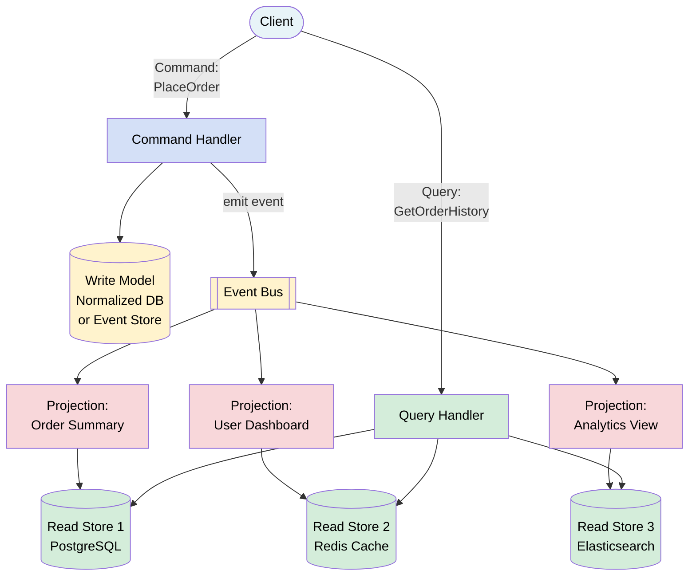
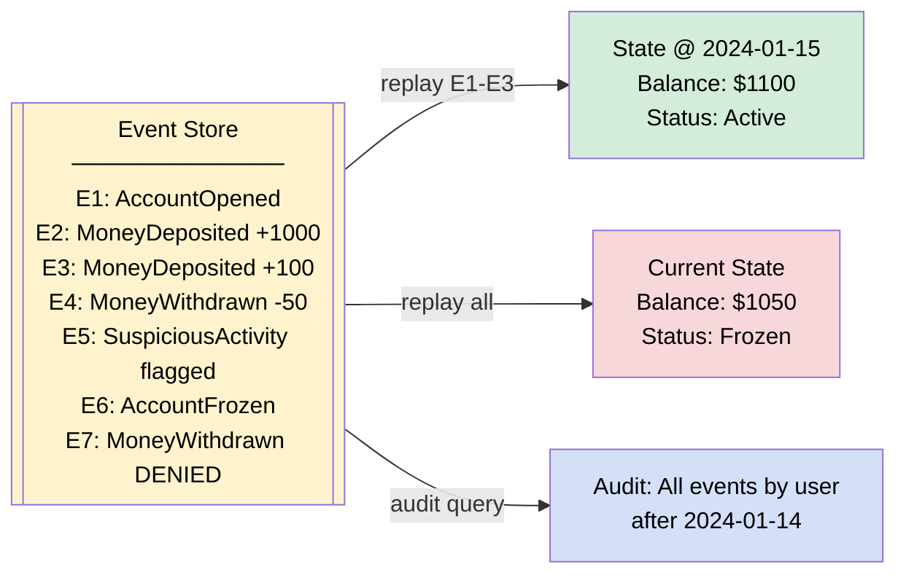

# CQRS and Event Sourcing

> **CQRS** (Command Query Responsibility Segregation) separates the write model from the read model. **Event Sourcing** stores every change as an immutable event rather than updating state in place. Together, they enable audit trails, time-travel debugging, and independently scalable reads and writes.

**Level:** 5 · **Topic:** 3 · **Prerequisites:** [Event-Driven Architecture](../02-Event-Driven-Architecture/README.md) · [Distributed Transactions](../../Level-04-Distributed-Systems/04-Distributed-Transactions/README.md)

---

## 🎯 The Problem

Traditional CRUD systems have one data model that serves everyone: your write operations update it, your read operations query it. This creates tension at scale:

- **Read patterns differ wildly from write patterns.** A bank account is written to one transaction at a time, but you might read it 10 different ways: current balance, monthly statement, transaction history, fraud detection view, analytics aggregation.
- **You can't answer "what happened?"** If a customer disputes a charge, your `accounts` table shows the current balance — not the history of how it got there.
- **Scaling reads and writes together is wasteful.** If you have 1,000 reads per second and 10 writes per second, you're over-engineering the write path.
- **Audit compliance is painful.** SOX, PCI-DSS, and banking regulations often require a complete audit trail that traditional UPDATE statements destroy.

---

## 🌍 Real-World Analogy

**CQRS** is like how a company runs. When you need to ask for a budget increase (a command), you fill out an expense request form and hand it to finance. The finance team processes it and updates their records. But when the CFO wants to see a dashboard of all expenses by department (a query), they run a report from a separate read-optimized data warehouse — not by going through every expense form.

**Event Sourcing** is like double-entry bookkeeping in accounting. Your bank never "updates" your balance directly. Every deposit and withdrawal is recorded as a separate journal entry. Your current balance is the *sum* of all those entries. The journal entries are the source of truth; the balance is derived.

---

## 🧠 Core Idea

### CQRS Fundamentals

The core insight: **reads and writes have different shapes**. Separate them.

- **Command side (Write):** Accepts commands (`PlaceOrder`, `TransferFunds`), validates business rules, applies changes, emits events. Optimized for consistency and integrity.
- **Query side (Read):** Answers queries. Often uses a denormalized, read-optimized data store (Elasticsearch, Redis, a separate read replica, a materialized view). Optimized for speed and flexibility.

You can have one database (CQRS without Event Sourcing) or separate databases. They sync asynchronously via events or projections.

### Event Sourcing Fundamentals

Instead of storing current state:
```sql
UPDATE accounts SET balance = 1050 WHERE id = 'acc-1';
```

You store every event that led to that state:
```
AccountOpened  { accountId: "acc-1", ownerId: "u-42", timestamp: ... }
MoneyDeposited { accountId: "acc-1", amount: 1000,    timestamp: ... }
MoneyDeposited { accountId: "acc-1", amount: 100,     timestamp: ... }
MoneyWithdrawn { accountId: "acc-1", amount: 50,      timestamp: ... }
```

The current balance (1050) is derived by **replaying** these events.

### CQRS and Event Sourcing Together

They're independent patterns but pair beautifully:
- Event Sourcing gives you a rich event stream on the write side
- That event stream drives **projections** (read models) on the query side via CQRS
- Each projection can be a different shape optimized for a specific query pattern

---

## 📊 How It Works

### CQRS Architecture



*Caption: Commands go to the write side, which emits events. Projections consume events and build read-optimized views. Queries hit the optimized read stores — not the write model.*

---

### Event Sourcing: Command to Event to Projection

```mermaid
sequenceDiagram
    participant C as Client
    participant CH as Command Handler
    participant ES as Event Store
    participant PR as Projection Builder
    participant RM as Read Model

    C->>CH: TransferFunds {from: acc-1, to: acc-2, amount: 200}
    CH->>ES: Load events for acc-1
    ES-->>CH: [AccountOpened, MoneyDeposited x3, ...]
    CH->>CH: Replay events → current balance = $1050
    CH->>CH: Validate: $1050 >= $200 ✓
    CH->>ES: Append MoneyTransferred event
    ES-->>CH: OK (event #47 written)
    CH-->>C: 200 OK

    Note over ES: Event is now permanent and immutable

    ES->>PR: MoneyTransferred event streamed
    PR->>RM: UPDATE account_summary SET balance=850
    PR->>RM: INSERT transaction_history record

    style ES fill:#fff3cd,color:#000
    style RM fill:#d4edda,color:#000
```

*Caption: The command handler replays events to get current state, validates the business rule, then appends a new event. The projection builder asynchronously updates the read model.*

---

### Snapshots: Avoiding Full Replay

```mermaid
graph LR
    E1[Event 1] --> E2[Event 2] --> Edots["..."] --> E100[Event 100] --> S[Snapshot<br/>@ event 100] --> E101[Event 101] --> E102[Event 102]

    subgraph "Without Snapshot"
        R1[Replay ALL 102 events]
    end

    subgraph "With Snapshot"
        R2[Load Snapshot<br/>+ replay events 101-102]
    end

    style S fill:#d4edda,color:#000
    style R2 fill:#d4edda,color:#000
    style R1 fill:#f8d7da,color:#000
```

*Caption: As an entity accumulates hundreds of events, replaying all of them on every command becomes slow. A snapshot captures the materialized state at a point in time; you only replay events since the last snapshot.*

---

### Time-Travel and Audit



*Caption: With Event Sourcing you can reconstruct the state of any entity at any point in time. This is invaluable for debugging, auditing, and regulatory compliance.*

---

## 🔧 Types / Variations / Strategies

### CQRS Variations

| Variation | Description | Complexity | When to Use |
|-----------|-------------|------------|-------------|
| **Simple CQRS** | Separate read/write models, one DB | Low | When read queries are complex but you don't need event sourcing |
| **CQRS + Separate DB** | Write to one DB, sync to read DB | Medium | High read:write ratio, need different storage tech |
| **CQRS + Event Sourcing** | Event store drives projections | High | Full audit trail, complex domain, time-travel needed |
| **CQRS + Read Replicas** | Write to primary, query replicas | Low | Read scaling without separate read model |

### Event Store Options

| Tool | Type | Best For |
|------|------|----------|
| **EventStoreDB** | Purpose-built event store | Native event sourcing, subscriptions |
| **Apache Kafka** | Distributed log | High throughput, event streaming |
| **PostgreSQL** (events table) | Relational, append-only table | Teams already on Postgres, lower complexity |
| **DynamoDB Streams** | Managed, serverless | AWS ecosystems |
| **Axon Framework** | Java framework with event store | Java/Spring teams |

### Projection Patterns

| Pattern | Description |
|---------|-------------|
| **Inline projection** | Read model updated synchronously in the same transaction |
| **Async projection** | Event handler updates read model asynchronously (eventual consistency) |
| **Catch-up subscription** | New projection built by replaying all historical events |
| **Live subscription** | Projection receives only new events going forward |

---

## 🏢 Real-World Examples

**Banking Systems:** Every major bank uses some form of Event Sourcing for accounts. Your account balance is derived from a ledger of transactions — every debit and credit is an immutable record. CQRS separates the write side (ledger entries) from the read side (account summary pages, monthly statements, fraud detection scores). Regulatory requirements like PCI-DSS and SOX essentially mandate this: you must be able to explain every change.

**Event Sourcing for E-commerce:** An order in Shopify or Amazon isn't just a row with a status column. It goes through events: `OrderPlaced`, `PaymentAuthorized`, `ItemsPicked`, `Shipped`, `Delivered`, `ReturnRequested`, `RefundIssued`. Each event drives different projections: the customer's order status page, the warehouse pick-list, the finance team's revenue report, the carrier's tracking integration.

**Axon Framework (Java ecosystem):** Many Dutch banks and financial institutions use Axon Framework which implements CQRS + Event Sourcing natively. Commands go to aggregates that emit events; those events are stored and projected into query models. The framework handles the boilerplate of event routing, snapshotting, and replay.

---

## ⚖️ Trade-offs

| Pros | Cons |
|------|------|
| Complete audit trail for free | Significantly higher complexity |
| Time-travel: reconstruct any past state | Eventual consistency between write and read models |
| Independently scale reads and writes | Schema evolution for events is hard (events are immutable) |
| Read models can be optimized per use case | Querying is harder — you must think in projections |
| Replay to build new projections retroactively | Event store can grow very large |
| Natural fit for domain-driven design | Requires team familiarity with the pattern |
| Simplifies concurrent writes (append-only) | Cold-start replay can be slow without snapshots |

---

## ✅ When to Use / ❌ When NOT to Use

**Use CQRS when:**
- Your read patterns are complex and different from your write patterns
- You have a high read-to-write ratio (10:1 or more)
- You need multiple views of the same data optimized differently
- Your domain has complex business logic on the write side

**Use Event Sourcing when:**
- You need a complete audit trail (banking, healthcare, compliance)
- You want the ability to replay history and build new read models from it
- Your domain is naturally event-oriented (e.g., trading, order management)
- You need to support temporal queries ("what was the state on date X?")

**Avoid CQRS/Event Sourcing when:**
- Your application is simple CRUD with no complex business logic
- Your team is not experienced with the pattern (steep learning curve)
- You don't need an audit trail or multiple read views
- You're in early-stage product development (adds too much overhead upfront)
- Simple database read replicas would solve your scaling problem

---

## ⚠️ Common Pitfalls

**Eventual consistency surprises:** After writing a command, the read model may not reflect it immediately. If your UI immediately queries the read model after a write, it might show stale data. Either accept this or use optimistic UI updates.

**Event schema evolution:** Events are immutable and permanent. If you rename a field or change a type in an old event, your replay logic breaks. Use versioned events (`OrderPlacedV1`, `OrderPlacedV2`) or upcasters (transformers that convert old events to new schemas on the fly).

**Projection rebuilds take forever:** If you have 10 years of events and need to rebuild a projection, it might take hours. Plan for this: design events to be compact, maintain efficient snapshots, and use parallel processing for rebuilds.

**Using CQRS everywhere:** Not every aggregate needs CQRS. Apply it to the complex, high-traffic parts of your domain. A user preferences screen probably doesn't need an event store.

**The read model is a cache, not a copy:** Your read model can always be rebuilt from events. Don't treat it as authoritative. Don't write to it directly.

---

## 🎤 Interview Tips

- Start with the problem: "Traditional CRUD conflates reads and writes, which creates scaling and auditability challenges."
- Define CQRS in one sentence: "Separate models for writing data and reading data, synchronized asynchronously."
- Define Event Sourcing: "Store events that describe what happened, not the current state. Derive current state by replaying events."
- Emphasize they're **independent patterns** that work well together but aren't required together.
- Mention **projections** — these are the read models built from the event stream.
- Always bring up the trade-offs: eventual consistency, schema evolution, complexity.
- Use banking as your go-to example — everyone understands a bank account ledger.
- Mention snapshots as the solution to slow replay.

---

## 📝 TL;DR

- **CQRS:** separate write model (commands, business logic) from read model (queries, optimized views)
- **Event Sourcing:** store immutable events instead of mutable state; derive current state by replaying events
- **Projection:** a read model built by consuming the event stream
- **Snapshot:** checkpoint of materialized state to avoid replaying all events
- **Key benefit:** full audit trail, time-travel, independent read/write scaling
- **Key cost:** eventual consistency, schema evolution complexity, steep learning curve
- **Use when:** complex domain, audit requirements, high read:write ratio
- **Avoid when:** simple CRUD, small teams, early-stage products

---

## 🧪 Test Yourself

1. A bank account has accumulated 50,000 events over 5 years. How would you prevent balance lookups from becoming slow, without losing the event history?
2. You added a `discountCode` field to `OrderPlaced` events 6 months ago, but older events don't have it. How do you handle replay of old events?
3. A customer places an order and immediately clicks "View My Orders." The order doesn't show up. Why might this happen in a CQRS system, and how would you handle it?
4. Your analytics team wants a new view: "revenue per product category per month." You have 2 years of `OrderPlaced` events. How do you build this view?
5. You're designing a healthcare system to track patient medication history. Why would Event Sourcing be a good fit here?

---

## 📚 Further Reading

- [Martin Fowler — CQRS](https://martinfowler.com/bliki/CQRS.html) — the original explanation
- [Martin Fowler — Event Sourcing](https://martinfowler.com/eaaDev/EventSourcing.html) — the canonical reference
- [Greg Young — CQRS Documents](https://cqrs.files.wordpress.com/2010/11/cqrs_documents.pdf) — the inventor of the term
- [EventStoreDB Documentation](https://developers.eventstore.com/) — purpose-built event store
- [Axon Framework](https://axoniq.io/) — CQRS/ES framework for Java
- Related: [Event-Driven Architecture](../02-Event-Driven-Architecture/README.md) · [Saga & Orchestration](../07-Saga-and-Orchestration/README.md)

---

*← [Event-Driven Architecture](../02-Event-Driven-Architecture/README.md) · [Level 05 Overview](../README.md) · Next: [Service Discovery](../04-Service-Discovery/README.md) →*
